#  103：种群生态学（第四部分）📊

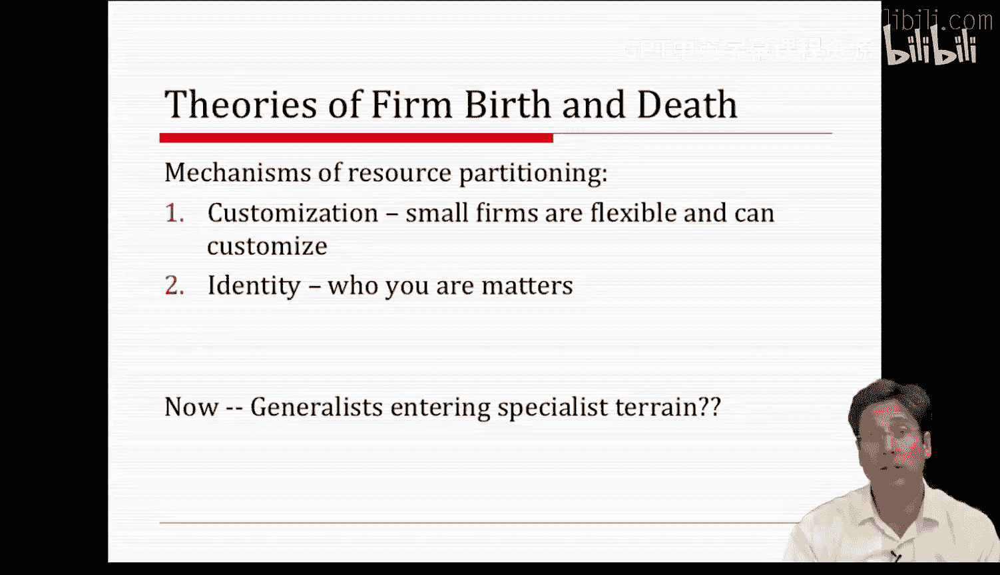

在本节课中，我们将学习组织种群生态学理论的核心观点、管理应用以及该理论存在的局限性。我们将探讨环境如何通过选择机制影响组织的生存与消亡，并了解管理者如何运用这一理论进行战略决策。

---

组织种群生态学关注的是**组织种群**，并研究驱动企业诞生与消亡的环境特征。接下来，我们将快速总结该理论的核心要点，以便你对其核心主张和应用方式有一个总体理解。

首先，组织种群生态学采用**开放系统视角**，认为环境与组织的诞生和消亡密不可分。

其次，在组织生态学家看来，组织通常**无法跟上环境的变化**。内部适应并不常见或非常困难，尤其是对于大型企业而言。

因此，组织变化的主要机制实际上是**组织选择**。正如Stinchcomb在1965年提出的，一个组织的形态相当稳定且具有一致性。在创始人打下烙印后，组织便具有这种稳定性。此外，正如Hannan和Freeman所论述的，内部和外部关系存在一定成本，使得适应变得困难。

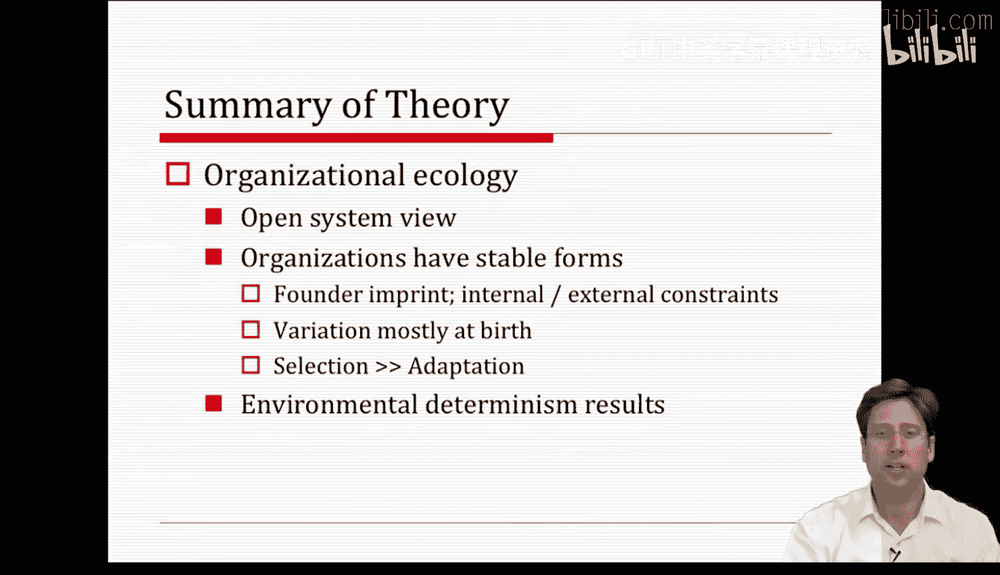

这使得选择过程变得至关重要。如果两个组织种群占据相同的生态位，但在某些组织特征或形式上存在差异，那么组织可能无法快速适应，而具有较低环境适应度的种群将被淘汰。

因此，组织形式的多样性最终会与环境的多样性达到**同构**。在均衡状态下，每种环境都将对应一种最佳适应其要求的组织形式，这就是**实现生态位**的概念。环境中的每个单元都面临相同的环境约束，因此必须具有相同的组织结构才能生存——这是在均衡状态下的情况。但环境往往并非处于均衡状态。关键在于，同构是选择的结果，环境只选择那些与其相匹配的组织。

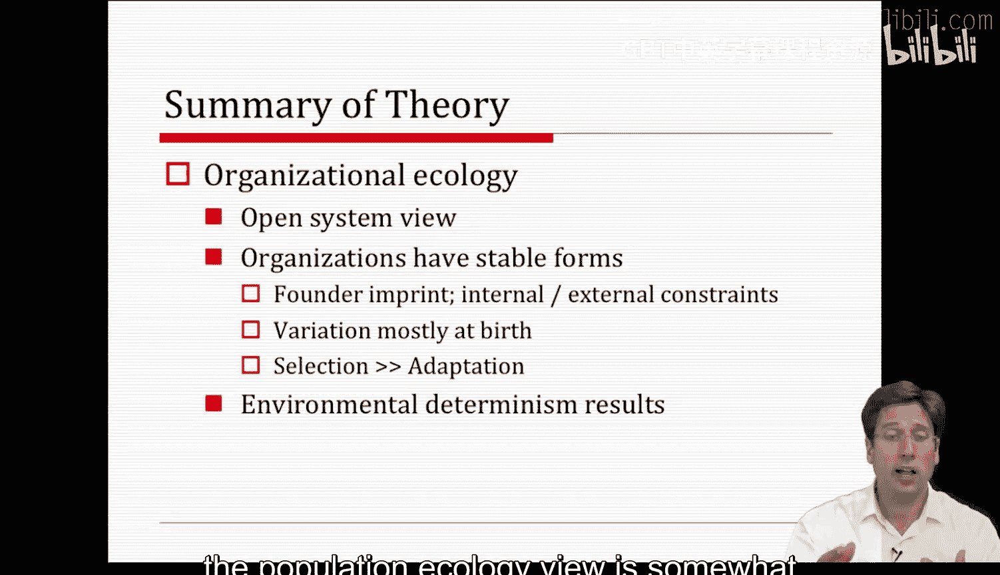

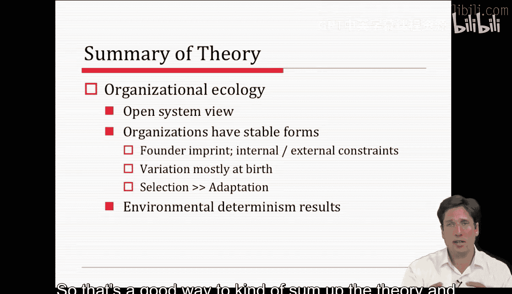

问题在于环境在不断变化，这就要求存在**变异**以及持续的**选择**和**保留**过程，这使得整个过程更具动态性。

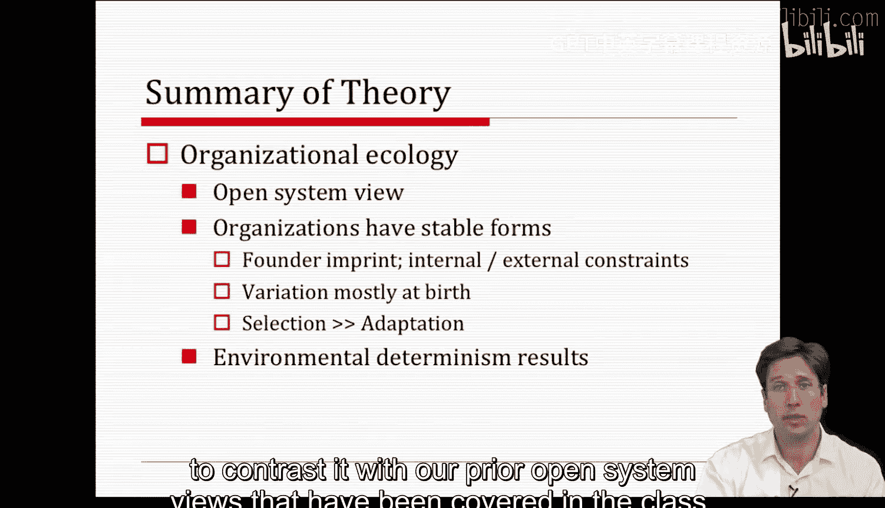

回顾一下，资源依赖理论、权变理论和新制度主义理论都侧重于组织如何**适应**环境。相比之下，组织种群生态学理论则从**选择**的视角探讨组织与环境的关系。与其他理论相比，种群生态学的观点更具**环境决定论**色彩。这是总结该理论并将其与本课程先前涉及的开放系统观点进行对比的一个有效方式。

---

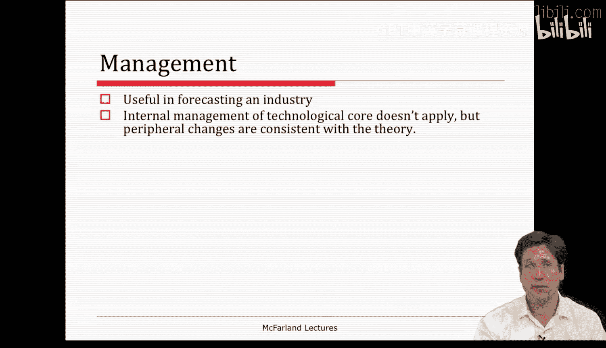

上一节我们介绍了种群生态学的核心理论观点。本节中，我们来看看管理者如何应用组织种群生态学理论。特别是考虑到其环境决定论倾向，我们应如何着手运用这一理论？

在许多方面，我将组织种群生态学视为一种**预测理论**。你拥有一个在种群或行业层面运作的理论，通过它，你可以评估环境、你的组织与该环境的匹配度及其生存机会——前提是你能收集到关于该行业、其基础生态位和实现生态位，以及你的组织形式相对于这些信息的足够数据。

考虑到组织形式的稳定性，改变你的公司通常很困难，除非它规模较小。因此，种群生态学视角下的管理者真正关注的是公司外部。他们关注**匹配度**，关注他们能够占据的**生态位**。

主要焦点在于尝试找到一个企业能够合理生存的**环境生态位**。这意味着管理者需要考虑他们所属的企业种群：他们与谁竞争？他们与他人共享什么技术？他们依赖什么资源？资源是否充足？他们是否会被淘汰？

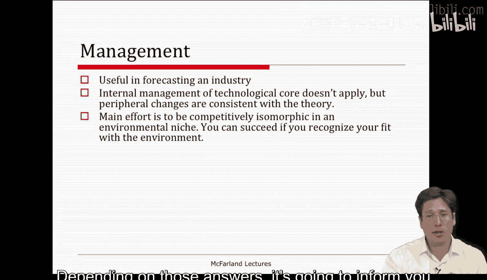

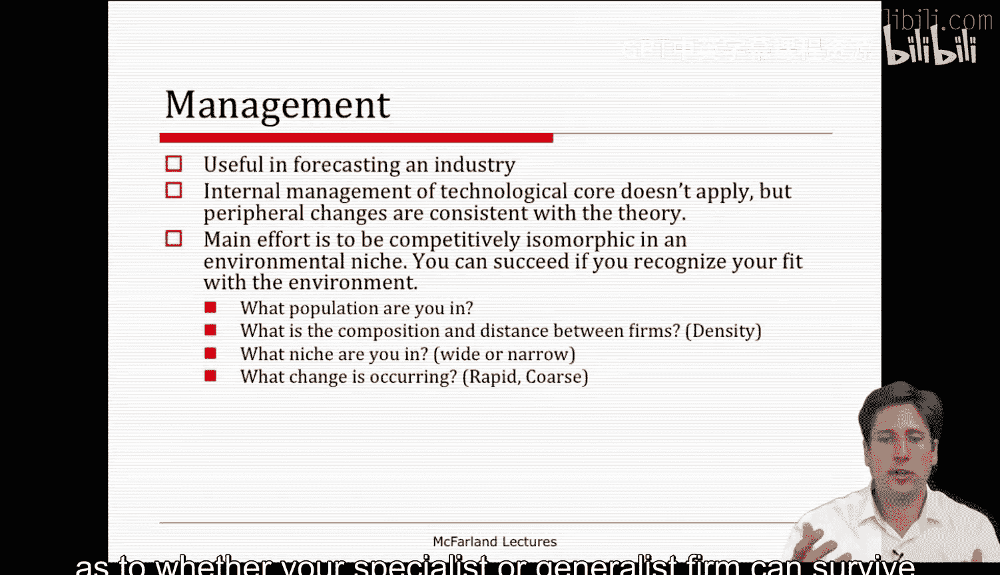

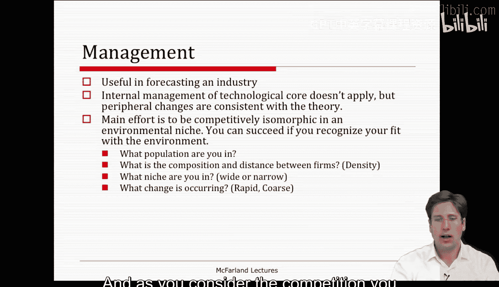

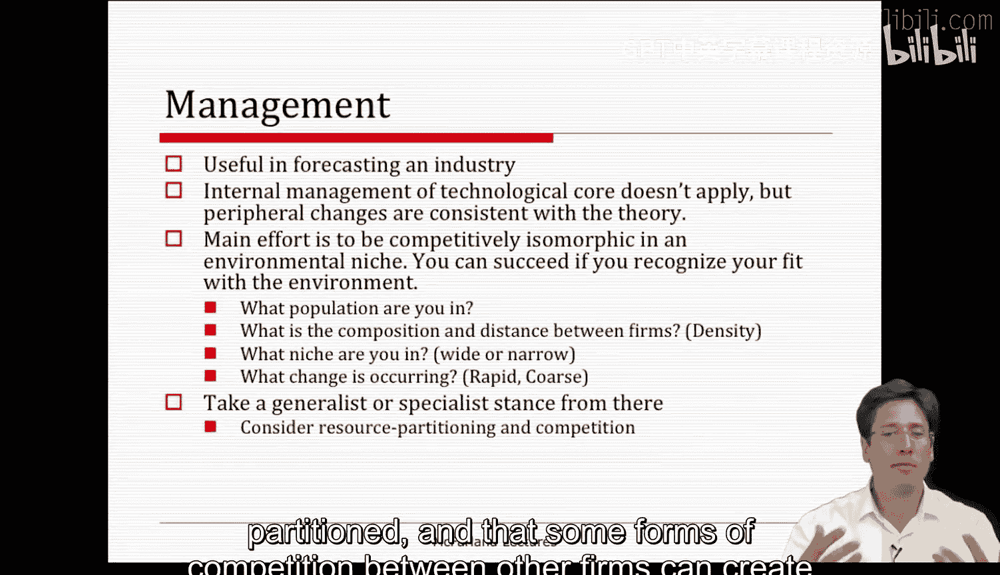

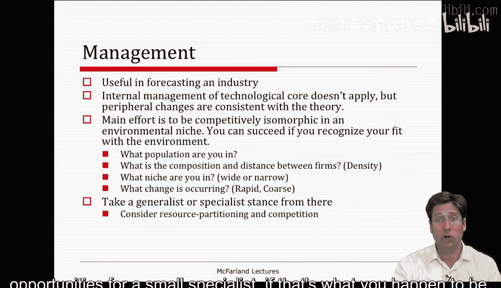

接着，管理者会提出类似以下的问题：这些企业的构成如何？它们有何不同？其中一些企业是从事多种业务的**通才型**企业，还是只专注于单一业务的**专才型**企业？它们与我的公司相似度或差异度如何？它们是否依赖相同的资源等？

然后，管理者会审视并询问：这个生态位能容纳多少企业？这个生态位的**承载能力**是多少？环境变化速度如何？变化是快速且粗放型的，还是缓慢且精细型的？根据这些答案，你将了解你的专才型或通才型企业能否生存，了解你的主要竞争对手位于何处。

在考虑竞争时，你可能会看到**资源分割**现象，即其他企业之间的某些竞争形式可能为小型专才型企业创造机会——如果你恰好是这类企业的话。

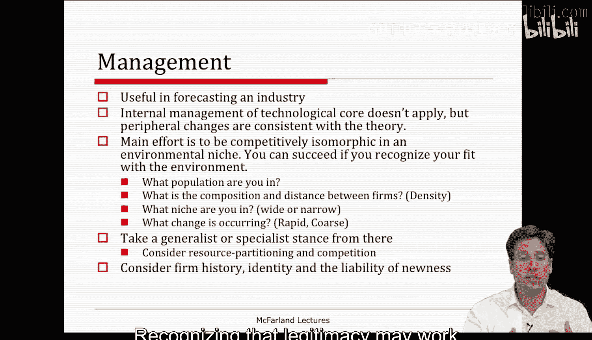

最后，你需要考虑公司的历史、公司的身份以及**新进入缺陷**。认识到合法性可能在特定情况下对你有利，例如在资源分割市场中，你处于边缘位置（你不是通才型企业，而是专才型企业），或者如果你处于缓慢稳定的环境中，作为专才型企业也有生存空间。

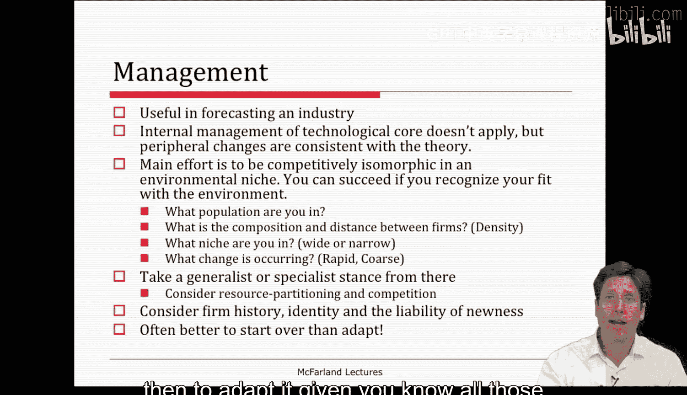

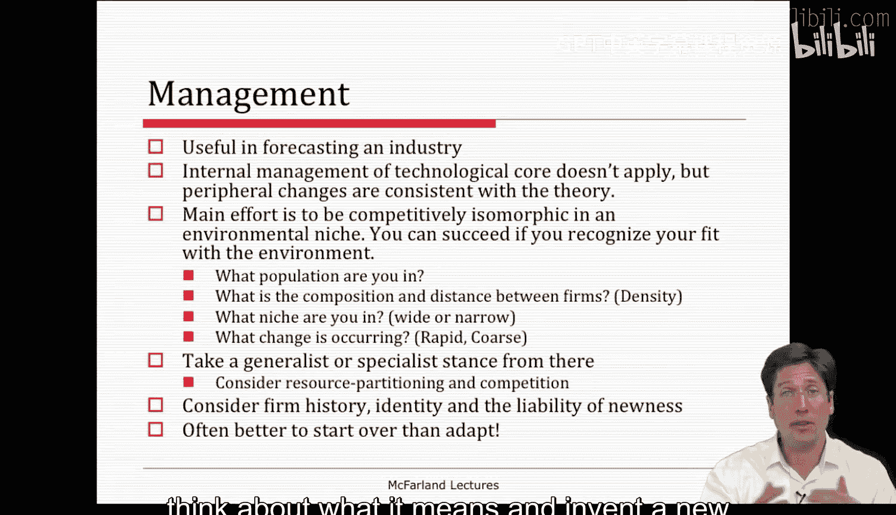

但你也需要考虑在哪些领域你可以与其他企业竞争，并作为专才型企业超越它们，从而利用某种环境。因此，你可以考虑接管一个非常特定的微细分市场。

此外，作为通才型企业，你可以思考如何在快速变化、波动剧烈的市场中定位自己，当所有其他专才型企业被淘汰时，你或许能够生存下来。

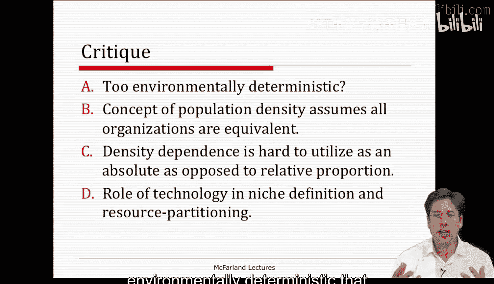

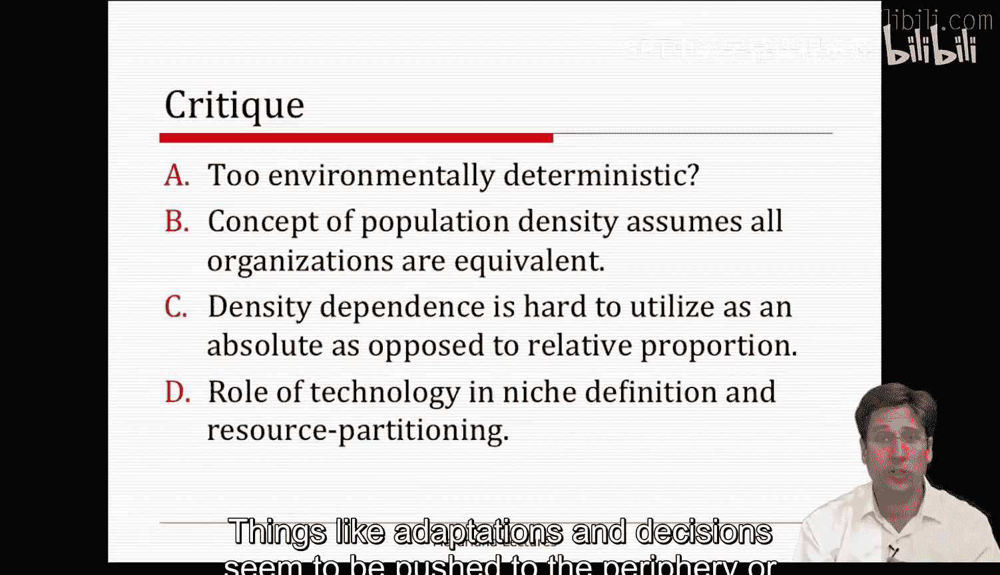

总的来说，考虑到内部约束和新进入缺陷等因素，**从头开始或彻底重塑公司**可能比试图适应它更好。通常的情况是，你审视当前的生态位，思考它的需求，然后创立一个能够满足这些需求的新公司。

---

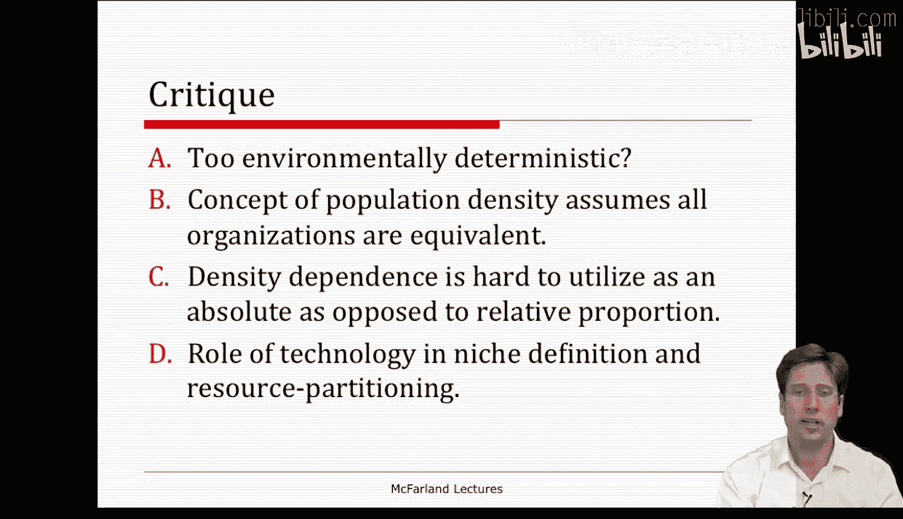

正如所有理论一样，组织种群生态学也有其局限性，并可能受到批评。最常见的批评或许是，种群生态学过于**环境决定论**，以至于似乎**丧失了人类能动性**。适应和决策等行为似乎被推到了边缘或次要位置，或者只发生在特定情况和特定类型的资源分割环境中。然而，作为管理者，你们中的许多人知道，这类适应和决策似乎是相关且可行的。

另一个批评是，**种群密度**的概念假设所有组织成员在衡量竞争时是等效的。例如，你会计算环境中企业的数量，但并非所有这些组织都具有同等的竞争力。有些公司规模巨大，有些则很小。因此，为密度依赖度量标准生成的数字是有疑问的，并且似乎不能在所有情况下准确反映竞争。

此外，就密度依赖而言，“密度”一词本身指的是绝对数量，这可能有些误导性，因为种群规模各不相同。对于一个小型种群来说，100家企业可能是一个巨大的相对数字；而对于一个庞大的种群来说，环境中的10家企业可能非常少。因此，更有用的可能是一个**相对的、标准化的密度概念**，它可能考虑到环境规模，从而判断这对于该类环境来说是比通常更密集还是更稀疏。我认为这是可以改进的地方。

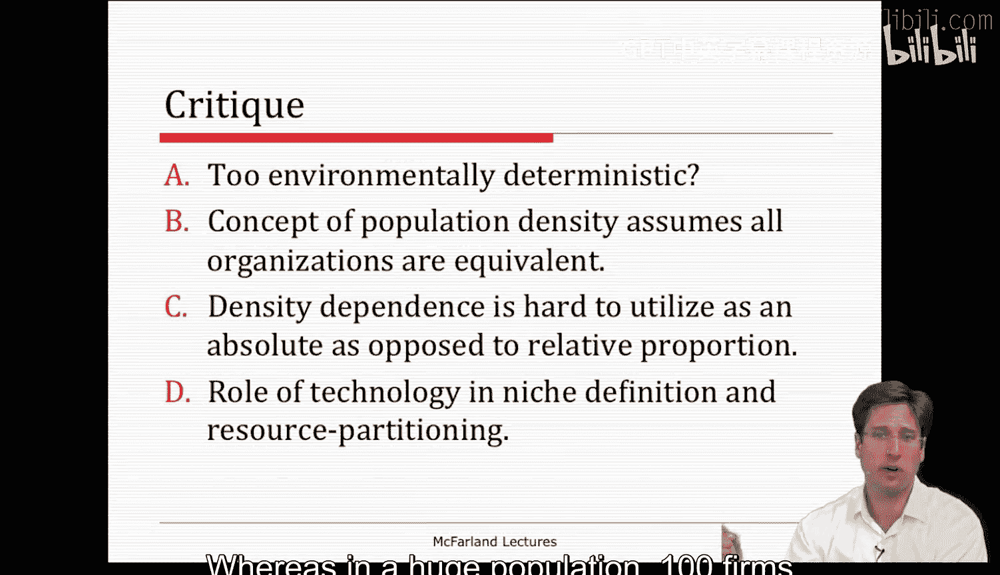

现在，种群生态学也忽视了**全球化**和**技术**在连接不同种群方面的作用。随着互联网和电信的出现，在生态位定义方面出现了各种复杂情况。如何界定一个种群或资源空间的大小？在这种情况下，还能公平地将一个生态位称为“西雅图金融企业”吗？我们还能这样做吗？此外，当一个企业在本地市场是通才型，但由于不同的文化定义和品味，在全球市场上却成为专才型时，会发生什么？这些是我能想到的种群生态学可能面临的问题，但它们相对容易理解，我认为其中许多问题可以通过该理论及其当前发展的各种研究来克服。

在思考每一种理论时，我相信你也能提出某些缺点和担忧，这些可能使该理论在特定情境下对你或多或少有些用处。

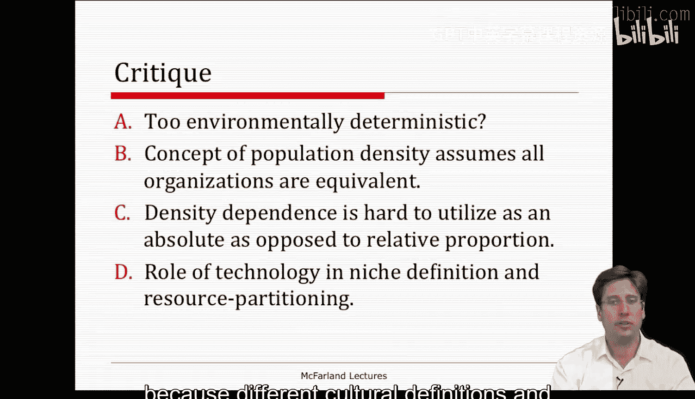

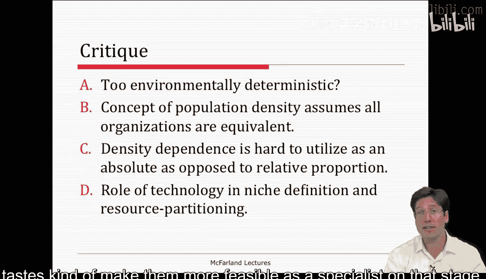

---

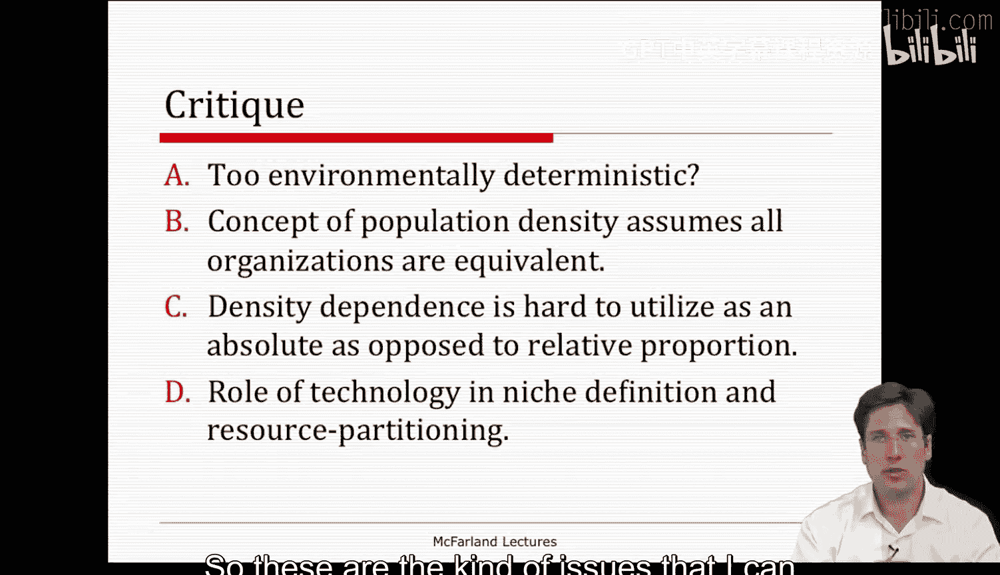

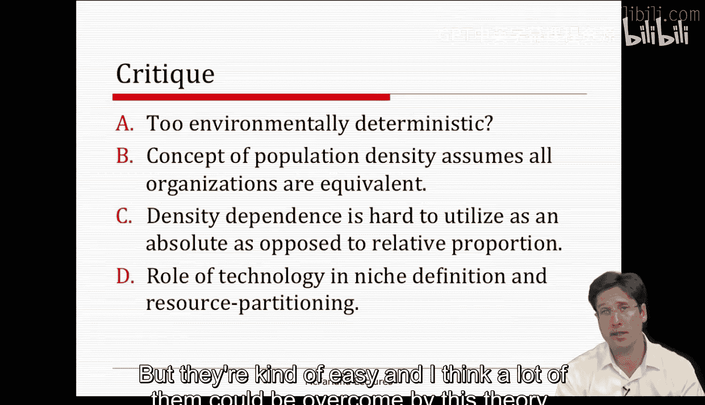

本节课中，我们一起学习了组织种群生态学理论。我们了解到该理论从选择视角看待组织与环境的关系，强调环境对组织形式的筛选作用。我们探讨了管理者如何运用该理论分析生态位、竞争格局和自身定位，并认识到从头开始或彻底重塑有时比艰难适应更为可行。最后，我们也审视了该理论在环境决定论、密度度量以及应对全球化与技术挑战方面的局限性。理解这些核心观点、应用方式和局限，有助于你更全面地分析组织在复杂环境中的生存与发展策略。