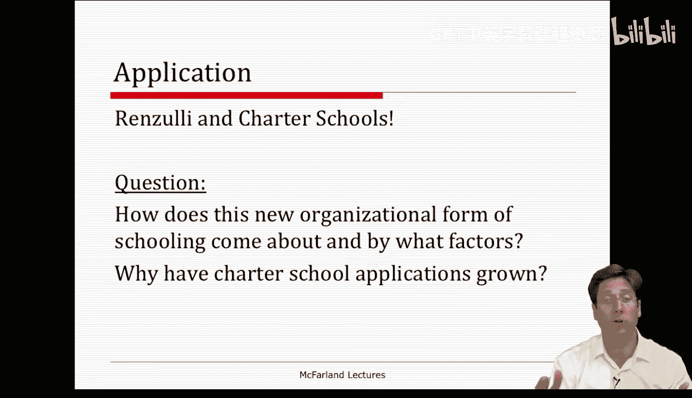
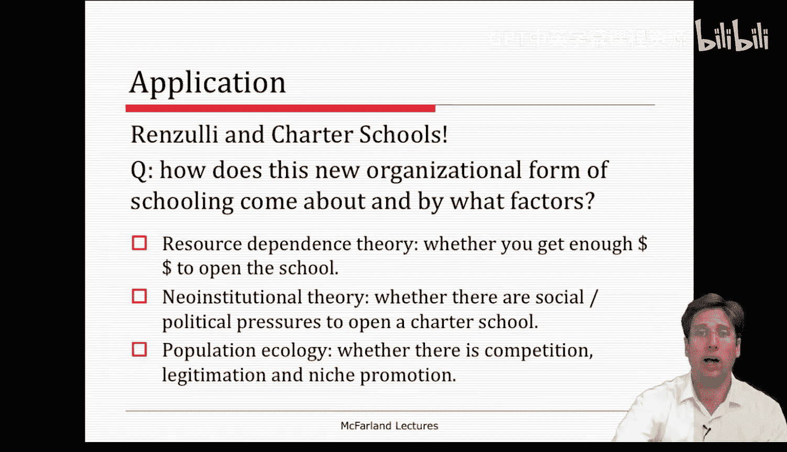
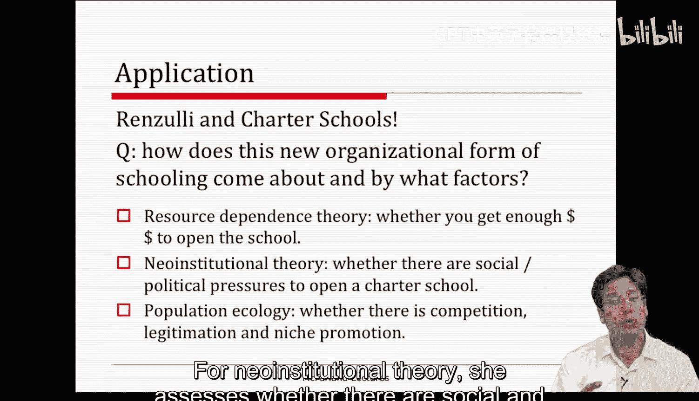
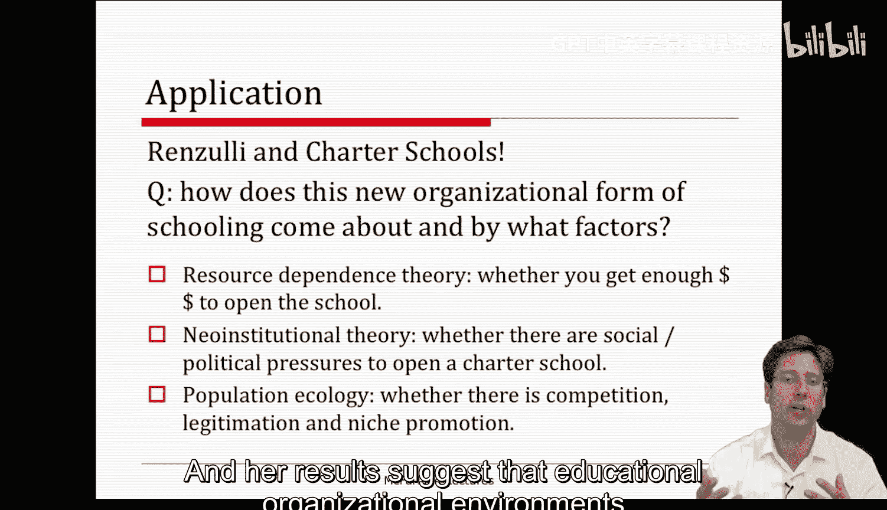
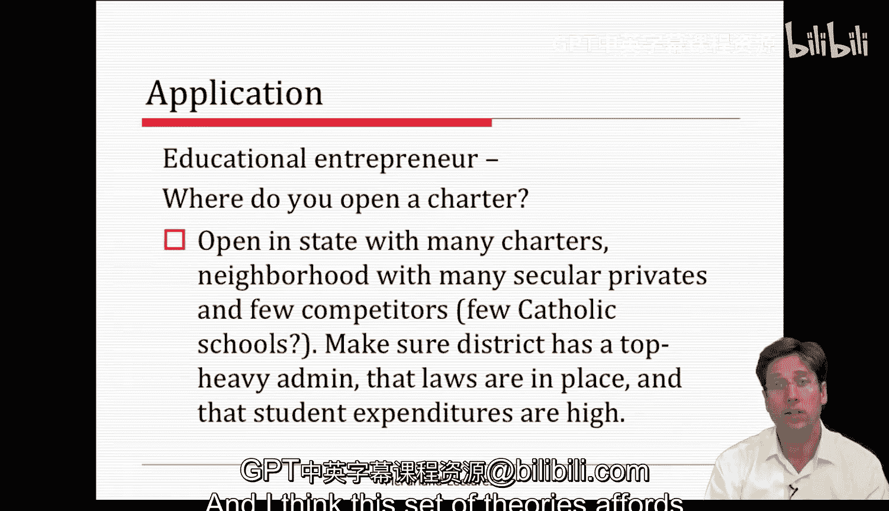

#  104：种群生态学 - 第五部分 🏫

在本节课中，我们将学习如何将种群生态学理论应用于一个实际案例。我们将通过琳达·伦齐关于特许学校的研究，来理解不同组织环境理论如何解释新组织形式的兴起。

上一节我们介绍了种群生态学理论及其潜在问题，本节中我们来看看一个具体的应用案例。

琳达·伦齐的研究进行了一项关于特许学校及其申请过程的实证研究。她提出的核心问题是：**特许学校**这种新的学校组织形式是如何产生的，以及受哪些因素影响。

这篇研究非常出色，因为它同时比较了多个关于组织环境的开放系统理论，例如资源依赖理论、制度理论和种群生态学。这是一种很好的方式来对比和观察人们如何结合这些理论来研究特定现象。她的具体问题是：为什么特许学校的申请数量会增长？

如果你开车经过一所特许学校，可能不会觉得它有什么特别显眼之处，它看起来就像一所典型的学校。但对于可能不了解的听众，需要说明的是：美国的特许学校是**由公共资金资助的中小学**，它们不受与传统公立学校相同的规则和法规约束。它们需要按照其章程或使命中规定的目标产出特定成果，并且是作为传统公立学校的替代选择，由家庭自愿选择入读。

大多数特许学校名额供不应求，因此入学资格通常通过抽签分配。特许学校之间也经常存在差异。这意味着，大多数特许学校的章程会提供专注于特定领域的课程，例如数学与科学、艺术与音乐，甚至是职业教育。另一些则提供通用课程，并试图在成本效益和表现上超越普通公立学校，这就是它们的章程。不过，所有这些特许学校都通过测试接受检查和问责，在这个意义上它们是不同的。

回到伦齐的研究，她想知道哪种理论能解释特许学校申请数量的增长。要建立一所特许学校，必须向学区和州政府提交申请和提案。在某种程度上，她的研究结果能帮助未来的教育创业者知道应该在哪里考虑开办新的特许学校。这对于目前正在学习本课程的一部分人来说，是一个实质性的问题。

为了回答这个问题，她评估了资源依赖理论、新制度主义理论和种群生态学的论点。她的分析有点像一场各种理论代理特征之间的“赛马”。

以下是她在研究中为每个理论设定的代理变量和测量方法：

*   **资源依赖理论**：她检验特许学校是否出现在能为开办提供足够资金的学区。她通过**生均教学支出**（即新特许学校开办后可获得的运营预算）来衡量这一点。
*   **制度理论**：她评估是否存在开办特许学校的社会和政治压力。她通过**立法与工会压力**来衡量，例如州内关于特许学校的立法强弱、相关立法的颁布年份（即州内特许学校法律成立的时间早晚），以及学区中特许学校管理人员的数量。这涉及合法性考量。
*   **种群生态学**：她考察了**本地竞争**，这是**密度依赖**的代理变量，用学区内现有特许学校的数量来衡量。她还考察了**利基促进**，她通过**非宗教私立学校的数量**来衡量，因为这些学校会促进贫困学生对特许学校的需求。

她为每个理论设定了这些可测量的变量，然后对它们进行回归分析。她的结果表明，教育组织环境确实是催生特许学校过程中的关键因素。

她发现了支持种群生态学的有力证据。她发现**非宗教私立学校**增加了特许学校申请的提交，这表明利基促进正在发生。她还发现，**本地学区现有特许学校的密度**会产生影响：随着市场饱和，申请提交数量会减少，这表明存在竞争，特许学校不会在饱和区域开办。

她也发现了一些支持新制度主义和资源依赖理论的证据。例如，她发现**本地政治环境、稳固的资金和立法支持**也有助于新特许学校的形成或申请。

考虑到所有这些因素，假设你是一位教育创业者，你会在哪里开办一所特许学校？这就像你作为开放系统的管理者，在预测将你的新组织“种植”在何处。

根据这项研究的结果，你应该在**一个拥有许多特许学校的州、一个有许多非宗教私立学校的社区、以及一个竞争对手较少的学区**开办。例如，那里没有很多学费低廉、可能与你竞争的天主教学校。同时，要确保该学区管理层人员充足，有支持特许学校的法律，并且生均支出较高。

我认为，从这篇论文中得出的所有这些特征，真正提供了一种更系统或种群层面的理解，让创业者知道可以从哪里开始创业。我认为这在管理上是一个非常重要的考量：**成功并非完全取决于内部的运营和适应，你所处的位置和时机也极大地影响着业务的成败**。而这套理论为我们提供了一系列思考这个问题的方法。

本节课中，我们一起学习了如何将种群生态学等组织理论应用于分析特许学校的兴起。我们看到了实证研究如何通过设定代理变量来检验不同理论，并理解了环境因素（如竞争密度、利基促进、制度支持和资源可得性）对于新组织创建和成功的重要性。这强调了管理者需要具备系统思维，将组织置于更广阔的环境背景中进行考量。