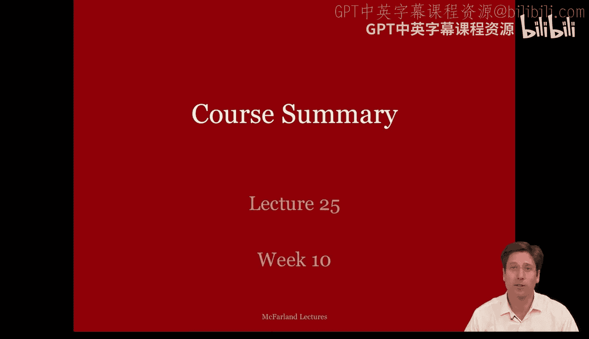
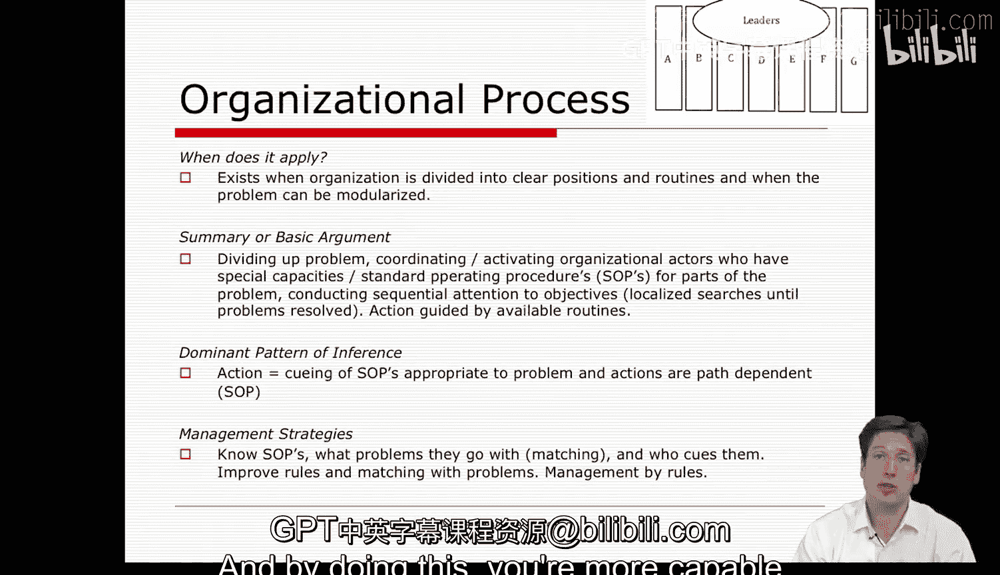

#  105：课程总结（第一部分） 🎓

在本节课程中，我们将回顾本学期所学的全部理论，并探讨如何将这些理论应用于分析过的各类案例。我们将系统梳理从微观到宏观、从理性系统到自然系统再到开放系统的理论框架，并总结各理论的核心要点与应用方式。

回顾整个课程，你会发现我们已经涵盖了大量的学习材料。课程从介绍组织及其行为开始，通过一系列广泛案例，分析了政府机构、游说团体、科技公司、中小学、学区、大学、组织改革项目、在线教育课程、多人在线游戏乃至国家政策等多种组织形态。同时，课程提供了多种组织特征供我们思考，例如环境、社会结构（包括行为、规范和认知特征，从表层到深层结构），以及参与者、技术（或任务）乃至组织的共同目标等要素。这些要素共同构成了一套语言和检查清单，帮助我们更深入、更全面地审视组织的复杂性。

我们还学习了一系列理论，用以理解这些组织特征如何协同作用。关于组织行为的理论涵盖了理性行动者模型（即管理者以理想化的理性方式，或更现实的、有限理性的“满意”方式，乃至遵循规则的义务驱动行为来做出决策）。在学习了清晰的理性行动者模型后，我们进一步探讨了组织如何像一个具有多重内部权变因素的有机体那样运作的自然系统观。我们观察到，企业常常遵循组织流程或官僚规则，而另一些组织则只有在经过政治博弈并形成联盟后才能实现协调。还有一些组织似乎遵循着一种“有组织的无政府”过程，人员与议题在会议中流动进出。

此外，我们还学会了将企业视为具有自我反思能力的学习型组织，并探讨了如何建立能够维持这种联合形式的社会结构。通过组织文化理论，我们深入探究了指导行动的规范与认知原则，了解到企业拥有自身的精神特质和风格，这些极大地塑造了成员的体验。

在过去的几周里，我们将焦点扩展到了环境及其如何影响企业行为与生存的理论上，例如资源依赖理论。我们关注企业间的依赖关系；通过网络组织形式理论，我们审视了更大范围的协调行动安排与模式，就像从直升机上俯瞰交通拥堵，而非从车内观察。借助新制度主义理论，我们研究了环境中的深层结构与文化，以及企业如何通过模仿它们来获得成功。最后，在本周，我们通过种群生态学理论，探讨了环境决定论的硬性形式，以及源于企业间竞争的自然选择过程。

纵观整个课程，我们从驱动组织作为统一行动者的微观层面个体，发展到由规则、政治、意义、反馈或意义建构所协调的中观层面群体，最后到达宏观环境层面，其中资源约束、基于互惠与信任的网络背景，以及社会政治的信念模式都对组织产生影响。我们从微观到宏观，从理性系统到自然系统再到开放系统。

在此过程中，我们也学习了相应的管理建议。每种理论都以特定视角看待世界，认为世界由某些特定方面驱动，这为组织的创建、变革与稳定提供了一系列策略。在某些情况下，环境中的资源是关键；在另一些情况下，信念与关系背景更重要；而在其他案例中，企业或学校内部的动态，例如人们对公司目标和仪式的认同程度，以及如何说服不认同的人或如何在这种情况下做出决策，则更为重要。

我们还学习了这些来之不易的组织经验如何被记住或遗忘，以及如何将其用于构建学习型组织。在我看来，你现在已经拥有了一套工具包，可以成为一名严谨的研究者、分析师，乃至管理者。你只需要思考这些框架、世界观或理论如何应用、在何时应用以及为何应用，然后就可以根据具体情况在不同理论间切换。不要将它们视为独立的工具，而要像木匠看待挂在墙上的工具那样，学会以不同方式组合使用它们。要成为大师级的木匠，就需要对案例形成全面、细致入微的理解，这对客户、读者以及世界上所有消费组织知识的人都是有益的。因此，我认为你现在已经拥有了这套工具，并准备好使用它们。我们只需要再向前一步，思考如何整合这些理论。

为了让你更清楚地了解我们已经走了多远，让我们回顾一下部分案例。第一个案例是关于玛丽·梅茨的磁石学校改革。另一个案例是艾利森应用多种理论分析的“古巴导弹危机”。我们还研究了几个关于20世纪80年代和90年代芝加哥公立学校改革的案例。我们以多种方式解读了“卡特里娜飓风”灾难。我们讨论了密尔沃基的家长择校计划（或称教育券计划），即学生或家长获得资金将孩子送到其他学校以购买教育选择权。我们探讨了在国会或立法机构中奔走、试图建立联盟的游说者。我们分析了旧金山的学校废除种族隔离努力，及其特有的“有组织的无政府”过程。我们审视了王国（Kingdom）内部的立法努力，但也讨论了国家政策法案《不让一个孩子掉队》及其出台过程。我们探讨了学术会议或任何由相对平等的个体聚集并试图做出决策的会议。我们讨论了施乐复印机维修工。《魔兽世界》这款大型多人在线游戏。我们研究了学习型社区，即那些试图将自身改革为反思性学习型组织的学校或机构。我们还讨论了昆达（Kunda）或马丁与迈永（Martin & Meyon）在奥斯科（Osco）所描述的一家科技公司。我们花时间讨论了我的母校芝加哥大学（University of Chicago）与西北大学（Northwestern）合并的尝试，作为资源依赖理论的案例。我们分析了一家硅系统公司中一次未遂的工会罢工。结合我自己的研究，我们探讨了课堂与学校网络，以及大学网络。通过埃格斯和戈德史密斯（Eggers & Goldsmith）的研究，我们了解了国家公园管理局及其如何形成网络组织形式。然后，我们还通过史密斯和沃斯特德特（Smith & Wosteadter）的阅读材料，研究了特许学校网络，这是一个组织场域，旨在改变形式并在原本高度同质化（每所学校看起来都一样）的领域中创造变异。这里存在一些实验性的努力。我们讨论了中学和高中，它们通常看起来非常相似，并且无论我们走到哪里，它们都复制了许多相同的结构，这是一种制度化的形式，如果你过多地偏离它，你的机构将难以获得社会资源。我们探讨了框架辩论，以及制度如何在智能设计论与进化论教学之间的辩论层面，乃至总统竞选平台层面（例如之前选举中共和党拥有相当规范的框架策略而民主党缺乏）被应用。我们还讨论了像Coursera和凤凰城大学（University of Phoenix）这样的大规模开放在线课程，以及它们如何挑战或至少引发了对合法化过程和环境制度使用的更深层反思。我们甚至花了一些时间讨论微型啤酒厂和葡萄酒，这很适合作为课程的结尾，我希望你们都能为自己完成这门课程好好庆祝一下。最后，是的，我们再次回到特许学校，将其视为在教育领域和组织种群中创造变异与选择的一场运动。

本学期我们涵盖了许多案例，我希望你们中的许多人已经意识到我们所涉及案例的多样性和数量。当然，我们在论坛讨论、许多讲座的简要提及以及阅读材料中，还讨论了更多远超这个小清单的案例。但我认为，记住案例的数量之多、种类之丰富，以及我们应用于它们的所有理论的多样性，是很有帮助的。

我们也涵盖了大量理论，总共10个。为了提醒你，它们包括：理性选择模型；反映组织流程和规则遵循的官僚模型；联盟理论；有组织的无政府状态或“垃圾桶”理论；组织学习理论；组织文化理论；资源依赖理论；网络组织形式理论；新制度理论；以及组织生态学理论。我们学习了10种不同的理论，现在你拥有了这套工具。

让我们花更多时间逐一回顾，以便你对每种理论的核心特征有所把握。

我们介绍的第一个理论是理性行动者模型。理性行动者模型也被称为理性选择模型。在我这边的屏幕上，你可以看到一个实际的流程图，它很好地描绘了该理论，将其表现为一系列“如果-那么”式的决策序列。我认为，如果你下载讲座幻灯片并放大这个图表，你会看到我将要谈到的所有要素。

现在，对于任何理论，首先要问的是它何时适用。就理性行动者理论而言，它适用于当你面对或感知到一个似乎驱动着组织大量过程的统一团队或行动者时。这个行动者通常具有一致的偏好、充分的信息、清晰的目标，并且有实际进行计算的时间。因此，在某些情况下，它可能更适合用于规划而非应对。理性行动者理论的一般论点是：该行动者面对一个问题，评估其目标或目的（即其特定偏好），识别各种选项或潜在选择，计算每个选项的后果，然后选择能最大化回报并最小化成本的选项。

当然，这假设了收集信息和计算后果、预见未来等方面相当强大的能力，但这并非总是可能。因此，在现实中，我们实际上讨论的是有限理性和“满意”决策，作为该理论的一个变体。在这里，我们认识到信息不完美或存在不确定性，以及后果不明确的模糊性，而选择过程与其说是最优化，不如说是“满意”或寻找足够好的解决方案。因此，这是理性行动者模型的一个轻微变体，仍然是手段-目的导向，只是有限理性的行动者设定了一个较低的阈值，并预设了信息不完美。

推理模式基本上是决策发生或组织行动发生的途径。在这个理论中，推理模式是目的的手段最大化，和/或目的的手段满意化。这就是主导的推理模式。最后，作为你公司中理性行动的管理者，你基本上需要专注于了解各种备选方案及其后果、设定清晰的目标、确保决策集中且一致，以优化应用理性行动者模型的特征，然后你真的需要花大量时间关注你所使用的信息质量和分析方法。通过这样做，你将更有能力进行管理。

---

**本节课中我们一起学习了**：课程第一部分总结，系统回顾了从理性行动者模型到组织生态学等十大理论框架，梳理了其核心要点、适用情境及管理启示，并通过回顾本学期丰富的案例分析，展示了如何运用这些理论工具从微观到宏观、多角度地深入理解复杂的组织现象。我们强调，掌握这套理论工具包的关键在于学会根据具体情况灵活选择与整合不同的理论视角。