#  106：第二部分

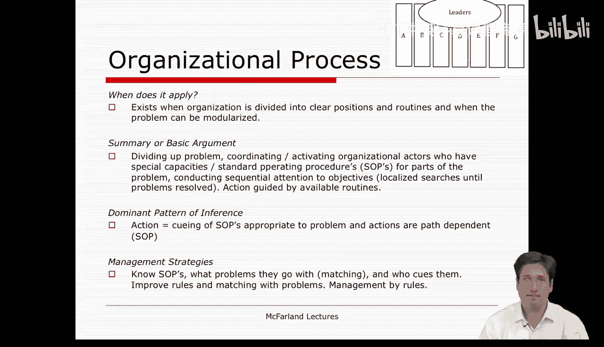

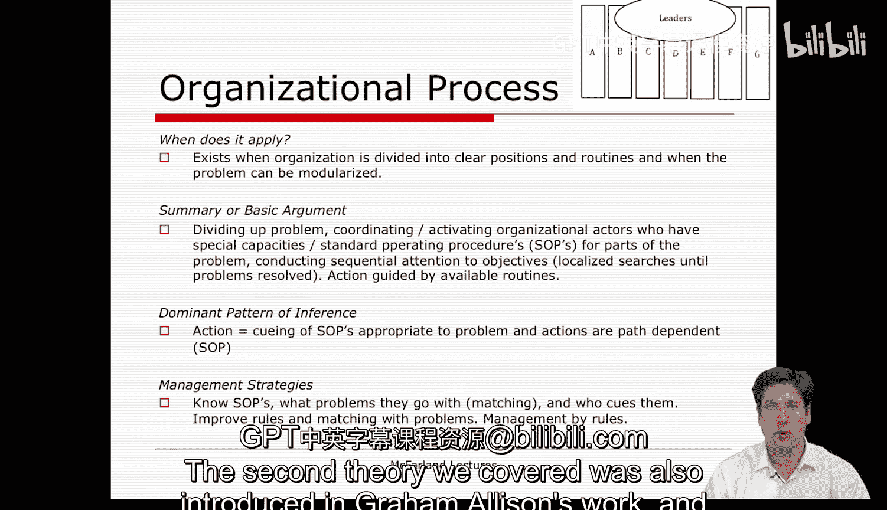

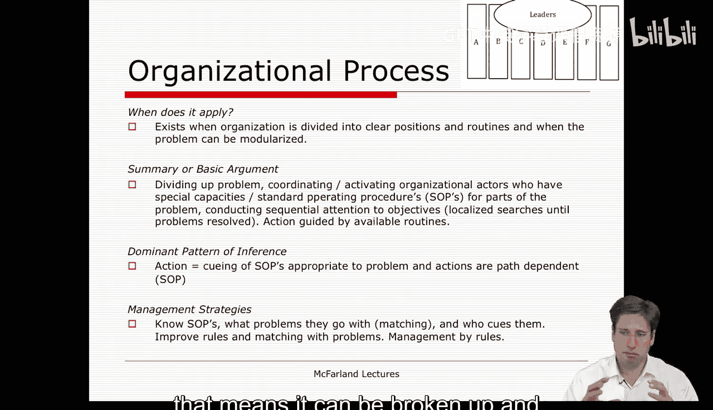

在本节课中，我们将回顾课程中探讨的几种核心组织决策理论。我们将逐一介绍每种理论的核心思想、适用场景、基本论点、决策模式以及管理启示，帮助你构建一个清晰的组织分析框架。

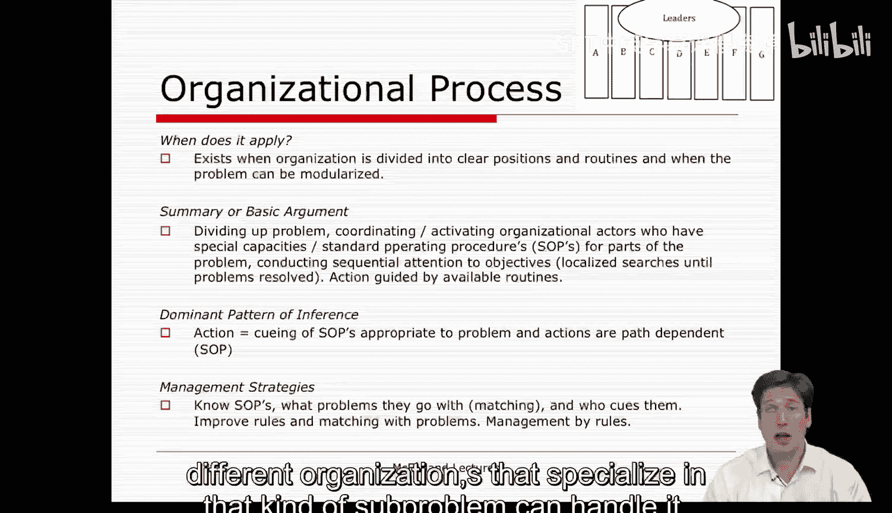

---

## 组织过程模型 🏛️

上一节我们介绍了理性选择模型，本节中我们来看看第二种理论——组织过程模型。该模型由格雷厄姆·艾利森提出，强调组织遵循既定规则和程序的逻辑。

该理论适用于组织被划分为明确的职位和例行程序，且问题可以被模块化处理的情况。这意味着问题可以被分解，并由组织内专门处理此类子问题的不同单位或不同组织，利用其特定的例行程序或规程来处理。

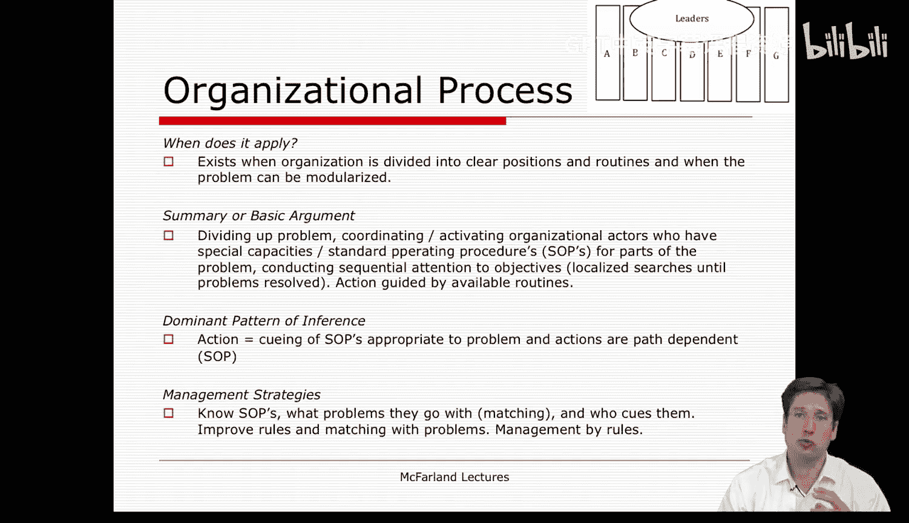

以下是组织过程模型的基本论证步骤：

1.  **分解问题**：将复杂问题（如肯尼迪面临的潜在“末日”危机）分解为多个组成部分。
2.  **协调与激活**：协调并激活那些在子单位或不同组织中、拥有处理特定子问题所需专业能力和标准操作程序的组织行动者。
3.  **匹配与执行**：将子问题与相应的处理单位匹配，并确保通过可用的例行程序按顺序解决每个子问题，实现目标。

在这种模型下，决策和行动的主要模式是**调用匹配特定问题的适当标准操作程序**。一旦启动，行动将具有路径依赖性，即存在惯性，个人和团队会遵循该标准操作程序。这是一种遵循规则和官僚逻辑的模式。

作为管理者，你需要了解公司的标准操作程序、问题与处理单位的对应关系、以及由谁在哪些职位上触发和控制这些程序。管理的重点在于**改进规则**，使其更好地匹配问题；**管理职位和标准操作程序**，通过演练和实践做好准备；并建立良好的文件系统，以便在需要时能迅速找到解决方案。

---

## 联盟理论/官僚政治模型 🤝

在课程的第二和第三周，我们遇到了第三种理论。它最初由格雷厄姆·艾利森称为官僚政治模型，后来由休拉和詹姆斯·马奇发展为联盟理论，探讨组织内部或跨组织联盟如何形成。

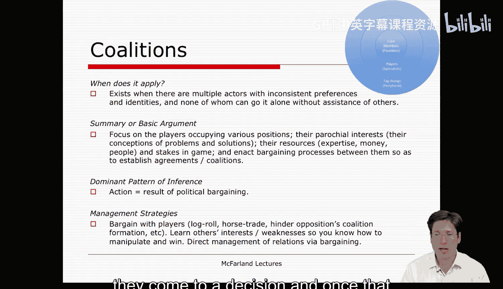

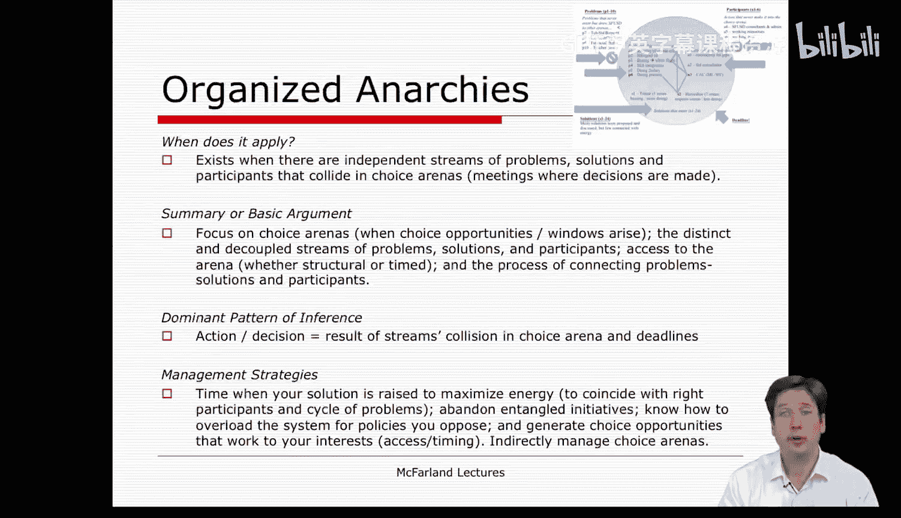

当存在多个行动者，他们拥有不一致的偏好和身份，且任何一方都无法在没有他人协助的情况下完成任务或达成目标时，联盟理论便适用。他们必须汇集资源，以某种方式联合起来。

联盟理论的基本论点如下：

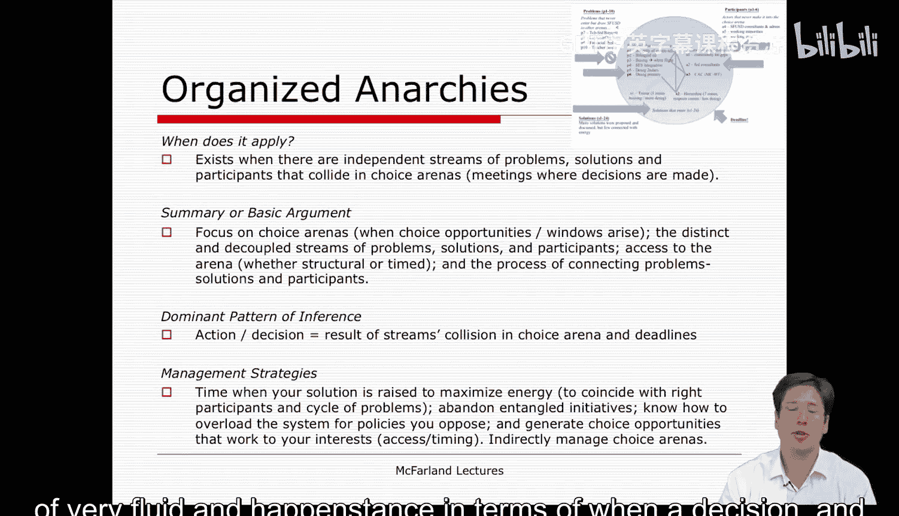

*   **参与者**占据不同职位，拥有狭隘的利益。
*   **问题与方案认知**：他们对问题和解决方案的看法差异很大。
*   **资源与筹码**：他们拥有各种可用于讨价还价的资源，如专业知识、资金、人力等。
*   **讨价还价过程**：拥有不同利益和资源的参与者，像持有不同手牌的玩家，通过讨价还价过程，试图建立一个能够推动决策的协议或联盟。

在这种理论下，集体决策和行动的产生模式是**政治性讨价还价**。作为联盟的管理者，你需要关注讨价还价过程和策略，例如**互投赞成票**（这次你不反对我，下次我也不反对你）、**利益交换**、以及**阻碍对立联盟的形成**。这需要通过了解其他团体、个人或职位的利益和弱点来实现，从而利用杠杆作用从各方伙伴那里争取达成协议。联盟通常是临时的，决策一旦做出，联盟便可能解散。

---

## 组织化无政府状态/垃圾桶模型 🗑️

本课程涉及的第四种理论被称为组织化无政府状态或垃圾桶模型。当我们观察到问题流（如来自媒体等持续不断的问题）、解决方案流（来自专家或不同利益集团的各种方案）以及参与者流（在决策场合中进进出出的人）各自独立运行时，垃圾桶模型便适用。决策场合本身也在流动，决策只在特定的“ punctuation”时刻才有机会做出。

该理论的基本论点是：存在一系列**决策机会窗口**，问题、解决方案和参与者这些“流”在其中流动交汇。决策的产生取决于在特定时间点，哪些问题、解决方案和参与者被连接到了一起。这个过程充满了有限理性、模糊性和各种现实决策情境中的混乱。

垃圾桶模型的决策推断模式是：决策和行动源于这些“流”在“垃圾桶”内的**碰撞与连接**。摇动垃圾桶，任何被连接到或纠缠在一起的东西就构成了决策。因此，这是一种带有无政府状态的、某种程度上由偶然性或至少是情境性驱动的决策模型。

管理这类情境充满挑战。管理者可以采取的策略包括：**把握时机**提出解决方案，以确保能量最大、关键人物在场；**放弃纠缠不清的倡议**，避免被复杂问题拖累；**战略性地过载系统**或设置议程以影响决策流向。如果完全接受这种视角，管理者需要以不同方式看待会议——不是将其视为做出决策的地方，而是作为**相互观察和理解**的场合，一个意义建构的过程，让参与者感到在过程中有发言权，从而获得更多认同。

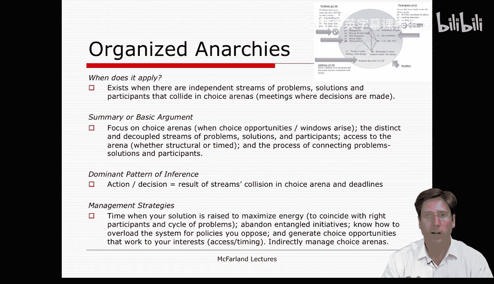

---

## 组织学习理论 🧠

在课程的第五周，我们讨论了组织学习理论。对许多人而言，这像是一种理想的组织模型。它适用于拥有清晰反馈回路、能够调整例行程序以使人们学习实践和知识的组织。在这样的组织中，人们了解隐性过程，记得什么方法有效，拥有组织智能，重视适应和实验，从而能够不断从成功和失败中学习，持续改进绩效。

该理论的基本论点是：通过**聚焦于实际实践**以及**持续改进这些实践的努力**，可以实现决策和行动。组织需要记住并改进对其社群或技术核心至关重要的成果。这通过创建**实践社群**（组织内参与者之间的横向联系，用于分享、沟通和传播最佳实践知识）和**实践网络**（延伸到其他组织的网络，用于学习可能存在于其他组织的全局最优或更好想法，并将其转化回本地）来实现。

在这种理论下，行动产生的模式是：**检查实践** -> **评估其对组织的回报** -> 通过本地实践社群中的持续迭代互动以及对外部环境的网络搜索，不断重复这一过程。

作为这类组织的管理者，鼓励学习行为的方法包括：**创建大量的横向联系**以加速知识传递（如施乐公司让新手与专家邻座）；**建立组织记忆**（如通过网站、邮件列表等）；**设计应用性社会学习体验**（如派整个团队进行专业发展，模拟实践）；最后，**重视即兴发挥**，培育沟通、知识共享以及对实践进行持续讨论和反思的文化。理论上，这将造就一个学习型组织。

---

## 总结 📚

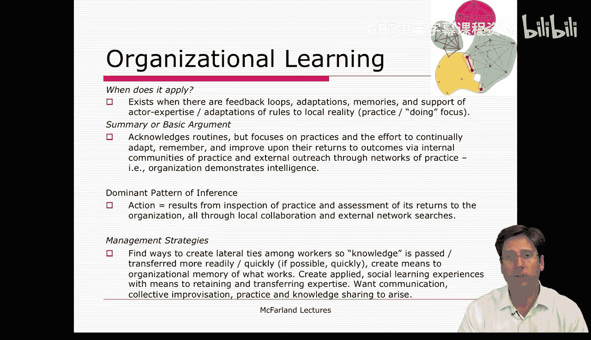

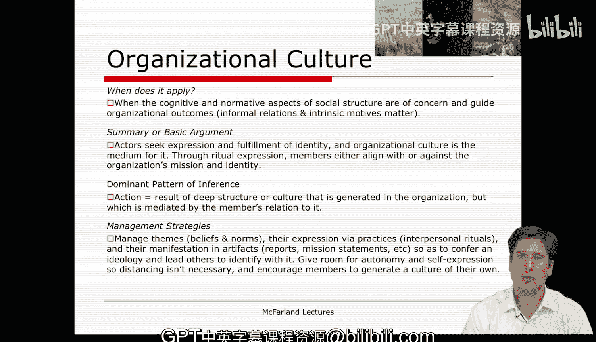

本节课我们一起回顾了课程中探讨的四种核心组织决策理论：强调规则与程序的**组织过程模型**、关注利益博弈与联合的**联盟理论**、描述混乱与偶然连接的**垃圾桶模型**，以及追求持续改进与知识共享的**组织学习理论**。每种理论都提供了独特的视角来分析组织如何决策与行动，并给出了相应的管理启示。理解这些理论有助于你根据不同的组织情境，选择最合适的分析工具。