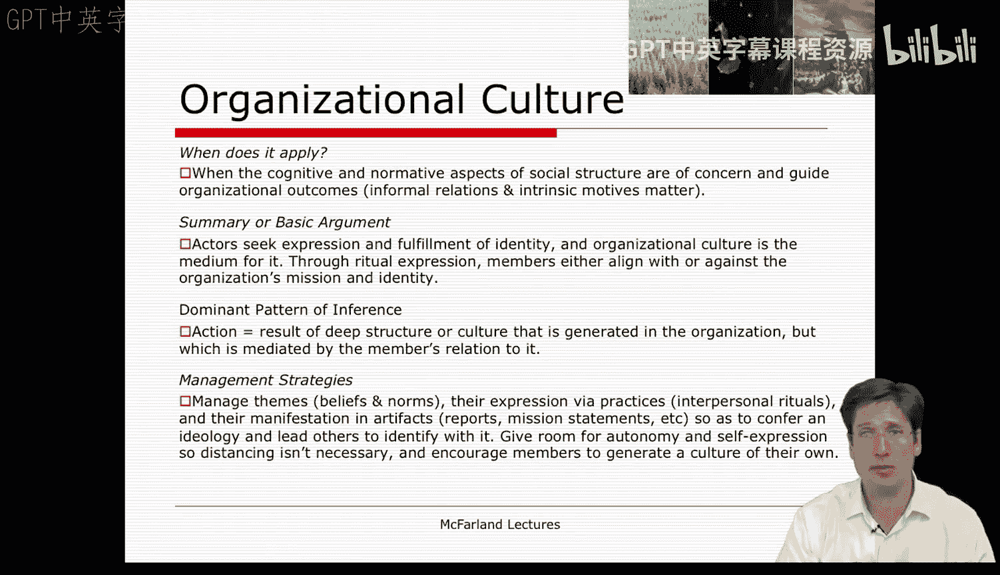
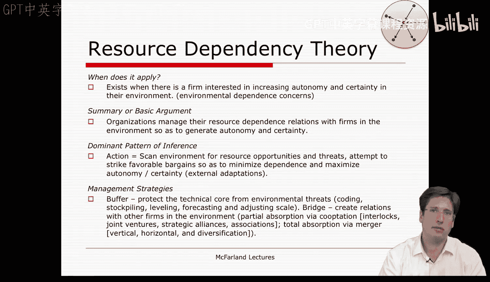
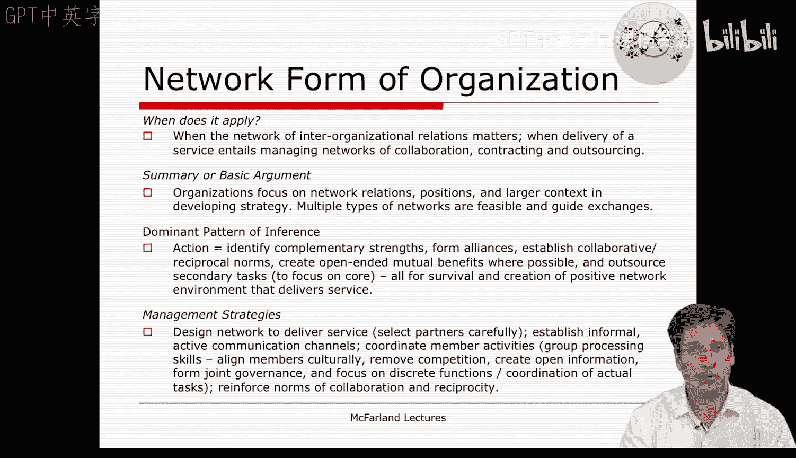
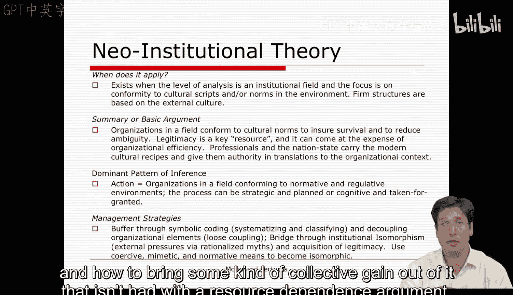
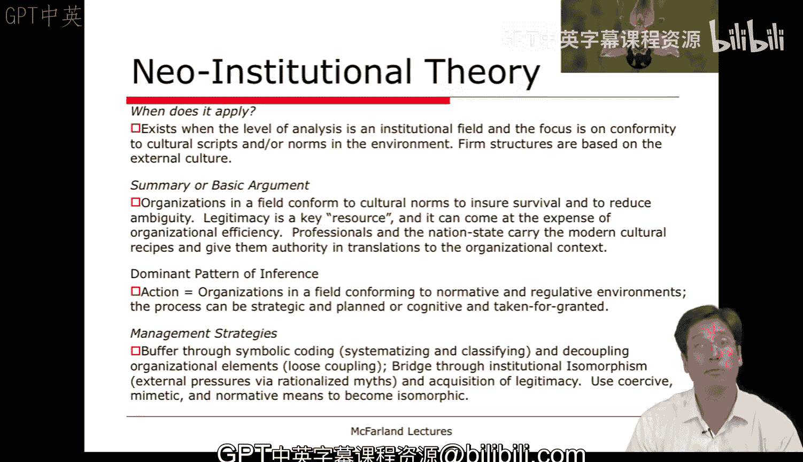

#  107：第三部分

在本节课中，我们将回顾第六周至第九周的核心理论，包括组织文化、资源依赖理论、网络组织形式和制度理论。我们将探讨每种理论的核心论点、适用场景以及管理者的应对策略。

---

## 第六周：组织文化 🏛️

上一部分我们讨论了组织学习，本节中我们来看看组织文化。组织学习预设了成员都认同并致力于改进实践。组织文化则不同，它关注深层的社会结构，而组织学习似乎更侧重于沟通与协作的表层结构。

那么，组织文化何时适用？当社会结构的认知和规范层面成为关注点时，当成员的非正式关系和动机真正重要时，当我们希望赢得员工的“人心”，或者员工的“人心”对公司至关重要或面临风险时，组织文化就变得重要了。

组织文化的基本论点是，公司内的行动者寻求身份的满足和表达。这本质上是一种**适宜性逻辑**。组织文化是他们发展自我意识或在日常生活中呈现自我的媒介。毕竟，他们大部分时间都在工作中度过。

通过仪式表达、互动（如展示工作成果、执行团队项目、进行演示和会议），成员们了解彼此的立场、他们在各项事务上的表现，以及他们重视或不重视的身份和意义。某些事物被认可为神圣或亵渎，这就是组织文化观点背后的普遍论点。

通过这些符号和仪式的展现，我们得以理解公司内每个人所处的认知和规范环境。

从组织文化的角度看，行动或决策产生的主要推理模式，完全由文化的深层社会结构驱动。这取决于成员与这种文化或身份的关系——他们是拥抱它，还是疏远它——这创造了他们是否感到有义务的感觉。他们是否愿意为此加班，所有这些都创造了对组织目标、活动和程序的行动感和承诺感。在某种程度上，这就是组织文化理论家和分析家所呈现的关注点。

作为管理者，如果你想灌输这种文化，你需要关注以下几点：

以下是管理者应关注的核心要素：

*   **信念与规范**：人们的信念和规范。
*   **表达方式**：人们在人际交往和工作流程仪式中表达信念和规范的方式。
*   **物化表现**：这些信念和规范如何体现在各种**人造物**中，例如报告、使命宣言的呈现方式，办公桌的布置、符号的使用，甚至是对空间和建筑的使用方式。

这一切都传达了一种意识形态，并引导他人要么认同它，要么抵制它。通常，作为管理者，你希望给予一些自主表达的空间，这样员工就不会觉得他们必须疏远组织文化。这鼓励他们在文化中融入一些自己的表达，从而进一步认同公司，并愿意为微薄的报酬加班加点。

在某种程度上，这听起来很糟糕，它是一种更深层次的组织控制形式。但组织文化提供了这种视角，它不一定如此阴暗。它也可以被视为一种实现自我价值的方式。尽管我们常常无偿做事，只是因为我们觉得它们令人愉快。如果我们能为工作中的人们创造这样的环境，何乐而不为呢？

---

## 第七周：资源依赖理论 🔗

在第七周，我们将注意力转向环境，并讨论了作为开放系统的开放组织。我们讨论的第一个理论是资源依赖理论。

当组织极度关注其与环境中其他公司的依赖关系时，资源依赖理论就适用了。这意味着它需要从其他公司获取资源，或者关注在环境中的自主性和交换的确定性。这时我们开始讨论这些以自我（即特定的焦点公司）为中心的公司间关系。

资源依赖观点的一般论点是，组织将管理其与环境中其他公司的依赖关系。为了**生成自主性**，它不希望依赖他人。但另一方面，它希望**创造确定性**，这意味着它希望确保从他人那里获得稳定的投入，从而使他人依赖它。因此，这是公司在这组关系（市场或非市场）中所寻求的一种有利定位。

这里的主要推理模式是，公司的行为或决策基于环境中的资源机会和威胁。选择某些关系、放弃其他关系的整个过程，取决于能否达成**最小化依赖、最大化自主性**的有利交易。因此，这实质上是与其他公司的外部适应。

如果你是一位遵循资源依赖理论的管理者，你会做以下几件事：

以下是管理者的核心策略：

*   **缓冲**：保护你的技术核心，使公司免受外部对核心的控制和影响。
*   **桥接**：与其他公司建立关系，以创造确定性并控制它们。

缓冲措施包括通过**编码**来保护你的核心免受环境威胁。你对内部许多特征进行分类，以便其他公司看到表面特征而无法深入你的技术核心。你囤积资源、进行平衡和预测、调整规模，采取各种措施来缓冲你的核心免受外部对技术核心的入侵。

桥接则略有不同。你将在环境中与其他公司建立关系，所有这些都是为了创造更大的确定性和对它们的控制。实现方式包括：

以下是桥接的具体方式：

*   **部分吸收**：通过互锁董事会、参与合资企业、战略联盟和协会来实现。这些都是共同囤积信息和资源的方式，以便共享并对它们的使用方式有一定控制。
*   **完全吸收**：通过合并实现。这些合并可以是纵向或横向的，你甚至可以多元化你的关系组合，从而不依赖于任何特定公司。

这是一系列相当政治化但属于公司间层面的策略，这与内部联盟为了某个决策而建立共识的视角不同。这里我们拥有一种马基雅维利式的、关于特定焦点公司间关系和依赖的观点。

---

## 第八周：网络组织形式 🌐

在第八周，我们转向了网络组织形式。在许多方面，它建立在资源依赖理论之上，但不仅仅是关注一个焦点公司及其在环境中为保障和争取资源优势而进行的政治性关系。

这里我们关注的是更大的网络，以及如何建立一些更**可持续**的、能够长期提供服务的组织。当我们关注作为更大背景的组织间关系时，网络组织形式就变得重要了。当服务的提供需要管理一个由合同和外包构成的协作网络时，它就适用了，这与资源依赖理论所提供的、旨在相互控制的努力略有不同。它需要建立在信任而非杠杆基础上的不同类型的关系。

网络组织形式的基本论点是，我们拥有一个由公司及其关系构成的更大背景，这些关系指导着交换，并为网络参与者提供某种资源。通过这种更大的网络组织形式，所有网络参与者都能获得额外利益，这是任何特定的资源关系都无法为焦点公司单独提供的。

这里促成网络形式或决定采用这种形式、采取此类行动的主要推理模式，是努力寻找**互补优势**，建立互补性而非竞争关系。这是联盟的形成，是建立协作互惠的规范与信任关系，其中存在开放式的**互惠利益**。所有这些都是为了生存并创造一个积极的网络环境，以提供任何单个公司都无法独自完成的服务。通过以这种集体网络的形式运作，他们获得的收益超过了仅仅以资源依赖的方式采取战略行动所能获得的。

要建立这种网络组织，管理者会采取的策略包括：

以下是建立网络组织的管理策略：

*   **设计网络**：设计网络以交付服务。
*   **选择伙伴**：考虑哪些合作伙伴是可行的，彼此之间不是竞争对手，并能找到互补性。
*   **建立沟通**：建立非正式的沟通渠道，进行频繁沟通。
*   **联合治理**：公司间实行联合治理，信息开放。
*   **文化协调**：在文化上相互协调。
*   **功能协调**：各自拥有独特功能，但相互协调。这不再是多部门公司，而是变成了**多公司体**，每个单位承担不同功能，因此是外部而非内部。
*   **群体处理技能**：这需要相当多的群体处理技能，以多种方式协调成员。
*   **建立规范**：最后，你希望在网络内建立互惠与协作的规范，让不同的公司真正看到彼此以及整个网络能给他们带来某种好处。

我认为这是一种略有不同的组织理论。正如我们在讲座中讨论的，它显然不同于市场或科层制。但我也认为它明显不同于资源依赖理论，无论是在管理方式上，还是在如何从中获得某种集体收益的观念上，这种收益是资源依赖论点所不具备的。

---

## 第九周：制度理论 🏛️🔗

在第九周，我们讨论了制度理论。这个理论扩展了分析单位，着眼于整个**制度场域**，它由一系列相互认为对方在其任务和技术方面具有重要性的组织构成。

这里存在一种更广泛的公司环境，它们关注的是**外部文化**，而不是公司内部的组织文化，而是与反映或遵从围绕它们的制度环境中的文化脚本和规范有关。

制度理论的基本论点是，场域中的组织遵从文化规范以确保生存、减少模糊性，并从根本上获取社会资源。公司越看起来像那种类型的合法公司，它从环境中获取的资源就越多。它们常常采纳这些**理性化的神话**或公司应有的表象。我们以学校为例讨论了很多，它们采用许多仪式性特征，使自己看起来像一所理性化的学校。每所大学都有各种院系，以看起来像一所真正的合法大学。但当你审视实际课程及其内容时，它们差异巨大。这里的要点在于，专业人士或理性化代理人（如认证机构、大学、官僚机构）规定这些特征是合法的，它们背后有权威支持，因此它们确保符合这些特征，而无需实际调查内容本身。在许多方面，专业人士和民族国家承载着现代文化配方，并赋予它们在组织情境中的权威和转化形式。

组织采取行动、做出决策、以这种方式遵从或获得合法性的主要方式是，它遵从规范和认知环境，关注环境中被视为理所当然的特征，并试图符合它们。它试图看起来像一所真正的学校。因此，我们在第九周讨论了很多，公司采用许多使其显得合法的**仪式性特征**，或者其网站和目标等能与环境产生共鸣、在该特定领域不被视为不合法的内容。

作为管理者，你需要做的事情与资源依赖理论中讨论的缓冲策略有不少相似之处，例如**符号编码**，即你以某种方式对组织结构进行分类，使其与外部关于公司应是什么样子的观念联系起来。就像大学有学位、不同院系、各种证书和成绩，雇主寻找这些，他们寻找我们对内容的这些分类和编码，即使学生的实际成就或每门课程的内容可能存在巨大差异，我们也有这种努力去分类和反映环境中期望的东西。大学和高中也是如此，它们在这些机构中寻找这类共同特征。因此，存在一种跨越这些机构的**信心逻辑**系统，维持着这种理性化神话的装置。

在制度理论中，我们也会进行桥接。你可以通过各种努力来获取合法性，这在鲍威尔和迪马吉奥的文章中是通过**强制性、模仿性和规范性**的同构手段实现的。这意味着你采纳最佳公司的表象，或者你试图遵循协会或专业人士的建议，你聘请来自贝恩咨询的顾问或教授，以使你的公司看起来合法，等等。

因此，作为管理者，制度理论会规定许多策略对你是有益的，使你显得合法，从而从环境中获取更多资源。

---

本节课中，我们一起回顾了组织分析中四个关键的理论视角：关注内部身份与规范的组织文化、关注公司间依赖与自主的资源依赖理论、强调协作与信任的网络组织形式，以及关注外部合法性与同构的制度理论。每种理论都提供了独特的透镜来分析组织行为和管理策略。