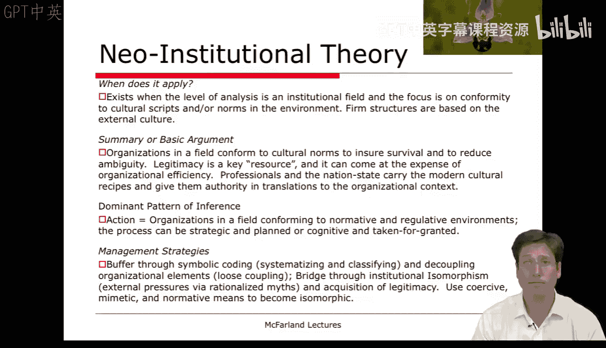
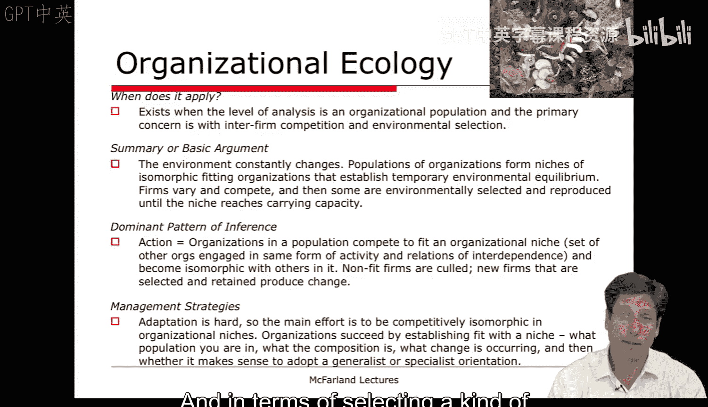
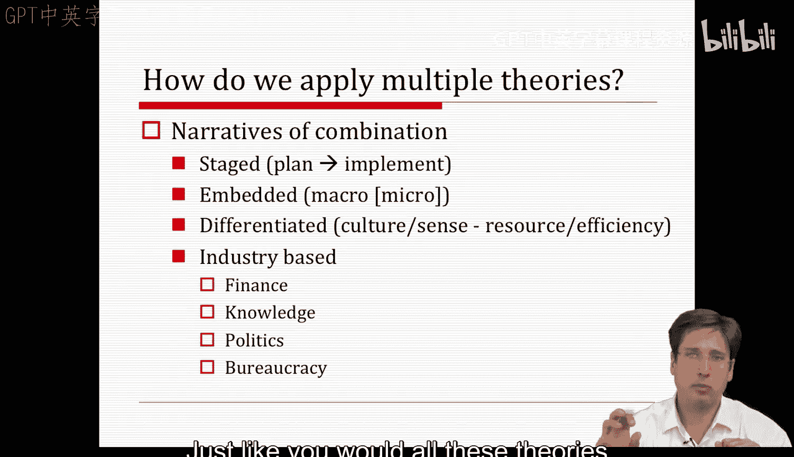
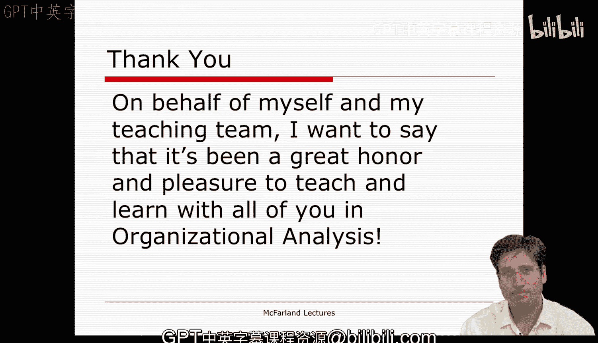

#  108：课程总结（第四部分）🎓

在本节课中，我们将回顾本课程介绍的最后一个理论——组织生态学，并探讨如何将本季度所学的十个理论结合起来，应用于分析实际的组织现象。最后，我们将对课程进行总结。

## 组织生态学理论 🌳

上一节我们讨论了制度理论，它关注组织为何趋同。本节中，我们来看看组织生态学理论。该理论将分析层面提升至整个**种群**，这与制度理论中的“组织场域”概念相似。

组织生态学采用了自然选择和达尔文主义的隐喻。其核心关切并非组织为何相似，而是**组织为何存在差异**，以及为何有些组织生存而有些消亡。这更多地是关于组织间竞争和环境选择的过程。

该理论具有鲜明的环境决定论色彩，非常适合用于思考：我的企业是否适合某个环境？我需要创办何种类型的企业？它可用于预测进入一个新生态位是否可行，以及你的企业能否存活。

### 核心论点与过程

以下是组织生态学的基本论证过程：

1.  **环境变化**：环境在不断变化。
2.  **种群与生态位形成**：组织种群会形成由**同构性**适应组织构成的生态位。这些组织集合暂时适应环境或与环境达成平衡。
3.  **变异与竞争**：可以将企业视为存在**变异**的实体，它们随时间改变某些特征，并在生态系统中相互竞争。
4.  **选择与繁殖**：更适应生态系统的企业被**选择**并**繁殖**，它们会填满生态位，直至达到**环境承载力**。
5.  **密度依赖**：一旦达到承载力，新企业便难以生存，因为空间过于拥挤，密度过高。
6.  **长期演化**：整个生态系统不会保持静态。长期来看，最终会演变成新的亚种，可能表现优于其他物种。

### 主导推论模式：竞争与选择

该理论的主导推论模式是**竞争**。企业结构存在一种**惯性**，使得它们难以很好地适应变化。因此，环境选择特定结构生存或消亡，成为主要的筛选机制。这关乎**选择**，而非**适应**。

由于这种机制，不同“物种”（组织形态）会根据其践行形式在内部竞争。随时间推移，环境（生态位）本身以及其中企业的形态都会发生变化，其中一些会变得更具适应性。

### 管理启示

对于管理者而言，这种观点可能令人不安，因为它意味着企业的改变或适应相当困难。主要努力方向变为在生态位中实现**竞争性同构**，即模仿该生态位中表现良好的其他企业。

同时，你需要思考你的企业是否具有轻微的适应性调整或“突变”，从而能够超越其他企业。成功的关键在于**适应生态位**，满足该生态系统环境的需求。

管理者需要考虑以下因素：
*   你所在的种群构成。
*   该生态位是否已达到环境承载力。
*   正在发生何种变化。
*   是采取**通才策略**（多元化，如大型综合性企业）还是**专才策略**（专注于细分市场，如微型酿酒厂）更为合理。这取决于生态位是处于剧烈变革期还是稳定期。

所有这些生态位和生态系统的特征，对于企业生存以及选择被视为“适应”的组织形态，都具有相当大的决定作用。

## 理论的结合与应用 🔗

本季度我们学习了十个理论，数量很多。对于任何特定案例，我们很可能需要应用其中多个理论。因此，我们面临一个问题：是否有方法可以结合应用这些理论？

一种有效的方法是考虑它们之间的差异。通过反思，我们可以发现：

*   **理想模型 vs. 现实/描述模型**：有些理论更偏向理想化模型，可能更适合规划而非实施。
*   **范围限制**：有些理论范围有限，聚焦于决策时刻及其管理；而另一些则关注组织背景、环境背景或决策条件。
*   **适应能力预设**：有些理论预设组织有内部能力去改变和适应（如改变技术核心和结构）；另一些则认为这非常困难，组织充满惯性，需要与环境进行决定性匹配（如种群生态学）。
*   **关注焦点**：有些理论关注**内部**；另一些则关注**外部**环境（如开放系统观点）。
*   **结构层次**：有些理论涉及**深层结构**（如组织文化和组织环境的规范要素）；另一些则更关心**表层结构**（如资源关系或关联网络）。

这些理论在关注点上差异巨大。根据具体案例的需要——例如，我们是关注规划，还是关注特定背景下的决策——我们可以选择特定的理论组合，从而对案例进行更全面、更精细的描述。

### 构建综合叙事框架

作为管理者，你需要思考如何构建独特的叙事或框架来整合多个理论。以下是几种方式：

**1. 阶段化视角**
一些理论可用于**规划阶段**，另一些则用于**实施阶段**。例如，理性选择模型可用于规划，而组织过程模型可用于实施。

**2. 嵌入视角**
在宏观背景的语境下，嵌入微观的过程性或决策模型。例如，在制度环境的宏观背景下，分析具体的决策制定过程。

**3. 差异化视角**
将每个案例视为具有多个维度（如文化、表层结构）。我们可能需要同时考察该企业或案例中的**文化和意义建构过程**，以及**资源和效率关切**。

**4. 行业适配视角**
根据不同行业特性应用不同理论：
*   在**金融业**，组织结构集中，信息明确且多以数字量化形式呈现，理性行动者模型可能更适用。
*   在**知识生产行业**，许多事物不确定且模糊，文化、信念和规范可能更重要，制度理论等可能比理性行动者模型更突出。
*   **政治系统**或偏好不一致、决策成本高昂的领域，可能更适合政治模型或垃圾箱模型等理论。
*   **政府官僚机构**通常稳定、固化且难以改变，组织过程模型等理论可能仍具有重要相关性和解释力。

我们可以根据行业类型匹配理论，也可以根据我们认为的组织核心维度（文化、结构）来差异化应用理论，还可以将理论以宏观-微观或决策-背景的方式嵌入。最后，我们还可以采用阶段化视角，认为组织现象从规划到实施可能需要截然不同的理论。

这些均为可行的叙事框架，能让你结合多个理论，同时保持整体逻辑的连贯性。这不仅仅是理论的拼凑，而是遵循一个合理的叙事逻辑，并能反思其是否更适合特定案例。

## 课程总结与致谢 🙏

希望这些关于理论多重组合或叙事框架的思考，对你们成为更出色的“组织分析木匠”有所助益。不要只将你的“螺丝刀”（某个理论）视为仅适用于一件事物，而要开始看到螺丝刀与锤子、锯子之间的关系，它们各自适合不同类型的项目。同样，这些理论中，有些会与你试图描绘和理解的组织现象、特定类型的企业或叙事更相关。

现在，我们来到课程的最后部分。我不想让告别变得伤感，我希望你们享受了这段旅程，并学到了很多。我和我的助教们也从这次经历以及与你们的互动中学到了很多，这非常宝贵。

我要感谢一些人：
*   首先，特别感谢我的助教 Charlie Gomez, Emily Schneider 和 Dan Newark。他们无偿投入了大量时间，我找不到比他们更好的团队来协助呈现这门课程。如果课程有任何成功之处，请将功劳归于他们。
*   其次，感谢 Coursera 以及一直在协助我们的 Rellli。没有她在 Coursera 的支持，我们无法实施许多我们正在尝试和探索的流程，以改进在线学习，使其更接近拥有大量实质性材料、写作反馈等的高质量实体课程。
*   最后，感谢斯坦福大学、在线学习副教务长以及 Jane Manning 的支持，让我们能够使用录音室等设施，协助我们进行在线交流等等。

如果有任何做得好的地方，功劳属于他们；对于任何不足之处，我表示歉意。我们认真对待了你们的每一条评论，并将据此进行改进，你们的反馈非常宝贵。你们的反馈始终是建设性的、友善的，我们非常感谢你们耐心地接受我们呈现的这些材料。

如果今年你未能获得证书，我们希望能在 2013 年秋季再次开设这门课程，并进行一系列改进，呈现更流畅、对你们和其他学习者更有价值的课程。所以，我希望这不是告别，而是感谢，并期待下一门课程或下一次相遇。

如果你们任何人来到斯坦福，而我又没有深陷类似课程的教学中，我很乐意坐下来与你们见面问好。

谢谢大家。

---

**本节课中我们一起学习了：**
1.  **组织生态学理论**的核心观点，即环境通过选择机制决定组织形态的生存与消亡，强调竞争性同构和生态位适应。
2.  如何**结合与应用**本课程所学的十个组织理论，包括通过阶段化、嵌入、差异化、行业适配等视角构建综合性的分析叙事框架。
3.  课程的最后，教授对助教、合作平台以及所有学员表达了感谢，并展望了未来的课程改进。

希望这门课程提供的理论工具和思维方式，能帮助你们更好地分析、理解和管理复杂的组织现象。