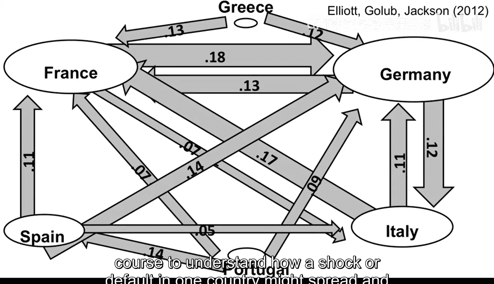
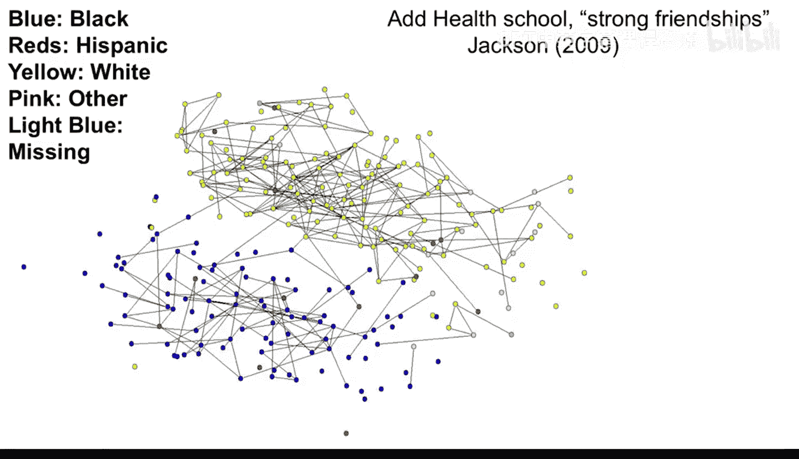
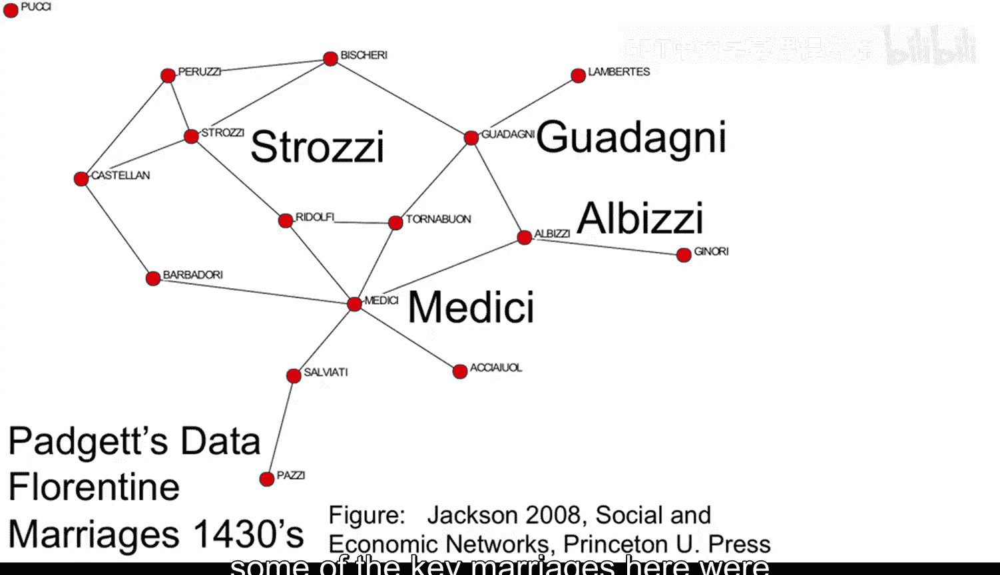

#  001：课程介绍 🎓

在本节课中，我们将学习《社会和经济网络：建模与分析》这门课程的整体介绍。我们将了解课程的目标、涵盖的主题、所需背景知识以及课程结构。

大家好，欢迎。我正在处理一个使用网络分析来理解金融传染的项目数据。

稍后会详细讨论这一点。首先请允许我自我介绍，我是马修·杰克逊。

我在这里主要想向大家介绍一门令人兴奋的新慕课，即大规模在线开放课程。

这是一门关于社会和经济网络分析与建模的课程。

这门课程主要面向可能在研究中使用网络分析的人士，因此目标受众是硕士到博士水平的学生，同时也为真正感兴趣的人提供了一些额外内容。

对于高年级本科生来说，这门课程也应该易于理解。

它部分基于我在斯坦福大学一直教授的一门博士课程，讲座将分为两个不同层次。

将有一组构成课程主体的基础讲座，以及一些额外的进阶讲座，为那些真正希望深入钻研该主题的人提供技术细节。

让我们快速浏览一下我们将要分析的一些问题类型。

以下是我与我的两位前学生马特·埃利奥特和本·戈布正在进行的研究中的一张图，旨在理解金融传染。

它显示了六个欧洲国家各自持有的另一国主权债务的数额。

我们将使用本课程中探讨的一些建模技术，来理解一个国家的冲击或违约如何可能蔓延并影响其他国家。

下一张图描绘了被称为“健康数据”数据集中一所高中学生之间的友谊关系。

节点按种族编码，你可以看到这个网络展现出所谓的“同质性”——学生按种族高度隔离。我们如何衡量和解释这种网络的形成？这种网络中的隔离对学习和交流有何影响？这里有很多有趣的问题。

第三张图同样引人入胜，它描绘了15世纪佛罗伦萨16个主要家族之间的联姻关系。

这是美第奇家族崛起的时期，其中一些关键的联姻是由科西莫·德·美第奇策划的。那么我们如何衡量不同家族的地位？这个网络能否帮助我们解释美第奇家族为何在这一时期掌权？

因此，本课程将汇集来自经济学、社会学、计算机科学、物理学、随机图论、数学和统计学等多个领域的模型。

我的目标是提供一个综合性的介绍，涵盖分析网络的多学科和跨学科方法。它应该为你提供一个工具箱，供你在分析和建模网络时使用和借鉴。

我们将学习网络的基本度量、网络形成模型、扩散模型、学习模型、传染模型，以及网络如何影响行为。我们还将使用一些统计技术来分析网络，并在课程进行中指出一些重要的新研究领域。

你需要什么样的背景知识呢？本课程假设你熟悉矩阵代数，因为当今编码和分析网络大量使用矩阵。

我们还将使用概率论和统计学的基本概念，以及一些简单的微积分。课程中会用到一点博弈论，但我会确保内容自成体系，无需额外预备知识。你应该能熟练使用计算机，因为我们将在课程中探索一些网络数据。

本课程将持续大约八周的讲座，然后进行期末考试。每周都会有视频讲座、一套习题集以及偶尔的数据练习。

通过论坛可以进行互动，你可以与其他同学交流。在习题集和期末考试中获得足够高分并完成课程的学生将获得结业证书。

课程即将开始，你可以在我的网站上找到关于时间安排的更新。

所以，请至少告诉两位可能对这门课程感兴趣的朋友。为什么至少是两位呢？

加入课程来寻找答案吧。希望很快能再次见到你，保重。

---

在本节课中，我们一起学习了《社会和经济网络：建模与分析》这门课程的概览。我们了解了课程的目标是提供跨学科的网络分析工具箱，涵盖了从金融传染到社会结构等多种应用。我们还明确了课程的结构、所需的数学和计算机背景，以及如何参与和完成课程。