#  002：引言 👋

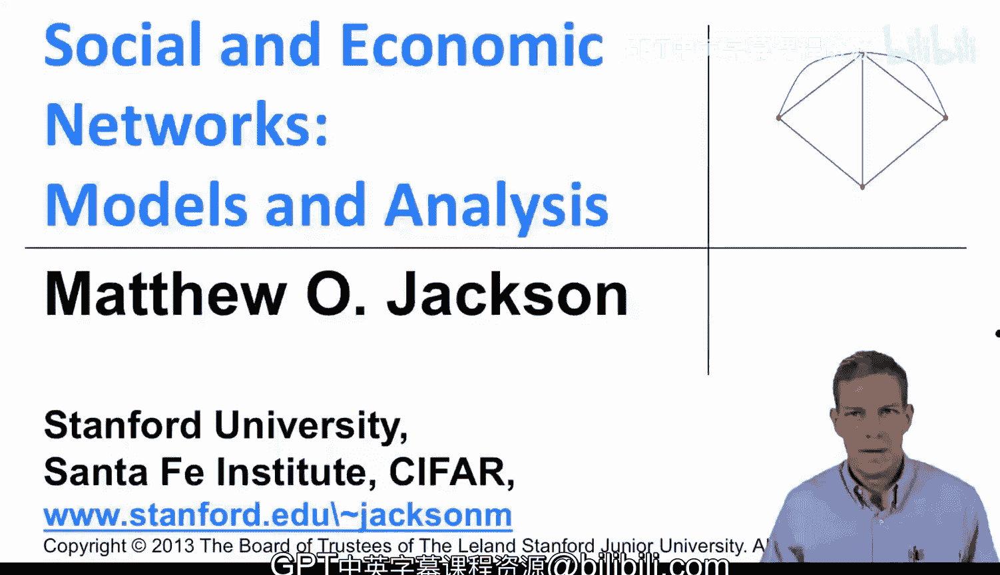

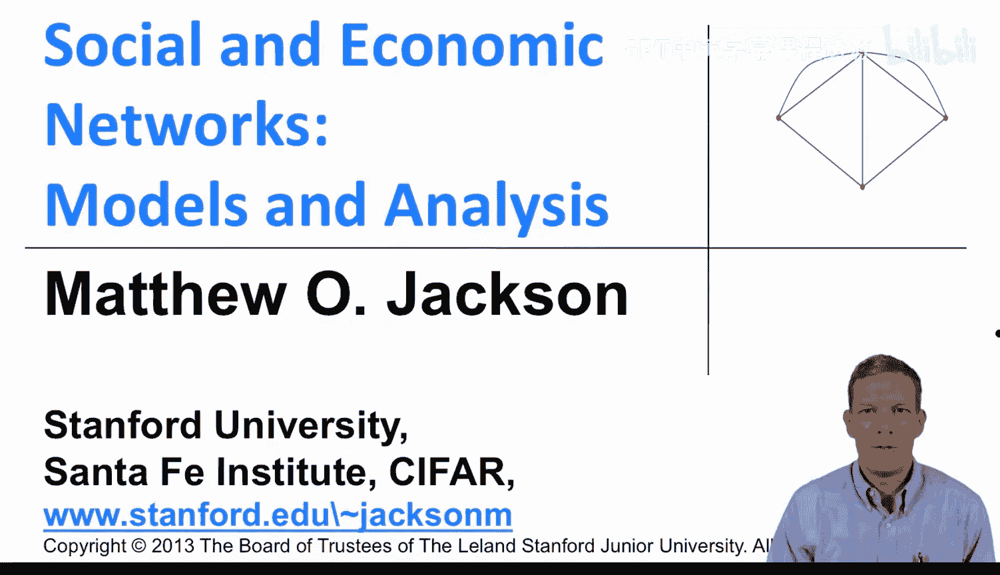

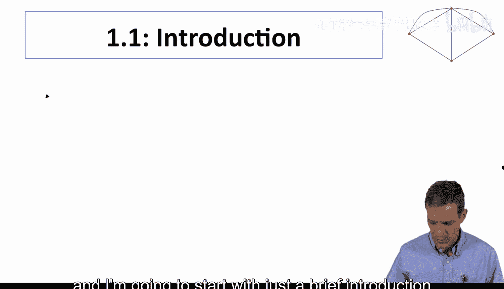

在本节课中，我们将学习社会与经济网络课程的基本介绍，包括研究网络的重要性、课程的核心问题、研究方法以及课程的整体结构。

大家好，我是斯坦福大学的马修·杰克逊。这是社会与经济网络课程的第一讲。我将首先简要介绍我们将要涵盖的一些材料。当然，我们可以从最重要的问题开始：为什么要研究网络？从社会科学家的角度来看，许多经济、政治和社会互动都嵌入在社会环境中。这些关系的结构对于决定人们的行为和结果都非常重要。例如，商品和服务的交易，大多数市场实际上并非集中化的，而是关于不同方之间的双边关系。

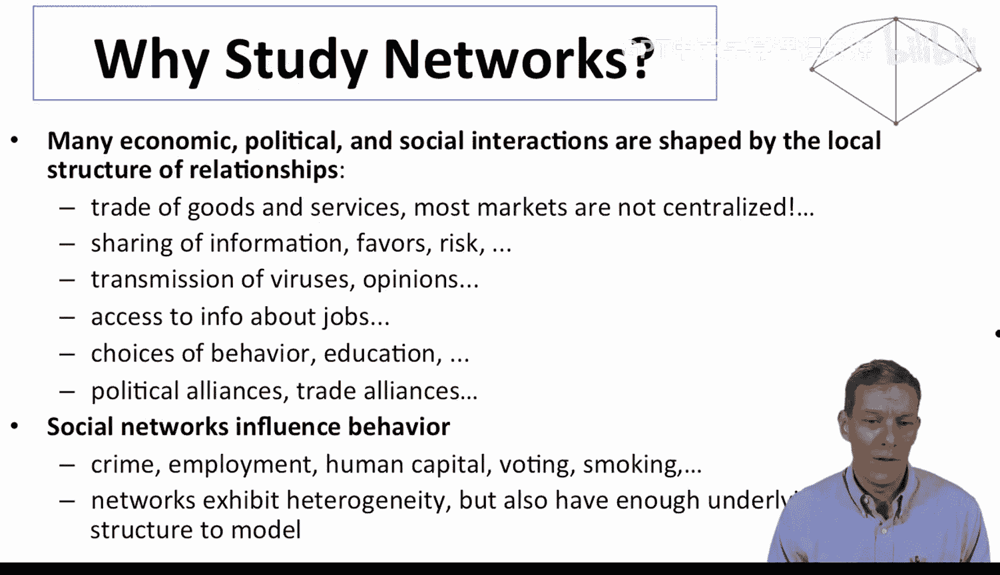

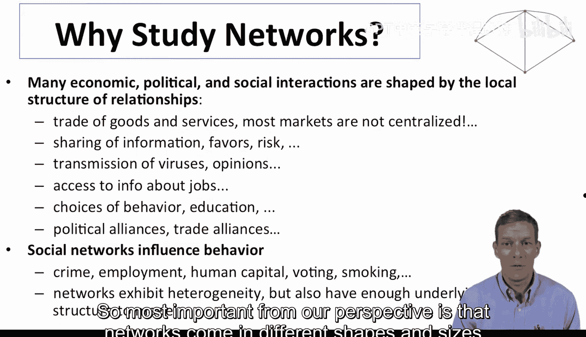

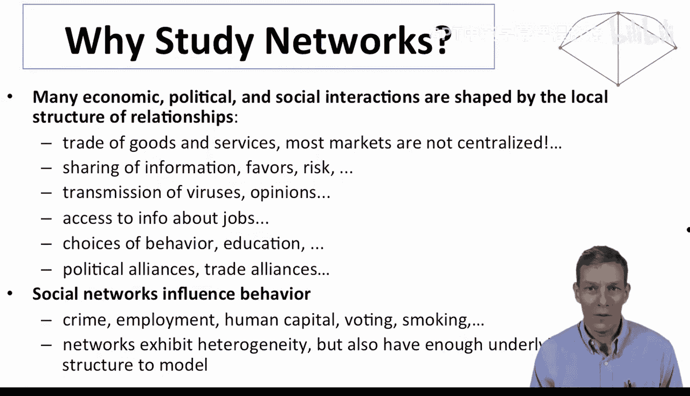

信息的共享、人情的交换、风险的共担、病毒的传播、观点的形成。你如何找到一份工作？通常是通过你认识的人。你如何选择投票给谁？你如何决定购买什么产品？很多时候，你是在与不同的人交谈，他们听到了什么？你如何获取信息？政治联盟可以是代表网络，贸易联盟也是如此。在各种不同的情境中，网络结构都非常重要。

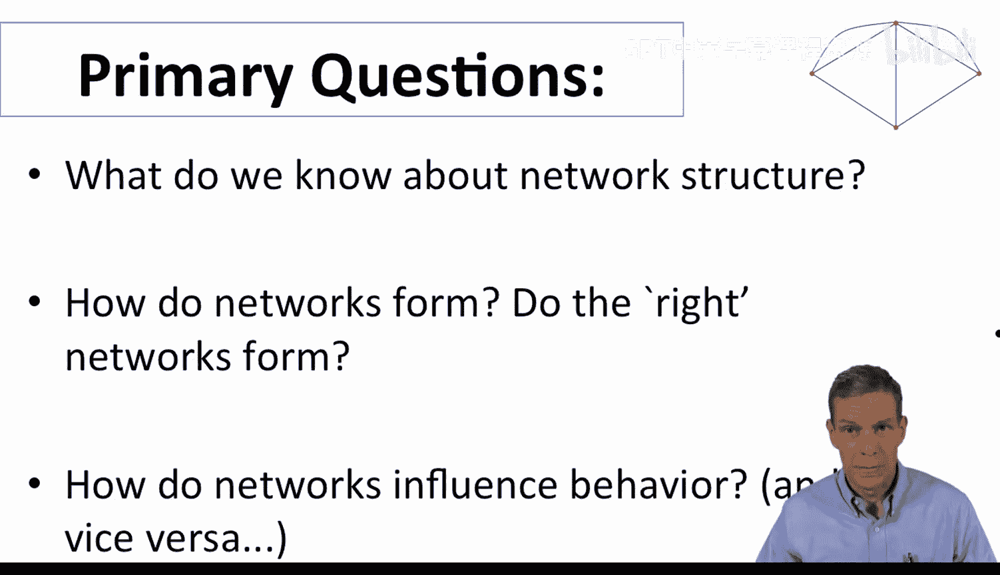

关键在于，网络实际上会影响行为。如果我们观察犯罪、就业、人们对人力资本（如教育）的投资、他们的投票选择、是否吸烟等，他们做出的各种决定都嵌入在这些环境中，并受到社会结构的影响。因此，从我们的角度来看，最重要的是网络有不同的形状和大小。理解它们如何形成、看起来是什么样子，对于理解结果至关重要。因此，有很多内容需要理解和建模。

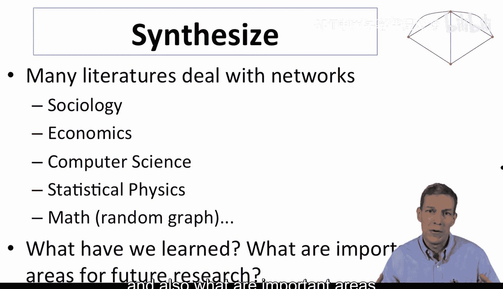

本课程我们将关注的主要问题包括：首先是一些关于社交网络结构的背景知识，即我们对社交网络的了解。课程的大部分内容将着眼于网络如何形成。例如，如果我们可以从不同角度影响网络的形成，我们是否希望“正确”的网络形成？网络如何影响行为？例如，网络的密度与结果之间的关系等等。

显然，这是一个在许多不同学科中都有研究的领域。当我们审视文献时，会涉及社会学、经济学、计算机科学、统计物理学、数学、随机图论等。我们在这里要做的是尝试综合其中一些内容，形成一个统一的观点，从不同角度提取模型，并试图理解我们已经学到的东西，以及未来研究的重要领域。

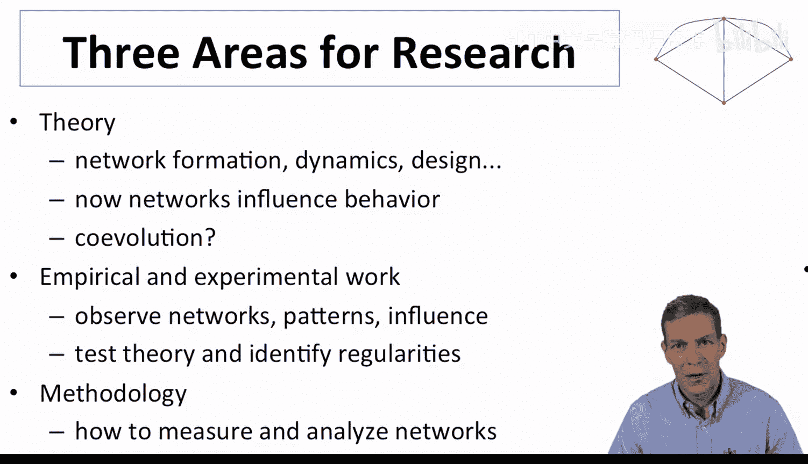

就未来研究和当前研究的领域而言，我们将关注建模的理论基础，主要是网络形成、动态建模、网络设计，以及理解网络如何影响行为。课程后期会强调共同演化。这意味着，我的朋友是谁会影响我的行为，但我的行为也会影响我的朋友是谁。因此，这是一种共同决定，并非一方固定不变地影响另一方，而是双方共同演化。

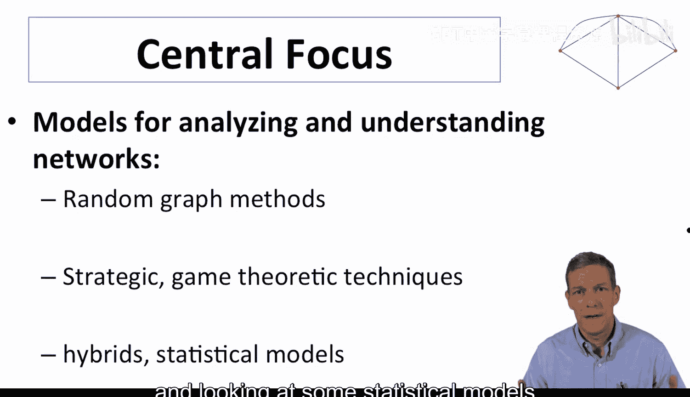

随着课程的进行，我们将关注大量的实证研究和实验工作，观察网络，看看我们确实观察到了哪些模式，并强调检验理论和理解数据中存在的规律性和模式。随着课程的进行，我们还将看到方法论。例如，将有一系列关于网络的定义，理解谁在网络中是中心可以用许多不同的方式来衡量。我们将尝试说明，对于不同的应用，哪些是好方法，哪些是坏方法。因此，可能没有单一的方法来解决问题，但理解有哪些不同的方法，以及我们能否对这些方法本身说些什么，是很重要的。

本课程的核心焦点将真正放在模型上。我们将使用的技术类型包括：从随机图论和数学中提取的技术；一些策略性和博弈论技术；以及一些涉及选择和机会的混合模型，并着眼于一些用于拟合和分析网络以及处理数据的统计模型。

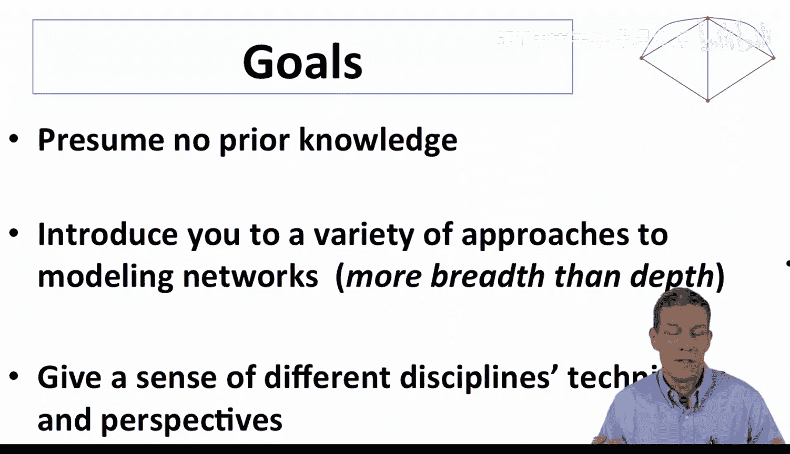

课程目标方面，我不会预设网络分析的先验知识。我将尝试向您介绍各种不同的方法。这里的理念实际上是广度而非深度，目的是让您有所接触，以便您了解存在哪些内容、有哪些不同类型的工具，以及哪些工具可能适用于不同的场景。关于我们将要讨论的每个主题，都可以说得更多，但这或多或少是一个介绍，让您了解哪些工具可能适用于分析的不同部分。它还将让您对不同学科的技术以及它们所关注的问题和视角有所了解。

就课程的一个重要方面而言，当我在这里开始课程时，真正强调的是：我们为什么一开始就要关心建模？我认为这是一个重要的问题，它将塑造我们使用何种模型以及它们如何形成的结构。当我们审视模型时，它们为我们做的一件事是让我们洞察为什么我们会看到某些事物。例如，为什么社交网络具有较短的平均路径长度？为什么世界上存在六度分隔？我们将看到一个答案，它将来自随机图模型。因此，仅仅理解事物如何随机产生的基本结构，就能帮助我们理解为什么我们可能会看到类似的现象。理解社交网络背后的基本树状结构将帮助我们理解路径长度。

模型还允许进行**比较静态分析**。如果我们理解模型会随着我们改变不同参数而变化，这可以帮助我们预测世界可能如何变化。例如，组件结构如何随密度变化？如果一个网络有越来越多的链接，这对网络的整体组件结构有什么影响？它将帮助我们进行样本外预测。例如，如果你想引入一项新政策，试图遏制流感疫情，疫苗需要多有效才能限制疫情的传播范围？这是一个我们可以开始用网络分析来回答的问题。

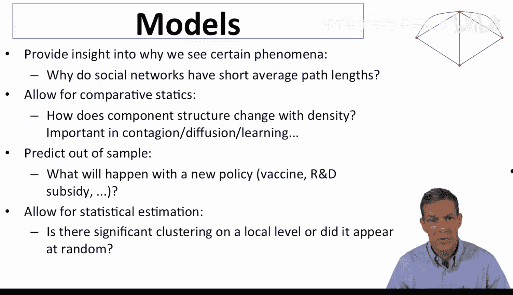

模型还将允许进行**统计估计**。例如，如果我们想理解是否存在显著的聚类（这意味着我的朋友之间是否彼此认识），这是因为某种社会力量，还是仅仅是随机发生的？我们可以检验模型。因此，我们可以采用模型，然后问：这看起来是随机发生的，还是看起来有其他因素在起作用？一旦我们有了模型来分析这类问题，就可以使用统计检验。

就课程的基本大纲而言，它将分为三个部分。第一部分是背景和基础，包括定义、我们如何分析网络、网络的一些基本属性和特征，以及与此相关的实证背景。课程的第二部分，也是核心部分，将是网络形成模型。我们将研究随机图模型，然后我们还将研究当人们实际做出选择时的策略形成模型。课程的第三部分是网络与行为。这部分将利用网络来理解网络的形状和结构（你认识谁、你认识多少人、他们认识谁等等）如何影响你的决策和行为。因此，我们将研究诸如扩散和传染、学习模型等主题。最后，我们将研究所谓的网络上的博弈，即我所做的事情取决于我朋友的选择的情况。例如，如果有一个新的应用程序出现，我想得到它吗？这可能取决于我有多少朋友得到了它，而这又可能取决于他们有多少朋友得到了它，等等。那么，我们如何在网络背景下分析这一点？大致上，这三个主要部分将是课程的核心结构。

还有一本完全可选的教科书，我写的，课程中的很多材料将从中提取。就这个大纲而言，这里的数字表示章节。例如，1、2、3、4、5等等，这些数字表示与课程讲座结构相对应的书中相关章节。因此，我们将沿着这本书的章节进行，在涵盖哪些章节和部分方面有一些例外。这就是一个基本的大纲，让我们开始吧。

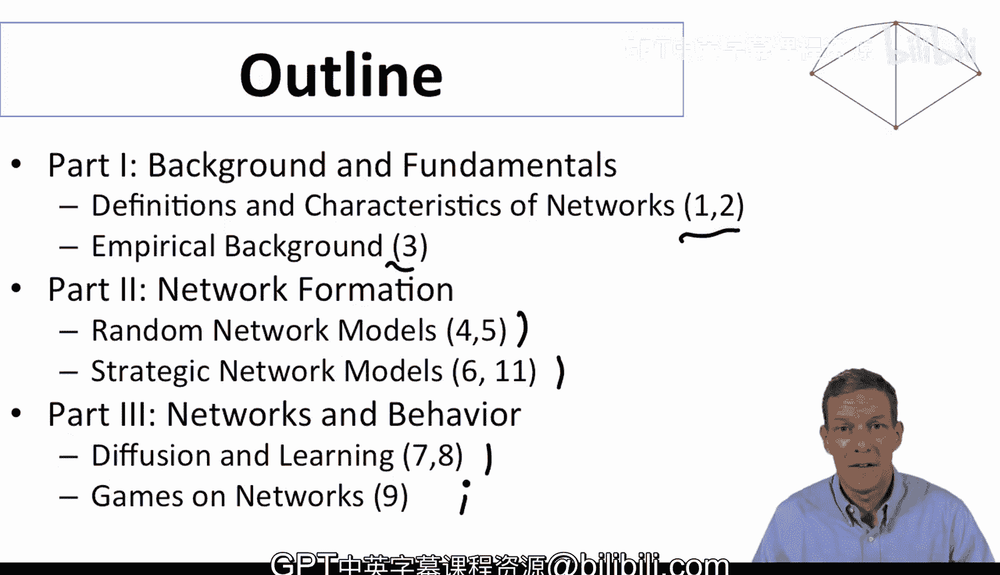

在本节课中，我们一起学习了研究社会与经济网络的重要性、课程将要探讨的核心问题、将采用的研究方法（包括随机图论、博弈论和统计模型），以及课程的整体结构（分为背景与基础、网络形成模型、网络与行为三大部分）。这为我们后续深入学习网络分析奠定了坚实的基础。