#  003：案例与挑战 📊

在本节课中，我们将通过几个具体案例来了解网络分析的应用场景，并探讨网络建模与分析所面临的核心挑战。这些案例将帮助我们理解为什么网络结构如此重要，以及为什么我们需要系统性的方法来研究它们。

## 案例一：文艺复兴时期佛罗伦萨的家族网络 👑

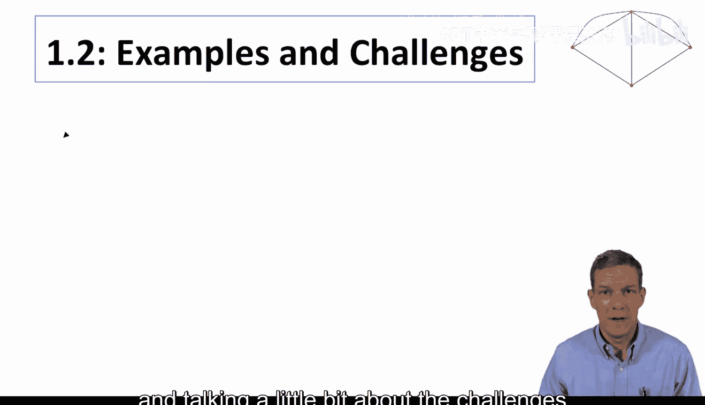

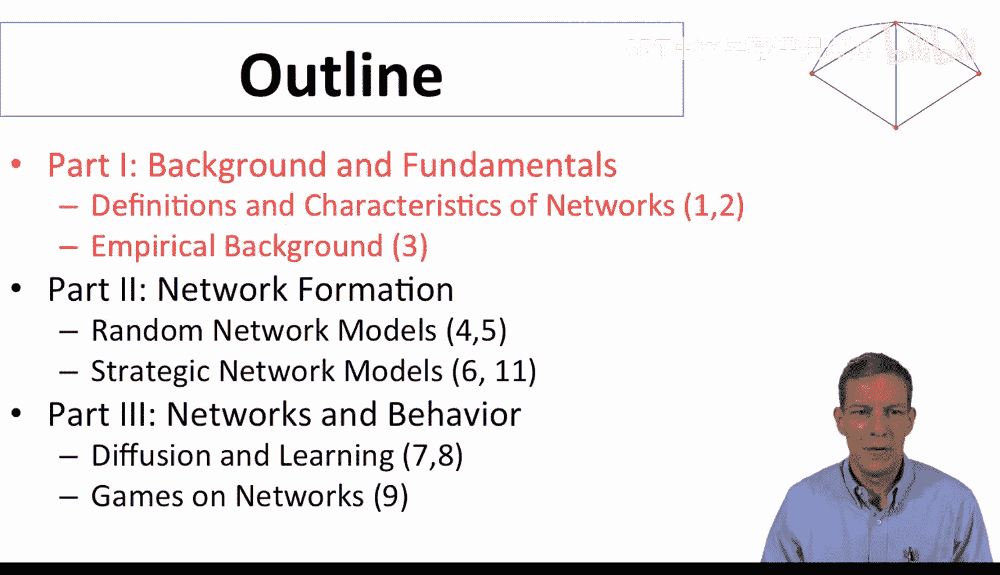

上一节我们提到了网络分析的广泛应用，本节中我们来看看一个历史案例。这个案例来自Padgett和Ansell的论文，基于Kent收集的数据。该研究分析了15世纪30年代佛罗伦萨16个主要家族之间的联姻关系。

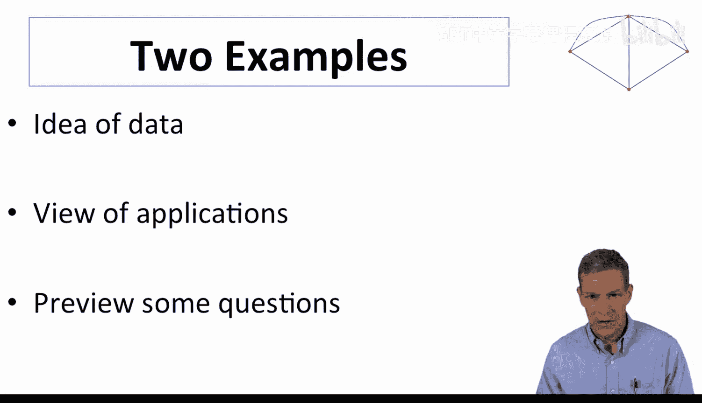

在您看到的这张图中，每个节点代表一个家族，两个家族之间的连线表示存在婚姻关系。例如，Reddolphs家族与Medici家族之间的连线就代表了一次联姻。

这张图的关键在于，它揭示了在15世纪30年代之前，佛罗伦萨由多个家族组成的寡头政治格局。而在这个时期，Medici家族开始崛起并掌权。图中显示的数字代表了各个家族在网络中的“中心性”，具体来说，它衡量了网络中连接其他家族的最短路径有多少比例会经过该家族。

例如，如果Reddolphs家族和Salviati家族想要在这个网络中建立联系，他们必须经过Medici家族。因此，Medici家族位于Reddolphs和Salviati之间的最短路径上。图中显示的52%意味着，当你观察网络中任意两个家族并找出它们之间的最短路径时，有52%的情况下Medici家族会位于这条路径上。

这表明Medici家族在某种意义上是这个网络的核心。尽管他们当时并非最富有或政治联系最广的家族，但他们的中心地位有助于解释他们为何能够崛起并最终成为佛罗伦萨的统治家族。Padgett和Ansell的论文中有更详细的分析，但网络分析的基本观点是：理解他们的中心性，有助于我们理解其掌权的原因。

## 案例二：欧洲国家债务网络 🌍

接下来，我们看一个以国家为节点的例子。这是一个由德国、法国、希腊、意大利、葡萄牙和西班牙这六个主要欧洲国家构成的网络。

这是一个**加权有向网络**。连线上的数字表示一个国家有多少比例的国债（主权债务）被另一个国家的实体持有。例如，18%的法国国债由德国持有，13%的德国国债由法国实体持有。

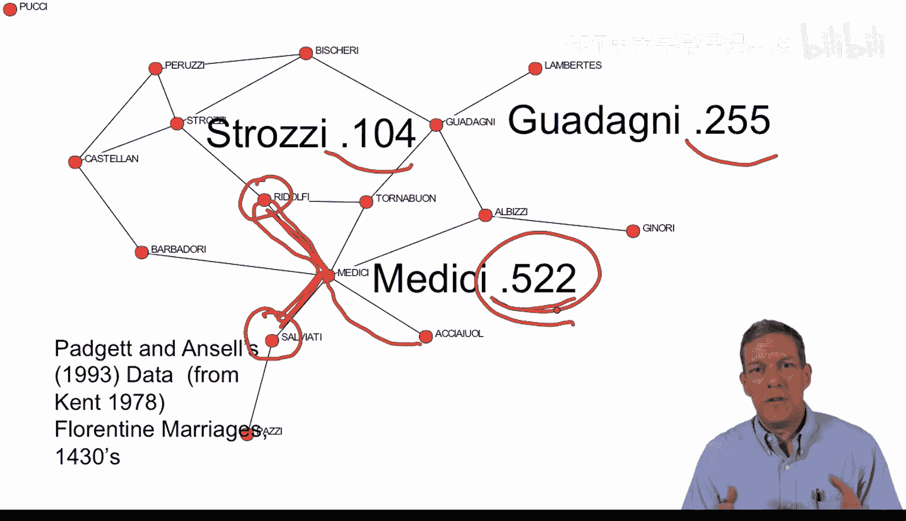

这个网络帮助我们理解一个国家的冲击如何传播并影响另一个国家。当我们后续学习传染和扩散模型时，网络分析将非常有助于理解这种传播机制。这个例子来自我与Matt Elliott和Bengolo最近的一篇论文，旨在理解金融冲击和危机如何在一个国家产生，并传导至另一个国家，导致货币贬值或其他问题，即某种形式的金融压力传导。

## 网络的重要性与挑战 🎯

以上两个例子展示了网络数据如何帮助我们理解复杂的社会经济现象。本课程将重点学习如何建立网络模型，以理解这些互动关系。

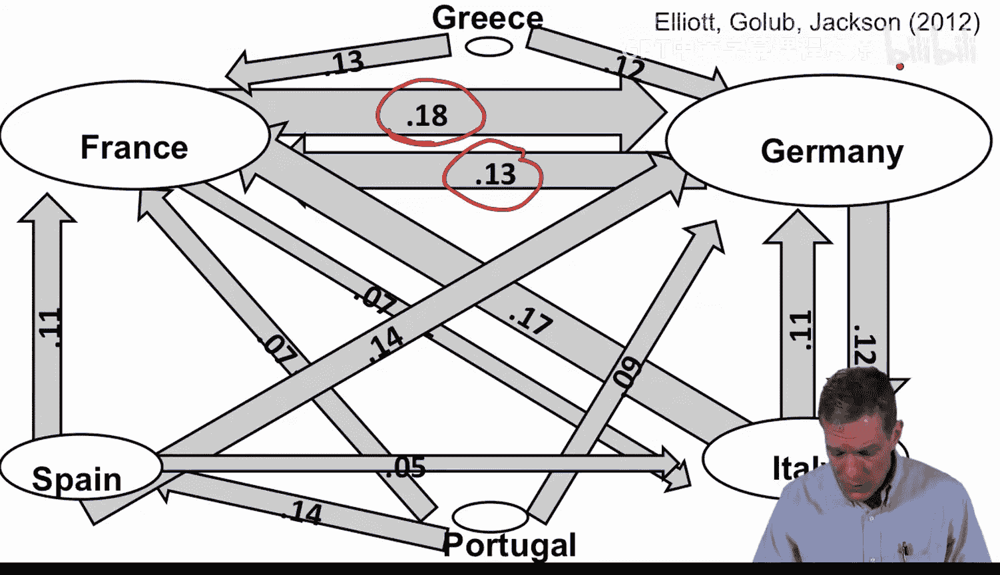

我们知道，网络在许多情境下都至关重要，例如求职、犯罪、风险分担、贸易和政治。丰富的**社会学文献**表明，网络结构确实会影响行为。正如我们所见，Medici家族并非最富有或政治实力最强，但他们在一个明确定义的意义上是最“中心”的。我们首先要明确的一点是，关于网络，我们可以进行系统性的分析。

具体来说，当我们开始思考网络的重要性时，这些特定关系的重要性意味着我们必须能够描述网络的**形状**。我们能否系统地说明网络是如何构成的，以及这种结构如何影响行为？

以下是网络研究中的一些关键方面：

*   **路径长度与局部属性**：节点之间如何连接，连接的效率如何。
*   **小世界现象**：网络中的节点即使相隔很远，也能通过较短的路径相连。
*   **度分布**：网络中连接数的分布情况。是存在大量连接的人和连接很少的人（分布偏斜），还是每个人的连接数大致相同？

理解这些现象很重要，但我们必须将行为嵌入到网络背景中。例如，要理解市场如何运作，我们需要理解网络中不同**链接**代表什么。具体的关系如何起作用？人们进行交易的流程是怎样的？

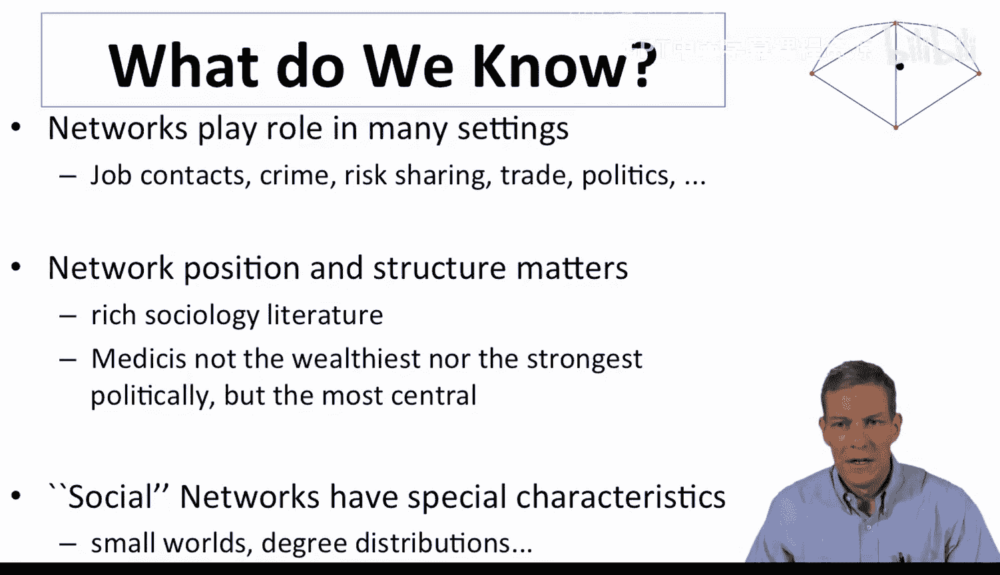

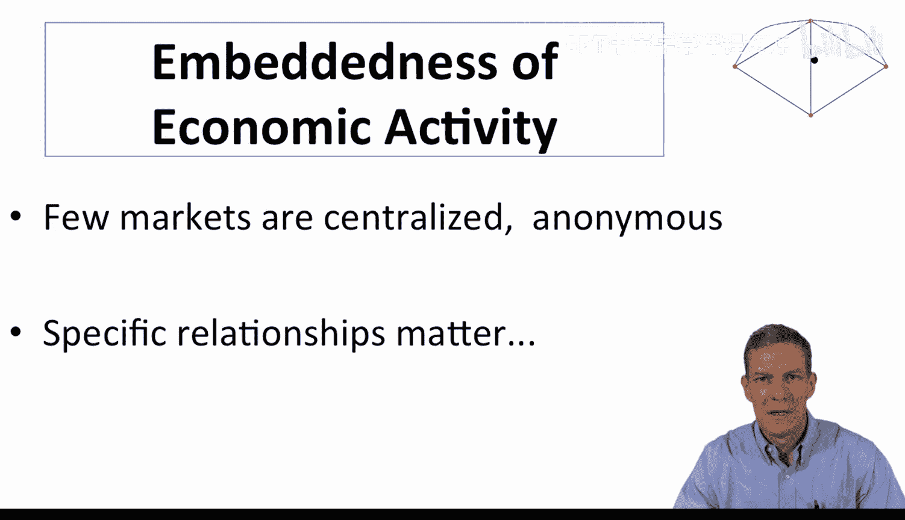

## 网络在劳动力市场中的作用 💼

为了提供基本的动机和背景，我们可以说，在许多情境下，网络都扮演着重要角色。其中一个被广泛研究的经典领域是网络在劳动力市场中的作用，特别是人们如何获知工作信息。

这个领域的一些早期工作，如Myers和Schultz在20世纪40年代末对纺织工人的调查（论文发表于1951年），发现62%的人是通过行业内已有的人脉找到第一份纺织工作的。相比之下，只有23%的人是直接申请找到工作，15%通过中介或广告。

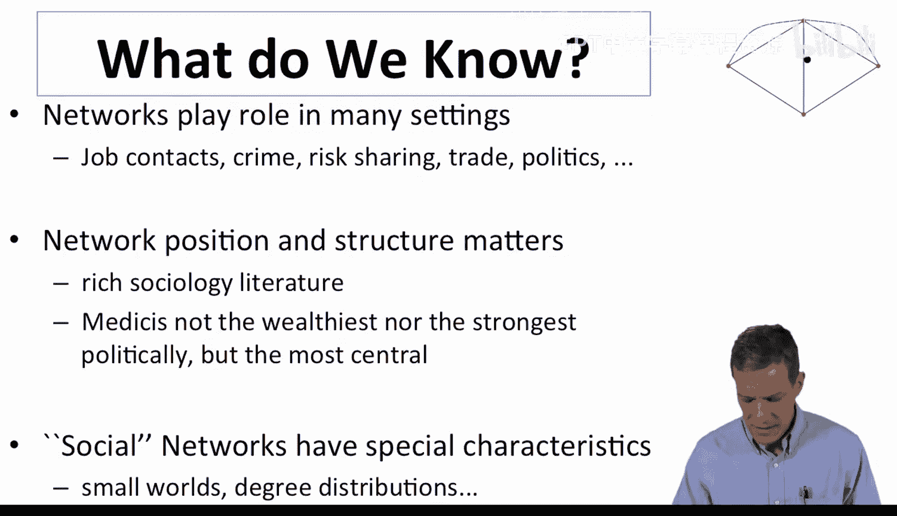

后来的研究，如Granovetter自20世纪70年代以来的经典工作，采访了不同地区和职业的人，发现不仅仅是纺织工人通过联系人网络找工作。例如，打字员（37%）、会计师（23.5%）、物料处理员（73.8%）、门卫（65%）、电工（57%）等职业，通过联系人找工作的比例在20%到80%之间。总体而言，口耳相传和人际关系是找工作的重要途径，无论你从事什么职业。

关于这个主题还有其他一系列研究，Granovetter的工作非常有影响力。Ioannides和Loury在2004年有一篇很好的文献综述。

## 网络在其他领域的应用 🔗

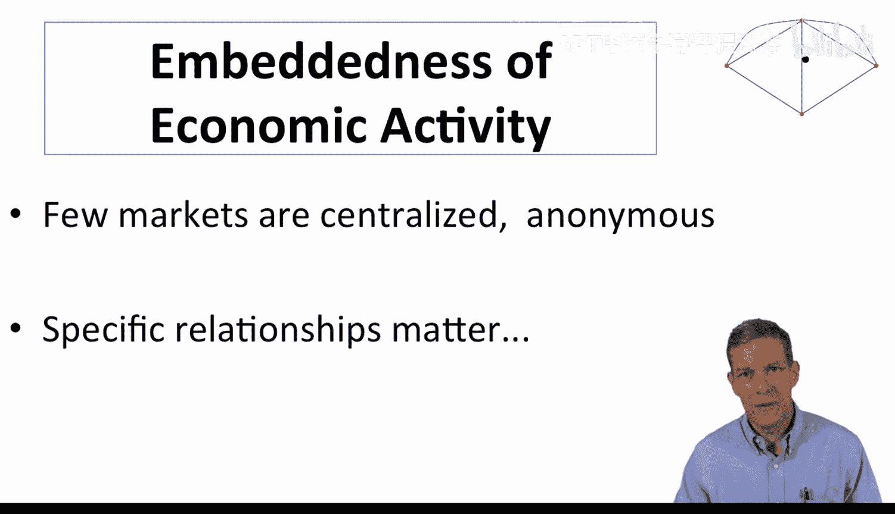

当我们审视这个问题时，会发现网络不仅在劳动力市场中重要，在一系列其他场景中也扮演着关键角色。以下列举几个，以便我们在课程中牢记：

*   **犯罪环境**：三分之二的罪犯是与他人共同犯罪的，他们并非单独行动。有证据表明，社会互动在决定青少年成为罪犯和犯罪率方面起着重要作用。
*   **市场**：一系列研究考察了人们如何建立商业联系、最终与谁合作、与谁签订合同。Brian Uzzi有一篇很好的论文，研究了服装行业中特定合同关系的重要性，即谁最终为哪个设计师生产服装。还有像鱼市场中可以用网络结构表示的重复互动。
*   **社会保险与风险分担**：当我们需要帮助时，能否从朋友那里借钱或得到帮助？
*   **扩散**：网络在信息或行为扩散中起着重要作用。例如，理解哪些农民在何时开始采用杂交玉米，哪些医生在不同时期开始处方特定药物。

这里的应用范围将非常广泛。因此，我们在本课程中面临的主要挑战是网络的**复杂性**。

## 网络复杂性的挑战 🤯

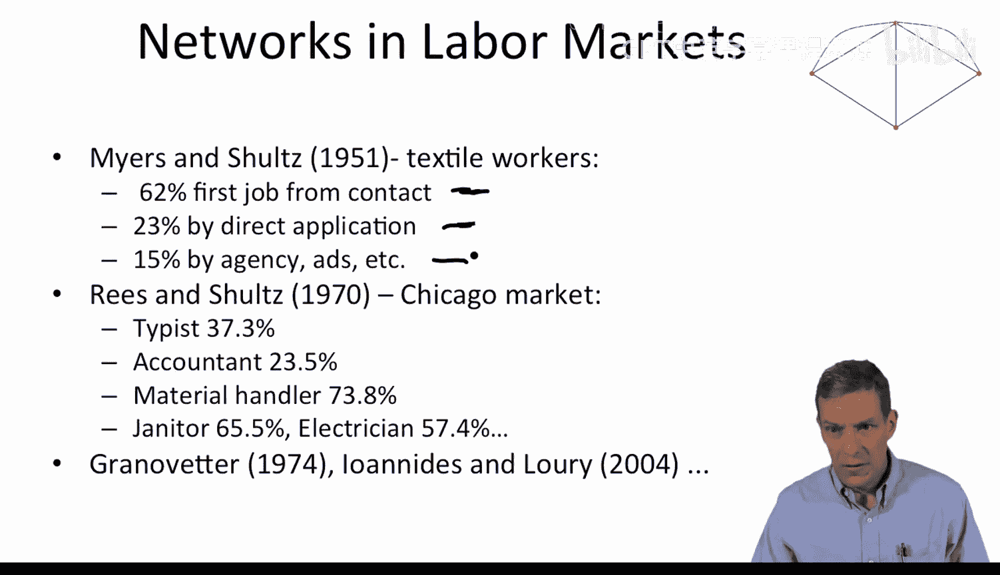

我所说的复杂性是什么意思？让我们做一个非常简单的计算。

想象一下，你只有30个节点，这是一个相当小的社会，比如学校里的一个班级。我们问：在这个班级中，可能有多少种不同的友谊网络？

可能是一个空网络，没有人是朋友。也可能是一个完全网络，每个人都是朋友。实际上，这个班级中可能的网络数量是极其庞大的。

第1个人可能有29种不同的友谊（与第2、3、4...30个人）。第2个人（不计第1人）可能有28种友谊，以此类推。如果我们问这个班级中可能存在的不同友谊对（链接）总数，那就是 `30 choose 2`，即 **435** 对。

这435对可能的友谊中，每一对的关系（存在或不存在）都有两种状态。因此，可能的网络总数是 **2的435次方**。

435看起来不是一个大数字，但2的435次方是一个天文数字。据估计，宇宙中的原子数量大约在 **2的158次方到2的246次方** 之间。仅仅一个班级的网络可能性，就比宇宙中的原子数量还要多出好几个数量级。

因此，我们绝不可能通过给网络编号（比如“这是53号网络”）来描述它们。我们必须找到描述这些网络的方法，以**简洁明了的方式捕捉网络的基本属性**，这样我们就不必去翻阅一个庞大的、所有可能网络的目录，那根本是无法完成的。

所以，我们首先要应对的主要挑战就是**如何表示网络**，以及如何以一种有意义的方式来捕捉这种复杂性。这将是我们定义部分的起点：我们如何表示网络？如何捕捉它们？

---

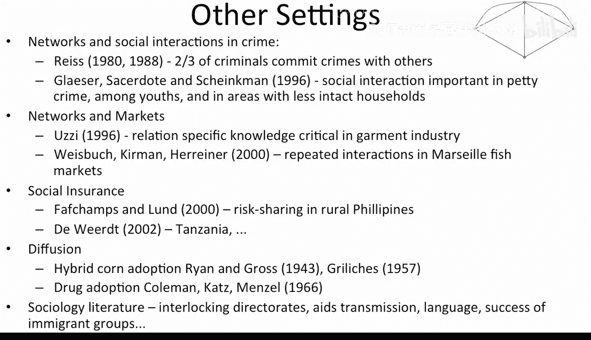

**本节课中我们一起学习了**：通过佛罗伦萨家族联姻和欧洲国家债务网络两个案例，我们看到了网络分析在解释历史事件和经济现象中的强大作用。我们探讨了网络在劳动力市场、犯罪、市场交易等多个领域的重要性。最后，我们认识到网络因其巨大的组合可能性而异常复杂，这要求我们必须发展出系统且简洁的方法来描述和分析网络结构，这也是本课程后续内容的核心。