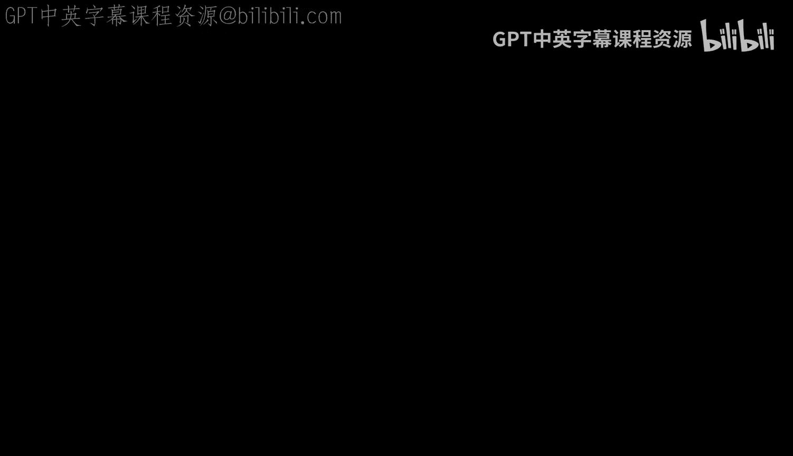
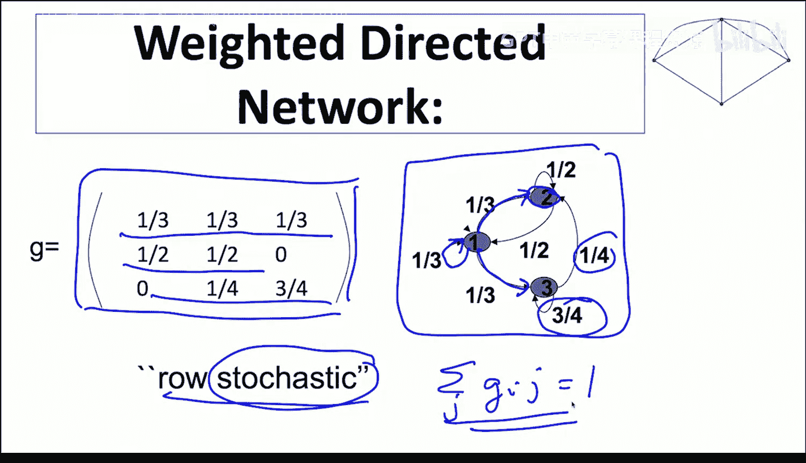
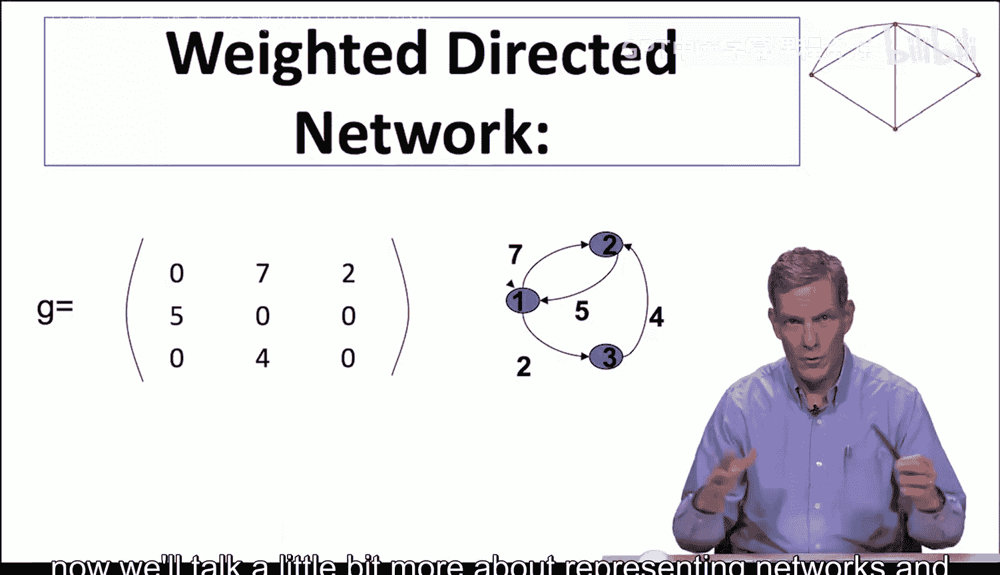

#  004：背景定义与符号基础（熟悉者可跳过）

在本节课中，我们将学习网络分析中最基础的概念，即如何表示不同类型的网络。我们将介绍节点、链接、有向与无向网络、加权与无权网络等核心概念，并学习它们的数学表示方法。

## 网络的基本类型

网络由一组基本元素构成。这些元素在不同学科中有不同的名称。

*   **节点**：也称为顶点、智能体、行动者或参与者。它们是网络中的基本对象。
*   **链接**：也称为边、纽带或关系。它们连接节点，表示节点之间的关联。

链接有不同的属性，主要分为两类：权重和方向。

## 链接的属性：权重与方向

链接可以具有强度或权重。例如，我们可以记录两个人每周在一起的小时数，这个数值可以从0到168（7天×24小时）。同样，我们也可以记录两国之间的贸易额占GDP的比例。这类网络称为**加权网络**。

相反，有些关系只记录是否存在，例如两位研究者是否合著过论文，或两人在社交平台上是否为好友。这类关系要么为真，要么为假，称为**无权网络**。

链接也可以是有方向的。有些关系是相互的，例如合著关系、亲属关系或婚姻关系。这类网络是**无向网络**。

另一些关系则是单向的。例如，一个网页可以链接到另一个网页，而无需被链接回来；一篇文章可以引用另一篇；在社交媒体上，你可以关注某人而无需对方关注你。这类网络是**有向网络**。

## 网络的表示方法

根据我们研究的对象，可以用不同方式表示这些网络。

### 无向网络的表示

对于一个简单的无向网络，主要有三种表示方法。

**1. 邻接矩阵**
通常用 **G**（代表图）表示。如果节点 **i** 和 **j** 相连，则矩阵中对应的元素 **G_ij** 为1，否则为0。由于是无向网络，矩阵是对称的，即 **G_ij = G_ji**。

**2. 图形表示**
我们也可以用图形直观地展示节点和链接。

**3. 链接列表**
我们还可以简单地列出所有相连的节点对。例如：`(1,2), (1,4), (2,4), (3,4)`。

在表示法上，为了简便，我们通常不使用集合符号，而直接说“1和2相连”。

**为何需要多种表示方法？**
当处理包含数百万甚至更多节点的大型数据集时，存储整个矩阵会非常占用内存和计算资源。相比之下，仅存储链接列表则高效得多。此外，有时从集合角度思考链接更为方便，而有时与矩阵相关的线性代数工具则非常有用。在本课程中，我们将在图形、矩阵和链接列表这三种表示法之间灵活切换。

### 有向网络的表示

对于有向网络，情况类似，但不再具有对称性。链接 `(1,2)` 表示从节点1指向节点2的链接，这并不意味着存在从2指向1的链接。

因此，在邻接矩阵 **G** 中，元素的顺序变得重要。**G_ij = 1** 表示存在从 **i** 指向 **j** 的链接。我们使用“出度”和“入度”来描述节点：从节点出发的链接称为**出边**，指向节点的链接称为**入边**。

### 加权有向网络的表示

当我们讨论信息传播或观点形成时，常会用到加权有向网络。

在这种网络中，每条有向链接都有一个权重。例如，节点1可能将其1/3的“注意力”分配给节点2，1/3给节点3，1/3留给自己。这可以表示一个人如何根据他人的意见来形成自己的观点。

此时的邻接矩阵 **G** 是**行随机矩阵**。这意味着所有权重都是非负的（介于0和1之间），并且每一行的所有权重之和等于1。用公式表示为：对于任意节点 **i**，有 **∑_j G_ij = 1**。

当然，加权有向网络的权重之和不一定为1。例如，它可以表示节点之间每周交流的小时数，或单向发送的电子邮件数量。这些权重不需要对称，例如，节点2发给节点1的邮件数量可能与节点1发给节点2的数量不同。

## 静态与动态网络

需要指出的是，目前我们讨论的都是**静态网络**，即节点和链接是固定不变的。在现实中，网络会随时间演变。在本课程后续部分，我们将讨论动态网络，那时我们会引入时间下标来跟踪网络的变化。

## 总结

本节课我们一起学习了网络分析的基础。我们介绍了网络的基本构成元素——节点和链接，并探讨了链接的权重与方向属性。我们学习了三种表示网络的方法：图形、邻接矩阵和链接列表，并分别了解了它们在无向、有向及加权有向网络中的应用。最后，我们指出了当前讨论的是静态网络，为后续学习动态网络奠定了基础。掌握这些基本概念和表示法是进行更复杂网络建模与分析的第一步。