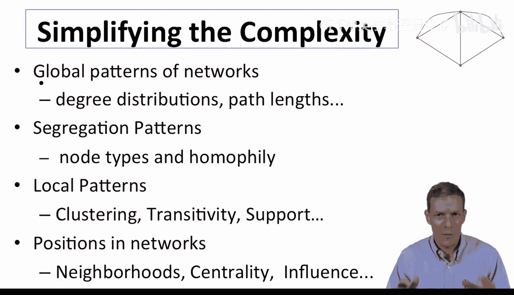
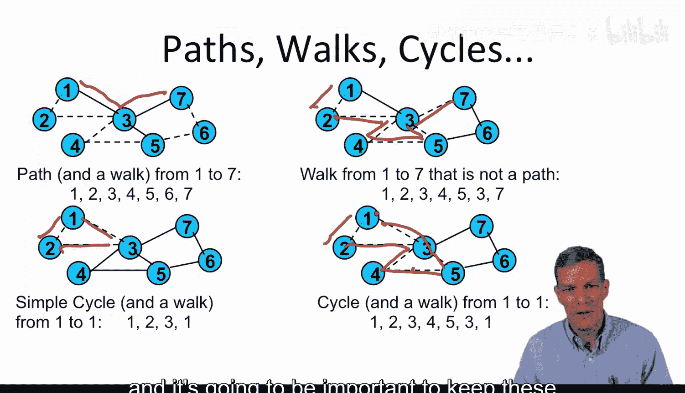
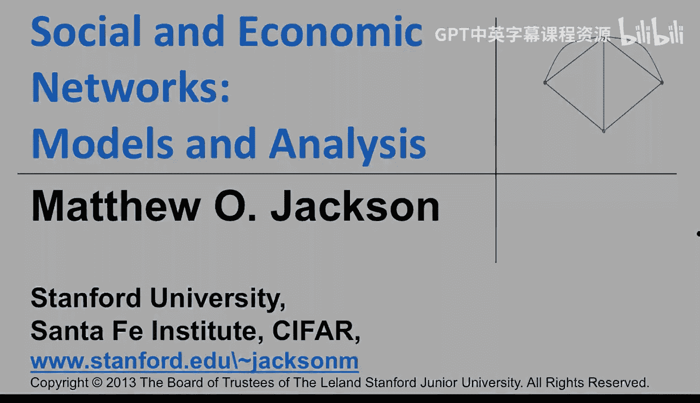

#  005：定义与符号 📚

在本节课中，我们将学习如何表示网络并讨论其基本属性。我们将通过一系列定义来简化描述网络时的复杂性，包括全局模式、局部模式以及节点在网络中的位置。

---

## 网络表示的基础

上一节我们介绍了网络分析的背景，本节中我们来看看如何用数学语言来描述一个网络。

网络由一组**节点**（也称为顶点、参与者或智能体）构成。我们通常用 **n** 来表示节点的总数。



一种基本的网络表示方法是**邻接矩阵**。它是一个 **n × n** 的矩阵，其中的元素表示节点之间是否存在连接。

**公式**：
- 设 **G** 为一个邻接矩阵。
- 如果节点 **i** 与节点 **j** 相连，则矩阵元素 **G[i][j] = 1**。
- 如果节点 **i** 与节点 **j** 不相连，则 **G[i][j] = 0**。

在本课程中，除非特别说明，我们主要讨论**无向网络**。这意味着如果 **i** 连接到 **j**，那么 **j** 也连接到 **i**（例如，友谊关系是相互的）。邻接矩阵通常是对称的。

我们也可以处理**有向网络**（连接有方向）和**加权网络**（连接有强度或权重），例如国家间的债务关系。

另一种有用的表示方法是直接列出网络中存在的所有连接关系。我们可以将网络 **G** 定义为一组节点和一组链接的集合。

**代码**（表示一个链接）：
```
(i, j) ∈ G
```
这表示节点 **i** 和 **j** 之间存在一条链接。

---

## 路径、行走与测地线

理解了网络的基本表示后，我们需要掌握如何在网络中“穿行”。以下是几个核心概念。

**行走** 是从一个节点到另一个节点的一系列链接序列。节点可以在行走中重复出现。

**路径** 是一种特殊的行走，其中除了起点和终点，所有节点都是不同的。

**环** 是一种行走，其起点和终点是同一个节点。

**测地线** 是连接两个节点的**最短路径**。“最短”指的是路径中链接的数量最少。

为了更直观地理解，请看下图示例。它展示了在一个七节点网络中，路径、行走和测地线的区别。


---



## 邻接矩阵的幂与行走计数

邻接矩阵不仅用于表示连接，其幂运算还能揭示网络更深层次的结构。

当我们计算邻接矩阵 **G** 的 **k 次幂**（即 **G^k**）时，所得矩阵中的元素 **G^k[i][j]** 的值，表示从节点 **i** 到节点 **j** 长度为 **k** 的**行走**的数量。

**公式**：
- **G^1**： 表示长度为1的行走（即直接连接）。
- **G^2**： 表示长度为2的行走。
- **G^3**： 表示长度为3的行走，依此类推。

例如，在一个四节点网络中，如果 **G^2[1][1] = 2**，则表示存在两条不同的、从节点1出发并回到节点1、且长度为2的行走路径。

这个性质在定义节点中心性、分析信息扩散过程时非常有用。

---

## 网络的组件结构

最后，我们来探讨网络的整体连通性，这通过**组件**的概念来理解。

一个网络是**连通**的，如果其中任意两个节点之间都存在一条路径。

一个**组件**是网络中的一个**极大连通子图**。这意味着：
1.  该子图本身是连通的（子图内任意两节点间有路径）。
2.  不能通过添加原网络中的任何其他节点或链接而继续保持连通（即它是“最大”的）。

请看下图，它展示了一个包含多个组件的网络。理解组件结构有助于我们分析信息传播的范围、网络的隔离程度以及学习动态。


---

## 总结




本节课中我们一起学习了网络分析的基础定义与符号。
我们首先学习了用**邻接矩阵**和**链接集合**来表示网络。
接着，我们区分了**行走**、**路径**、**环**和**测地线**这些在网络中导航的核心概念。
然后，我们了解到**邻接矩阵的幂**可以用于计算网络中特定长度的行走数量。
最后，我们引入了**组件**的概念，用以描述网络的整体连通结构。
这些基础工具和概念是我们后续深入分析网络各种模式（如中心性、聚类、扩散）的基石。下一讲，我们将开始探讨路径长度和网络直径。