#  006：网络直径 📏

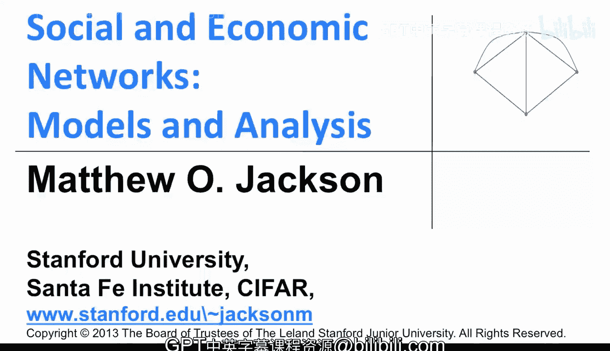

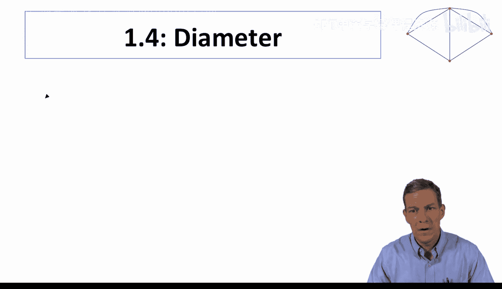

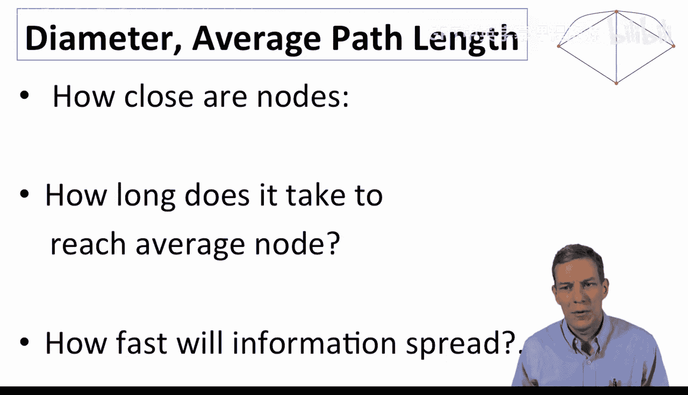

在本节课中，我们将要学习网络的两个重要度量指标：直径和平均路径长度。我们将了解它们的定义，探讨它们在不同网络结构中的表现，并解释为什么现实世界中的网络通常具有很短的路径长度。

## 概述

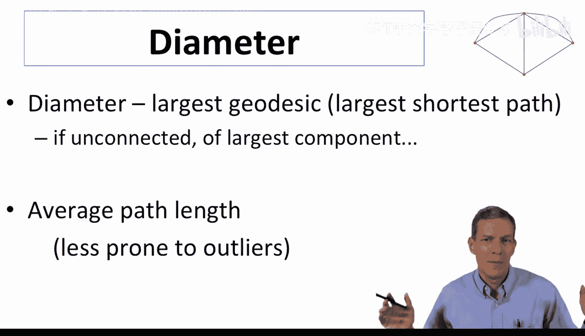

上一节我们介绍了网络的基本表示方法，本节中我们来看看如何衡量网络中节点之间的“距离”。直径和平均路径长度是描述网络连通效率的两个核心概念。它们能告诉我们信息在网络中传播的速度有多快，以及从一个节点到达另一个节点有多容易。

## 直径与平均路径长度的定义

网络直径的定义是网络中**最大的测地距离**，即所有节点对之间最短路径长度的最大值。

**公式**：`直径 = max( d(i, j) )`，其中 `d(i, j)` 是节点 `i` 和 `j` 之间的最短路径长度。

如果网络不是完全连通的，人们通常讨论的是**最大连通分量**的直径。直径的一个特点是它可能对异常值很敏感，网络中只要有一对节点距离非常远，就会显著增大直径值。

平均路径长度则不同，它是网络中所有节点对之间最短路径长度的**平均值**。

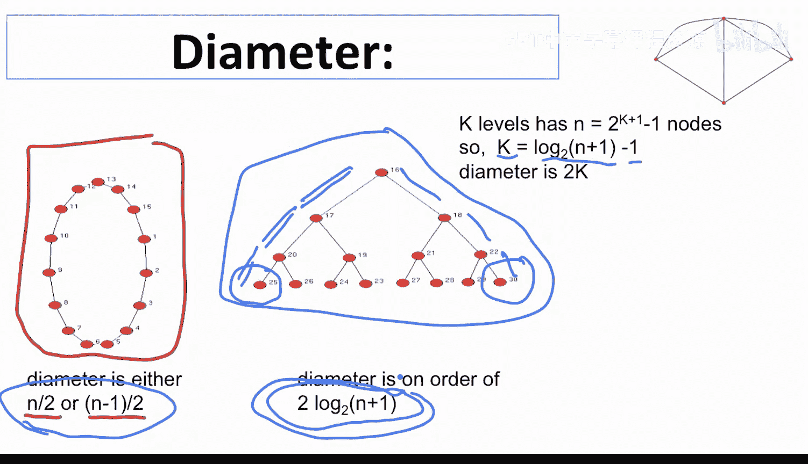

**公式**：`平均路径长度 = ( Σ d(i, j) ) / ( n(n-1)/2 )`，其中求和遍历所有节点对。

平均路径长度能更好地反映网络的整体连通性，因为它考虑了所有节点对的距离，而不仅仅是最大值。

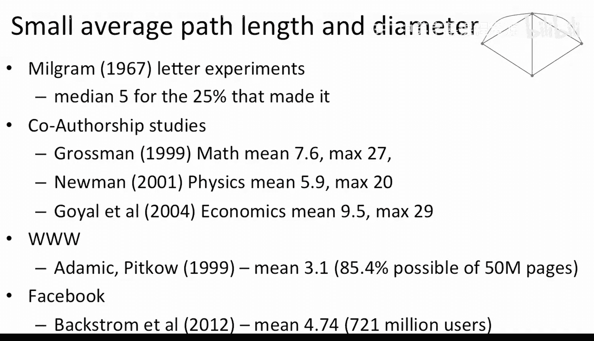

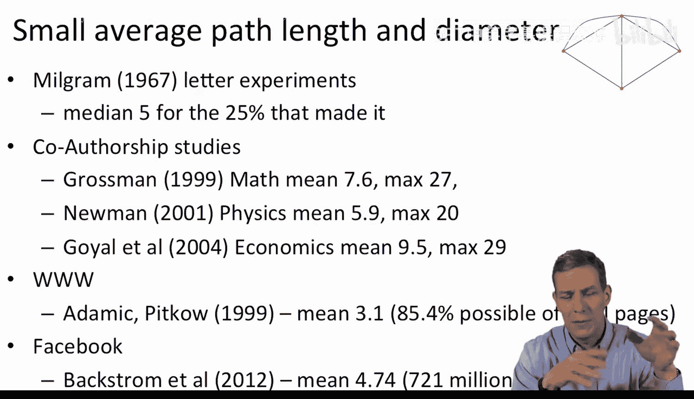

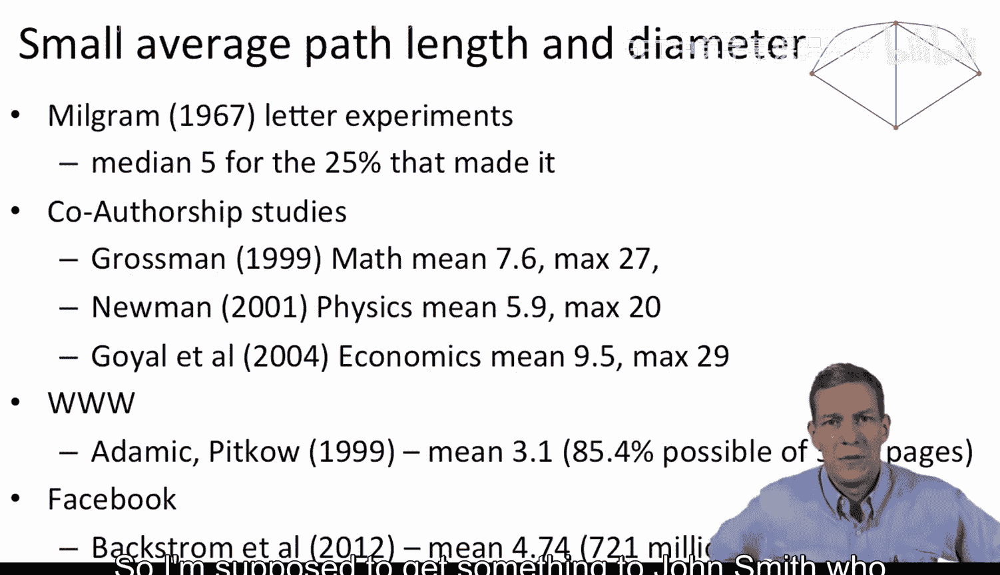

## 不同网络结构的直径

通过观察不同结构的网络，我们可以理解直径如何揭示网络特性。

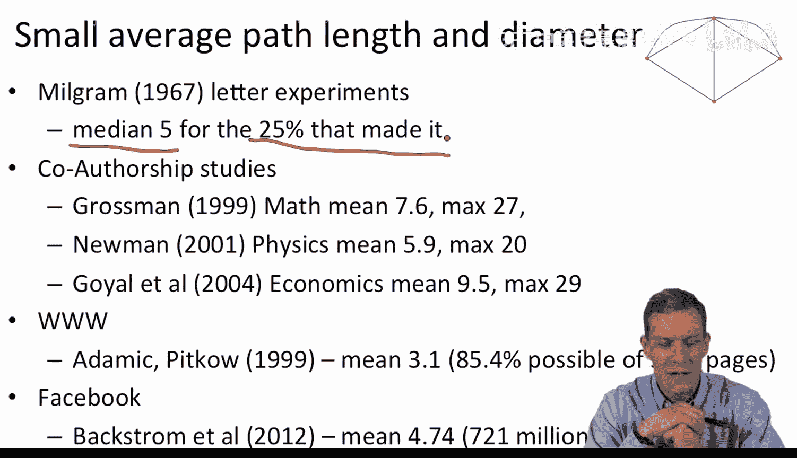

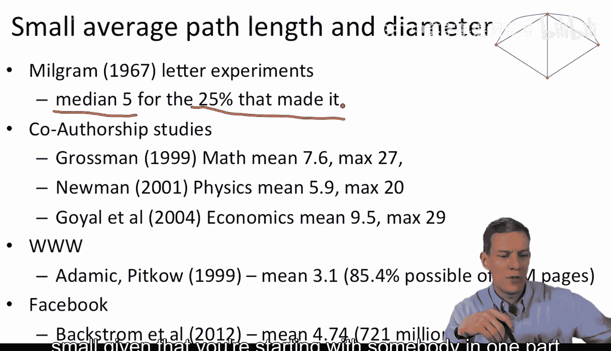

以下是两种基本网络结构的直径对比：

*   **环形网络**：在左侧的环形网络中，节点沿一个圆圈连接。这种情况下，有些节点彼此距离很远。直径大约为节点数的一半，即 `n/2` 或 `(n-1)/2`（取决于节点数是偶数还是奇数）。这意味着直径随着节点数量 `n` **线性增长**。
*   **树形网络**：在右侧的树形网络中，连接方式更高效。对于一个有 `K` 层深度的平衡二叉树，其节点总数 `n` 约为 `2^(K+1) - 1`。反过来，层数 `K` 约为 `log₂(n+1) - 1`。在这种树中，最长的最短路径（直径）约为 `2K`。因此，树形网络的直径随着节点数量 `n` **对数增长**，即约为 `2 * log₂(n)`。

对比可知，树形结构在利用较少链接高效连接节点方面远优于环形结构。环形网络的直径线性增长，而树形网络的直径仅对数增长，后者在节点数很大时远小于前者。

## 现实世界中的小世界现象

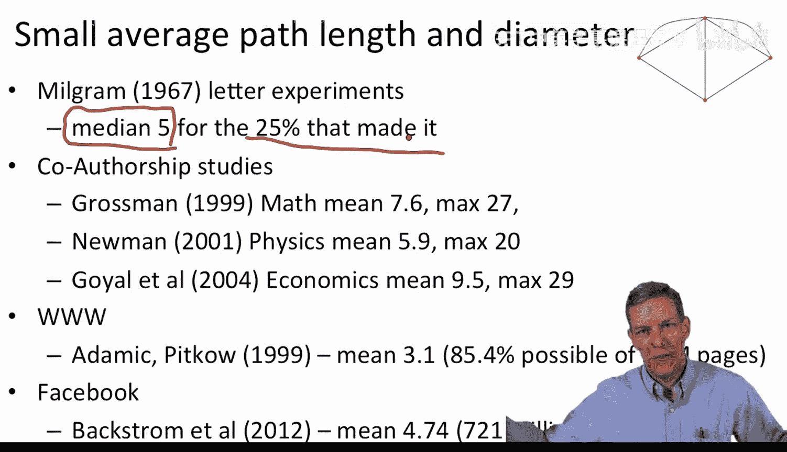

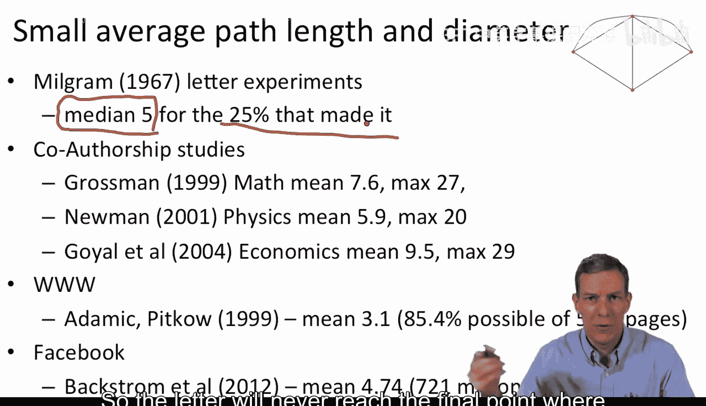

研究发现，现实世界中的社交网络普遍具有较短的平均路径长度和直径。“短”在这里直观地意味着，我们用相当少的连接步数就能联系到大量节点。

最著名的例子是斯坦利·米尔格拉姆的“小世界”实验。实验中，参与者需要将一封信通过熟人链从美国中西部（如内布拉斯加州）寄到东海岸（如马萨诸塞州）的某个指定陌生人手中。令人惊讶的是，成功抵达的信件所需的中间人数量中位数仅为 **5**。尽管只有约25%的信件最终送达，且长路径的信件更可能中途丢失（造成结果偏差），但“六度分隔”的概念由此深入人心。

后续在不同领域的研究也 consistently 发现了短路径现象：

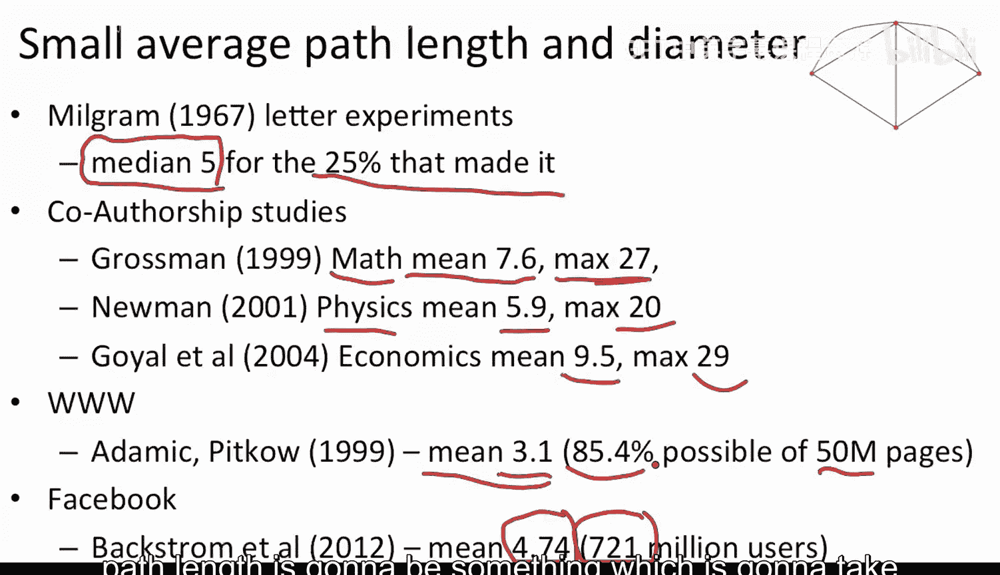

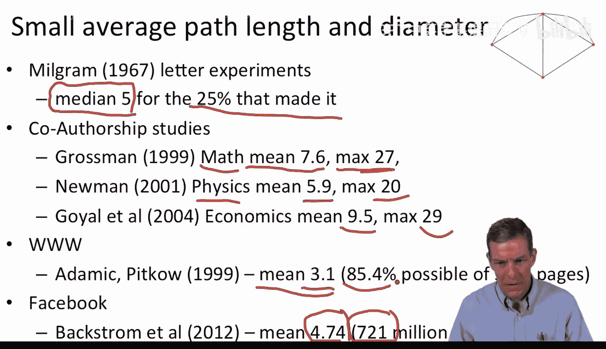

以下是部分研究发现的平均路径长度示例：
*   **格罗斯曼的数学家合著网络**：平均路径长度 7.6，最大连通分量内最大距离 27。
*   **纽曼的物理学家合著网络**：平均 5.9，最大 20。
*   **高耶尔等人的经济学家合著网络**：平均 9.5，最大 29。
*   **拉达等人研究的万维网**：在包含约5000万个页面、覆盖85%网页的巨型分量中，平均路径长度仅为 3.1。
*   **巴克斯特罗姆等人研究的Facebook网络**：在7.21亿用户中，平均路径长度约为 4.74。

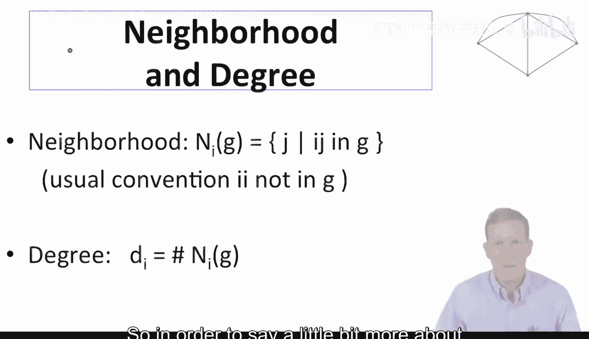

这些数据表明，即使在超大规模网络中，节点间的平均距离也仅在个位数级别，这体现了社会网络的高度互联性。

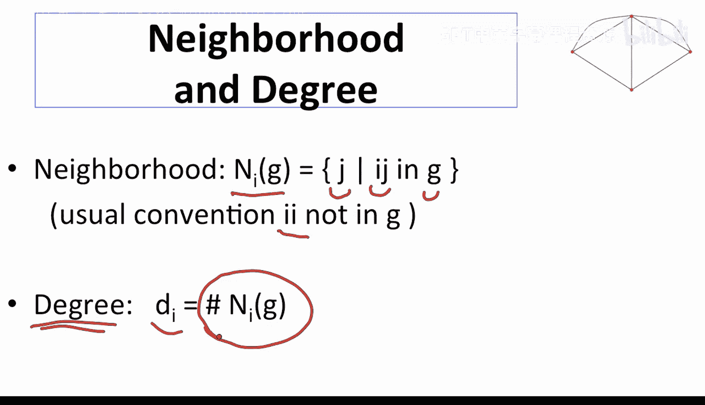

## 理解短路径：随机图模型

为了更深入地理解为什么会出现短平均路径长度，我们需要引入几个新概念，并借助一个重要的基准模型——随机图。

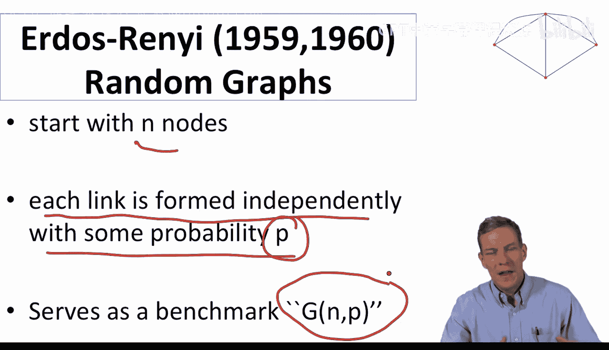

首先，定义节点 `i` 的**邻居集合** `N_i(g)` 为在网络 `g` 中与 `i` 直接相连的所有其他节点的集合。节点 `i` 的**度** `d_i(g)` 即为其邻居的数量，这是一个在网络分析中非常重要的基础概念。

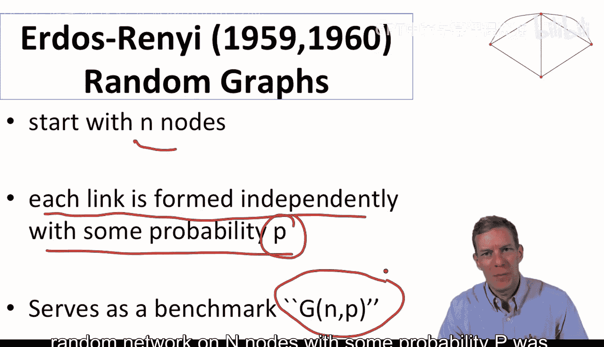

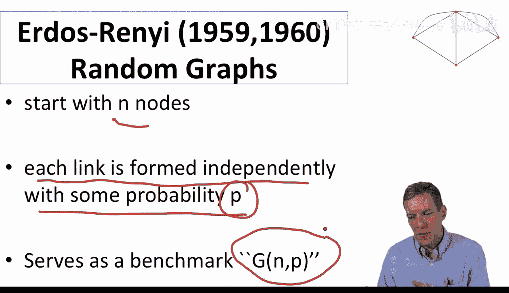

**代码/公式**：`d_i(g) = |N_i(g)|`

理解短路径的关键模型是**埃尔德什-雷尼随机图模型**。该模型非常简单：
1.  从 `n` 个节点开始。
2.  对于每一对可能的节点，以固定的概率 `p` 独立地创建一条连接它们的边。

这就像为每一对节点抛一枚硬币，正面（概率为 `p`）则连接，反面则不连接。这样生成的图记作 `G(n, p)`。它是一个重要的基准，因为我们可以将观察到的真实网络与这种“随机”生成的网络进行比较，从而判断真实网络是否存在某种系统性的结构特征。

## 随机图的直径与平均路径长度定理

当我们研究大型随机图（即 `n` 很大）时，可以得出关于其直径和平均路径长度的有力结论。考虑满足以下条件的随机图序列：
1.  平均度 `d(n)` 至少为 `log n`（这确保了网络以高概率连通）。
2.  平均度 `d(n)` 远小于总节点数 `n`（这避免了网络是完全图，使得路径长度有意义）。

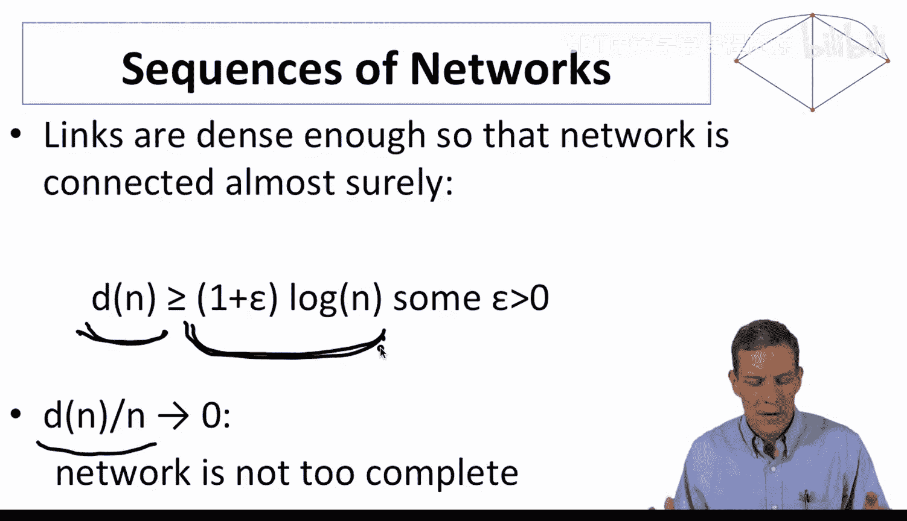

在这些条件下，有一个基本定理：对于足够大的 `n`，`G(n, p)` 随机图的平均路径长度和直径**以高概率近似正比于 `log n / log d(n)`**。

**公式**：`平均距离 ≈ 直径 ≈ log n / log d`

更精确的数学表述是：在所述条件下，平均距离与 `(log n / log d)` 的比值依概率收敛于 1，直径也有类似性质。

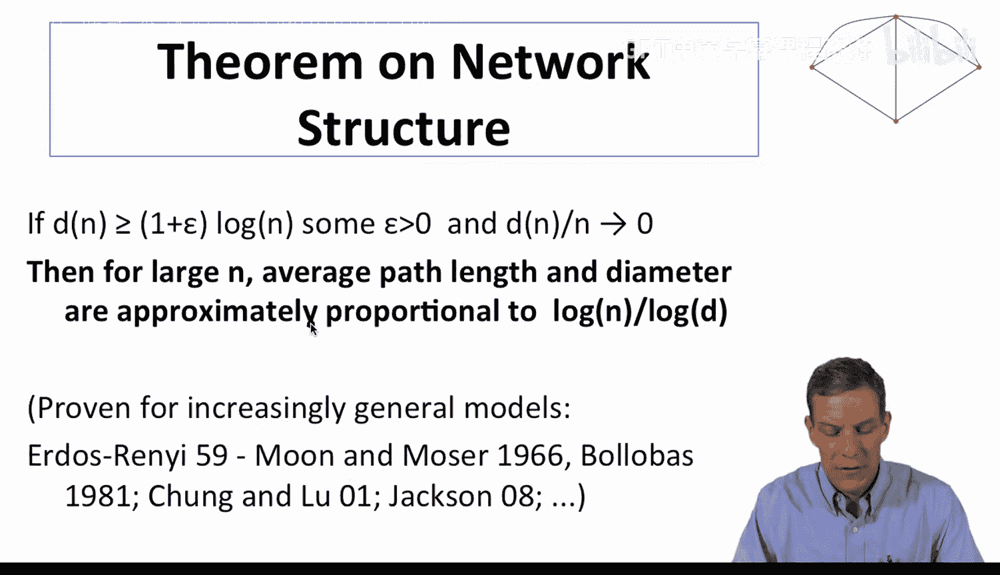

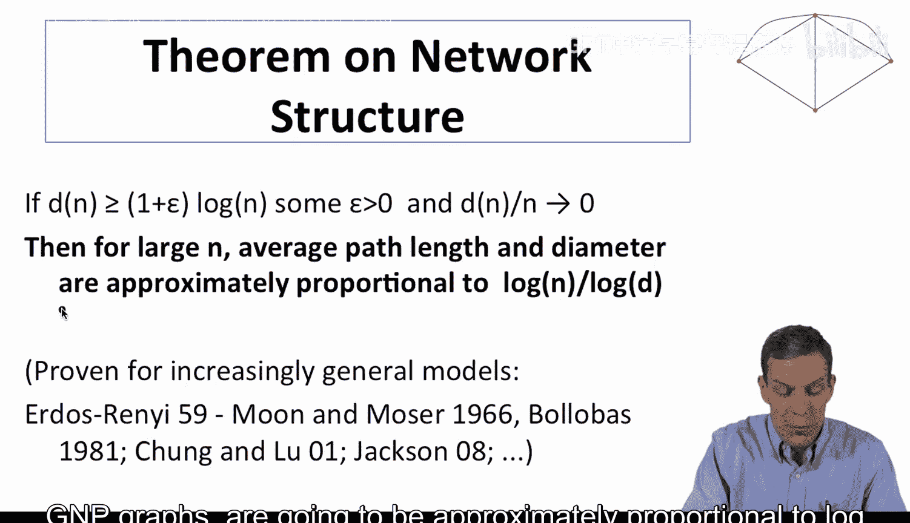

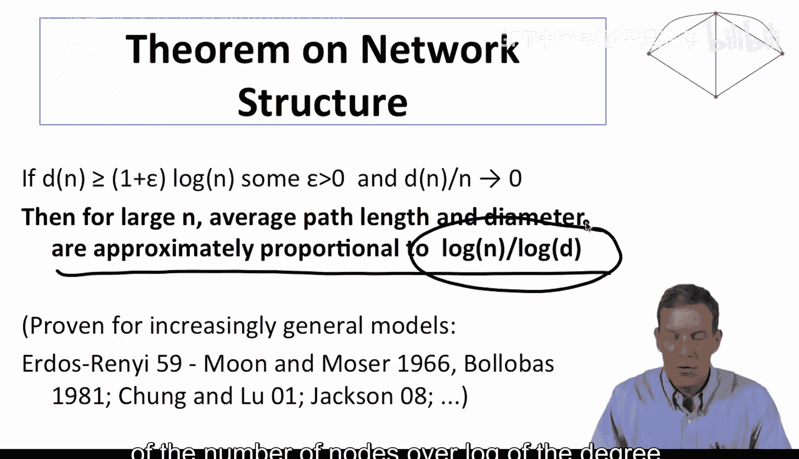

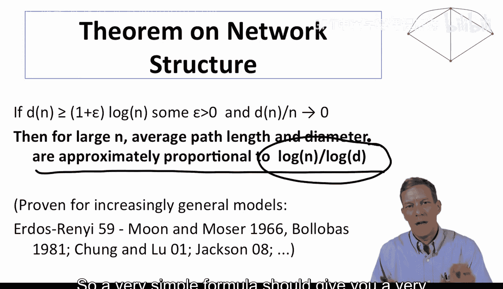

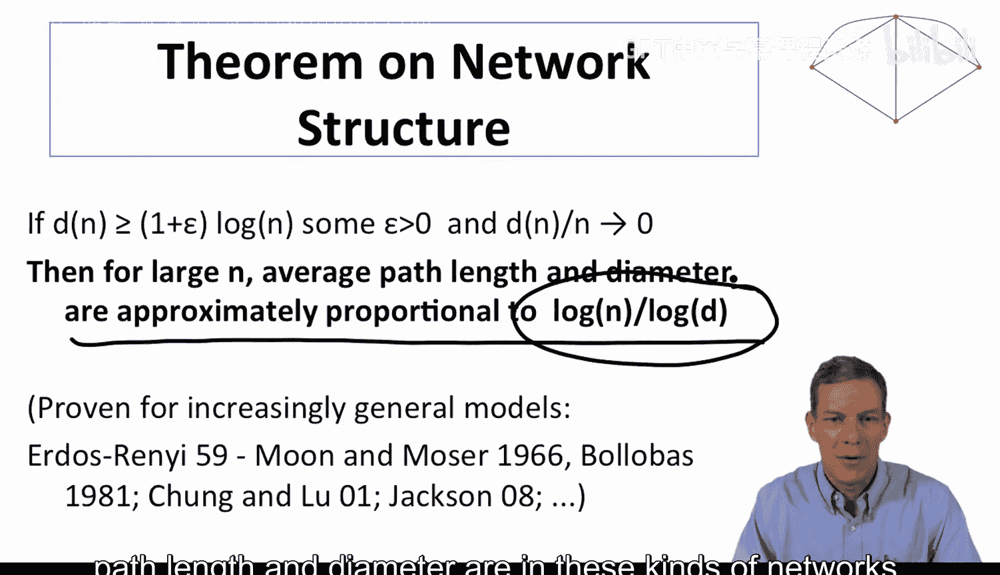

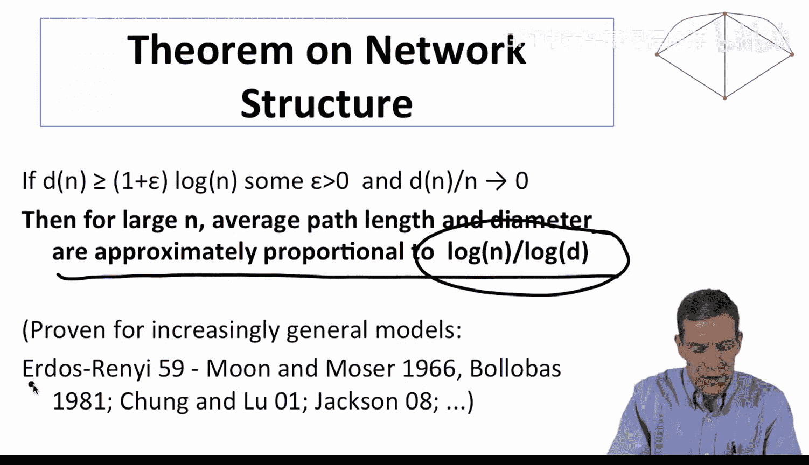

这个定理的直觉逻辑相对简单（更严格的证明会在进阶讲座中涉及）：想象从任意一个节点开始“探索”网络。第一层有大约 `d` 个邻居。这些邻居的邻居（第二层）大约有 `d * d = d²` 个（忽略重叠）。以此类推，在 `k` 步之内，大约可以触及 `d^k` 个节点。当 `d^k` 与总节点数 `n` 相当时，即 `d^k ≈ n`，解得 `k ≈ log n / log d`。这意味着从任一节点出发，大约经过 `log n / log d` 步就能到达网络的大部分节点，从而解释了短路径的成因。

这个公式揭示了为什么即使在大规模网络中，路径长度也能保持很短：只要平均度 `d` 不是太小，`log n / log d` 的增长速度非常缓慢。例如，在一个有10亿节点、平均度为100的网络中，`log(10^9) / log(100) ≈ 9/2 = 4.5`，这与我们在Facebook等网络中观察到的数据相符。

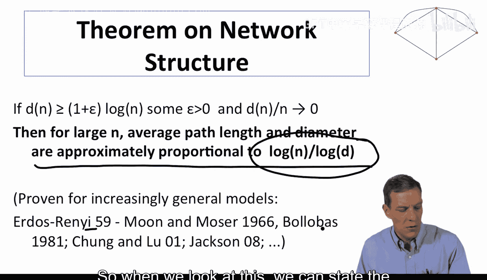

## 总结

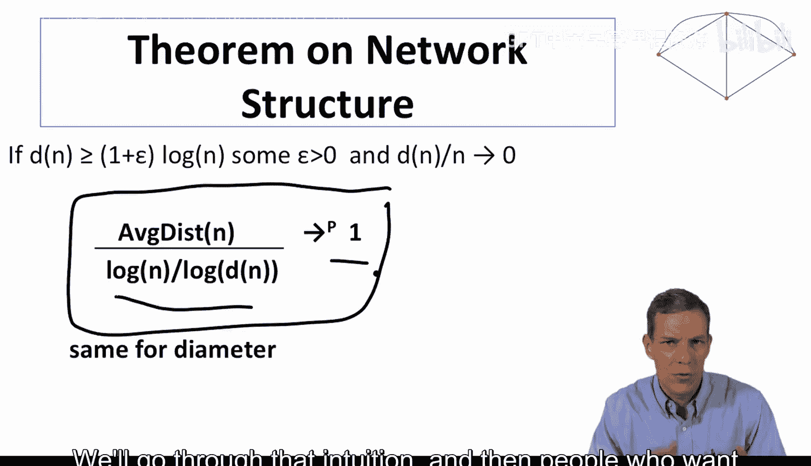

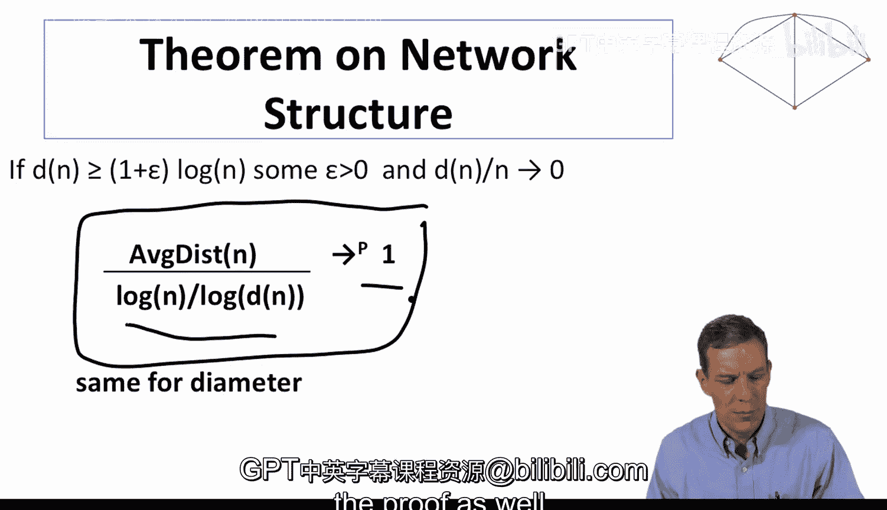

本节课中我们一起学习了网络直径和平均路径长度这两个核心度量指标。我们明确了它们的定义，对比了它们在环形和树形等不同结构中的差异，并回顾了从米尔格拉姆实验到现代在线社交网络中都普遍存在的“小世界”现象——即极短的平均路径长度。为了理解这一现象的成因，我们引入了埃尔德什-雷尼随机图模型作为基准，并学习了一个关键定理：在适当的条件下，随机图的平均路径长度和直径约为 `log n / log d`。这个公式从理论上解释了，只要网络连接足够随机且平均度不太小，即使网络规模巨大，节点间的距离也能非常短。这为我们理解现实社会和经济网络的高效连通性提供了基础。