#  007：直径与树结构 🌳

在本节课中，我们将详细探讨网络直径的概念，并理解为何在许多随机网络中，平均路径长度会非常短。我们将从一个简单的树状结构模型入手，逐步推导出平均距离与节点数 `n` 和平均度数 `D` 之间的关系。

上一节我们讨论了随机网络的平均距离特性，本节中我们来看看如何通过一个简单的树状模型来直观理解这一现象。

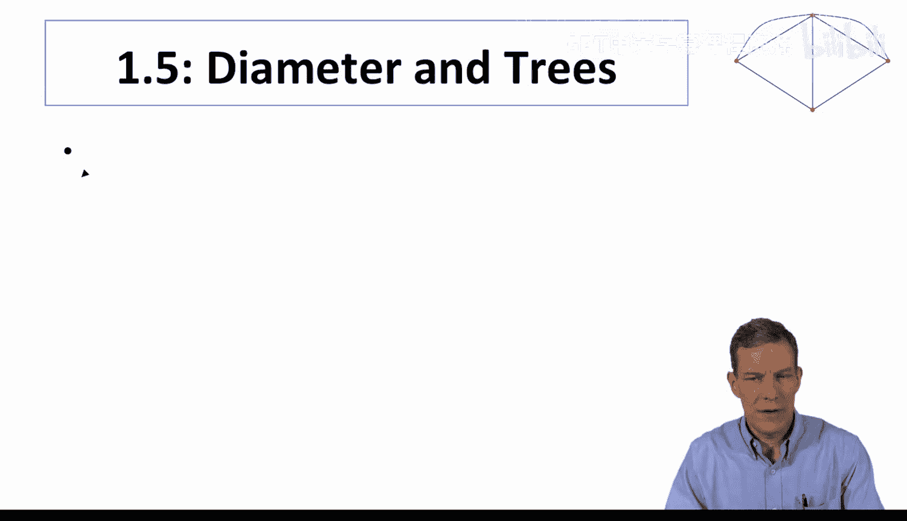

## 规则树模型

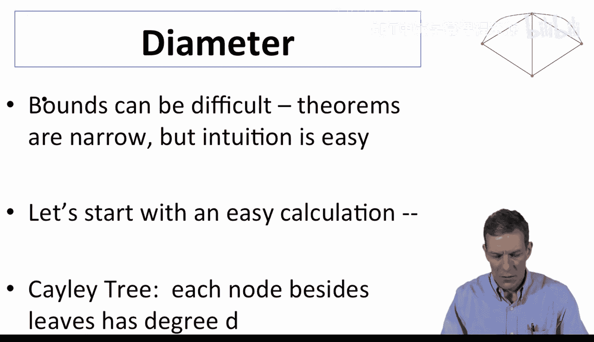

为了进行一个粗略的计算，我们从一个非常规则的树结构开始，这被称为**Cayley树**。在这种树中，除了最外层的节点，每个节点的度数都是 `D`。例如，我们从一个度数为4的节点开始。

这个中心节点有4个邻居。我们可以追踪从该节点出发，每一步能到达多少个新节点，以此来估算它到其他节点的路径长度。

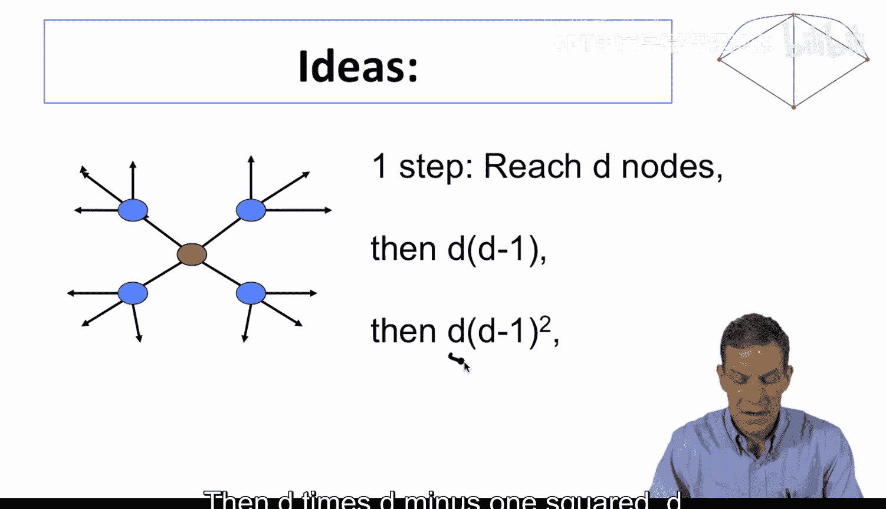

以下是每一步能到达的节点数估算：

*   **第一步**：到达 `D` 个新节点。
*   **第二步**：每个新节点（除了返回父节点的链接）又能连接到 `D-1` 个新节点。因此，第二步总共到达 `D * (D-1)` 个新节点。
*   **第三步**：到达 `D * (D-1)^2` 个新节点。
*   依此类推。

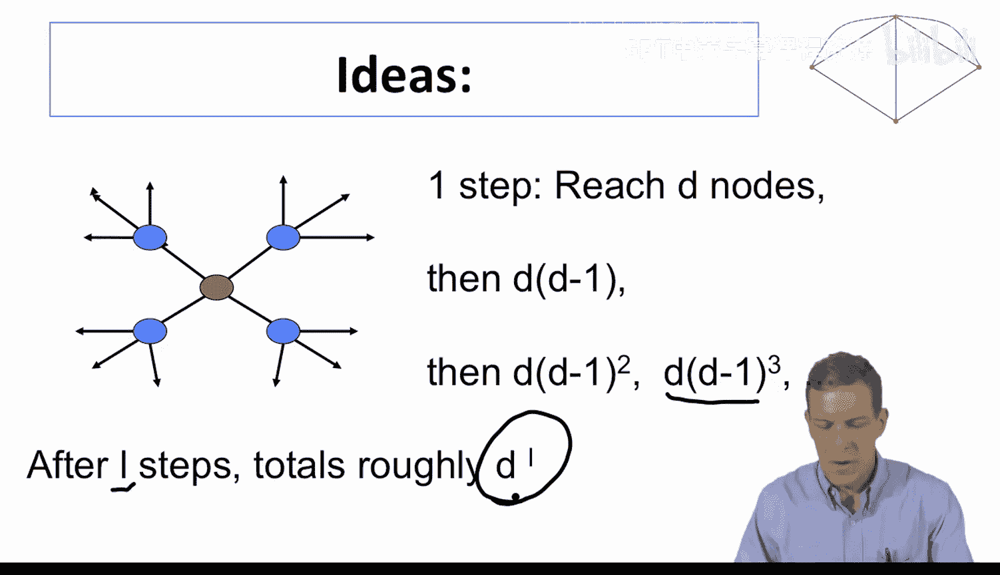

经过 `L` 步后，从起始节点总共能到达的节点数大致为 `D * (D-1)^(L-1)` 的级数和。对于足够大的 `D`，这个总和可以近似为 `(D-1)^L`。

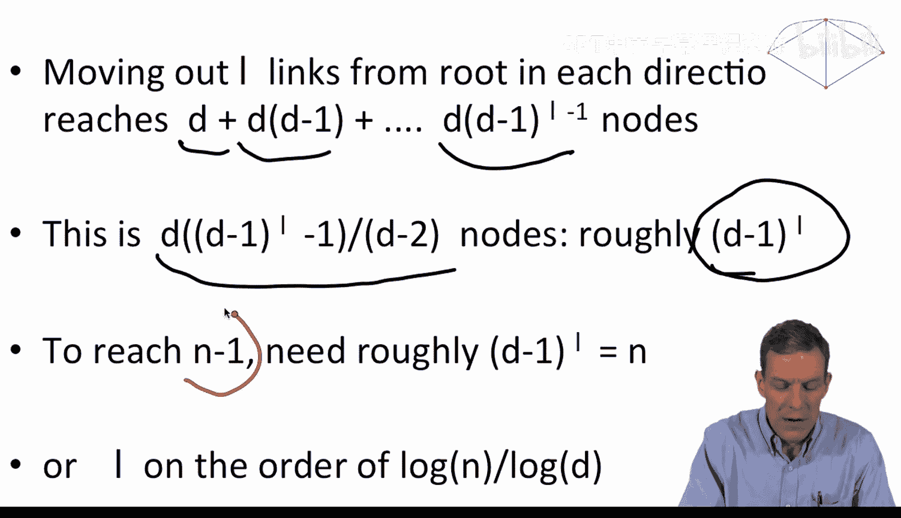

## 计算所需步数

现在，我们想知道需要多少步 `L` 才能到达网络中几乎所有的 `n` 个节点。这要求我们到达的节点总数与 `n` 相当。

因此，我们需要解这个近似方程：
`(D-1)^L ≈ n`

对等式两边取对数，我们可以解出 `L`：
`L ≈ log(n) / log(D-1)`

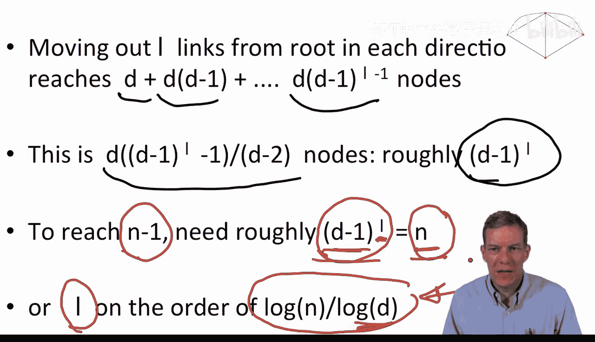

当 `D` 较大时，`log(D-1)` 与 `log(D)` 相近。因此，我们得到：
`L ∝ log(n) / log(D)`

这正是我们在关于Erdős–Rényi随机图的定理中看到的结果。从一个规则树中心节点到其他节点的距离，其数量级与随机图的平均路径长度公式一致。整个网络的直径大致是这个值的两倍，但比例关系相同。

## 从树到随机图

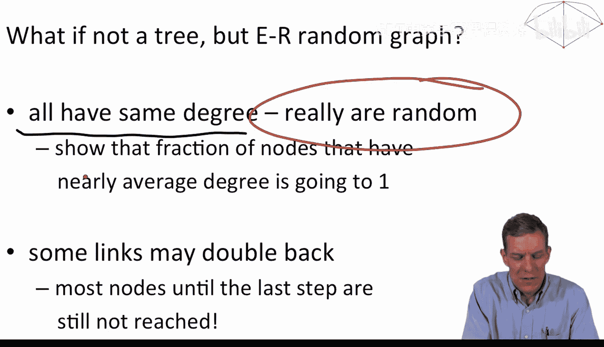

你可能会问，规则树和随机图毕竟不同，为什么结论会相似呢？以下是两个关键原因：

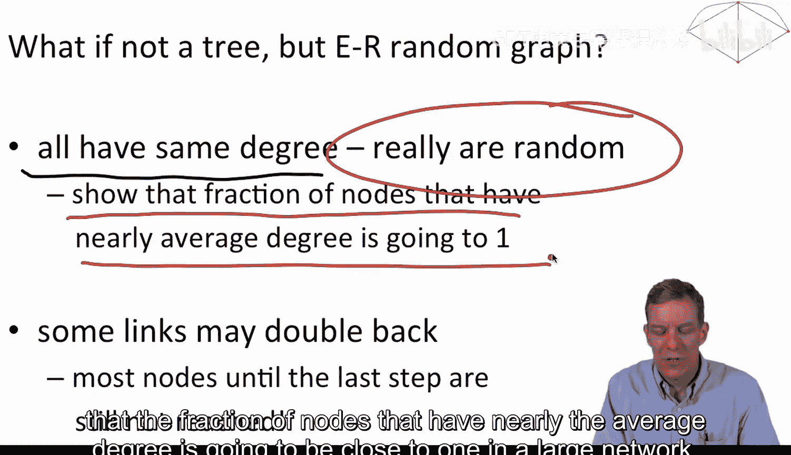

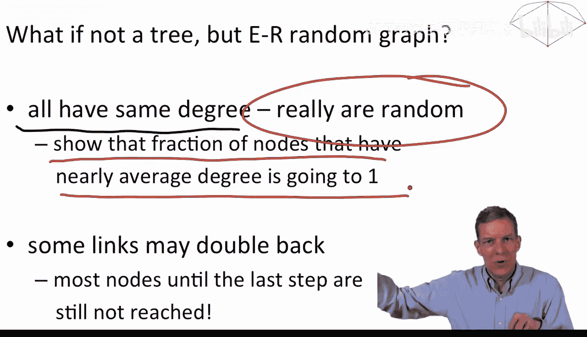

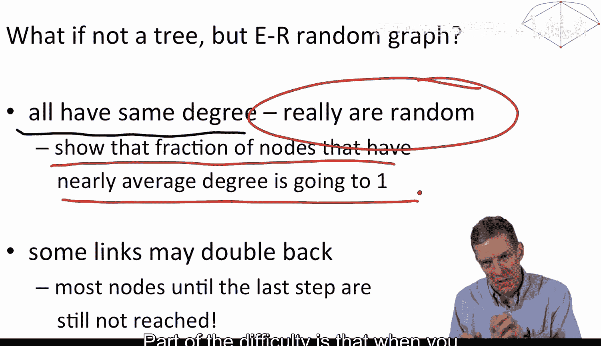

1.  **度数分布**：在大型随机网络中，拥有接近平均度数 `D` 的节点比例非常高。因此，从“平均”节点出发的扩展过程，与从规则树节点出发的过程类似。
2.  **避免回溯**：在树模型中，我们假设每一步都到达全新节点。在随机图中，链接可能指回已访问的节点。证明的关键在于，在过程的绝大部分阶段（直到接近访问完所有节点），大多数链接仍然指向未访问的新节点，从而保持了类似树的“分支”增长模式。

因此，尽管存在随机性和回溯链接，大型随机图在路径长度方面仍表现出与规则树相似的性质，从而导致了 `log(n) / log(D)` 这样的短平均路径长度。

对于那些对详细数学推导感兴趣的学者，后续会有课程更深入地讲解这些概率计算。接下来，我们将查看一些实际数据，检验 `log(n) / log(D)` 这个公式是否合理。

---

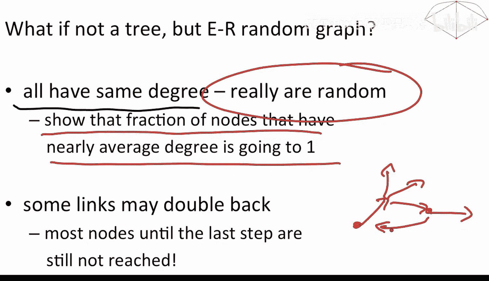

**本节课中我们一起学习了**：如何通过一个规则的树状结构模型来直观理解网络直径和平均路径长度。我们推导出，从树中心到达所有节点所需的步数 `L` 与 `log(n)/log(D)` 成正比，并解释了为何具有随机连接的Erdős–Rényi随机图也会展现出相似的短路径特性。这揭示了小世界现象背后的一个基本结构原理。