#  009：现实世界中的网络直径

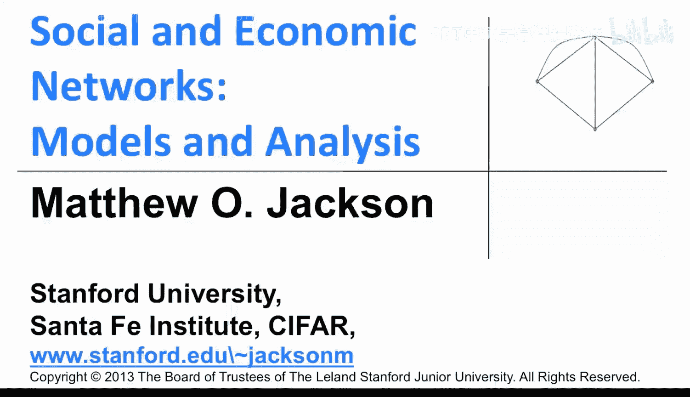

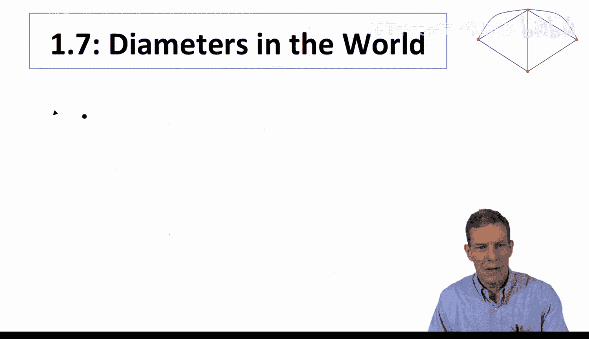

## 概述
在本节课中，我们将探讨现实世界中网络直径的实际观测数据，并与之前学习的随机图模型中的理论预测进行对比。我们将看到，理论公式 `log(n) / log(d)` 如何为理解真实社交网络中的“六度分隔”现象提供依据，并通过具体数据集验证其准确性。

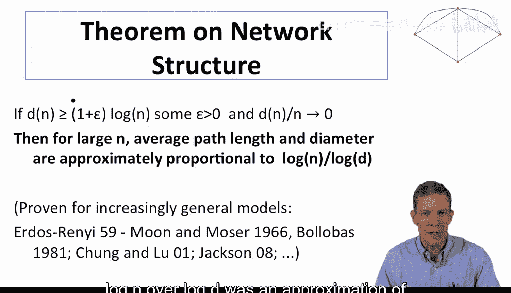

---

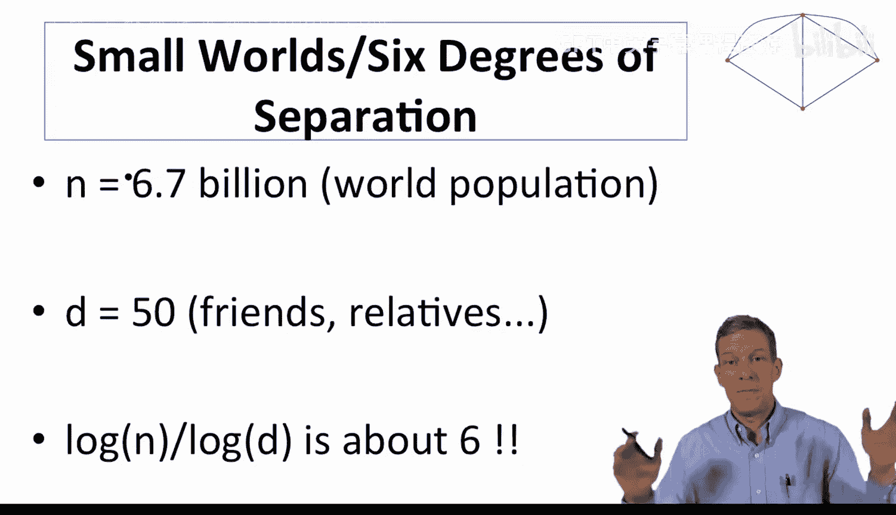

## 理论回顾与“六度分隔”现象

上一节我们介绍了随机图中直径和平均路径长度的近似公式。现在，我们来看看这个理论如何应用于现实世界。

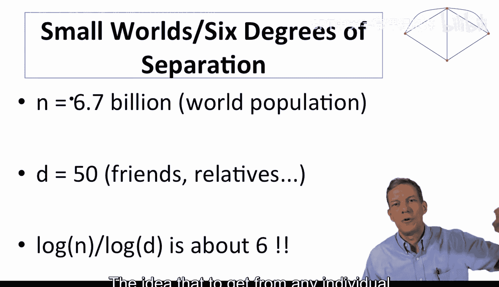

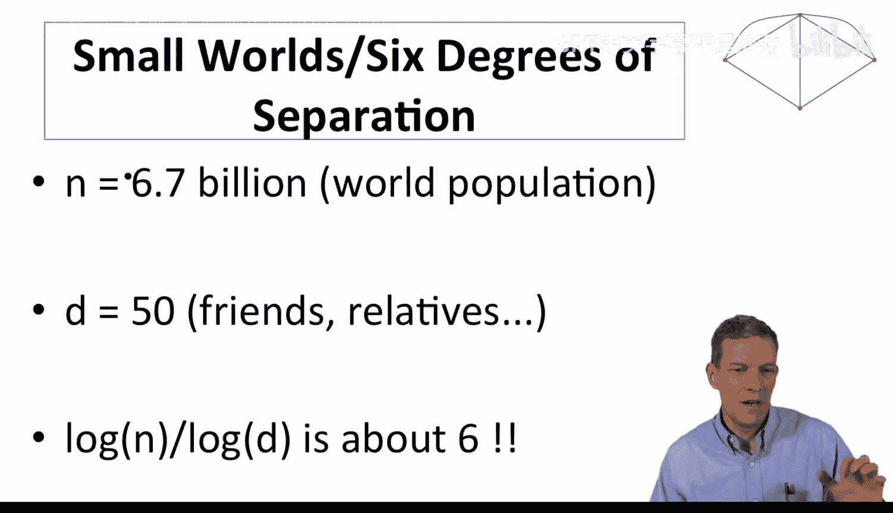

在特定形式的随机图中，对于足够大且度数适中的图，平均路径长度和直径可以近似为 **`log(n) / log(d)`**，其中 `n` 是节点数，`d` 是平均度数。

让我们做一个粗略的估算。假设世界人口约为67亿（`n = 6.7 × 10^9`）。再假设每个人平均与50位朋友或亲属保持定期联系（`d = 50`）。计算 `log(6.7 × 10^9) / log(50)`，结果大约为6。这就是常被提及的“六度分隔”概念：世界上任何两个人之间，平均只需要大约6次“跳跃”就能建立联系。

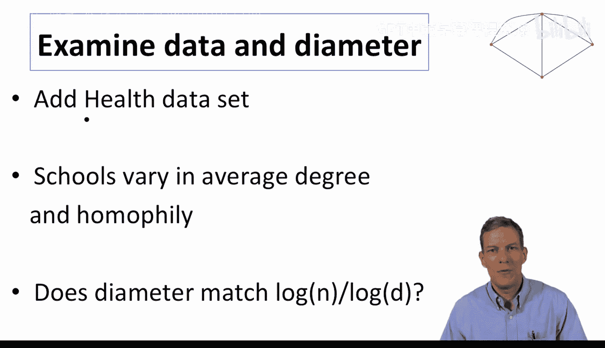

---

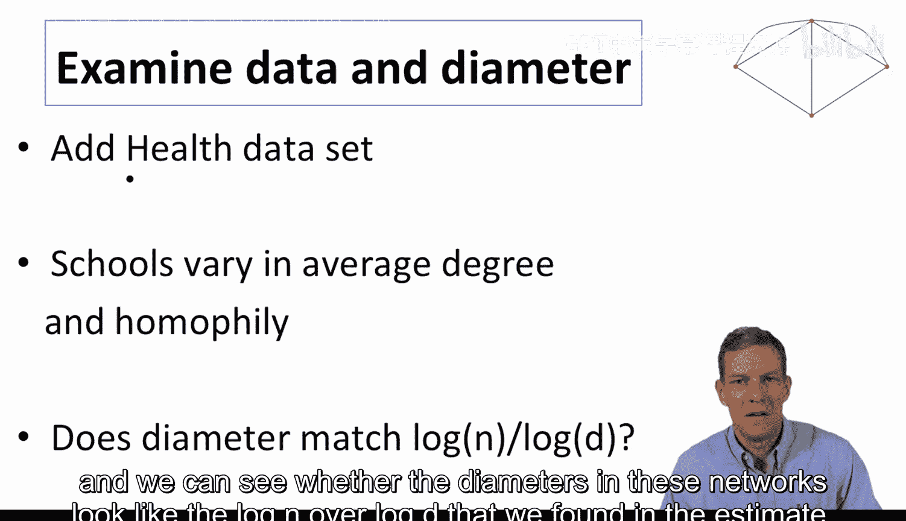

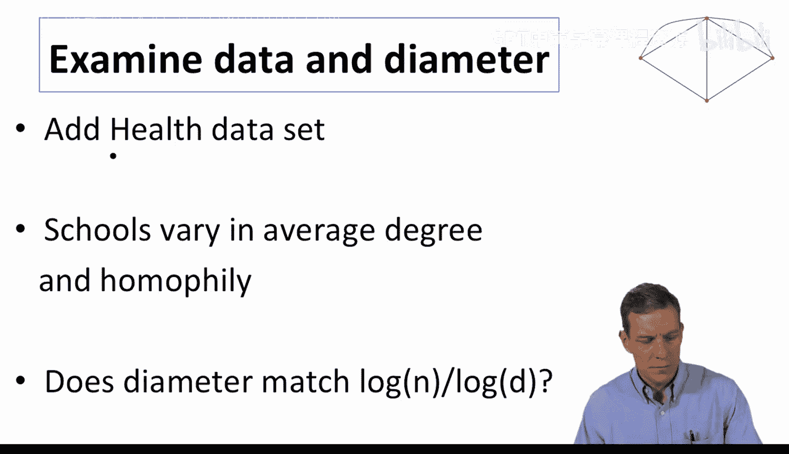

## 现实数据验证：美国高中社交网络

以下是来自现实世界的数据，用于检验理论预测的准确性。

我们将查看被称为“青少年健康数据”的数据集。该数据集收集于20世纪90年代，包含对美国多所高中的调查，记录了学生提名朋友的信息。这些学校在种族构成、学生规模等方面差异很大，因此其网络结构也各不相同。我们可以观察这些网络的直径是否接近 `log(n) / log(d)` 的估计值。

以下是来自84所拥有完整网络数据的高中的分析结果（图表展示了平均最短路径与 `log(n) / log(d)` 的关系）。

*   **X轴**：理论预测值 `log(n) / log(d)`。
*   **Y轴**：网络中实际观测到的平均最短路径。

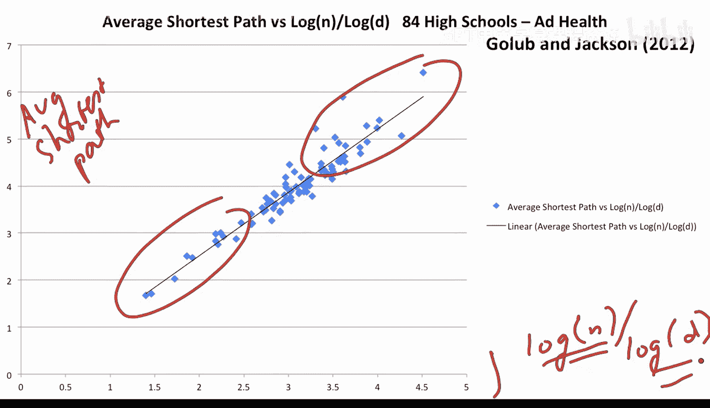

如果理论完全准确，所有数据点应落在45度对角线上。从图中可以看出，实际数据与理论预测吻合得相当好。规模较小的高中平均路径长度较短，规模较大的高中则较长，但它们都紧密围绕 `log(n) / log(d)` 的预测线分布。这表明，该公式是估算真实社交网络连通效率的一个有效工具。

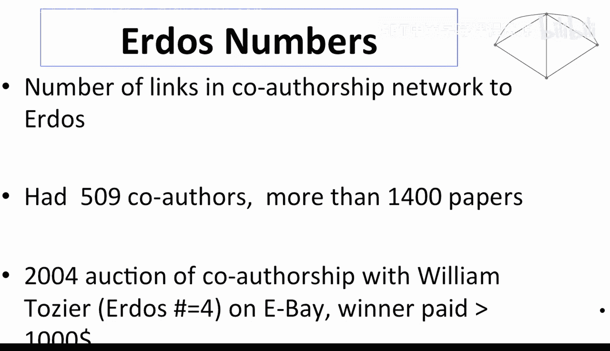

---

## 网络连通性的多样性及其影响

当我们观察平均度数时，一个重要发现是：网络密度的变化会直接影响平均路径长度。有趣的是，现实中的网络在连通性上差异巨大。

以下是不同网络的平均度数示例：

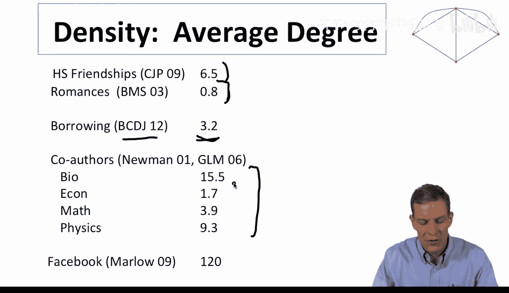

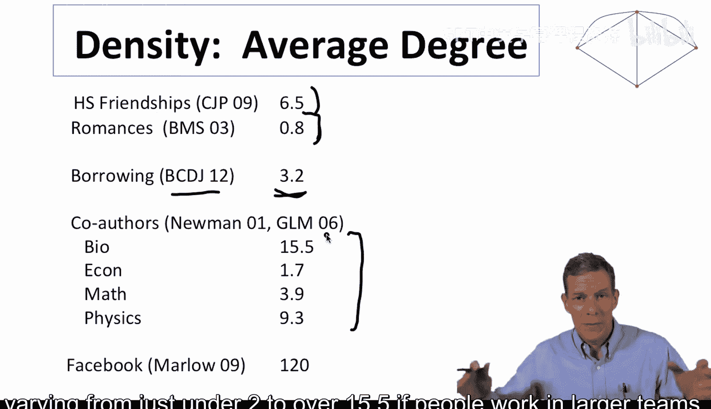

*   **高中友谊网络**：平均每人有约6.5个连接。
*   **高中恋爱关系网络**：在特定时期内，平均每人约有0.8段关系。
*   **印度农村借贷网络**：平均每户家庭向约3.2个其他家庭借贷煤油或大米。
*   **合著网络**：在经济学、生物学、数学、物理学等领域，人们在十年或更长时间内的平均合著者数量各不相同，通常在2到15.5人之间。
*   **Facebook好友网络**：平均好友数约为120。

由此可见，不同网络的连通性差异显著，这将导致它们具有不同的网络属性。有些网络的平均路径很短，有些则较长。因此，在研究任何具体问题或情境时，精确定义所分析的网络类型至关重要。无论是借贷网络、合作网络、Facebook式的线上好友网络，还是友谊、恋爱等关系，不同类型的连接会形成具有不同属性的网络结构。

---

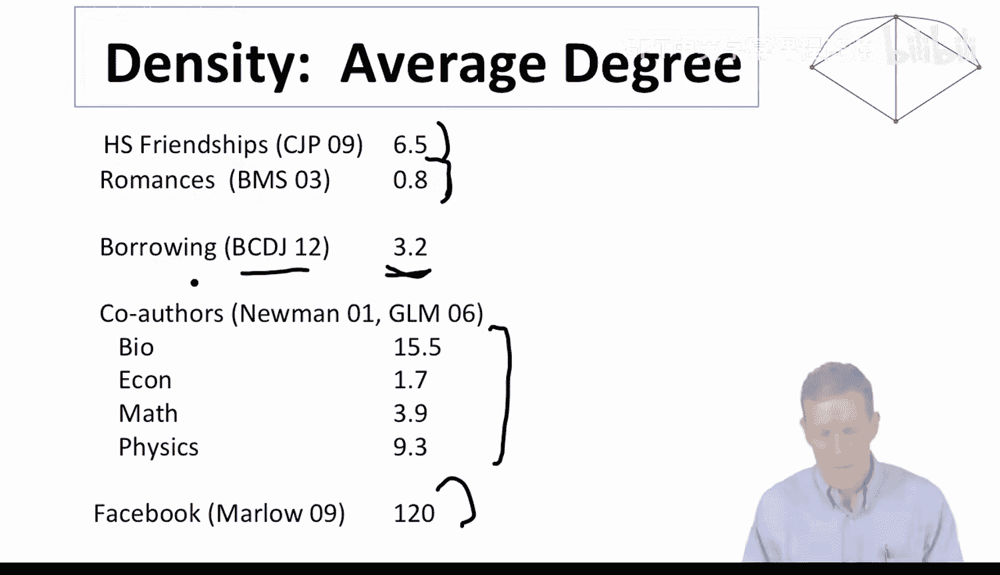

## 总结
本节课中，我们一起学习了如何将随机图的直径理论应用于现实世界。我们通过“六度分隔”的估算和真实的高中社交网络数据，验证了公式 **`log(n) / log(d)`** 在预测平均路径长度方面的有效性。同时，我们也认识到现实世界网络的多样性，其平均度数的巨大差异直接导致了路径长度和整体结构的不同。这提醒我们，在进行网络分析时，必须根据具体情境仔细定义网络的边界和连接关系。