#  010：度分布 📊


在本节课中，我们将学习网络中的度分布。度分布描述了网络中节点拥有不同连接数（即“度”）的频率。理解度分布对于刻画网络的基本特性至关重要，例如，网络中大多数节点的连接数是相似还是差异巨大，这将直接影响网络的扩散特性、路径结构等性质。


---

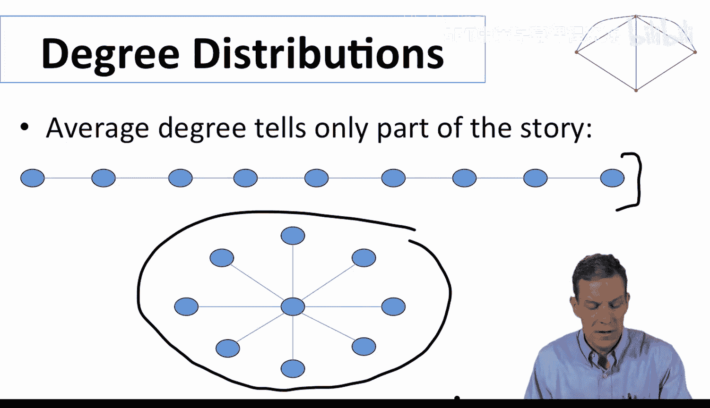

## 度分布的重要性

上一节我们介绍了网络的基本概念，本节中我们来看看如何量化网络中节点的连接情况。度分布能告诉我们网络是均匀的还是存在某些高度连接的“枢纽”节点。例如，在一个社交网络中，如果每个人都只有一两个朋友，那么信息传播会很慢。但如果存在少数拥有大量朋友的人，信息就可能通过这些“枢纽”快速传播。

---

## 随机网络中的度分布

让我们首先分析一种简单的网络模型：Erdős–Rényi 随机图（G(n, p) 模型）。在这种网络中，每对节点之间以固定概率 `p` 独立地形成连接。

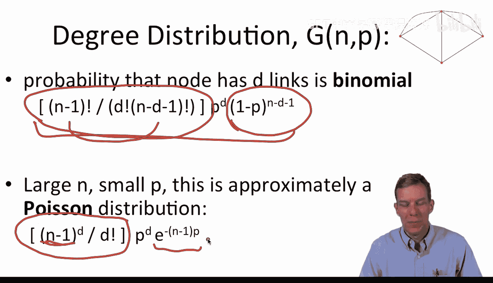

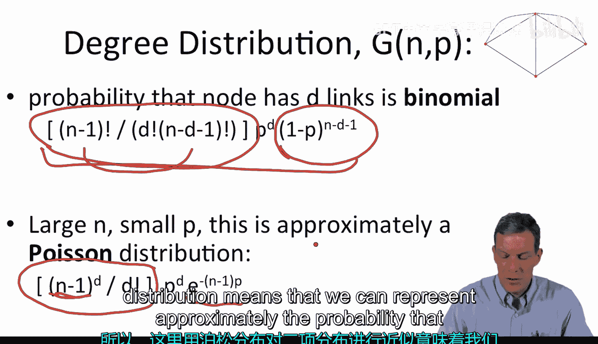

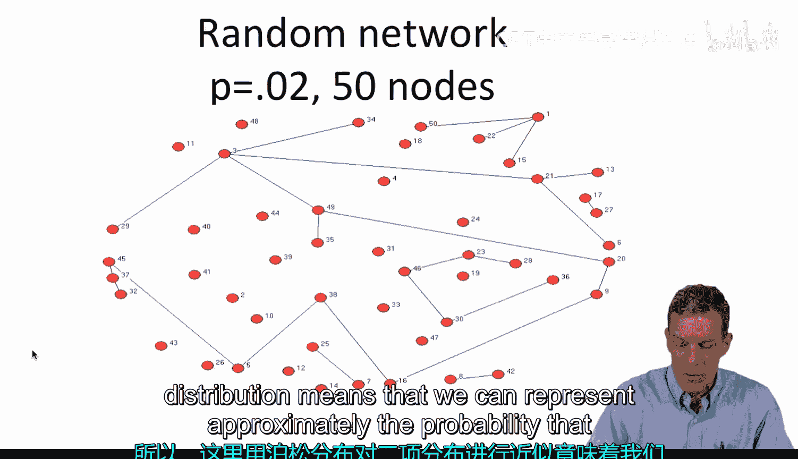

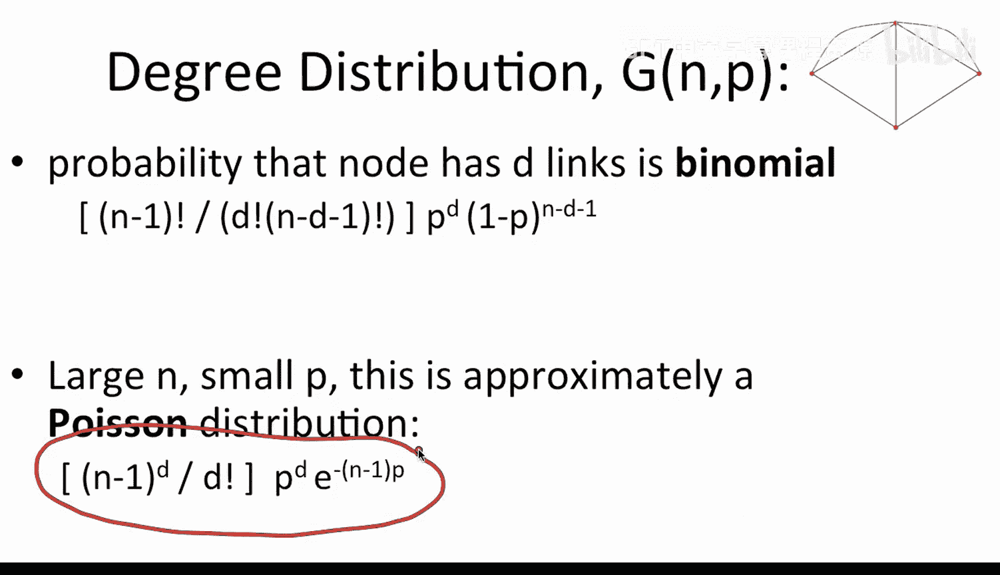

对于一个给定的节点，其恰好拥有 `d` 条连接的概率遵循**二项分布**。具体公式如下：

**公式：**
```
P(degree = d) = C(n-1, d) * p^d * (1-p)^(n-1-d)
```
其中，`C(n-1, d)` 是组合数，表示从 `n-1` 个其他节点中选择 `d` 个的不同方式数量。

当网络规模 `n` 很大且连接概率 `p` 相对较小时，这个二项分布可以很好地用**泊松分布**来近似。

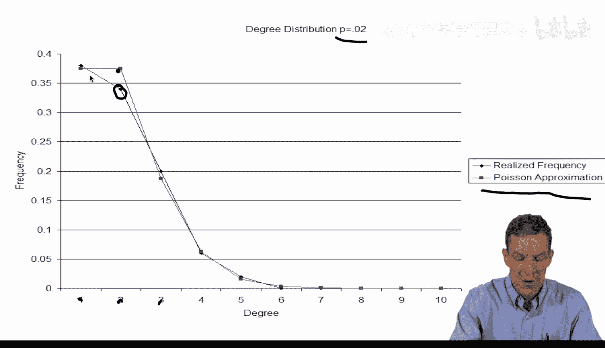

**公式（泊松近似）：**
```
P(degree = d) ≈ e^(-λ) * (λ^d) / d!
```
其中，`λ = (n-1) * p`，代表节点的平均度。

以下是泊松分布的几个关键特性：
*   它描述了在固定平均发生率下，事件发生次数的概率。
*   在随机网络中，大多数节点的度会集中在平均值 `λ` 附近。
*   出现极高或极低度的节点概率会随着偏离平均值而急剧下降。

---

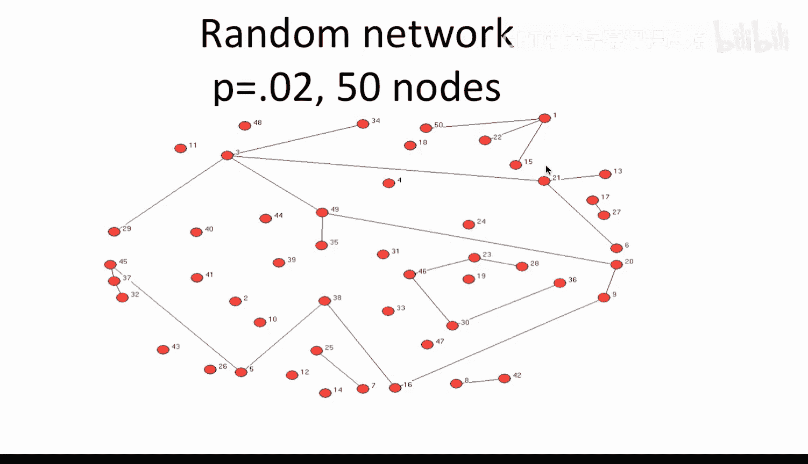

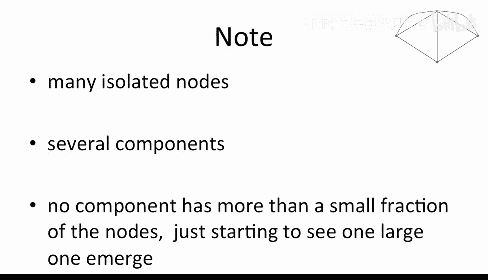

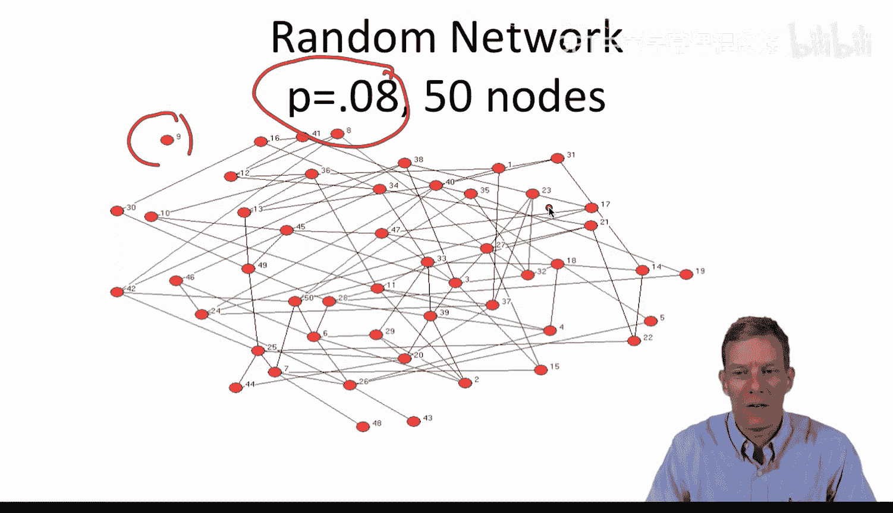

## 实例分析：随机网络

为了直观理解，我们观察两个在50个节点上生成的随机网络。

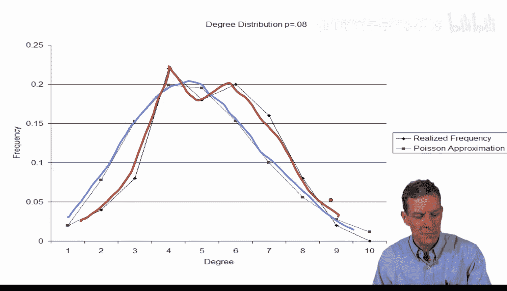

**第一个网络**（p = 0.02）：
*   网络结构稀疏，存在许多孤立节点和多个小分支。
*   其实际度分布（菱形标记）与泊松分布的预测（方块标记）几乎完全重合。这表明链接确实是随机形成的。

**第二个网络**（p = 0.08）：
*   网络连接更紧密，但仍有一个孤立节点。
*   其实际度分布与泊松预测略有偏差，但依然相当接近。如果节点数 `n` 更大，两者会吻合得更好。

这些例子表明，在链接随机形成的网络中，泊松分布是描述其度分布的一个良好模型。

---

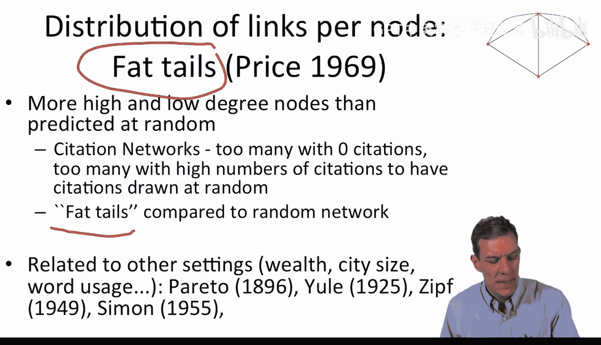

## 现实网络中的“厚尾”分布

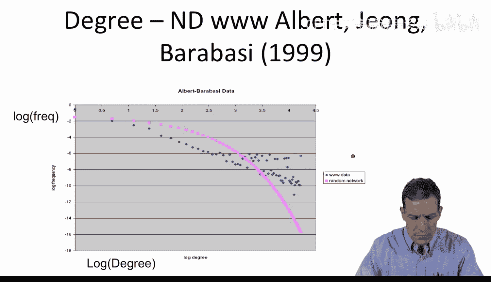

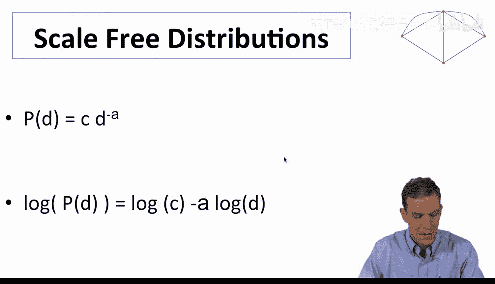

然而，许多现实世界的网络并不遵循简单的随机模式。它们的度分布常常表现出“厚尾”特性。

“厚尾”意味着什么？
*   与泊松分布相比，现实网络中拥有极高连接数（“枢纽”节点）和极低连接数的节点数量远超预期。
*   而拥有接近平均连接数的节点数量则相对较少。
*   这种模式在许多系统中都存在，如论文引用网络、财富分布、城市人口规模等。

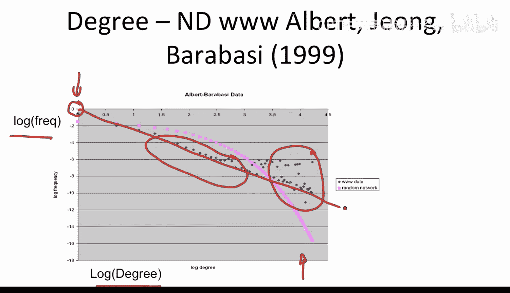

一个著名的例子是Albert-László Barabási等人对万维网的研究。他们绘制了网页连接数的分布图（取对数坐标），发现：
*   实际数据（蓝色）在两端（高连接数和低连接数）都高于随机网络的预测（粉色）。
*   在对数坐标中，数据点近似呈一条直线。这暗示其分布可能遵循**幂律分布**。

幂律分布的公式通常表示为：
**公式：**
```
P(degree = d) ∝ d^(-γ)
```
其中 `γ` 是一个常数。取对数后，得到 `log(P) ∝ -γ * log(d)`，这正是对数坐标中呈直线的原因。这种分布被称为“无标度”的，因为其形状在不同尺度下看起来相似。

---

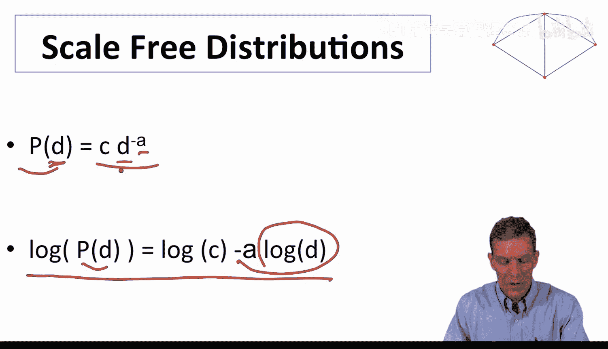

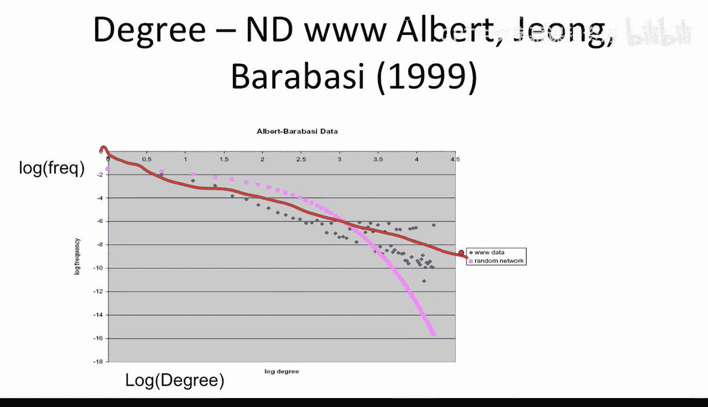

## 对比案例：高中恋爱网络

并非所有现实网络都呈现无标度特性。让我们看一个反例：Bearman, Moody和Stovel研究的高中恋爱关系网络。

在这个网络中：
*   节点代表学生，连接代表他们在调查期间存在恋爱关系。
*   网络结构包含许多两人配对、一个较大的分支和一些小分支。
*   其度分布与随机网络模型的预测非常吻合，并未显示出明显的“厚尾”特征。

这个对比告诉我们：
*   不同网络的度分布可以具有截然不同的性质。
*   有些网络（如万维网）的链接形成机制可能不是随机的，而是存在“富者愈富”的偏好连接机制。
*   而有些网络（如这个特定的恋爱网络）的链接模式则更接近随机形成。


---

## 总结

本节课中我们一起学习了网络分析中的一个核心概念——度分布。
*   我们首先介绍了在Erdős–Rényi随机网络中，度分布遵循二项分布，并可用泊松分布近似。
*   接着，我们探讨了现实网络中常见的“厚尾”现象，并引入了幂律分布（无标度网络）来描述这种具有大量“枢纽”节点的结构。
*   最后，通过对比万维网和高中恋爱网络，我们认识到度分布是区分不同类型网络、理解其底层形成机制的关键工具。

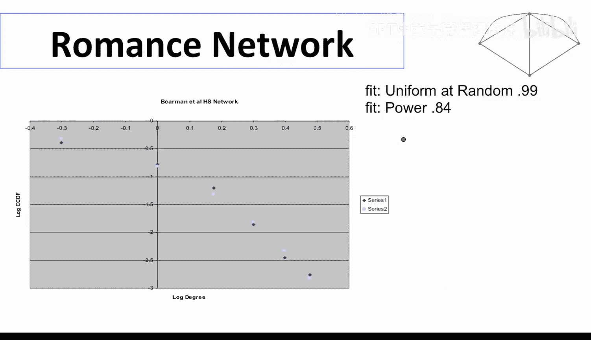

度分布是刻画网络密度和节点连接异质性的基本方法，在后续课程中我们将继续利用这一工具深入分析网络的各种性质。