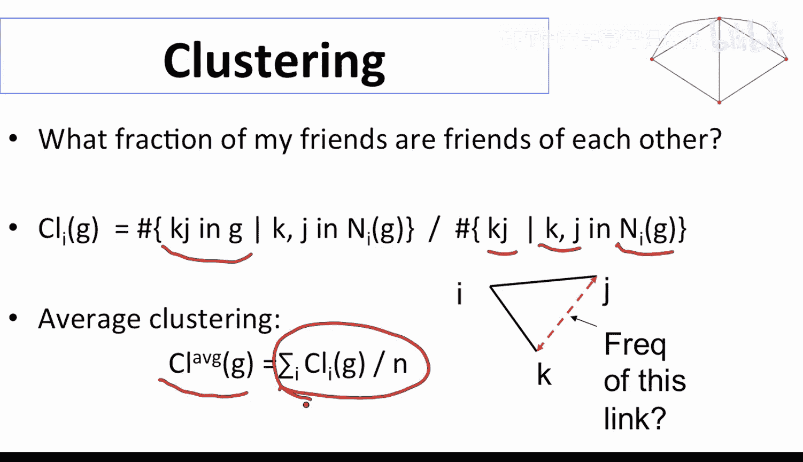
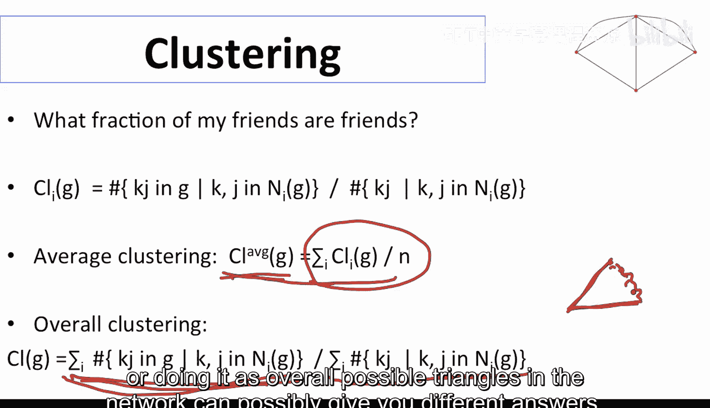
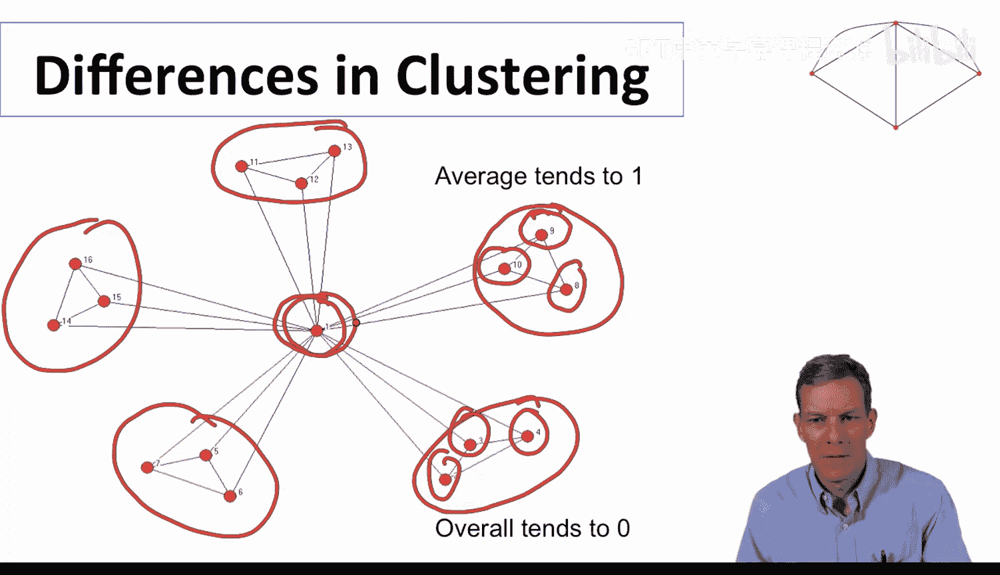
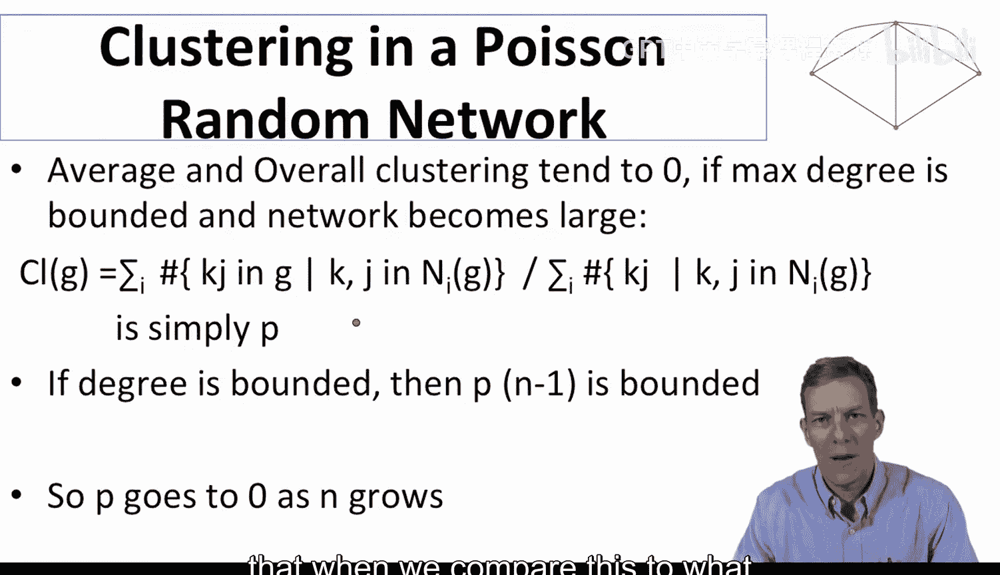
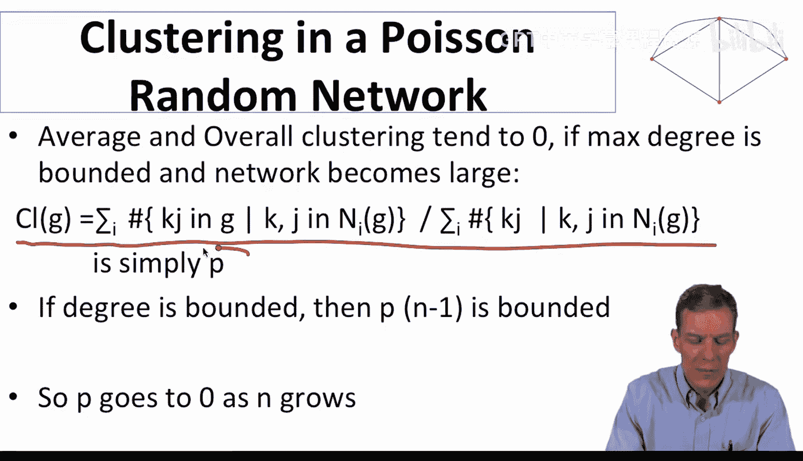
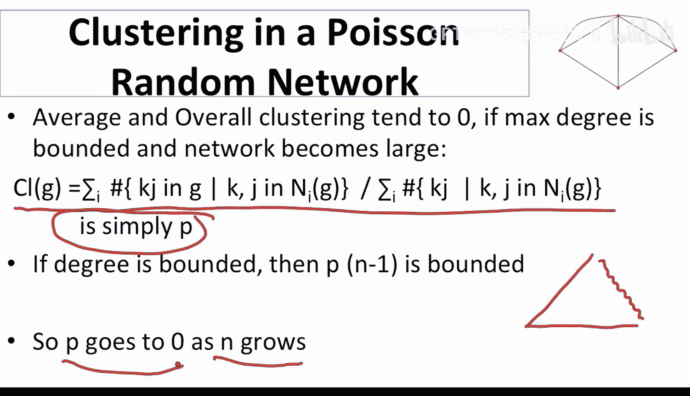
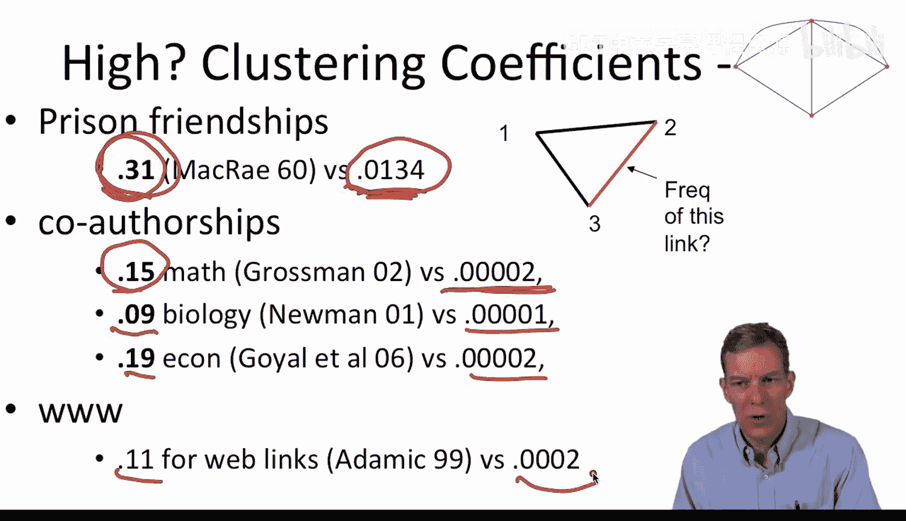
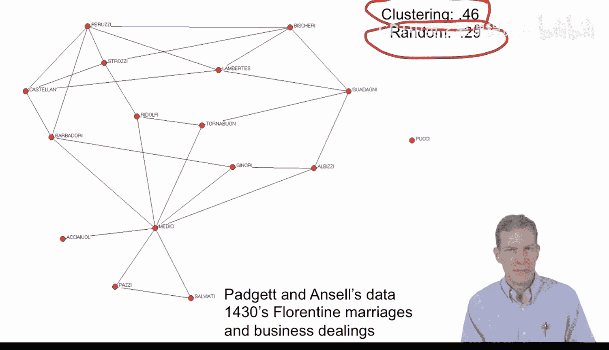

#  011：聚类系数 📊

在本节课中，我们将学习网络分析中的一个重要局部属性——聚类系数。我们将了解它的定义、两种不同的计算方法，以及它在真实网络数据中与随机网络的显著差异。

---

上一节我们讨论了网络的度分布等全局属性，本节中我们来看看一个更侧重于局部结构的属性：聚类系数。它关注的是网络中“朋友的朋友也是朋友”的程度。

## 定义与计算

对于一个给定的节点 `i`，其聚类系数衡量的是其邻居节点之间相互连接的程度。具体来说，我们观察节点 `i` 的所有邻居，计算这些邻居之间实际存在的连接数，与所有可能存在的连接数之比。

**节点 `i` 的聚类系数公式**：
`C_i = (节点i的邻居之间实际存在的边数) / (节点i的邻居之间所有可能存在的边数)`

其中，分母的计算公式为 `k_i * (k_i - 1) / 2`，`k_i` 是节点 `i` 的度（即邻居数量）。

以下是两种主要的网络聚类系数计算方法：

*   **平均聚类系数**：首先计算网络中每个节点的聚类系数 `C_i`，然后对所有节点的 `C_i` 取算术平均值。这种方法平等地对待每个节点。
*   **整体聚类系数**：不先按节点计算，而是直接在整个网络中统计所有“三角形”结构。具体是计算所有“已连接的两条边共享一个节点”的三元组中，能形成完整三角形的比例。这种方法更侧重于网络中的连接模式本身。

这两种计算方法可能给出不同的结果，因为它们衡量的是网络不同方面的特性。

## 聚类系数：随机网络 vs. 真实网络

在均匀随机网络（如G(n, p)模型）中，任意两个节点之间以固定概率 `p` 连接。因此，无论采用平均还是整体计算，其聚类系数都约等于连接概率 `p`。

**随机网络聚类系数**：`C_random ≈ p`

对于大型稀疏网络（节点数 `n` 很大，平均度相对较小），`p` 会非常小，因此随机网络的聚类系数趋近于零。

然而，当我们观察各种真实世界的社会与经济网络数据时，会发现其聚类系数远高于同等规模的随机网络。以下是几个例子：

*   **监狱友谊网络**：观测聚类系数为 0.31，而随机网络预期值仅为 0.01。
*   **数学合作作者网络**：观测值为 0.15，随机预期值极低。
*   **佛罗伦萨家族联姻与商业网络**：观测值为 0.46，随机预期值为 0.29。

这些数据表明，真实网络中存在显著的“抱团”或“社区”倾向，朋友之间彼此认识的概率远高于随机连接。

---

本节课中我们一起学习了聚类系数，这是一个刻画网络局部紧密程度的核心指标。我们掌握了它的两种计算方法，并理解了真实网络通常比随机网络具有更高的聚类性，这揭示了社会连接中普遍存在的“传递性”特征。接下来，我们将把节点置于更丰富的背景中进行考察，学习更多有助于描述和分析网络特性的定义与工具。