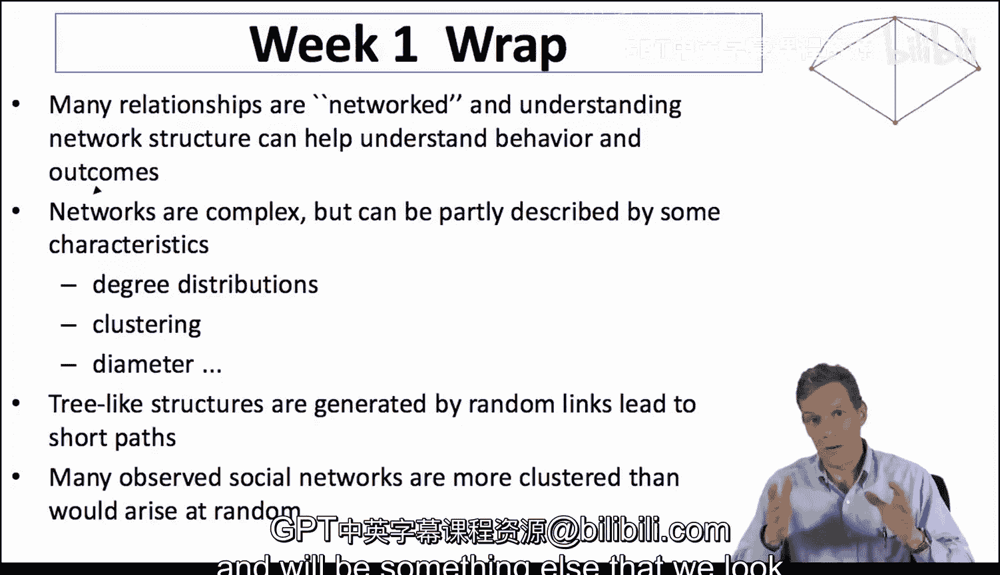

#  012：第一周总结 📚

在本节课中，我们将快速回顾第一周所涵盖的核心内容。我们将总结网络分析的基本概念、网络的关键描述性统计量，以及观察到的社会网络所具有的一些普遍特性。

## 网络的重要性与复杂性 🌐

我们首先讨论了一个核心观点：许多社会、政治、经济关系都是网络化的。无论是个人、公司、国家还是各类组织之间的互动，它们通常都嵌入在某种网络结构中。理解这些网络结构对于理解和预测结果与行为至关重要，这也是本课程后续部分将深入探讨的内容。

## 网络的描述性统计量 📊

网络非常复杂。同一组节点可以形成许多不同的网络。因此，我们需要借助一些简单但充分的统计量或摘要统计量来描述网络。以下是一些关键的网络描述指标：

*   **度分布**：它描述了网络中节点连接数的分布情况，能揭示网络的连接模式。
*   **聚类系数**：它衡量网络在局部层面的连接紧密程度，例如网络中三角形（即三个节点两两相连）的数量。
*   **直径**：它指网络中任意两个节点之间最短路径的最大长度，反映了网络的“大小”或信息传播的难易程度。

这些描述性指标将帮助我们追踪网络特性，并最终与网络如何影响行为以及从网络中涌现出的现象联系起来。

## 树状结构与短路径 🌲

我们探讨的另一个要点是：随机链接倾向于生成树状结构，而这种结构会导致非常短的路径。如果网络底层是简单的树状结构，那么分支过程会导致路径长度与节点数量呈**对数关系**，这远比线性增长要短。许多不同的网络形成过程实际上都会产生某种底层的树状结构，这自然导致了短路径的存在。

## 观察到的社会网络特性 👥

最后，许多观察到的社会网络具有一些简单的共性。特别是在局部层面，我们倾向于看到非常密集的连接。例如，在观察友谊关系或社交环境中的各类互动时，我认识的许多人彼此也互相认识，反之亦然。这种特性在信息传播以及人们如何相互参照以选择行为方面将变得非常重要，这也是我们后续课程中会多次探讨的内容。

## 总结 📝

本节课中，我们一起回顾了第一周的核心内容。我们学习了网络在各类关系中的普遍性及其重要性，认识了描述网络复杂性的关键统计量（如度分布、聚类系数和直径），理解了树状结构如何自然导致短路径，并了解了观察到的社会网络所具有的局部高密度连接特性。这些基础概念为我们后续深入分析网络如何影响行为与结果奠定了坚实的基础。