#  013：同质性 🧑‍🤝‍🧑

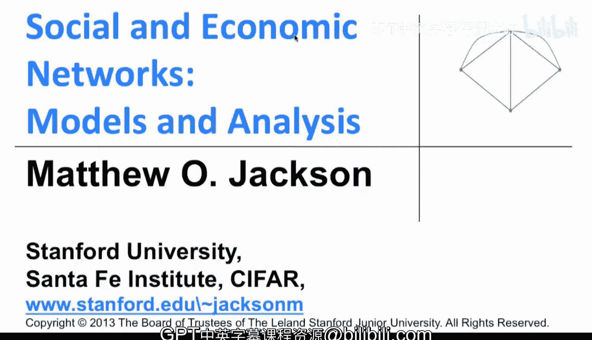

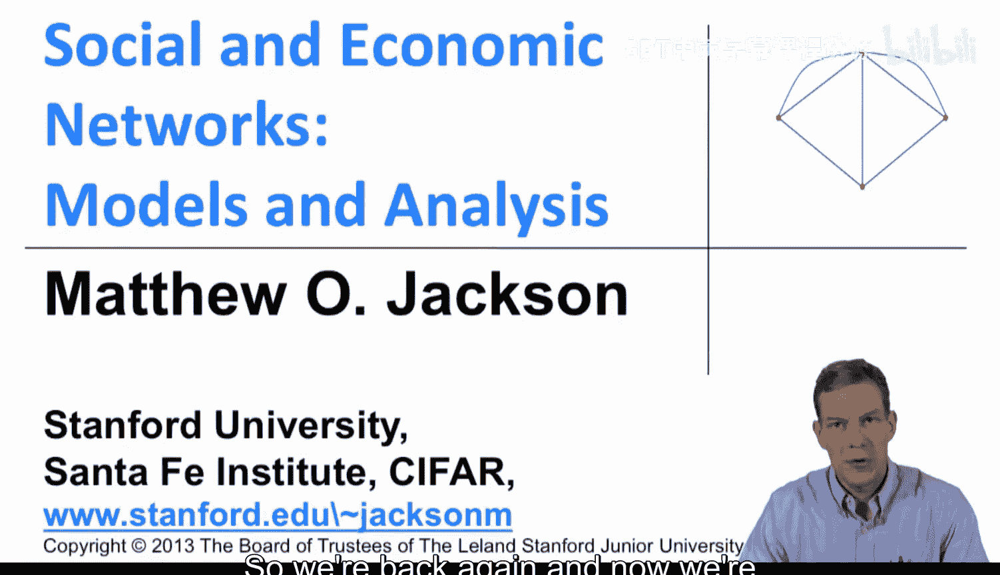

在本节课中，我们将要学习网络分析中的一个核心概念——同质性。我们将了解什么是同质性，通过数据观察其表现形式，并探讨其在理解网络结构中的重要性。

## 概述

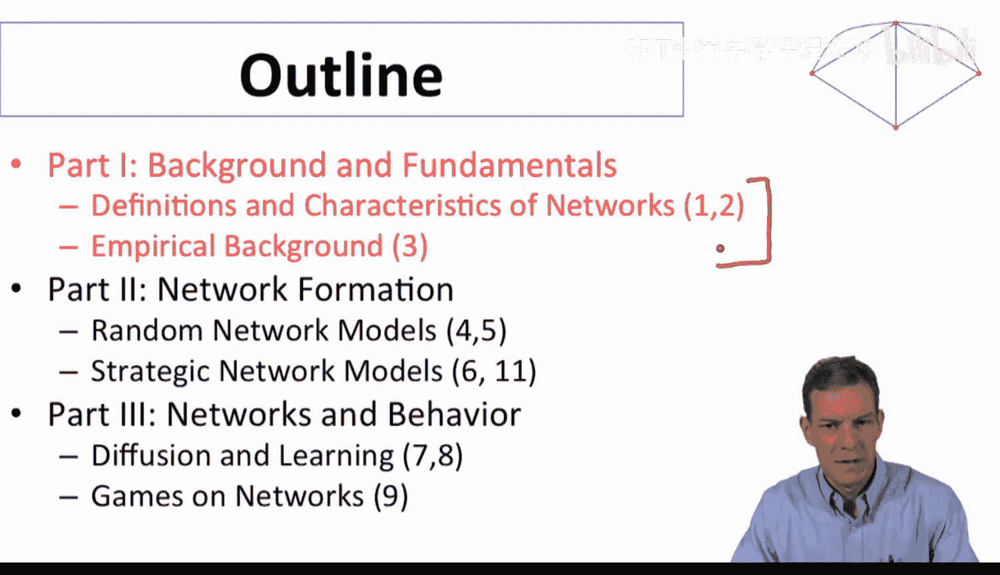

同质性指的是网络中具有相似属性的节点倾向于彼此连接的现象。这种现象在人类互动中普遍存在，并深刻影响着网络的结构与动态。

## 同质性的定义与背景

上一节我们介绍了网络的基本结构和表示方法，本节中我们来看看节点属性如何影响网络连接模式。

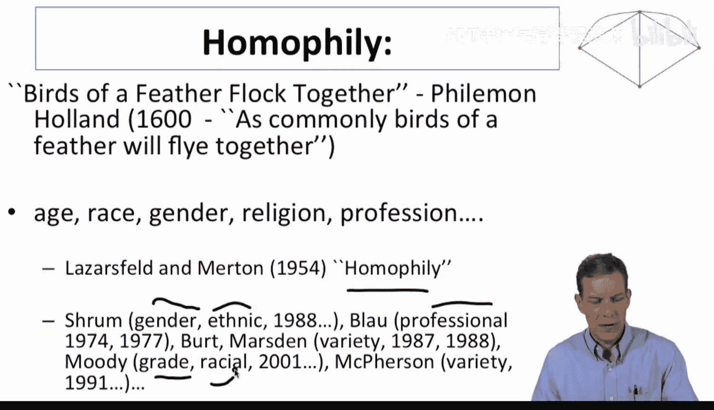

同质性描述了当我们在网络中考虑节点属性时，会发现相连的节点彼此相似。这种现象在人类互动中已被认知了数千年。例如，菲拉蒙·霍兰德在1600年曾写道：“物以类聚，人以群分”。相似类型的个体倾向于相互交往。

这种现象在许多维度上都被观察到，例如：
*   年龄
*   种族
*   性别
*   宗教
*   职业

“同质性”这一术语本身由拉扎斯菲尔德和默顿在1954年的一篇论文中提出，并已在众多研究中得到证实。

## 同质性的实证证据

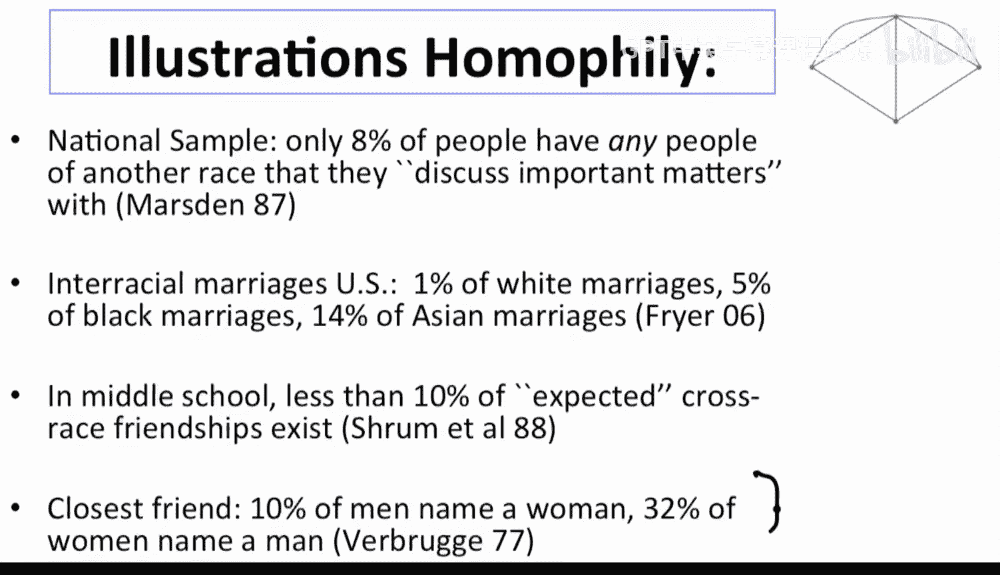

以下是来自不同研究的同质性数据示例：

*   彼得·马斯登的一项美国全国性调查显示，只有**8%**的人会提名不同种族的人来讨论重要事务。这个比例远低于如果人们不考虑种族、随机提名时所预期的水平。
*   在美国的跨种族婚姻研究中，罗兰·法尔发现：**1%**的白人与非白人结婚，**5%**的黑人与非黑人结婚，**14%**的亚裔与非亚裔结婚。这些数字虽然因亚群体规模而异，但都低于随机均匀匹配的预期水平。
*   在高中友谊研究中，跨种族友谊的比例低于**10%**的预期值。
*   在“最亲密朋友”的调查中，**10%**的男性会提名一位女性，**32%**的女性会提名一位男性。这里存在一些不对称性，但这两个数字同样远低于无性别偏好时预期的**50%**左右。

## 网络可视化中的同质性

我们可以通过可视化更直观地观察同质性。下图展示了一所高中社交网络，节点根据学生的自我报告种族进行着色（蓝色代表黑人，红色代表西班牙裔，黄色代表白人）。

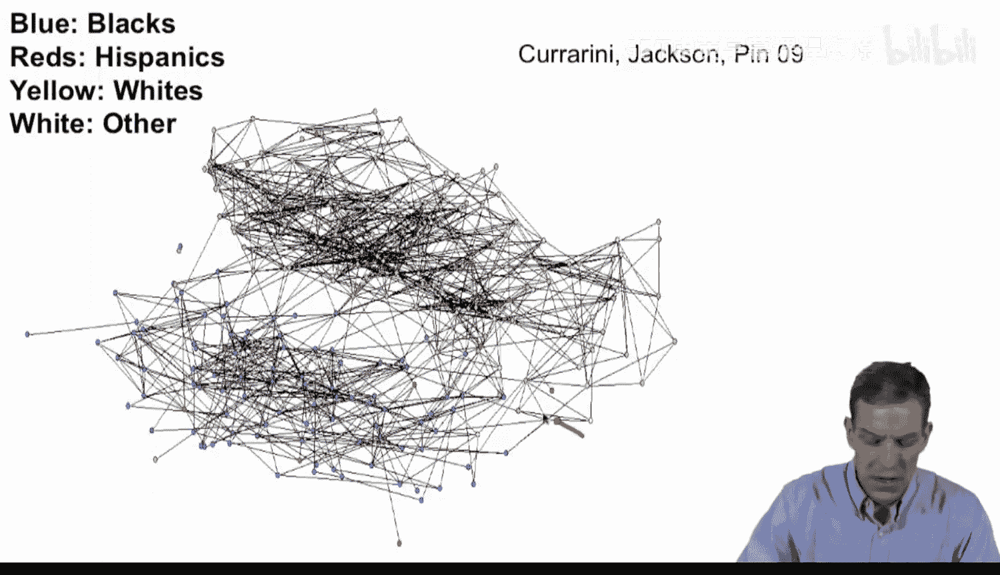

该图使用“弹簧算法”绘制，该算法模拟连接节点的“弹簧”将彼此拉近。从图中可以清晰地看到，大部分黑人聚集在一个区域，大部分白人聚集在另一个区域，显示出强烈的种族隔离模式。

数据进一步证实了这一点：
*   白人在该高中占**52%**，但其**86%**的友谊是与白人建立的。
*   黑人占**38%**，但其**85%**的友谊是与黑人建立的。
*   西班牙裔占**5%**，但其仅有**2%**的友谊是与西班牙裔建立的。

小群体往往表现出与大规模群体不同的特征，但我们观察到了强烈的隔离模式。

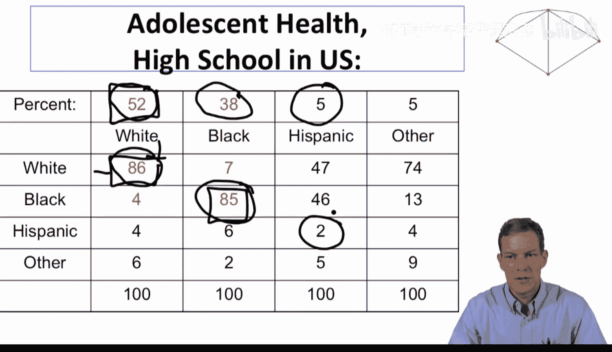

## 不同关系强度下的同质性

上一节我们基于“提名朋友”的数据观察了同质性，本节中我们来看看当关系定义更严格时，模式有何变化。

如果我们考察更紧密的关系，例如将“友谊”定义为“一周内至少共同进行过三项活动”（如一起学习、共进午餐、一起上课等），网络会变得更稀疏，关系强度更高。

在这种更强的定义下，我们看到了**更严重的隔离**。跨种族的关系数量极少，可能只有寥寥数条。这表明，随着关系强度的增加，同质性效应可能更加明显。

这种现象并非美国高中独有。一项对荷兰高中的研究显示：
*   荷兰裔学生占人口的**65%**，其**79%**的友谊是与荷兰裔建立的。
*   摩洛哥裔学生占人口的**5%**，其**27%**的友谊是与摩洛哥裔建立的。

观察矩阵对角线上的数字（代表同群体内友谊的比例），它们普遍高于该群体在总人口中的比例，这再次印证了人们更倾向于与同类个体建立连接。

## 同质性的成因与重要性

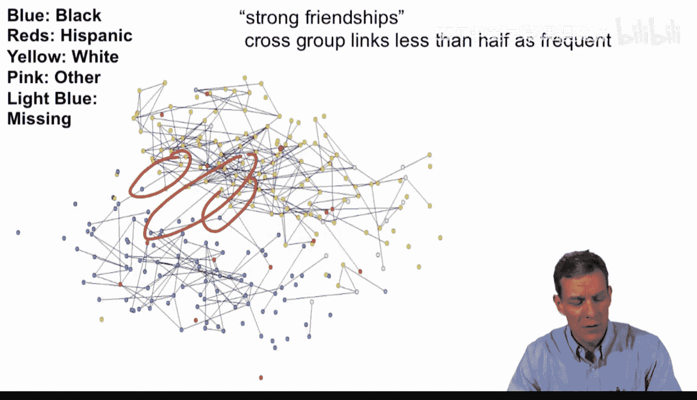

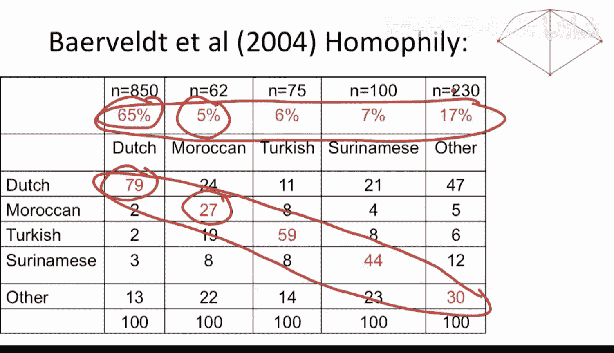

当我们思考同质性时，存在多种可能的解释：

*   **机会受限**：班级结构或相遇机会可能因种族而产生偏差，导致你更有可能遇到同类个体。
*   **收益与成本**：共同的理解、文化或语言可能使同类人之间的互动更容易、收益更高。
*   **社会压力**：来自群体内部或外部的社会压力可能影响交友选择。
*   **社会竞争**：群体间的竞争也可能导致隔离。

理解同质性至关重要，因为它揭示了网络结构依赖于节点特性。同质性结构影响着许多社会进程：

*   理解为何在隔离的网络中**学习**或**信息传播**会遇到障碍。
*   理解为何某些**观点**只在一个群体内循环，而无法传播到另一个群体。
*   理解**传染**（如疾病、信息、行为）何时会波及整个人口，何时又只会影响部分群体。

因此，一旦我们开始理解网络结构与行为之间的关系，理解同质性结构对于理解一系列社会现象就变得非常重要。探究这些模式背后的原因——我们为何看到这种分离与隔离——本身也是一个有趣的课题。

## 总结

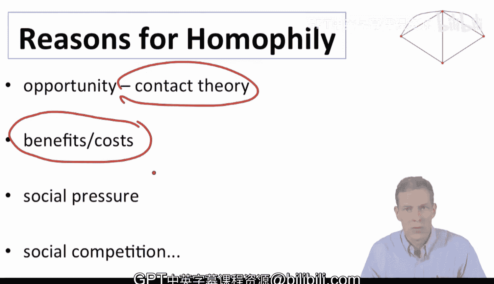

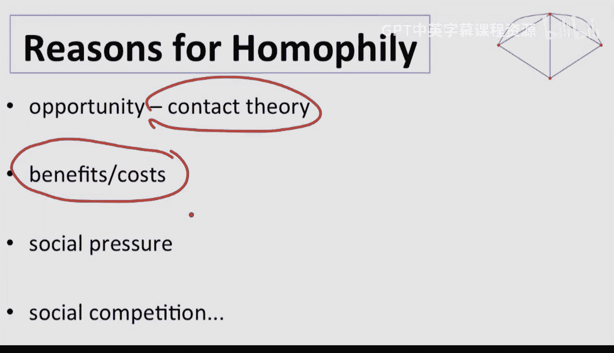

本节课中我们一起学习了同质性的概念。我们了解到，同质性是指网络中相似节点倾向于相互连接的现象，并通过多项研究和可视化案例观察了其在种族、性别等维度上的表现。我们还探讨了关系强度对同质性的影响，以及同质性产生的多种可能原因。理解同质性对于分析网络结构如何影响信息传播、学习和社会动态等过程具有基础性意义。