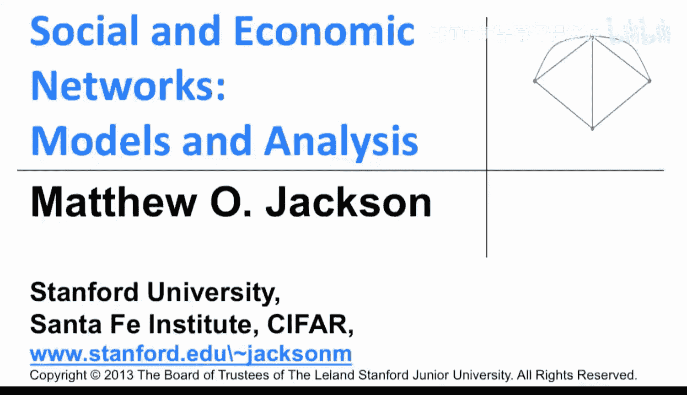
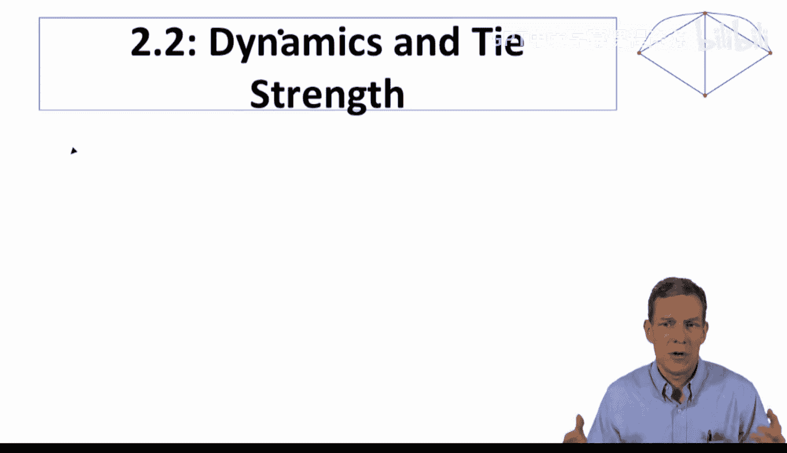
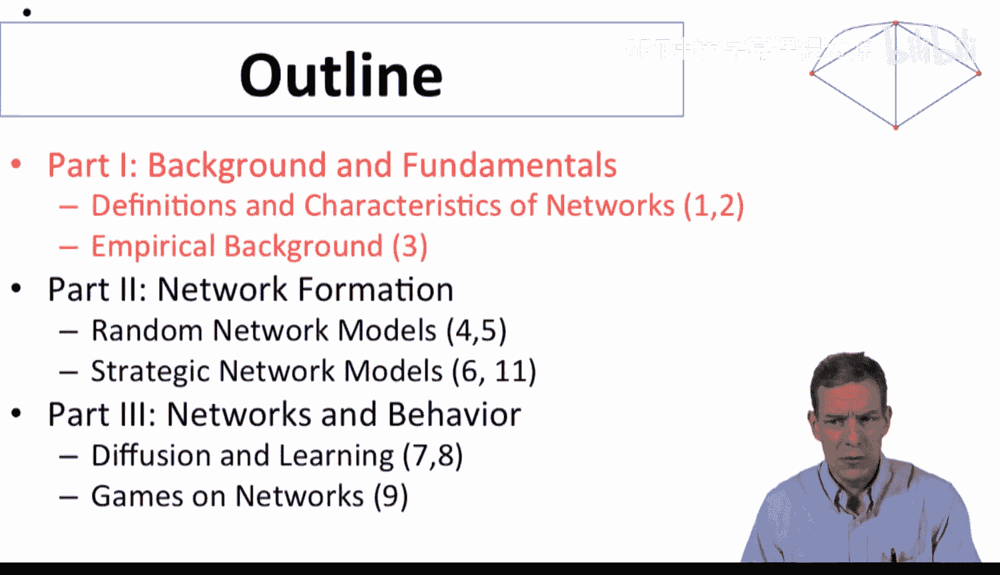
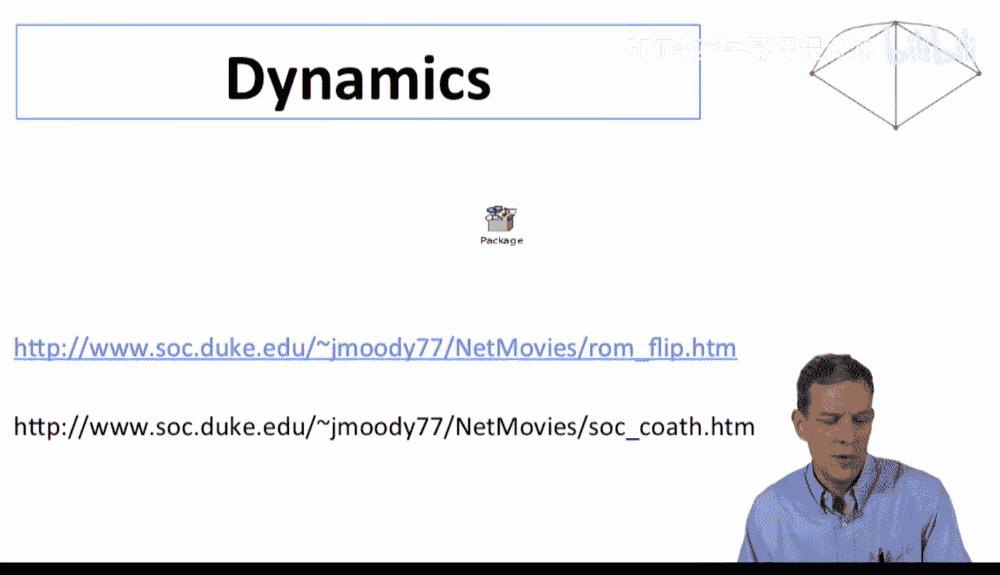
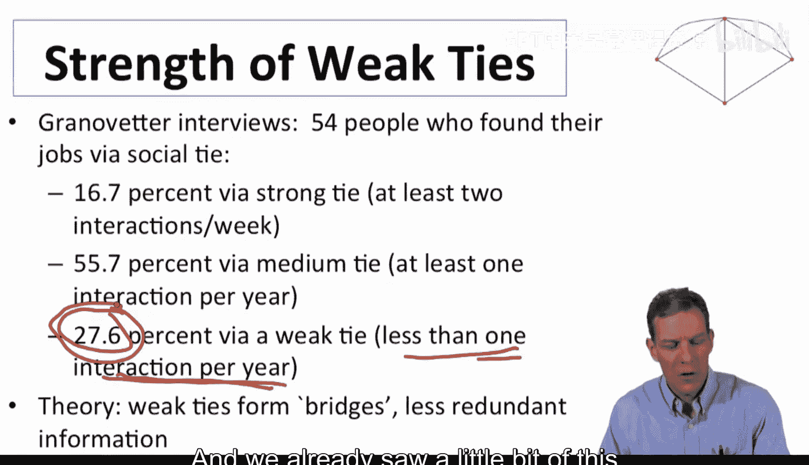
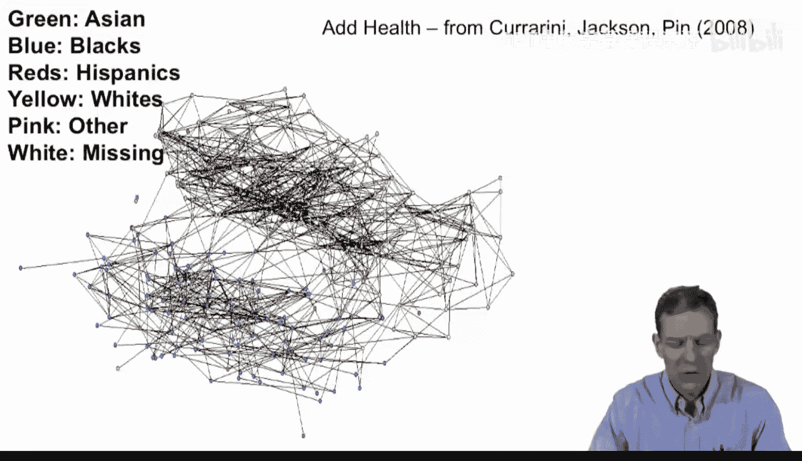
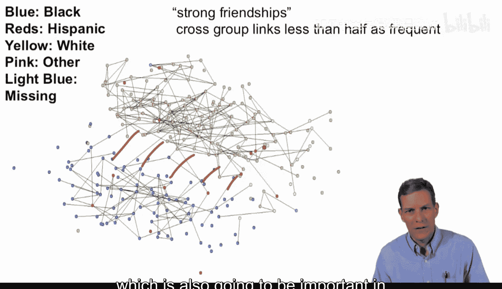

社会与经济网络：建模与分析：2：动态性与关系强度

在本节中，我们将探讨网络的两个重要特性：动态变化与关系强度。我们将看到，现实中的网络并非一成不变，节点间的关系也并非只有“有”或“无”两种状态。

上一节我们介绍了网络的基本结构与表示方法。本节中，我们来看看网络如何随时间变化，以及如何衡量节点间关系的强弱。

### 网络的动态性

现实世界中的网络是动态变化的。关系会形成、消失、增强或减弱。理解这种动态性对于研究信息传播、疾病传染等现象至关重要。

以下是关于网络动态性的关键点：

*   关系并非同时存在：例如，在高中恋爱关系数据中，并非所有关系都在同一时间点存在。人们在不同时间与不同的人建立关系。
*   动态性是研究重点：随着数据日益丰富，如何编码和处理动态网络数据是一个活跃的研究领域。
*   动态影响实际过程：个体互动的频率对流感传播有重要影响。当我们讨论产品扩散等现象时，沟通模式和旅行模式的动态性也扮演着关键角色。

目前我们对此仅作简要介绍，后续课程将通过更多实例进行探讨。

### 关系的强度

我们之前简要讨论过，节点间的关系并非简单的0（无关系）或1（有关系）。关系的强度各不相同。

一个关于关系强度的经典研究是格兰诺维特在20世纪70年代初进行的“弱关系的力量”研究。他采访了一系列人，询问他们如何找到工作。

以下是该研究的关键发现：

*   **强关系**（每周至少互动两次）：约16%的人通过强关系找到工作。
*   **中等关系**（每年至少互动一次，但每周不足两次）：约56%的人通过中等关系找到工作。
*   **弱关系**（每年互动少于一次）：约27.6%的人通过弱关系找到工作。

这项研究指出，尽管弱关系的互动频率很低，但它们提供了大量非冗余信息，在求职等过程中可能比强关系更重要。

### 理解弱关系的重要性

为什么看似不紧密的弱关系可能很重要？以下是几个原因：

*   **数量差异**：一个人拥有的强关系数量可能只有几十个，而弱关系可能多达数千个。即使单个弱关系提供信息的概率低，但其庞大的基数使其总体贡献不可忽视。
*   **结构洞桥梁**：弱关系更可能成为连接网络中不同群体的“桥梁”。在我们之前看过的健康数据中，当只考虑“提名朋友”这种较弱的关系时，不同种族群体间存在连接。但当引入“经常一起玩”这种更强的关系定义后，跨种族的连接大多消失了。这表明，**弱关系在连接网络的不同组成部分（即充当“结构洞”的桥梁）方面可能更常见**。
*   **信息非冗余性**：与你互动较少的人，可能将你连接到一个你通常无法接触的世界，提供与你日常圈子不同的、非冗余的信息。

因此，弱关系在信息传播和机会获取中可以扮演非常重要的角色。

### 本节总结

本节课中我们一起学习了网络的动态性与关系强度。

*   我们认识到网络会随时间动态变化，关系的形成与消失是常态。
*   我们了解了关系具有不同的强度，并重点探讨了“弱关系的力量”这一经典概念及其重要性。
*   我们明白了弱关系因其数量庞大和充当“结构洞”桥梁的特性，能够在信息传播中发挥关键作用。

接下来，我们将开始聚焦于网络中的单个节点，探讨如何衡量节点在网络中的位置，这对于理解扩散、传染以及个体行为至关重要。