#  015：中心性度量 📊

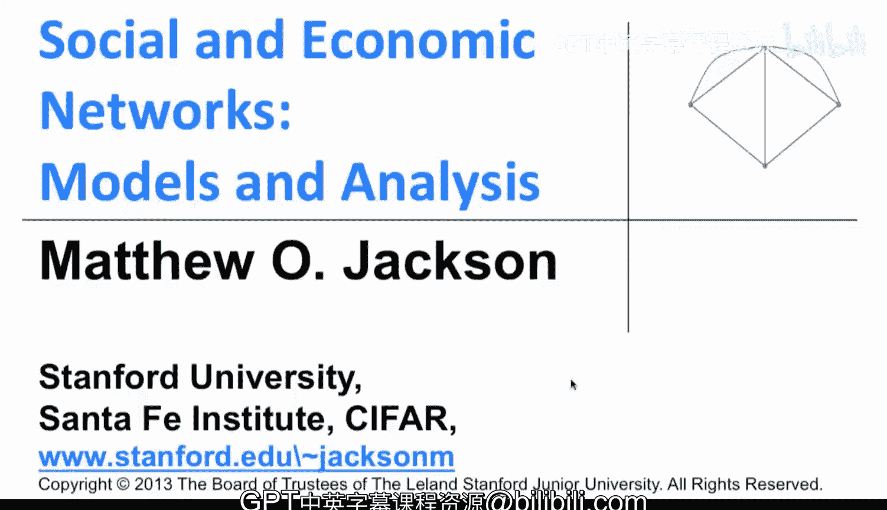

在本节课中，我们将学习如何衡量网络中节点的重要性或中心性。我们将探讨几种不同的中心性度量方法，理解它们各自捕捉了节点在网络中的哪些不同方面。

---

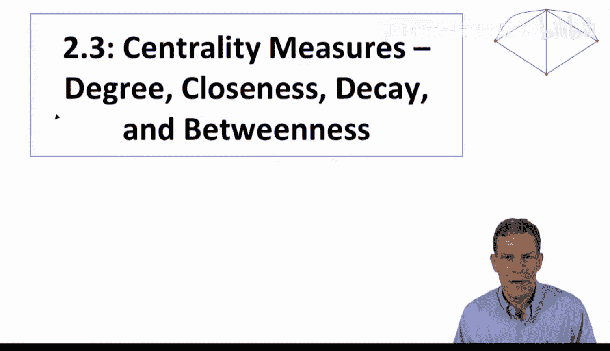

上一节我们介绍了网络的基本结构特征，如度分布和路径长度。本节中，我们来看看如何具体衡量单个节点在网络中的位置和重要性。

中心性度量旨在描述节点在网络中的位置，帮助我们判断一个节点是否重要、有影响力或处于中心地位。这不仅仅是看它有多少连接，还要考虑其与网络中其他部分的相对关系。

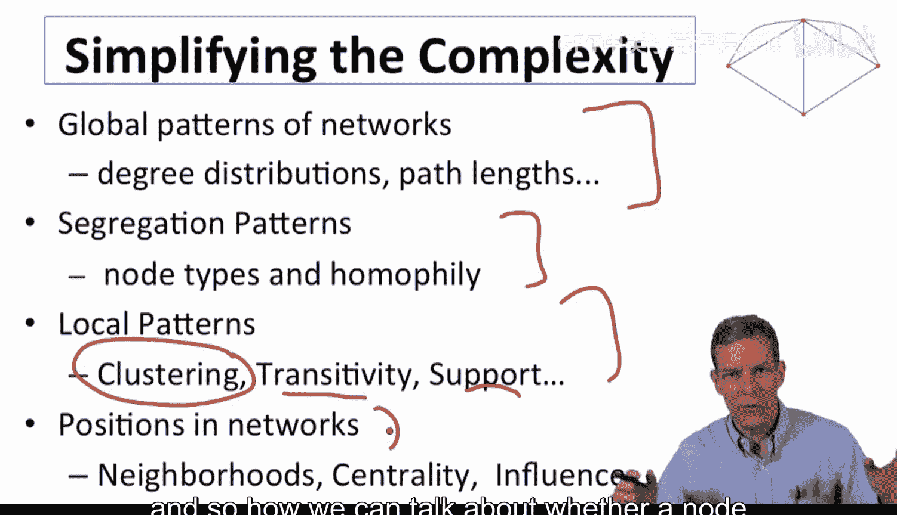

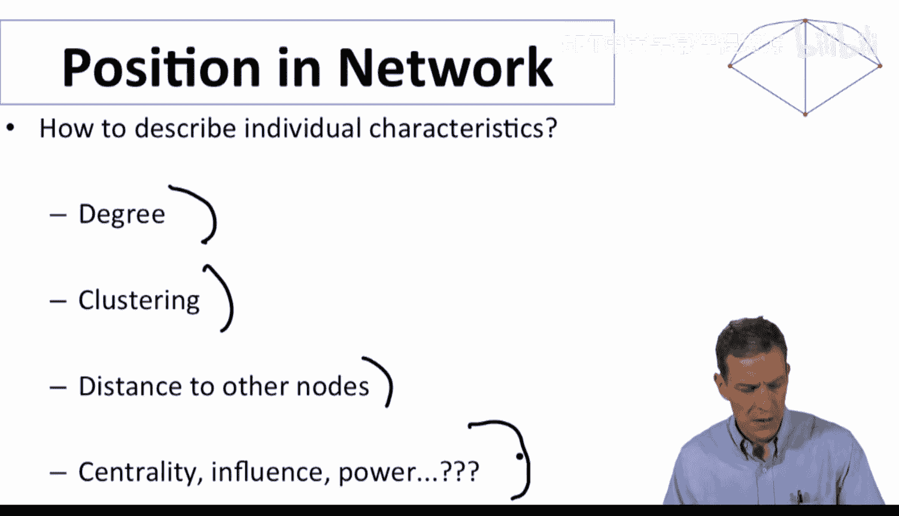

以下是几种主要的中心性度量概念：

*   **度中心性**：衡量节点的基本连接数量。
*   **接近中心性**：衡量节点到网络中所有其他节点的平均距离。
*   **中介中心性**：衡量节点作为其他节点之间“桥梁”或“中介”的程度。
*   **特征向量中心性**：衡量节点的重要性，这种重要性取决于其邻居节点的重要性。

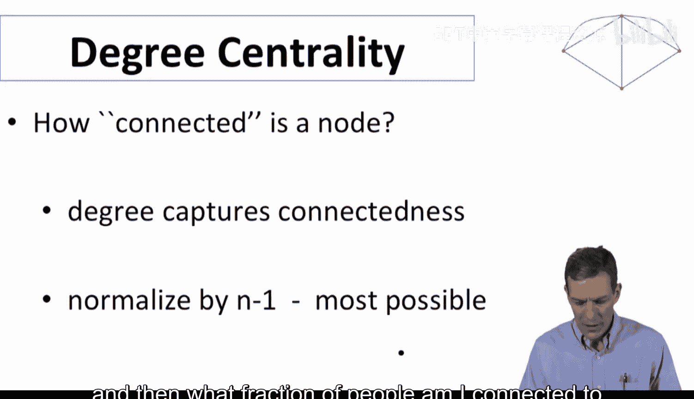

需要强调的是，没有一种度量是绝对“最好”的。它们捕捉的是节点位置的不同方面，在不同的应用场景下，其重要性也不同。

---

## 度中心性 🔗

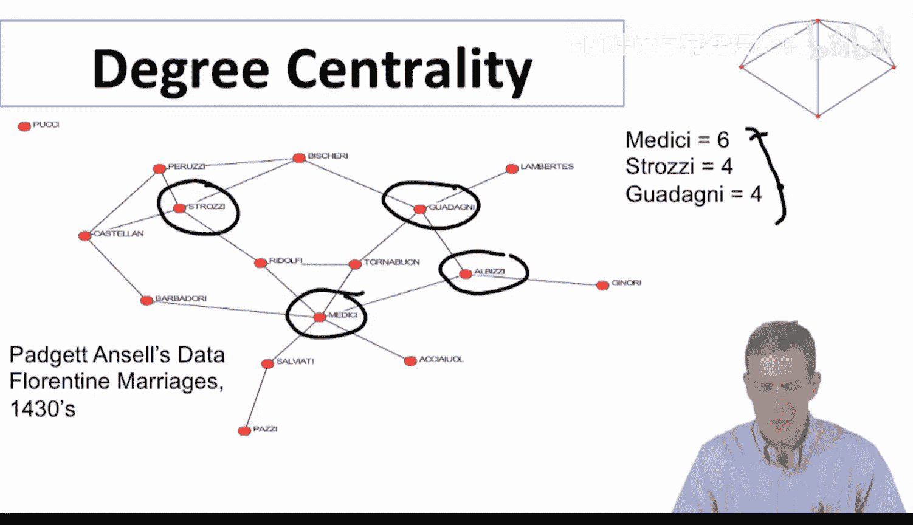

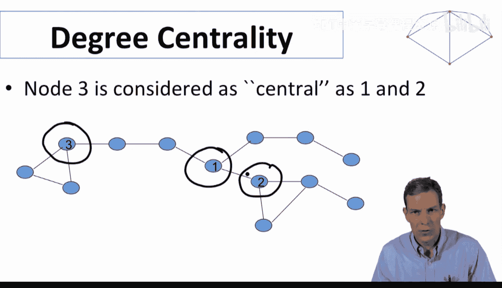

最基础的中心性度量就是节点的**度**，它直接衡量了一个节点有多少连接。为了将其标准化到0到1之间，我们可以将其除以最大可能的连接数 `(n-1)`。

**公式**：`C_D(i) = d_i / (n-1)`

其中 `d_i` 是节点 `i` 的度，`n` 是网络中的节点总数。

例如，在我们之前看过的佛罗伦萨家族网络中，美第奇家族的度为6，而其他重要家族的度在3到4之间。这表明美第奇家族在直接连接数量上更具优势。

然而，度中心性有其局限性。它只关注节点的“本地邻居”数量，而忽略了节点在整个网络拓扑结构中的位置。例如，一个处于网络边缘但连接了几个节点的“枢纽”，与一个处于网络核心但连接数相同的节点，其重要性可能截然不同。

---

上一节我们介绍了度中心性，它关注的是直接连接。本节中我们来看看另一类度量，它们关注的是节点与网络中其他所有节点的“距离”。

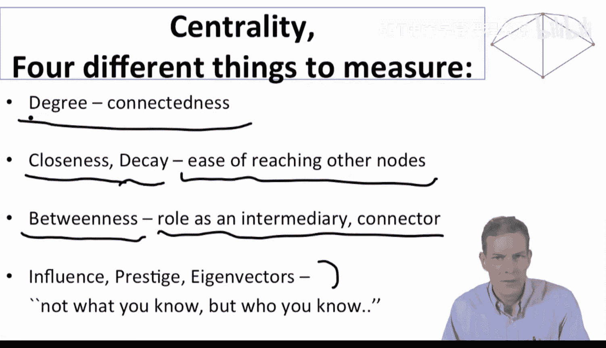

## 接近中心性与衰减中心性 📏

**接近中心性**的核心思想是：一个节点越“中心”，它到网络中所有其他节点的平均距离就越短。其定义基于节点间最短路径的长度。

**公式**：`C_C(i) = (n-1) / (∑_{j≠i} d(i, j))`

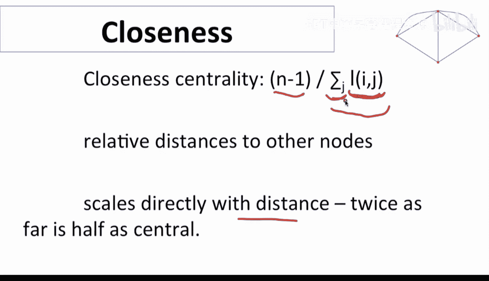

其中 `d(i, j)` 是节点 `i` 到节点 `j` 的最短路径长度。分母是节点 `i` 到所有其他节点的距离之和。这个值越大，表示节点 `i` 越“接近”其他所有节点。

在佛罗伦萨家族网络的例子中（忽略孤立节点），计算出的接近中心性数值在不同家族间有所区分，美第奇家族依然表现较好，但优势不像度中心性那么绝对。

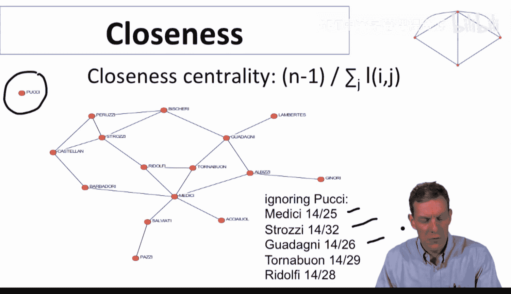

**衰减中心性**是接近中心性的一个变体。它假设节点从连接中获取的价值会随着距离的增加而衰减。例如，直接朋友的价值是 `δ`，朋友的朋友的价值是 `δ^2`，依此类推。

**公式**：`C_{Decay}(i) = ∑_{j≠i} δ^{d(i, j)}`

参数 `δ` (0 < δ < 1) 控制着衰减的速度。当 `δ` 接近1时，它近似于计算节点可到达的所有节点数；当 `δ` 接近0时，它几乎退化为度中心性，只强调直接连接。

---

上一节我们讨论了基于距离的中心性度量。本节中我们来看看一个非常不同的概念：节点作为“中介”或“桥梁”的重要性。

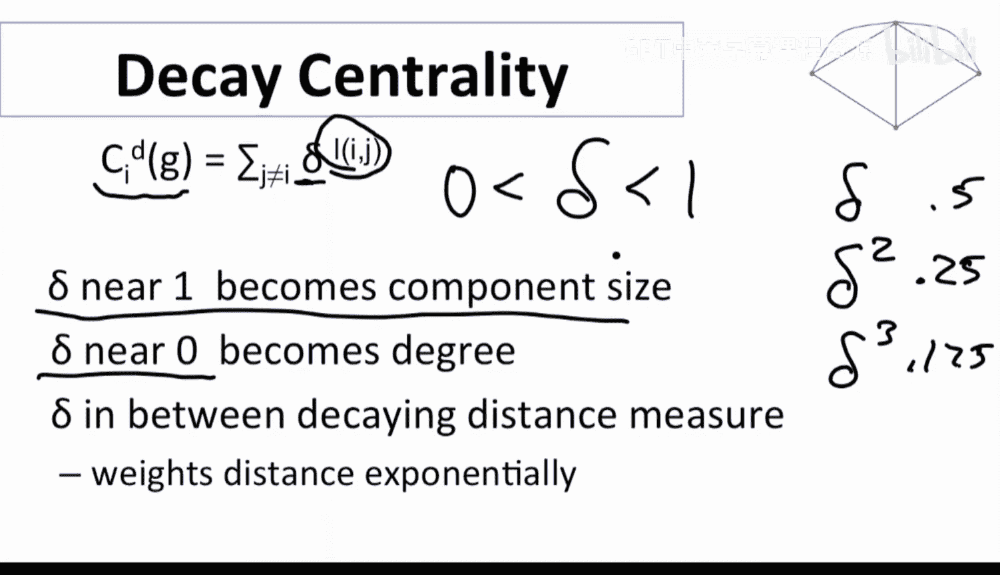

## 中介中心性 🌉

**中介中心性**衡量的是一个节点位于其他节点对之间最短路径上的频率。如果一个节点是许多节点对之间通信的必经之路，那么其中介中心性就很高。

其正式定义（由林恩·弗里曼提出）如下：

**公式**：
`C_B(k) = (2 / ((n-1)(n-2))) * ∑_{i≠j, i≠k, j≠k} (g_{ij}(k) / g_{ij})`

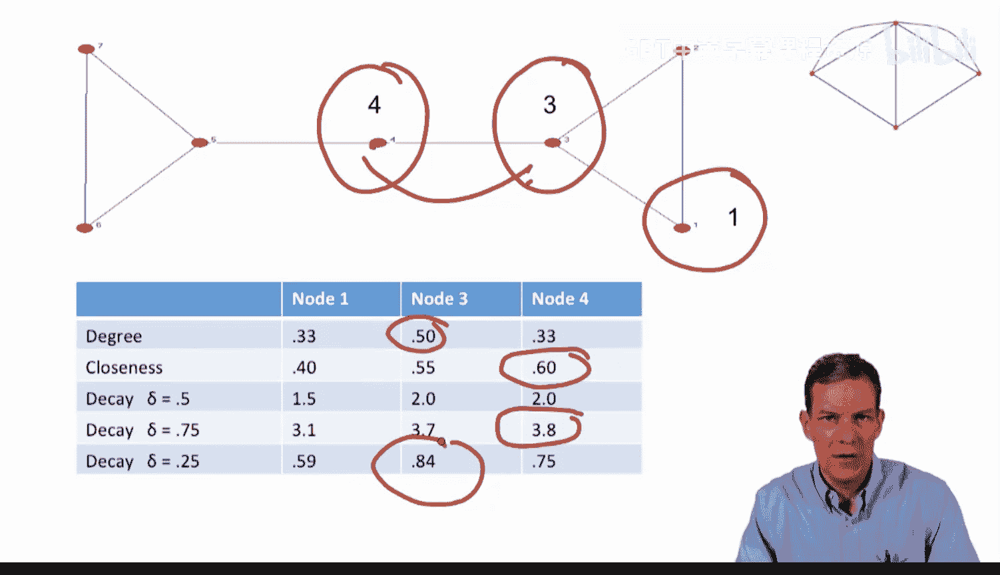

其中：
*   `g_{ij}` 是节点 `i` 和 `j` 之间最短路径的总数。
*   `g_{ij}(k)` 是这些最短路径中经过节点 `k` 的路径数量。
*   前面的系数是对所有可能的节点对 `(i, j)`（不包括 `k`）进行归一化。

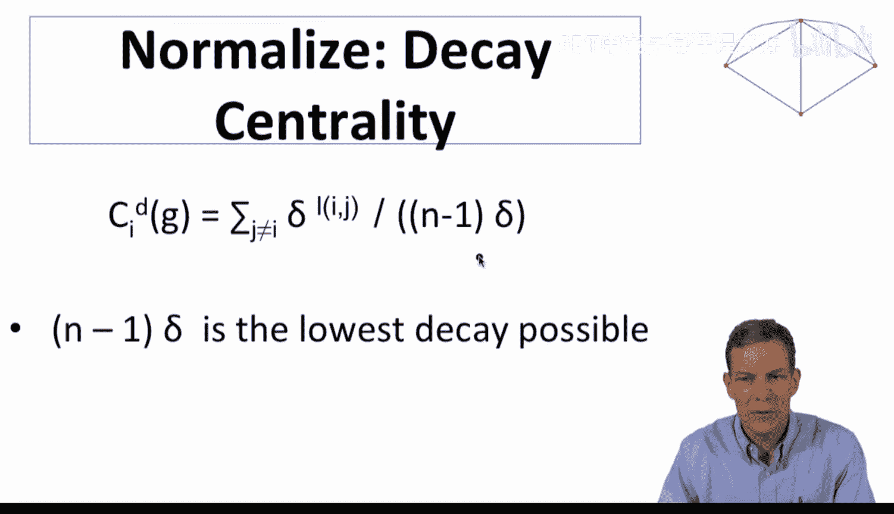

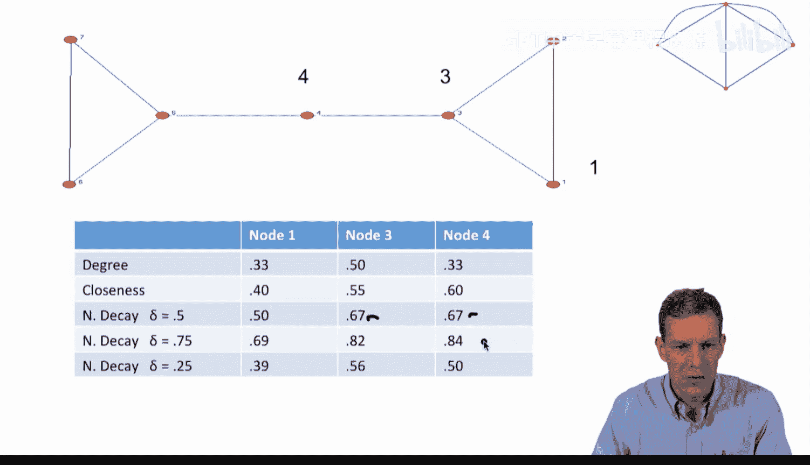

这个度量捕捉的是节点的“桥梁”作用。在佛罗伦萨家族网络中，美第奇家族的中介中心性远高于其他家族。这表明，如果其他家族想要彼此联系或交易，很可能需要经过美第奇家族作为中介，这赋予了美第奇家族巨大的潜在权力和影响力。

---

## 不同度量的对比 🔄

让我们通过一个简单的“领结”形网络来对比这些不同的中心性度量。

**网络示例**：
*   节点3：拥有3个直接连接（高度中心性）。
*   节点4：处于网络中心，连接两个部分。
*   节点1/2/6/7：处于网络边缘。

**计算结果对比**：
*   **度中心性**：节点3最高。
*   **接近中心性**：节点4最高，因为它到所有节点的平均距离最短。
*   **衰减中心性**：取决于 `δ` 的取值。`δ` 较大时（看重间接连接），节点4占优；`δ` 较小时（只看重直接连接），节点3占优。
*   **中介中心性**：节点4最高，因为它是连接网络左右两部分的唯一桥梁；节点1、2、6、7的中介中心性为0。

这个例子清晰地表明，不同的中心性度量从不同角度定义了“重要性”，并可能将“最重要”的标签赋予不同的节点。

---

本节课中我们一起学习了四种核心的中心性度量方法：
1.  **度中心性**：衡量直接连接的数量。
2.  **接近中心性与衰减中心性**：衡量到网络中其他节点的“距离”或“可到达性”。
3.  **中介中心性**：衡量作为其他节点之间“桥梁”的重要性。

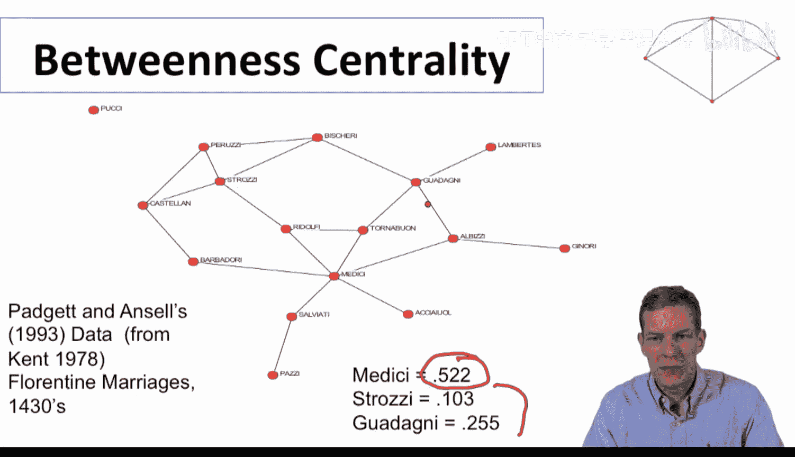

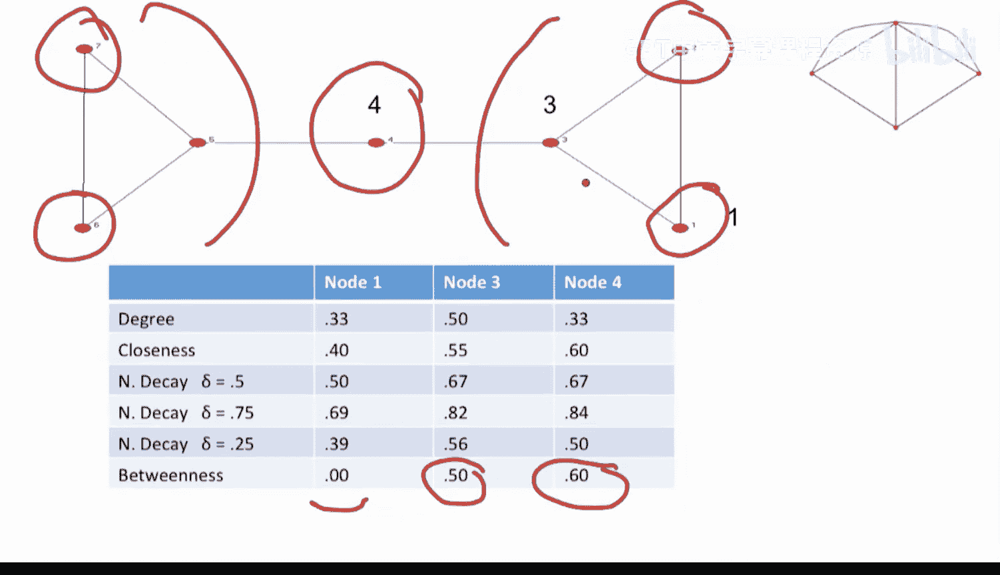

每种度量都揭示了节点在网络中位置的不同侧面。在实际应用中，选择哪种度量取决于具体的研究问题和背景。例如，研究信息传播可能更关注接近中心性，而研究资源控制或权力可能更关心中介中心性。下一节，我们将探讨基于特征向量的中心性度量，它从“你的朋友有多重要”的角度来定义节点的重要性。