#  017：应用-中心性度量 📊

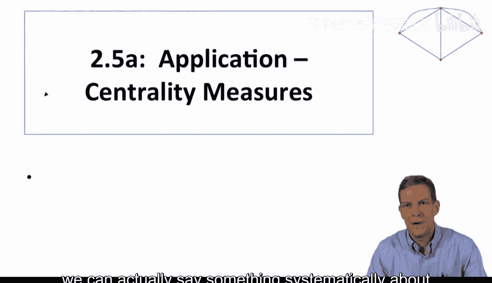

在本节课中，我们将学习如何应用不同的中心性度量来分析实际问题。我们将通过一个具体的案例——印度农村小额信贷的扩散过程，来比较度中心性、特征向量中心性等不同度量方法的预测效果，并理解它们在实际情境中的差异。

---

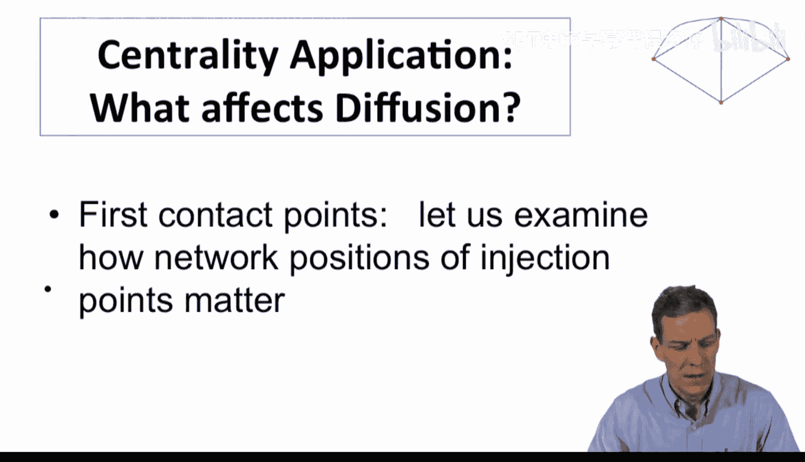

上一节我们介绍了多种中心性度量方法，本节中我们来看看如何在实际数据中应用和区分它们。需要强调的是，本应用的目的并非证明某一种中心性度量总是优于另一种，而是展示在特定情境下，我们可以系统地分析哪些度量方法能更好地解释现象和进行预测。

我们将研究的问题是网络中的扩散过程。具体来说，我们观察一个已启动的扩散过程，了解网络中哪些节点最先被接触，然后观察扩散的最终形态。通过比较不同网络，我们可以分析节点的中心性如何预测扩散的成功程度。

这个案例源于我与Abijit Banerji、Arun Chandrasekhar和Esther Duflo合作的一个长期项目。我们具体研究的是印度南部卡纳塔克邦75个偏远农村的小额信贷扩散情况。

这些村庄最初难以获得外部贷款。一家名为BSS的银行进入了其中43个村庄，提供小额信贷服务。我们在银行进入之前，对这些村庄进行了调查并绘制了社会网络图，随后持续追踪了村民参与小额信贷的情况。因此，我们掌握了扩散随时间推移的数据，并且知道银行最初接触了哪些人。

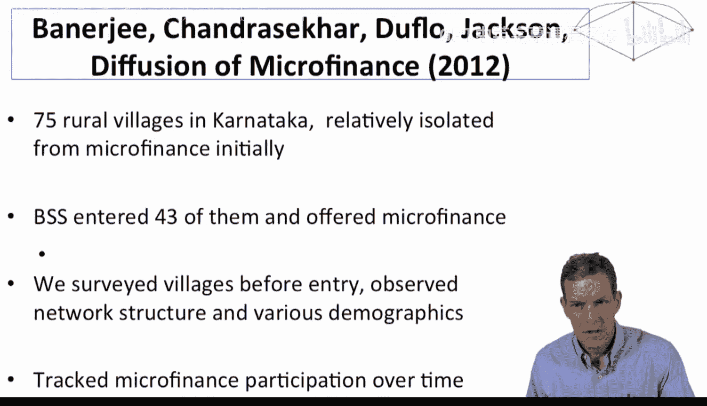

银行在每个村庄会首先接触一组特定人群，如店主、教师、自助小组负责人等，他们认为这些人在村里人脉较广。银行告诉他们即将提供贷款的消息，请他们告知朋友，并在几周后返回进行后续安排。随着时间的推移，人们可以加入贷款计划。最终，不同村庄的参与率差异很大，最高的约44%，最低的约7%。

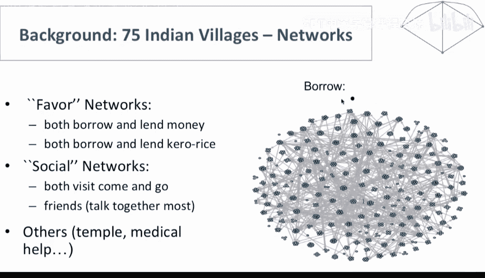

我们提出的问题是：最初接触哪些人是否重要？例如，在1号村，教师可能是一个中心人物，但在12号村，教师可能并不处于网络中心。如果银行在两个村庄都接触了教师，那么在一个村庄接触的是中心人物，在另一个则不是。这会对最终的小额信贷参与率产生影响吗？会影响信息的传播范围吗？

我们拥有43个村庄的数据，可以计算这些最初接触节点的中心性，并使用我们学过的不同中心性概念来检验哪些度量方法更有效。

为了描绘网络，我们针对每个村庄绘制了一系列不同的关系图。例如，我们询问“如果需要借50卢比一天，你会向谁借？”，从而得到一个借贷网络。我们总共询问了13个不同的问题，涵盖了共同去寺庙、寻求建议、借用煤油、紧急医疗求助等多个方面。

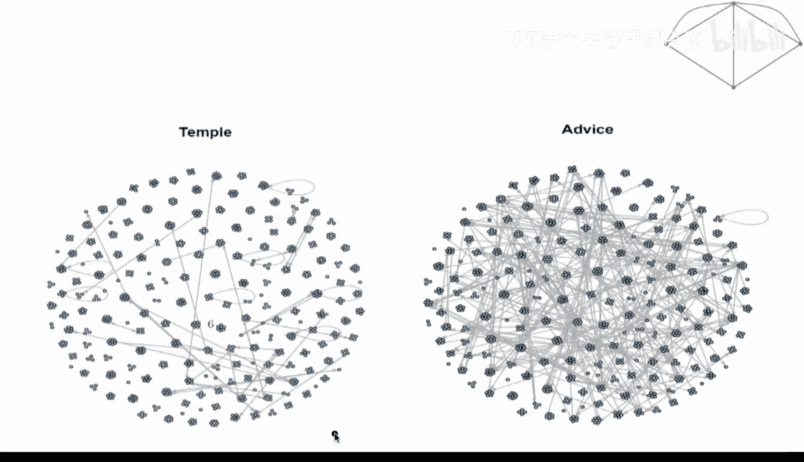

我们可以将这些关系汇总，定义两个家庭之间只要对任何一个问题回答“是”即视为存在连接。在本分析中，我们主要使用这种汇总后的无向网络，并聚焦于家庭层面。

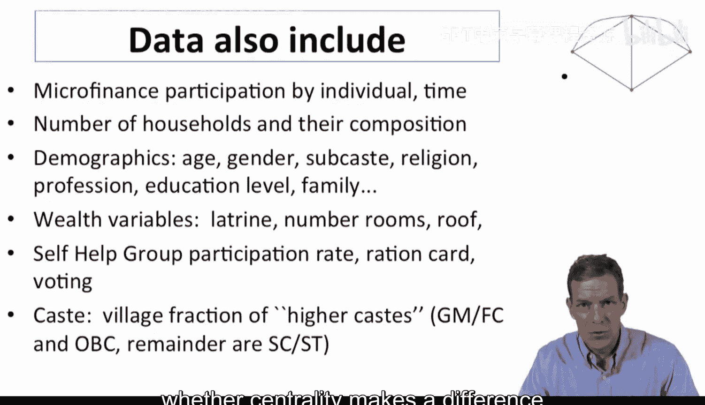

我们拥有网络数据、大量人口统计信息、随时间推移的小额信贷参与数据，以及家庭构成、年龄、性别、种姓、宗教、职业、教育水平、财富状况、自助小组参与情况等一系列可控制的变量。现在，我们想探究中心性是否影响贷款计划的扩散。

首先，我们可以从度中心性开始分析。在一个村庄网络中，度中心性最高的个体拥有最多的直接连接。一个假设是：如果最初接触的个体拥有更多连接（即更高的度中心性），那么关于小额信贷的信息应该传播得更广，知道的人越多，参与率就越高。

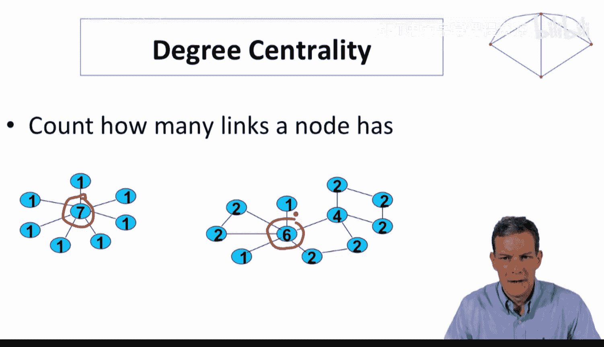

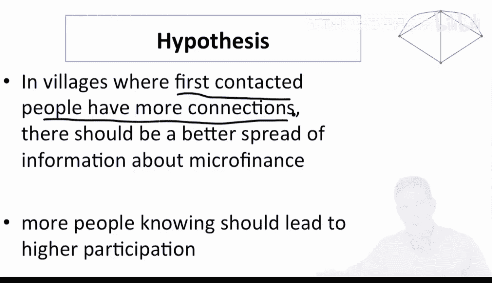

**核心假设公式：**
`最初接触节点的高度中心性 = 高小额信贷参与率`

然而，当我们观察数据时，将最初接触者（称为“领导者”）的平均度中心性与村庄的最终参与率进行对比，并未发现明显的正相关关系。拟合的最佳趋势线斜率甚至是负的。这表明度中心性似乎未能有效捕捉影响扩散的关键因素。

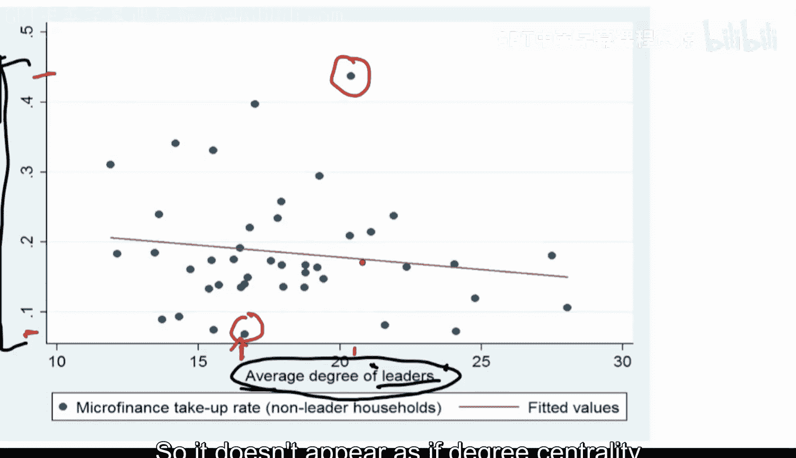

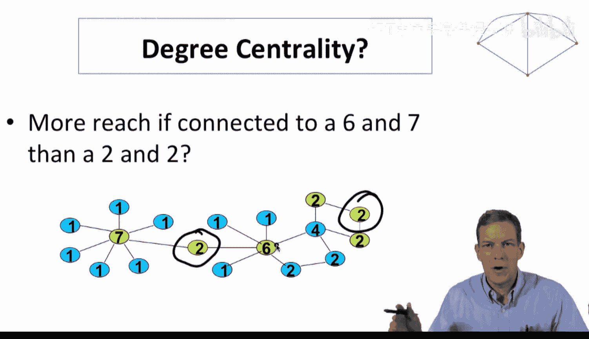

既然度中心性效果不佳，我们或许需要另一种中心性度量。回顾之前关于特征向量中心性的讨论，我们认识到度中心性无法反映个体在网络中的整体“位置优势”，而特征向量中心性通过考虑邻居的中心性来衡量这一点。

因此，让我们检验特征向量中心性是否表现更好。修订我们的假设：在最初接触者具有更高特征向量中心性的村庄，关于小额信贷的信息应能更好地传播，知晓人数更多，从而带来更高的参与率。

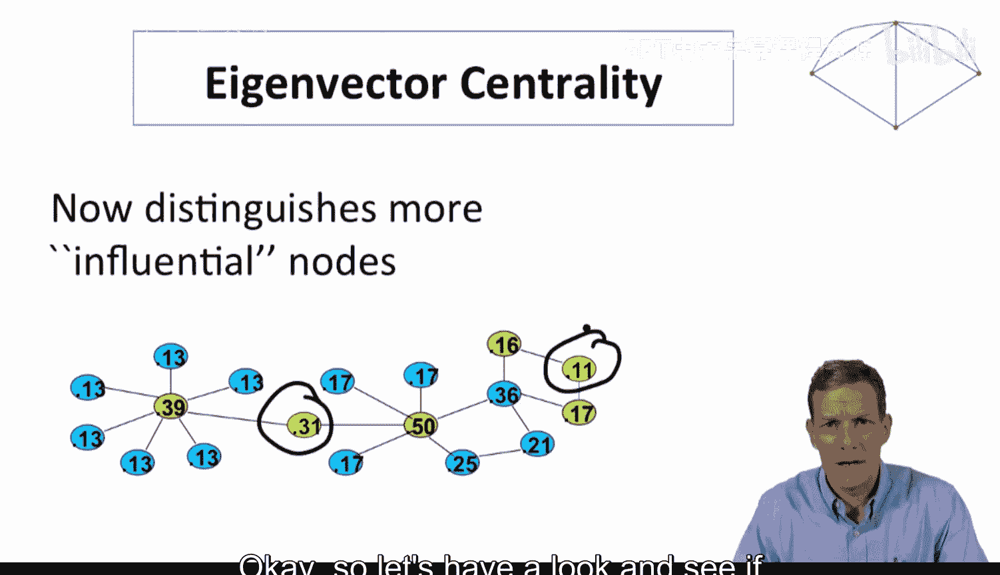

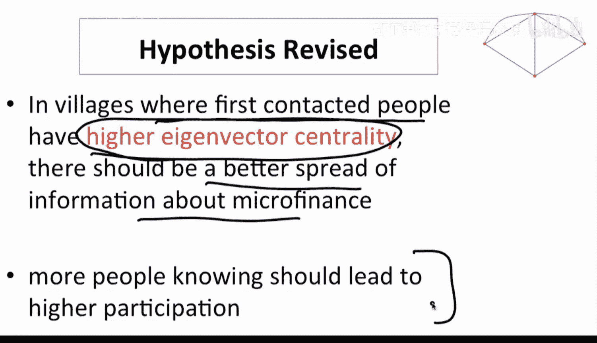

当我们绘制最初接触者的平均特征向量中心性与村庄参与率的关系图时，发现了一个显著的正相关且较强的联系。拥有更高特征向量中心性的“领导者”，能相当好地预测最终的小额信贷参与率，而度中心性则未能捕捉到这种关系。

这里的逻辑在于，特征向量中心性在此类重复传播过程中表现更优：你告诉你的朋友，他们再告诉他们的朋友，依此类推。如果你的朋友及其朋友都处于网络中的优势位置，这将非常有利于扩散。特征向量中心性衡量了这一点，而度中心性则没有。

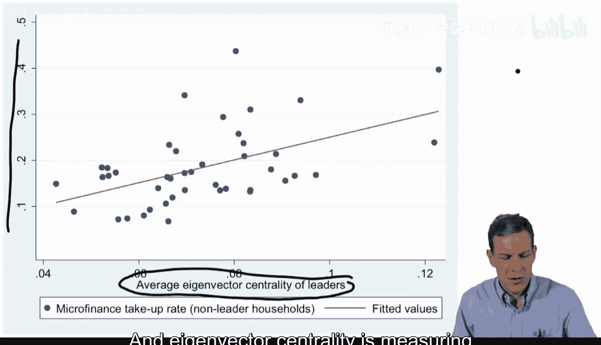

我们可以进行回归分析来进一步验证。将小额信贷参与率作为因变量，将领导者的特征向量中心性和度中心性等作为自变量进行回归。结果显示，领导者的特征向量中心性与参与率呈显著正相关，而度中心性的关系则为轻微负向且不显著。这确实表明特征向量中心性在此案例中表现更佳。

我们还可以考察更多不同的中心性度量。在控制了村庄规模、自助小组参与情况、储蓄、种姓等一系列变量后，再次进行回归分析。结果发现，特征向量中心性仍然是显著正向的预测因子，而度中心性、接近中心性、介数中心性等其他度量在控制变量后均不显著。

这只是一个应用案例，但它表明，当我们针对一个非常具体的问题，并探究哪些中心性度量与最终结果相关时，特征向量中心性在此案例中表现出正向相关性，而其他度量在控制了一系列变量后则没有显著相关性。这让我们认识到，这些度量捕捉的是网络的不同方面，有时某一度量会是更好的预测指标。

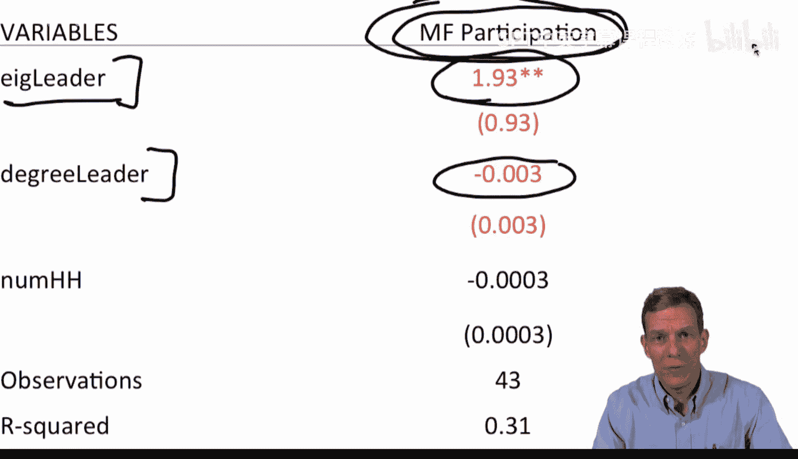

关于其中的因果关系，我们可以用“沟通”和“拥有连接良好的朋友有利于信息传播”等故事来解释，特征向量中心性恰好捕捉了这一点。但需要指出，这是观察性数据，我们无法完全确定因果关系。不过，我们确实看到不同的度量方法在数据中揭示了不同的信息，这一点非常重要。

再次强调，这并不意味着特征向量中心性应该是你唯一使用的中心性度量。它仅仅表明，在我们研究的这个特定类型的扩散应用中，它比其他标准中心性度量表现出更好的相关性。根据你所研究的具体应用场景（例如，在分析佛罗伦萨婚姻数据时，其他度量可能表现更好），可能需要使用不同的中心性度量。

---

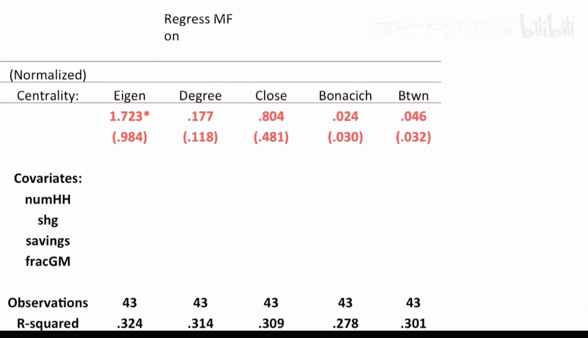

本节课中，我们一起学习了如何将中心性度量应用于分析实际的社会网络扩散问题。通过印度农村小额信贷的案例，我们比较了度中心性与特征向量中心性的预测能力，发现后者在此类多级传播的场景中能更好地预测扩散结果。这提醒我们，选择中心性度量时需要结合具体的应用背景和研究问题，因为每种度量都揭示了网络结构的不同侧面。