#  018：应用-扩散中心性 📡

在本节课中，我们将学习一种新的中心性度量方法——扩散中心性。我们将探讨它如何在一个具体的印度农村信息扩散案例中，比之前介绍的标准中心性度量方法表现得更好。

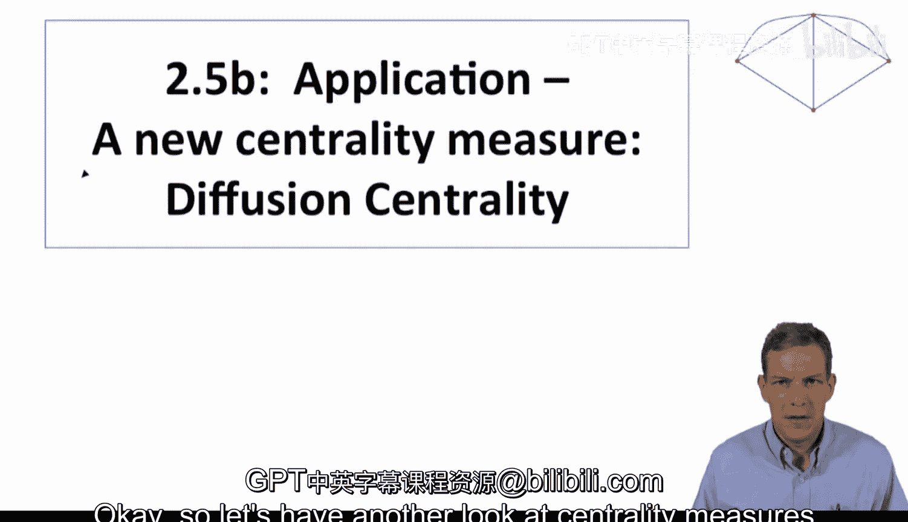

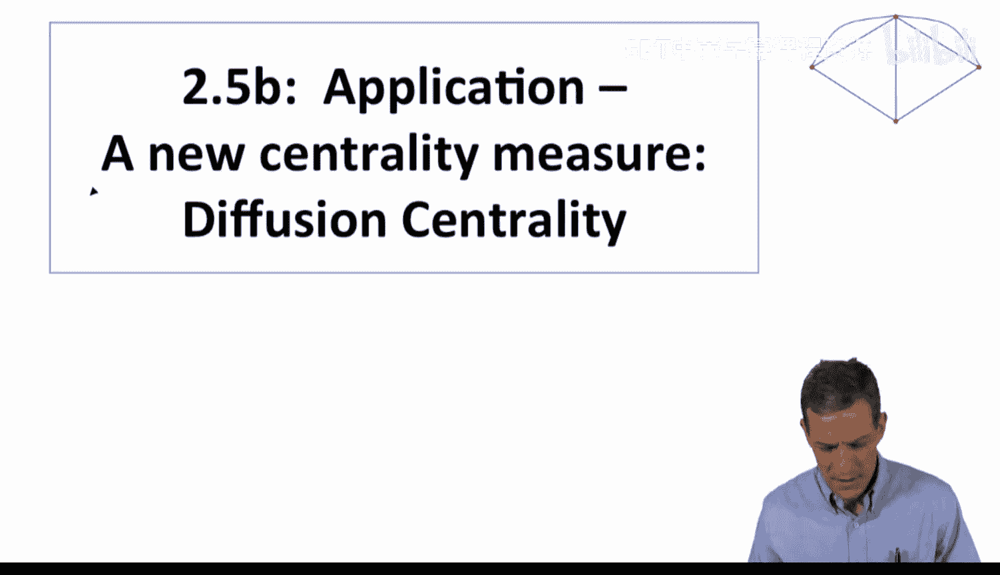

上一节我们讨论了中心性度量的不同概念，本节中我们来看看如何根据一个具体的扩散过程来定义中心性。

## 扩散中心性的定义 💡

扩散中心性的核心思想是，一个节点的影响力取决于信息通过社交网络传播的过程。具体来说，我们考虑一个节点最初被告知某个信息（例如，小额信贷），然后它会以一定的概率告诉其朋友，朋友再告诉他们的朋友，如此持续多个时期。

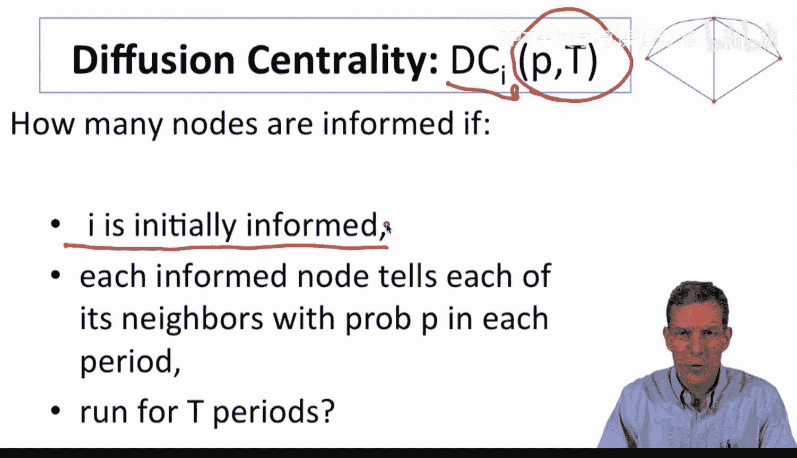

扩散中心性依赖于两个参数：
*   **传播概率 `P`**：在任一时期，一个已获知信息的节点将其告诉其每个邻居的概率。
*   **传播时期 `T`**：信息传播过程持续的总时期数。

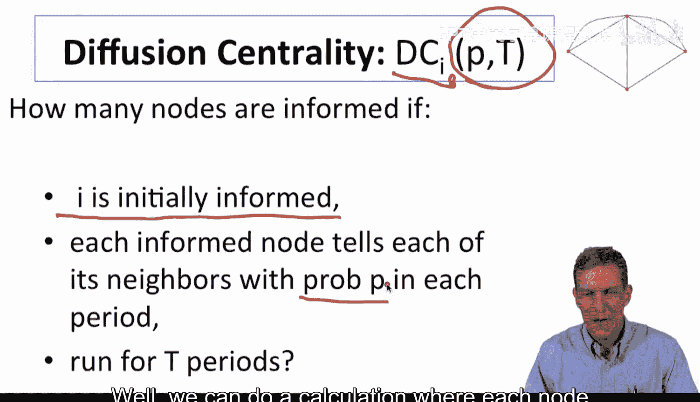

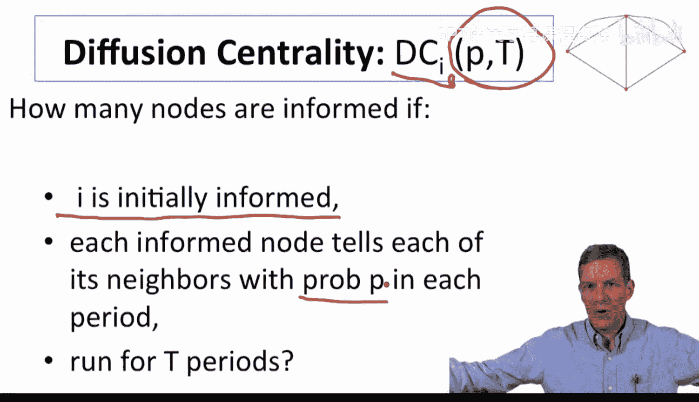

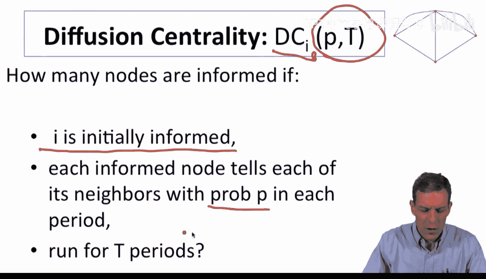

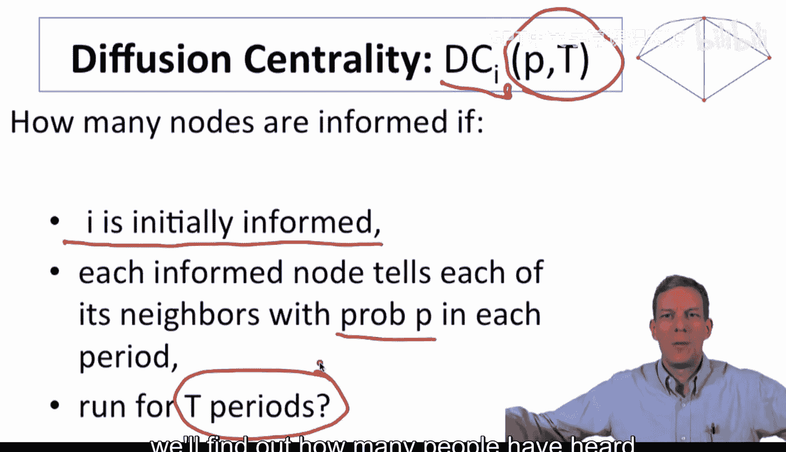

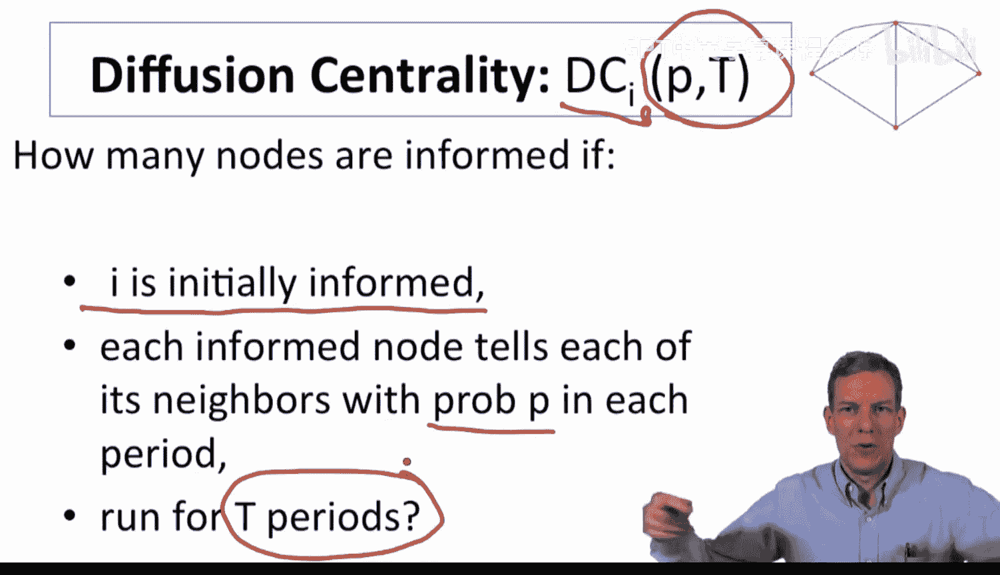

节点的扩散中心性，可以近似地通过以下公式计算：

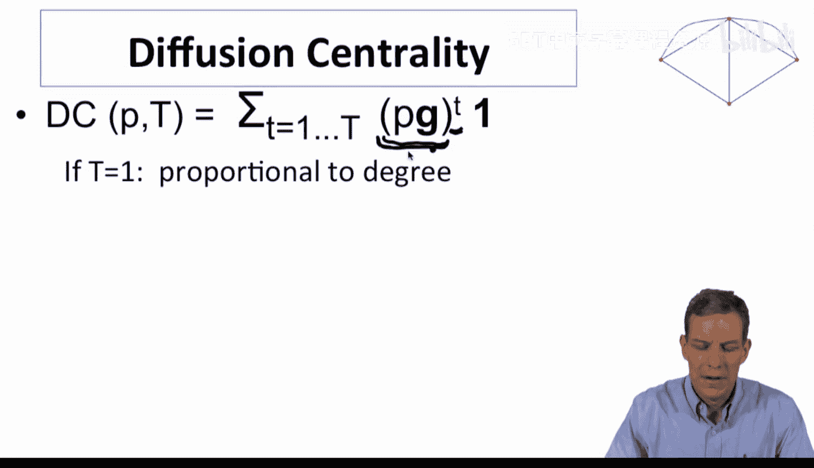

```
DC(i) = sum_{t=1}^{T} (P * G)^t * 1
```


其中：
*   `G` 是网络的邻接矩阵。
*   `1` 是一个所有元素为1的列向量。
*   `(P * G)^t` 的 `(i, j)` 元素，近似表示从节点 `i` 出发，经过恰好 `t` 步到达节点 `j` 的概率。

这个公式累加了从节点 `i` 出发，在 `1` 到 `T` 步内能到达的所有节点数量（经过概率加权）。

## 与其他中心性度量的关系 🔗

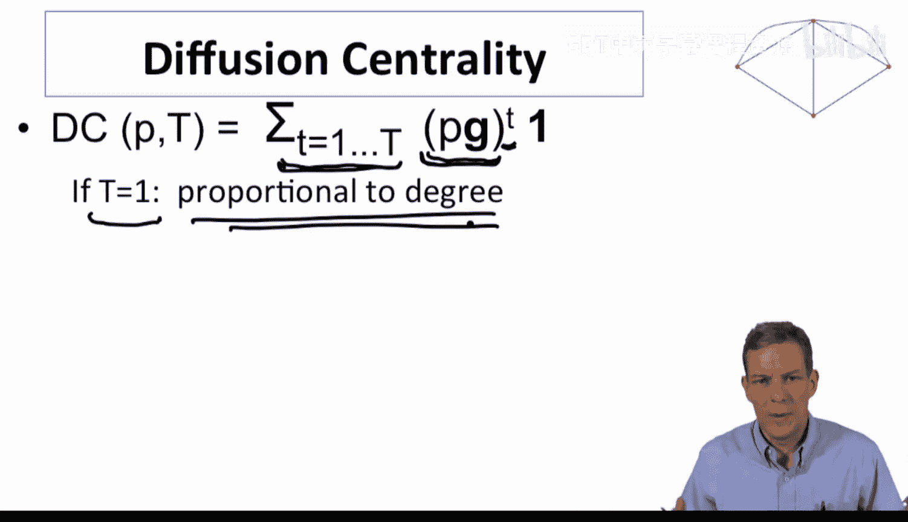

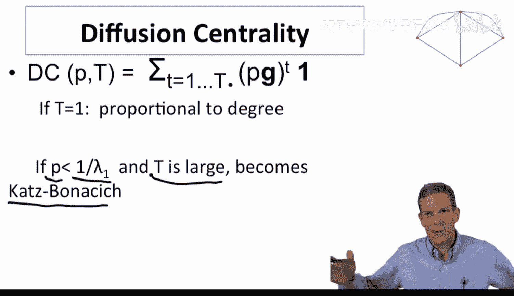

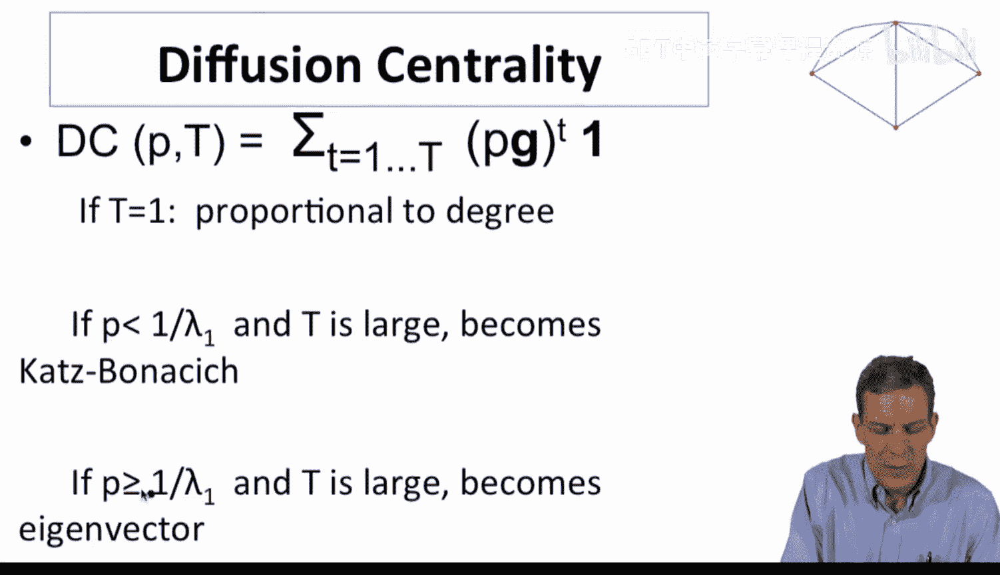

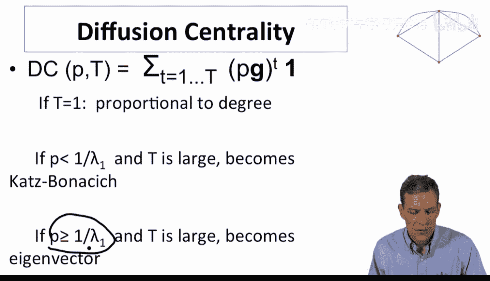

扩散中心性是一个更一般的框架，在不同的参数设置下，它可以简化为我们熟悉的标准中心性度量。

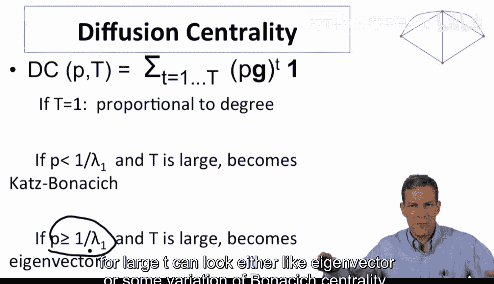

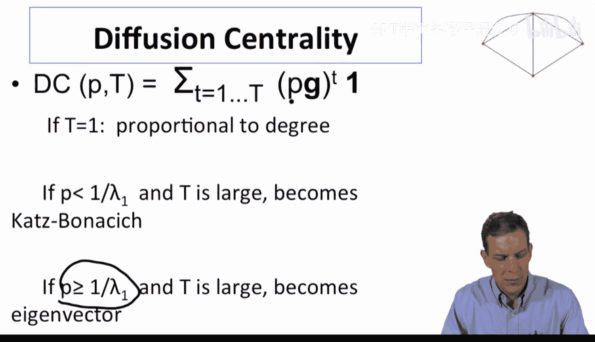

*   **当 `T = 1` 时**：扩散中心性正比于**度中心性**。因为它只计算了节点的直接邻居数量。
*   **当 `T` 很大且 `P < 1/λ₁` (λ₁是G的最大特征值) 时**：扩散中心性收敛于**卡茨中心性**，其中 `P` 扮演了衰减因子的角色。
*   **当 `T` 很大且 `P > 1/λ₁` 时**：扩散中心性开始近似于**特征向量中心性**。

因此，扩散中心性通过参数 `P` 和 `T`，能够灵活地捕捉从局部邻居（小T）到全局影响力（大T）的不同情况，并涵盖了标准度量作为其特例。

## 在印度农村数据中的应用 📊

现在，让我们看看这个度量在之前讨论的印度农村小额信贷扩散数据中的实际表现。

研究人员将扩散中心性与特征向量中心性、度中心性、接近中心性、介数中心性等一同放入回归模型中，以预测村庄对小额信贷的采纳情况。

以下是关键设置和发现：
*   **参数设置**：研究中设定 `P = 1/λ₁`，`T` 等于村庄接触信息的“ trimester ”（约三个月）数量。
*   **回归结果**：扩散中心性在统计上高度显著（99%置信水平），表明它是一个强有力的预测变量。
*   **比较分析**：当在同一个回归模型中同时放入扩散中心性和特征向量中心性时，扩散中心性仍然保持高度显著，而特征向量中心性的显著性则消失了。这表明，对于这个**有限期数**的信息传播过程，专门设计的扩散中心性比通用的特征向量中心性能更好地捕捉节点的实际影响力。

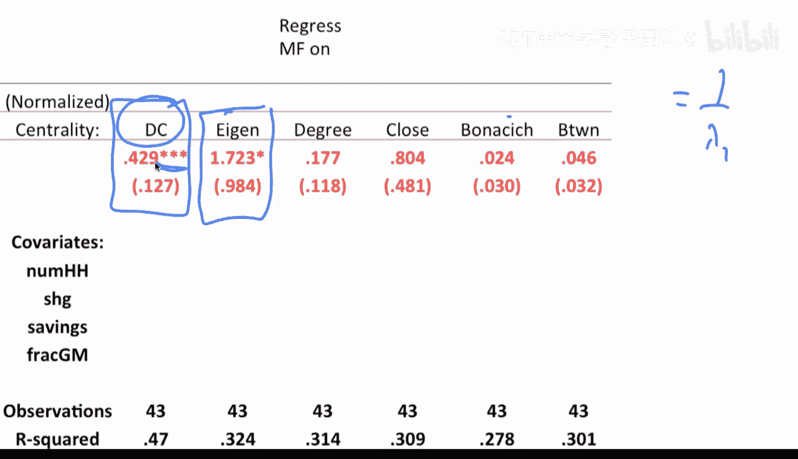

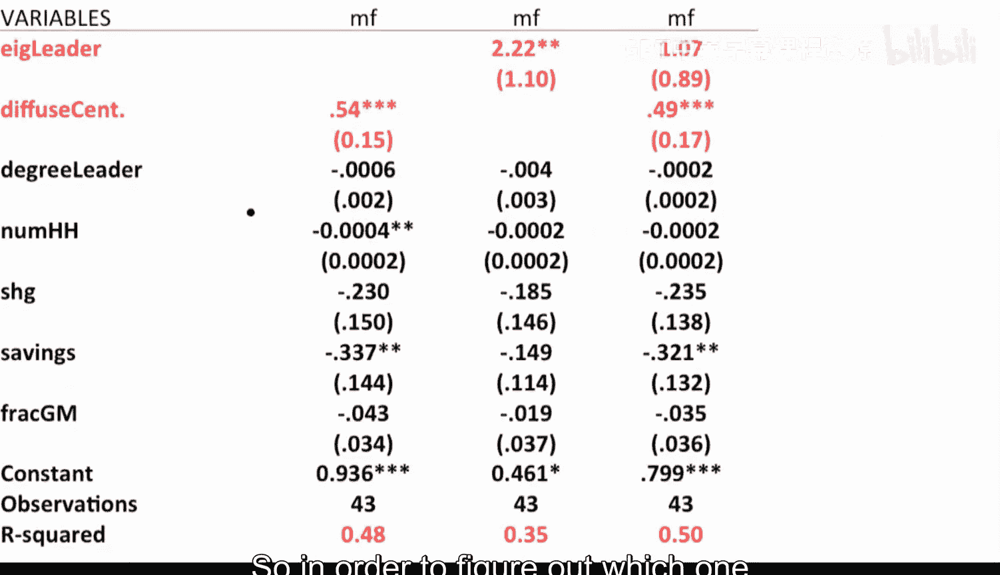

## 核心启示 ✨

这个应用案例给我们一个重要的启示：当我们研究网络中的具体过程（如信息扩散、疾病传播、创新采纳）时，可以根据该过程的动态特性（如传播概率、持续时间）来定制节点的度量指标。

扩散中心性正是这样一个“面向过程”的中心性度量。它不仅仅抽象地衡量节点的重要性，而是直接模拟信息如何实际地在网络中流动，从而更精准地识别出在特定扩散场景下最关键的角色。

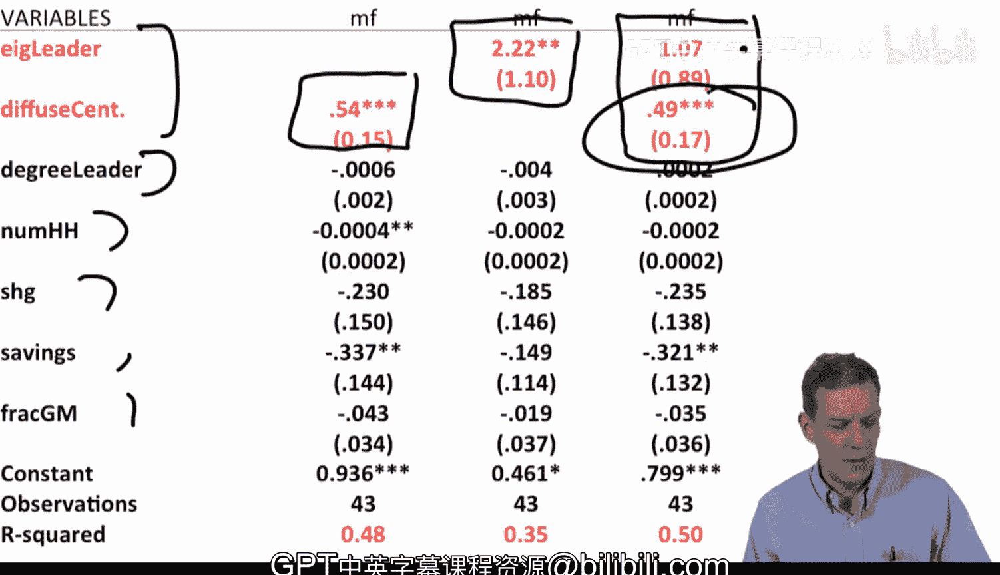

本节课中我们一起学习了扩散中心性的定义、其与经典中心性度量的联系，以及它如何通过贴合实际过程，在实证研究中展现出优越的预测能力。这为我们设计和选择网络节点度量提供了新的思路：从理解网络结构本身，转向理解网络结构如何与特定动态过程相互作用。