#  019：随机网络模型 🕸️

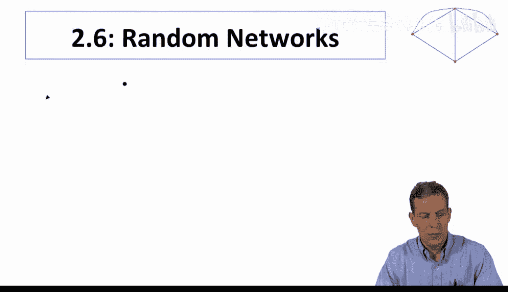

在本节课中，我们将开始更详细地探讨网络形成过程。我们将从随机网络模型入手，理解其作为基准模型的重要性，并学习如何用数学语言描述和度量网络的“性质”。

上一节我们介绍了网络的基本度量和特征，本节中我们来看看如何系统地研究网络形成的随机过程。

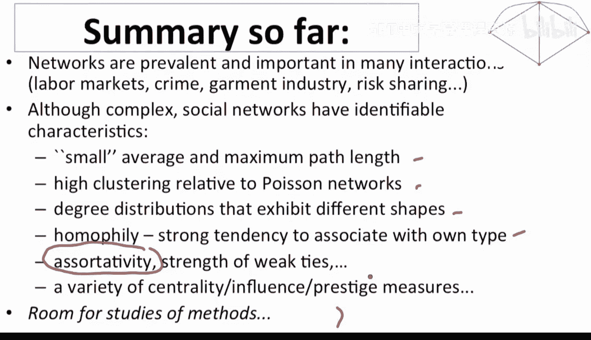

## 概述：随机网络模型的重要性

我们首先讨论随机网络模型，主要有两个原因。

第一，随机网络模型是一个非常有用的基准。通过观察事物完全随机发生时的情况，我们可以将实际观察到的网络特征与随机情况下的特征进行比较。这有助于我们理解哪些特征是随机过程的结果，哪些特征可能源于其他机制。

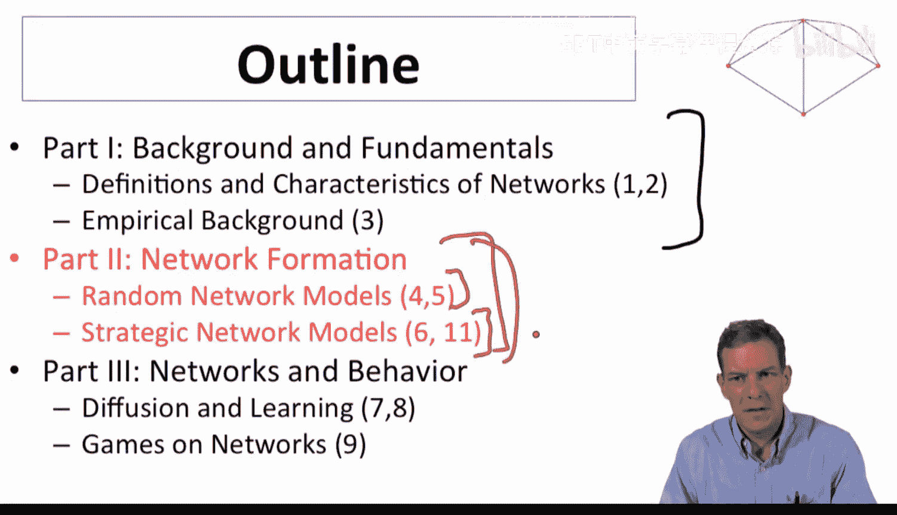

第二，研究随机网络模型能为我们提供基本的分析工具和概念，帮助我们理解网络的一般性质，例如连通性、平均路径长度和度分布。

## 随机网络模型：埃尔德什-雷尼模型

我们将从埃尔德什-雷尼随机网络模型开始，并更详细地考察其性质。

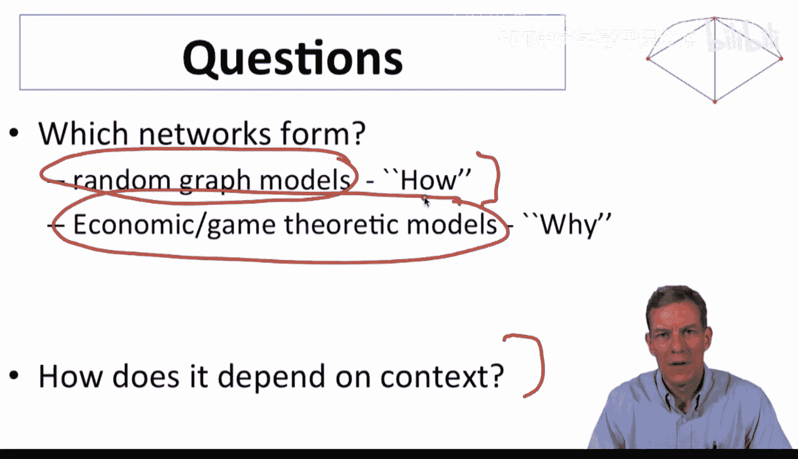

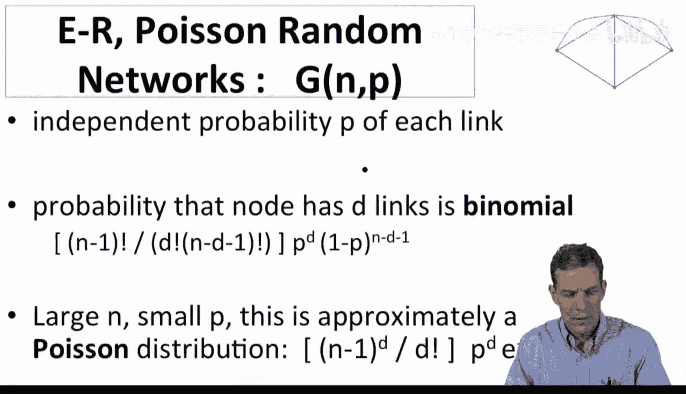

如果你还记得，这些网络就是 **G(n, p)** 模型。该模型的基本设定是：我们有 **n** 个节点，每条边以独立的概率 **p** 形成。在这种网络中，度分布是二项分布，当 **n** 很大且 **p** 相对较小时，可以很好地用泊松分布来近似。

处理这类网络的一个挑战在于，每一个可能的网络图都有一定的概率出现。为了理解这种现象，我们开始为大型网络证明定理。当 **n** 很大时，某些性质将以接近1的概率成立。

## 网络“性质”的数学定义

为了使讨论更精确，我们引入一些符号。

*   令 **G(n)** 表示在 **n** 个节点集合上所有可能的无向网络集合。网络中的边要么存在，要么不存在，没有方向或权重。
*   一个“性质”就是 **G(n)** 的一个子集。性质 **A** 是 **G(n)** 的一个子集，它指明了哪些网络具有该性质，哪些没有。这本质上就是我们感兴趣的网络特征的列表。

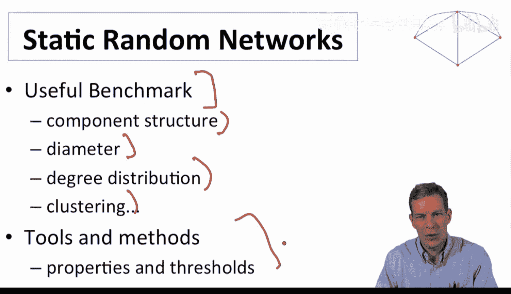

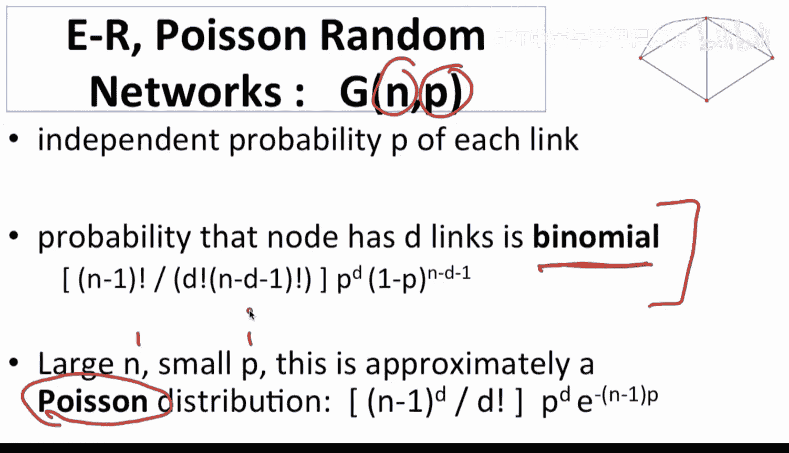

以下是几个性质的例子：
*   **性质“没有孤立节点”**：所有满足“每个节点的邻居集合非空”的网络集合。
*   **性质“网络连通”**：所有满足“任意两个节点 **i** 和 **j** 之间存在有限长度的路径”的网络集合。
*   **性质“平均路径长度小于 log(n)”**：所有满足此条件的网络集合。

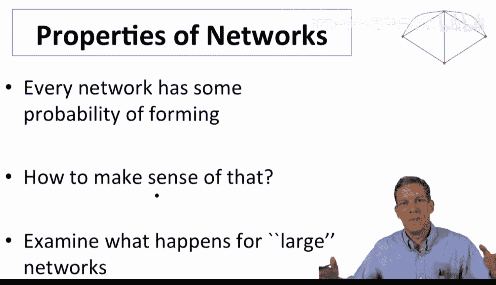

## 单调性质

一类重要的性质被称为“单调性质”。

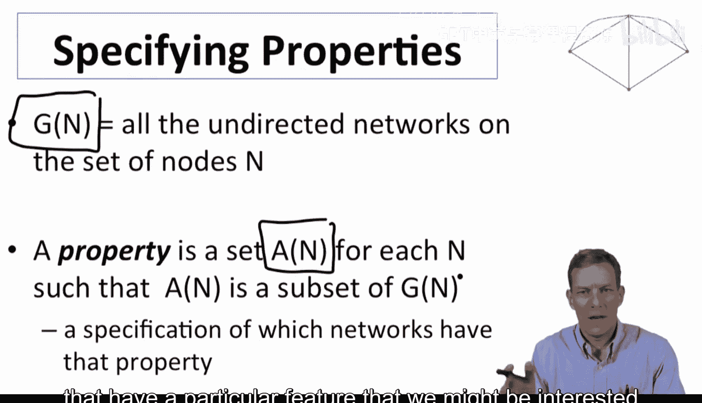

一个性质是单调的，意味着：如果一个网络 **G** 满足该性质，那么向 **G** 中添加额外的边得到网络 **G‘**（即 **G** 是 **G’** 的子图），则 **G‘** 也一定满足该性质。

之前提到的所有例子都是单调性质。例如，一个连通网络添加更多边后依然连通；一个没有孤立节点的网络添加边后依然没有孤立节点。

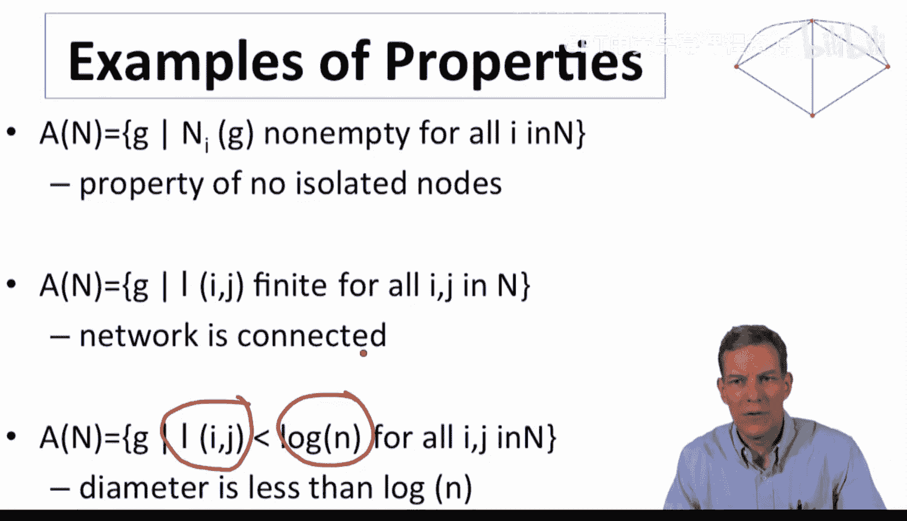

非单调性质的例子是“边的数量为偶数”。如果在一个满足此性质的网络上添加一条边，边的总数变为奇数，就不再满足该性质了。我们通常关注的许多网络性质都是单调的，这使得分析更为简便。

## 极限性质与阈值现象

我们感兴趣的是网络的极限性质。我们可以考察一系列 **G(n, p)** 随机图，研究当图规模 **n** 趋于无穷大时，某些性质成立的概率如何变化。

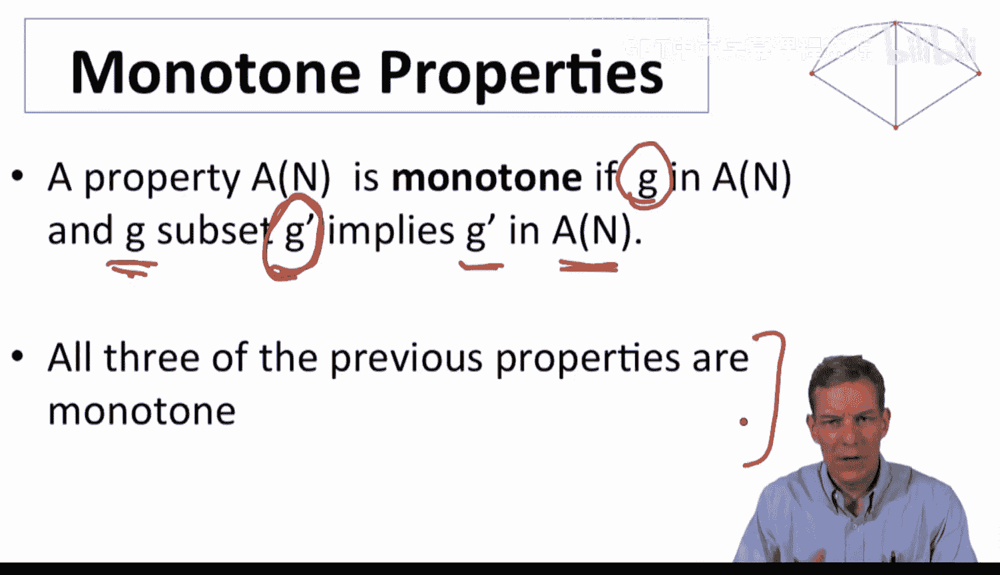

埃尔德什-雷尼模型和 **G(n, p)** 图的一个非常优美的特性在于，许多性质存在非常“尖锐的阈值”。这意味着，平均度（或连接概率 **p**）只要超过某个临界水平，该性质几乎必然（以概率接近1）在大规模网络中成立；而如果低于该临界水平，该性质则几乎必然不成立。

这种阈值现象清晰地划分了性质成立与否的边界，是我们接下来要探讨的重点。

## 总结

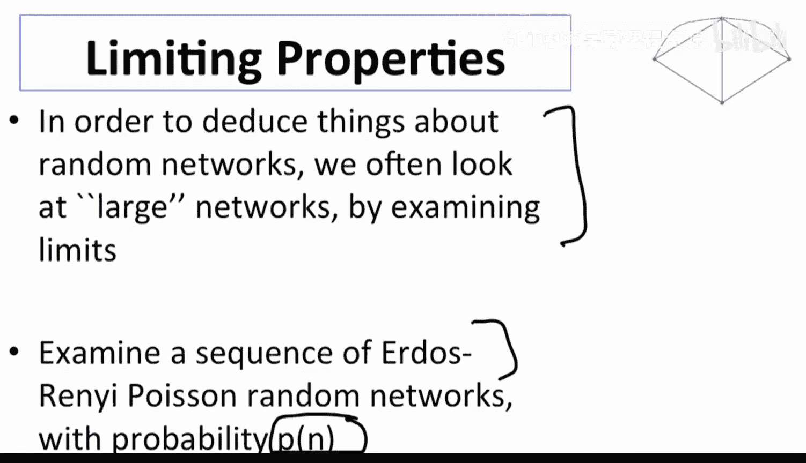

本节课中，我们一起学习了网络形成分析的起点——随机网络模型。我们明确了使用随机模型作为基准的重要性，并正式定义了网络的“性质”及其重要的子类“单调性质”。最后，我们预告了埃尔德什-雷尼随机图模型的一个核心特征：许多网络性质会随着连接概率的变化，在某个阈值点发生急剧的转变。在接下来的课程中，我们将具体分析这些阈值现象。