#  021：阈值定理（可选-进阶）📊

在本节课中，我们将深入学习随机网络连通性的一个关键定理——阈值定理。我们将详细探讨网络何时会变得连通，以及如何通过数学证明来理解这一现象背后的逻辑。

---

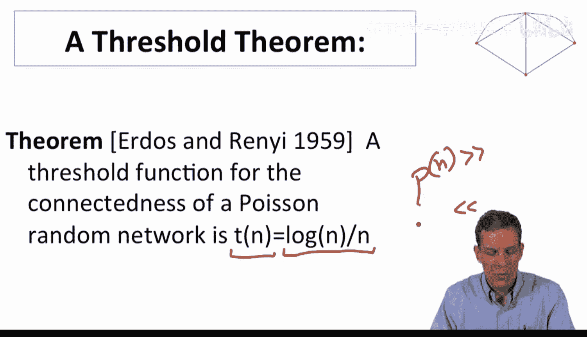

上一节我们介绍了随机网络的基本模型，本节中我们来看看一个关于网络连通性的重要阈值定理。这个定理由Verash和Reni提出，它精确地指出了泊松随机网络或G(n,p)随机网络变得连通的概率阈值。

**定理核心**：对于一个节点数为n的随机网络，其连边概率p(n)的阈值函数与 **log(n)/n** 成正比。具体来说：
*   如果 **p(n) >> log(n)/n**，那么随着n增大，网络几乎必然是连通的。
*   如果 **p(n) << log(n)/n**，那么随着n增大，网络几乎必然是不连通的（会存在多个独立组件）。

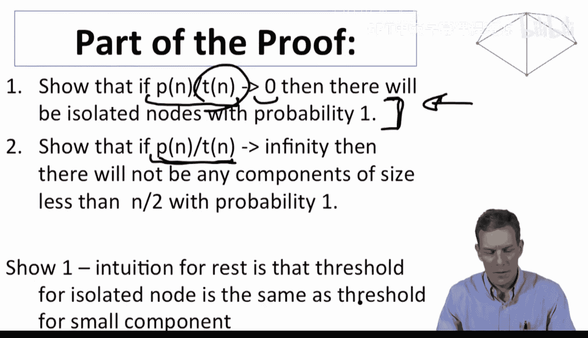

我们将通过证明的主要部分来理解其背后的直觉。证明的核心思路是：当p远低于此阈值时，图中几乎必然存在孤立节点，因此网络不连通；当p远高于此阈值时，图中不仅没有孤立节点，甚至不会存在任何小于半数节点的小组件，这意味着必然存在一个包含绝大多数节点的巨型连通组件。

---

在开始证明前，我们先回顾两个关于指数函数的有用近似，这在后续的概率计算中至关重要。

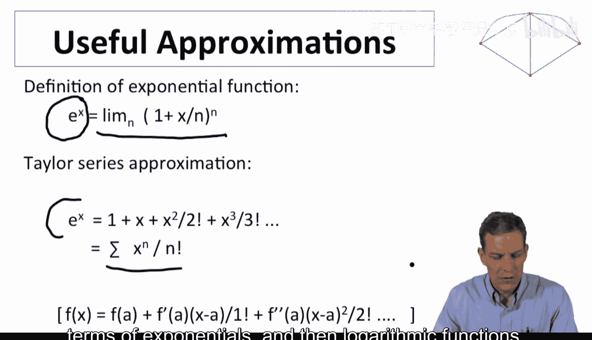

以下是两个关键公式：
1.  **极限定义**：`e^x = lim_{n→∞} (1 + x/n)^n`
2.  **泰勒级数展开**：`e^x = Σ_{k=0}^{∞} (x^k)/(k!)`

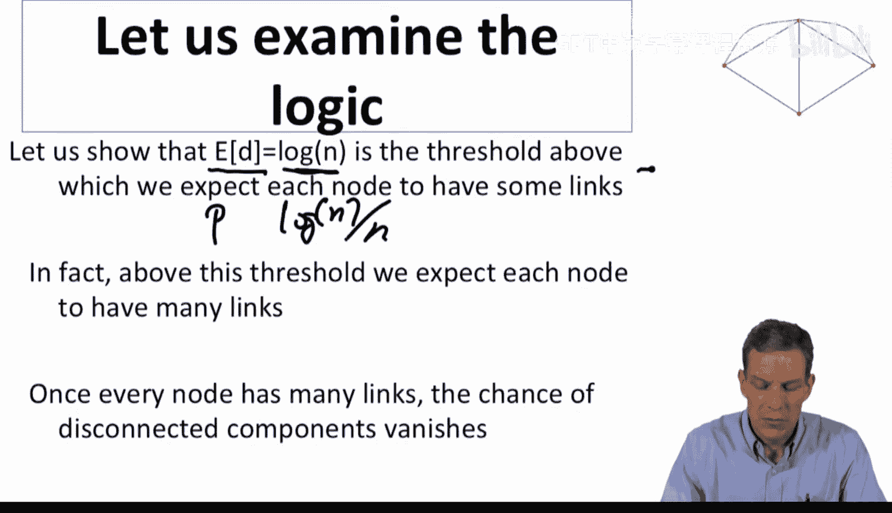

我们将利用第一个近似来估算事件发生的概率，并将其转化为指数和对数形式，从而简化分析。

---

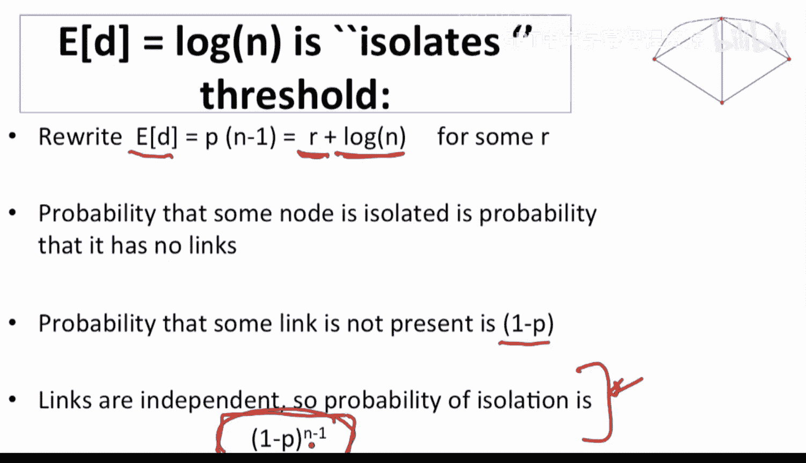

现在，我们开始证明的第一部分：展示当p远小于阈值时，图中存在孤立节点。

我们设节点的**期望度数**为 `(n-1)p`。根据阈值定理，我们关注 `(n-1)p` 与 `log n` 的关系。因此，我们将其写为：
`(n-1)p = r(n) + log n`
其中，`r(n)` 是一个关于n的函数，它衡量了期望度数偏离 `log n` 的程度。

接下来，我们计算**单个节点是孤立节点**的概率。对于一个特定节点，它与其他 `n-1` 个节点都没有连边的概率为：
`P(节点孤立) = (1 - p)^{n-1}`

将 `p = [r(n) + log n] / (n-1)` 代入上式，得到：
`P(节点孤立) = [1 - (r(n) + log n)/(n-1)]^{n-1}`

当 `n` 很大，且 `(r(n) + log n)` 远小于 `(n-1)` 时，我们可以应用之前的指数近似公式（令 `x = -(r(n) + log n)`）：
`P(节点孤立) ≈ e^{-(r(n) + log n)} = e^{-r(n)} / n`

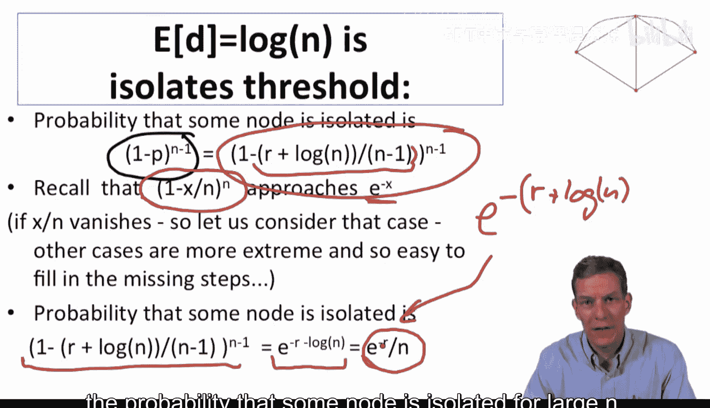

由此，我们得到了一个关于n很大时，节点孤立概率的简洁表达式。

---

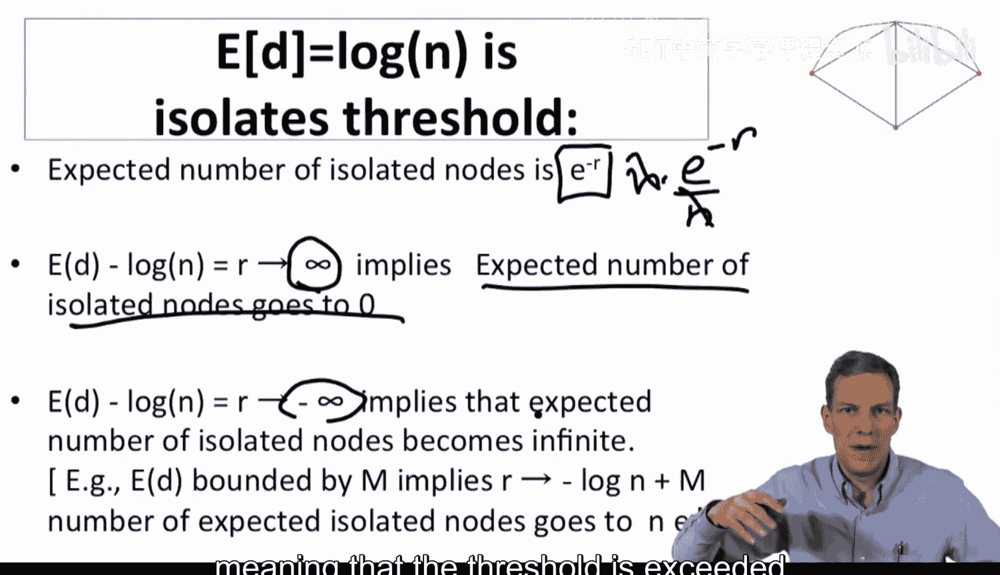

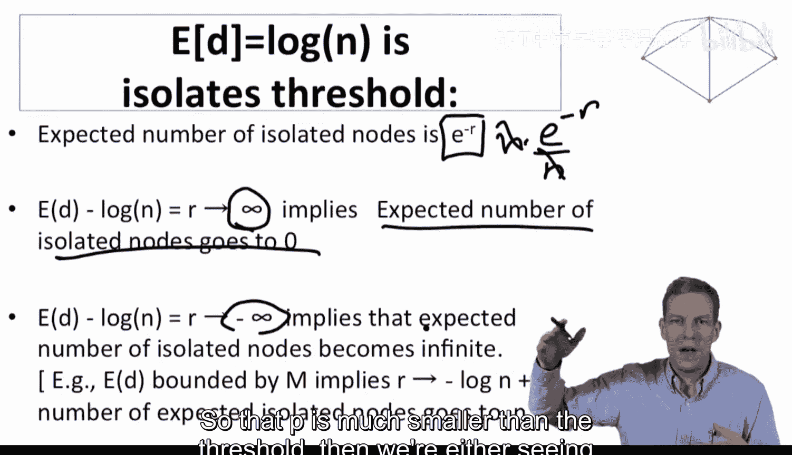

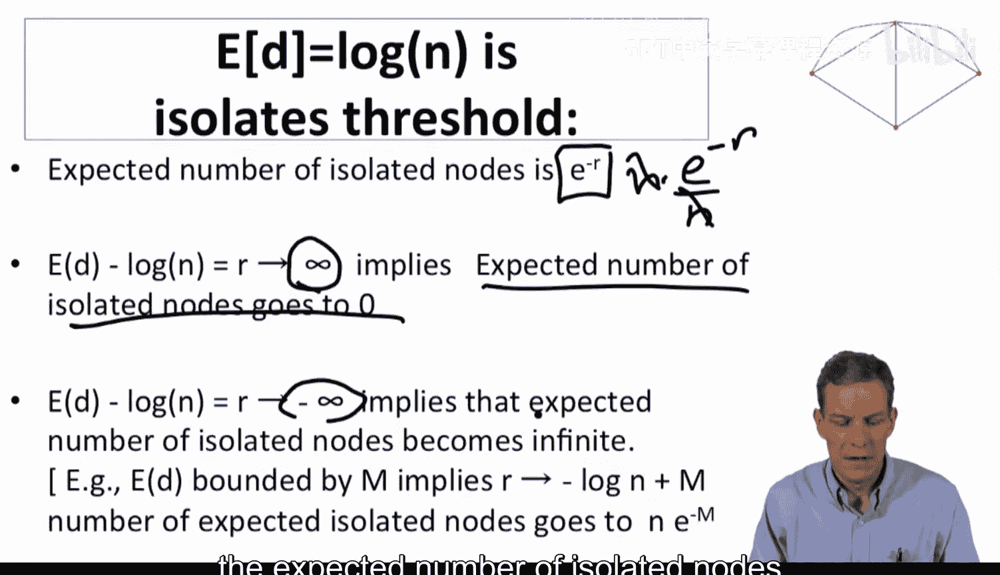

基于上一节得到的孤立节点概率公式，我们可以推导出图中孤立节点的期望数量。

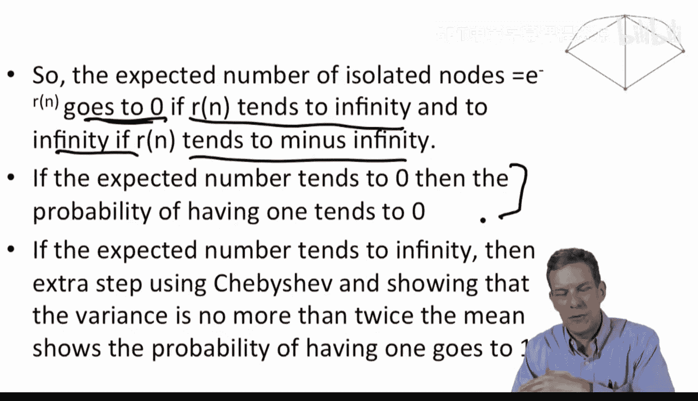

由于节点是对称的，图中**孤立节点的期望数量**为节点总数乘以单个节点孤立的概率：
`E[孤立节点数] = n * [e^{-r(n)} / n] = e^{-r(n)}`

这个结果非常直观。现在，关键取决于函数 `r(n)` 的趋势：
*   如果 **r(n) → +∞**（即 `p` 远大于阈值 `log n / n`），则 `E[孤立节点数] → 0`。
*   如果 **r(n) → -∞**（即 `p` 远小于阈值 `log n / n`），则 `E[孤立节点数] → ∞`。

期望数量趋于0意味着实际存在孤立节点的概率也趋于0（利用马尔可夫不等式）。期望数量趋于无穷大，则意味着实际存在至少一个孤立节点的概率趋于1（这需要更严格的方差分析，例如使用切比雪夫不等式）。这就完成了定理证明的核心部分：在阈值之上，孤立节点几乎消失；在阈值之下，孤立节点几乎必然存在。

---

以上我们详细剖析了阈值定理证明中关于孤立节点的部分。对于“不存在小于半数节点的小组件”这部分的证明，思路是类似的，只是计算的对象从“孤立节点”变成了“规模为k的小组件”存在的概率，并进行更复杂的求和与近似。整个随机图论的许多定理证明都遵循类似的结构：将目标事件的概率用网络参数表示，利用数学近似（特别是指数近似）进行简化，最后分析参数在极限情况下的趋势，从而确定性质发生突变的阈值点。

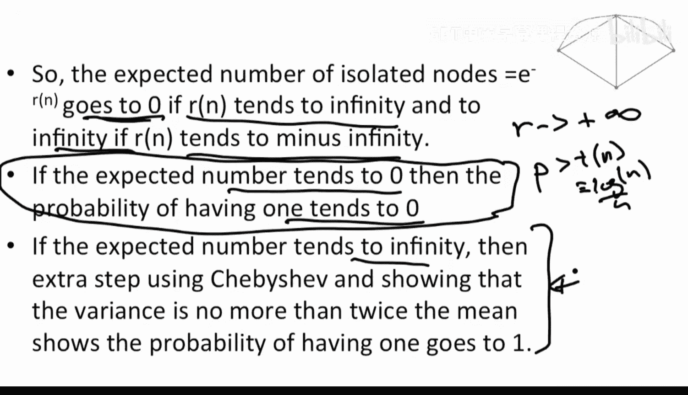

本节课中我们一起学习了随机网络连通性的阈值定理及其证明思路。我们了解到，网络从几乎必然不连通到几乎必然连通的转变发生在一个非常尖锐的阈值 `p ~ log(n)/n` 附近。证明过程展示了如何利用概率计算和极限分析来捕捉这种相变现象，这是理解大规模随机网络性质的基础工具。