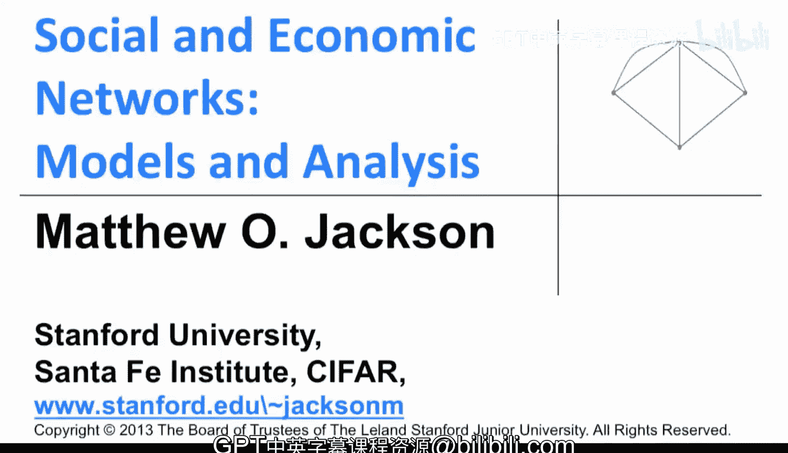
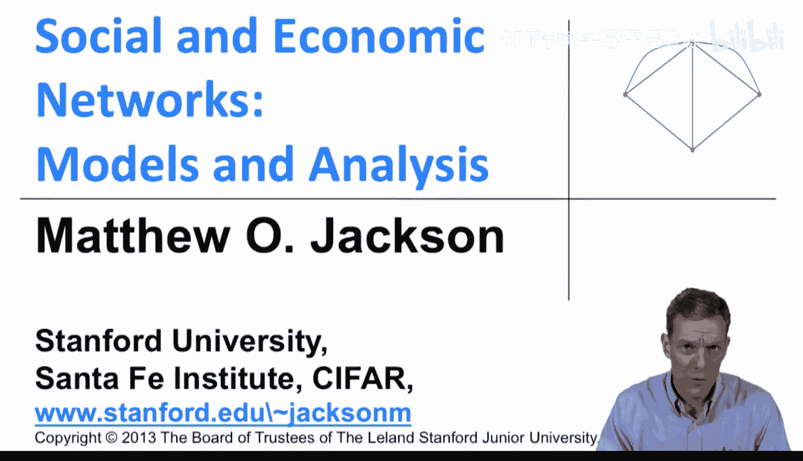
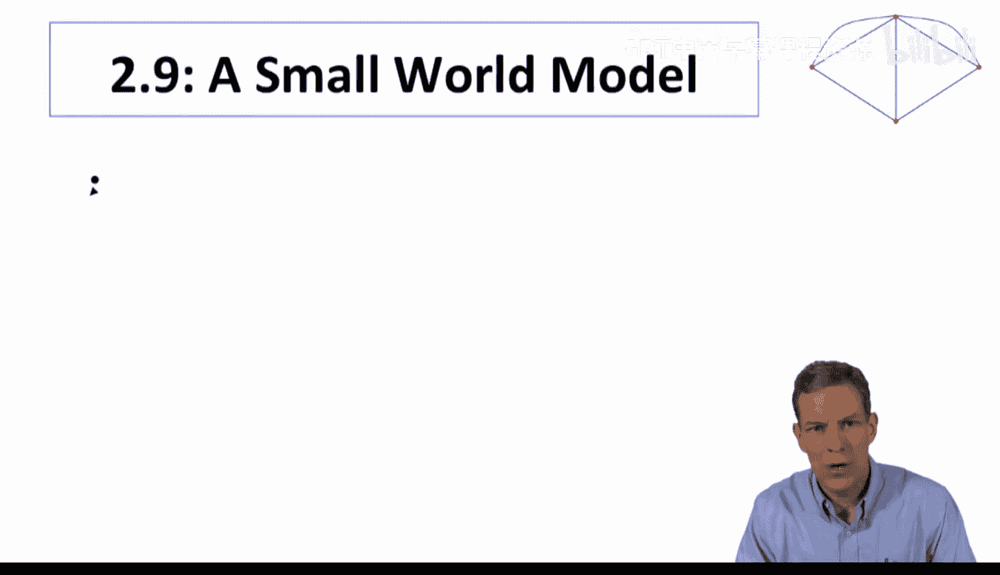
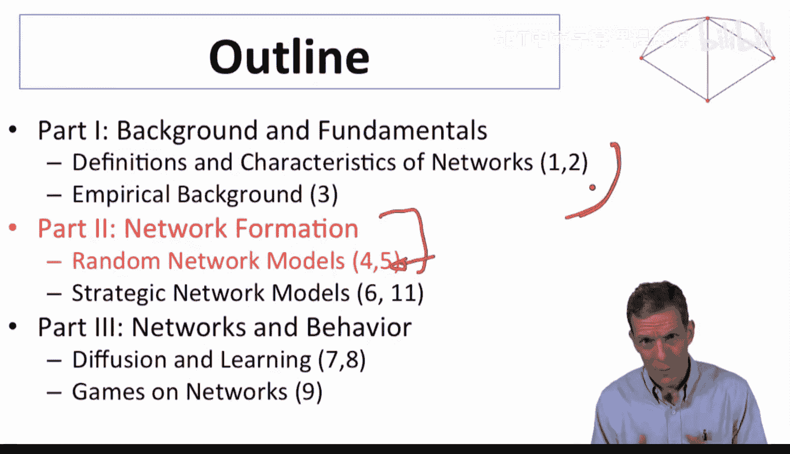
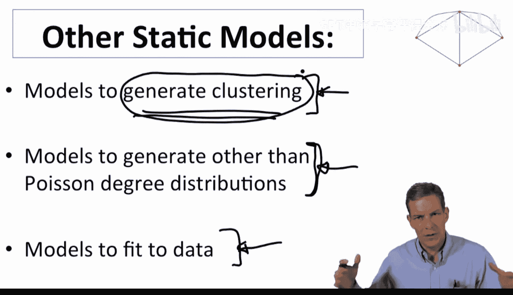
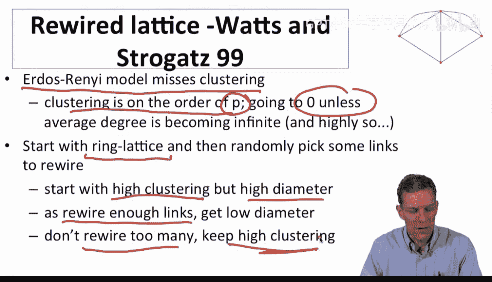
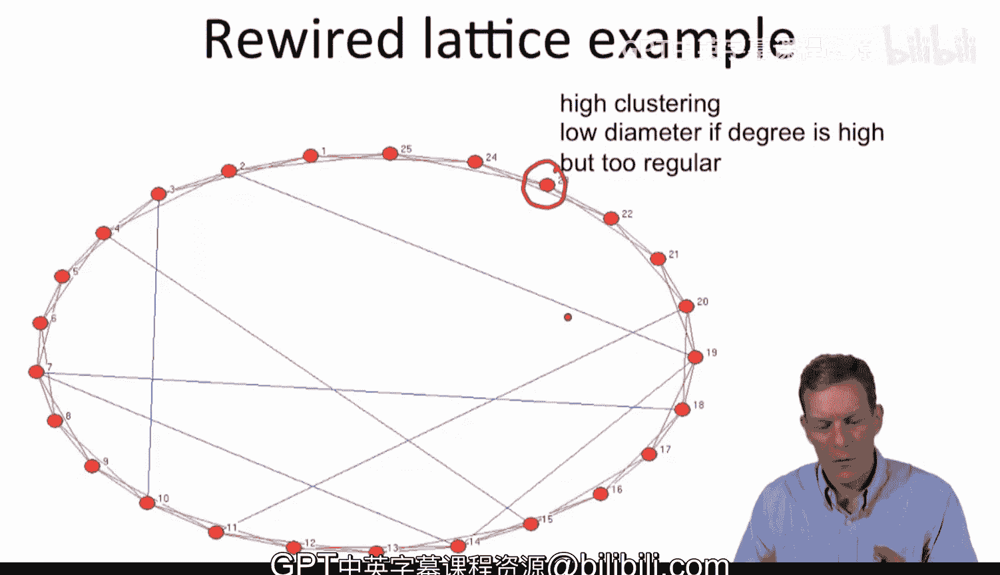

#  022：小世界模型 🌐

在本节课中，我们将学习如何通过丰富随机网络模型，来捕捉现实网络中观察到的特性，特别是“小世界”现象。我们将探讨如何在一个模型中同时实现较短的平均路径长度和较高的聚类系数。

---

上一节我们介绍了简单的Erdős–Rényi随机网络模型，它解释了平均路径长度为何可能较短。然而，该模型在解释**聚类系数**方面表现不佳。现实中的许多社交网络，其聚类系数显著高于随机网络的预期值。

这表明，简单的随机网络模型缺失了某些关键特征。因此，在丰富模型时，我们的目标之一是生成非平凡的聚类。另一个目标是生成更灵活的模型类别，以匹配现实中观察到的“肥尾”度分布等特性。

接下来，我们将首先关注如何在一个模型中同时实现高聚类和短路径长度，然后逐步丰富模型，使其能拟合更多现实数据。

---

一个早期的经典研究是Watts和Strogatz在1999年发表的论文。他们提出的核心问题是：如何在一个模型中同时匹配网络的这两个不同特性——短的平均路径长度和高聚类？

一个重要的观察是：Erdős–Rényi模型的聚类系数约为 **`p`**（连接概率）。除非平均度数变得非常大，否则 `p` 会趋近于零，从而无法产生高聚类。然而在现实中，人们的邻居数量是有限的（几百或几千个），而非数十亿个。

因此，我们需要一个既能保持高聚类，又能维持较小 `p` 值的模型。他们的思路如下：

1.  从一个具有高聚类系数的特定网络结构开始，即**环形格子**。
2.  然后，随机选择并“重连”其中的一部分链接。

通过从这种格子结构出发，我们初始就获得了一个高聚类但**直径**（网络中任意两点间的最长最短路径）也很大的网络。随后，只需改变其中少量链接，就能迅速缩小网络的直径和平均路径长度。如果重连的链接数量不多，就能在很大程度上保留原有的高聚类特性。

让我们通过一个例子来具体理解这个过程。

---

以下是一个包含25个节点的环形格子示意图。初始时，每个节点仅与其两个直接邻居相连（例如，节点1连接节点2和3，同时也连接节点24和25）。

这种初始结构产生了很高的聚类系数。例如，节点1连接了节点2和3，而节点2和3彼此也相连。

在这个图示中，我们没有重连原有链接，而是**添加**了几条随机链接（如图中所示）。

初始状态下，如果没有这些随机链接，从节点1到节点15需要沿着圆环走很长的路径。当网络规模更大时，路径长度会更长。

然而，加入这几条额外的连接后，路径长度被显著缩短。例如，从节点1到节点15现在可能只需4跳，到节点14只需3跳，到节点10只需2跳。

因此，**少量**的随机链接就能戏剧性地缩短平均路径长度，同时不会对聚类系数造成太大影响。Watts和Strogatz发现，只需进行少量的重连操作，就能在保持较高聚类的同时，急剧缩小网络直径。

当然，这个模型生成的网络在形态上仍与许多现实网络有差距。例如，节点的度数分布仍然比较规则，无法匹配现实中观察到的“肥尾”分布。

尽管如此，这个模型的意义在于，它开始回答一些关键问题：如果由于某种局部机制，网络初始就具有高聚类，那么只需在其上添加少量随机连接，就能同时获得高聚类和短路径这两个特性。这为解释现实网络中这些特性如何共存提供了思路——你并不需要很多随机链接就能显著缩短平均路径长度。

---

本节课中，我们一起学习了小世界模型的基本思想。该模型通过结合规则结构的局部高聚类特性和少量随机连接的“捷径”效应，解释了网络如何能同时具备高聚类和短平均路径长度这两个看似矛盾的特征。

虽然这个基础模型本身还不足以完美拟合现实数据，但它为我们指明了方向：通过逐步丰富模型，引入更多机制（如不同的连接规则、节点异质性等），我们可以构建出更复杂、更贴近现实的网络模型，并用于检验是否能复现我们在真实世界网络中观察到的各种特征。在接下来的课程中，我们将更详细地探讨各类随机网络模型。