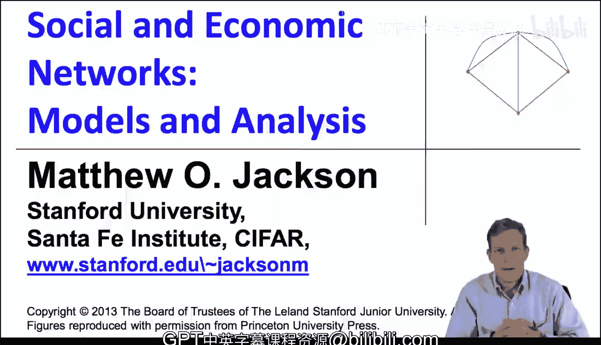
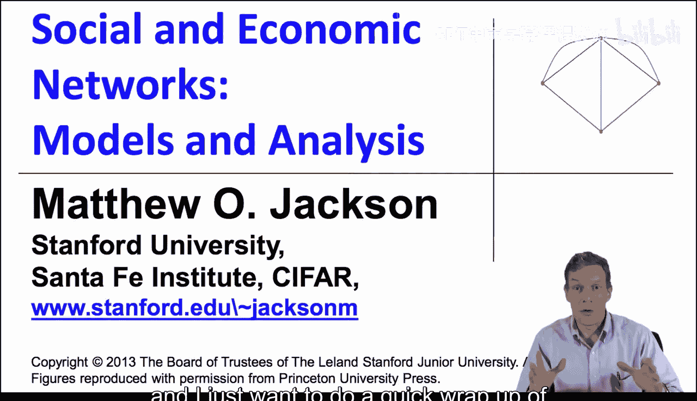
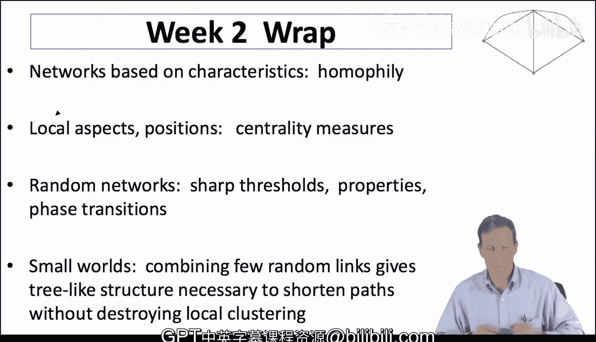

#  023：第二周总结 🧠

在本节课中，我们将对第二周课程的核心内容进行总结。我们探讨了网络中的同质性现象、中心性度量、随机网络的关键特性以及小世界网络模型。这些概念为我们理解网络的结构与动态奠定了基础。

## 同质性与网络结构

上一节我们介绍了网络的基本拓扑结构，本节中我们来看看节点特征如何影响连接模式。同质性是指具有相似特征的节点之间更容易形成连接的趋势。这在社交环境中很自然，例如人们倾向于与背景、兴趣相似的人交往。

同质性现象可能由多种原因导致，但其结果往往是导致网络出现隔离。这种隔离模式在我们后续讨论网络中的学习、信息扩散以及行为选择时，将变得非常重要。因此，理解同质性及其影响，是我们未来课程中需要持续关注的重点。

## 中心性度量：识别影响力节点

当我们从局部视角分析网络，试图找出哪些节点可能更具影响力时，就需要借助中心性度量。中心性度量有多种方式，它们从不同角度刻画了节点在网络中的位置。

以下是几种主要的中心性度量：
*   **度中心性**：衡量一个节点拥有的直接连接数量。
*   **接近中心性**：衡量一个节点到网络中所有其他节点的平均距离有多近。
*   **中介中心性**：衡量一个节点位于其他节点对之间最短路径上的频率。
*   **特征向量中心性**：衡量一个节点连接到其他重要节点的程度。

这些度量捕捉了网络的不同方面。例如，中介中心性高的节点可能在“经纪”或“桥梁”情境中很重要；接近中心性高的节点可能在信息传播中很重要；而特征向量中心性高的节点则因其连接对象的重要性而具有影响力。我们将这些度量作为工具箱中的工具，在后续研究网络行为时，它们会在不同场景下反复出现。

## 随机网络与相变

接着，我们更深入地探讨了随机网络模型，例如 Erdős–Rényi 模型。这里一个非常重要的概念是**相变**或**尖锐阈值**现象。

具体来说，在 Erdős–Rényi 模型 `G(n, p)` 中，当连接概率 `p` 发生微小变化时，网络的整体性质会发生突变。例如，`p` 略低于某个阈值时，网络可能由许多孤立的小分支组成；而当 `p` 略高于该阈值时，网络会突然“凝聚”成一个巨大的连通分支。这意味着在概率参数空间内移动很小的距离，就会导致网络涌现出截然不同的特征。这种相变特性是我们未来课程中会反复遇到的重要现象。

## 小世界网络模型

最后，我们学习了小世界网络模型。这个模型巧妙地将两种看似矛盾的网络特性结合在了一起：高度的局部聚类和较短的平均路径长度。

它通过在一个高度聚类（即你的朋友之间也互相是朋友）的规则网络（如环形网络）中，随机重连或添加少量“捷径”边来实现。这些少量的随机连接极大地缩短了网络中任意两点间的平均距离，从而同时实现了**高度的局部连通性**和**便捷的全局可达性**。这为我们观察到的许多真实网络特性提供了一个简洁而有力的解释。

## 总结与展望

本节课中我们一起学习了第二周的核心内容：同质性如何塑造网络结构；多种中心性度量如何从不同角度识别关键节点；随机网络中存在的尖锐阈值与相变现象；以及小世界模型如何解释网络的高聚类与短路径特性。

这些概念为我们提供了分析网络的基本工具和视角。在接下来的课程中，我们将构建更丰富的网络形成模型，以更真实地捕捉网络的各个方面，并由此深入探讨网络上的行为模型及其他特征，这些将是课程后半部分的重点。