#  024：增长随机网络 📈

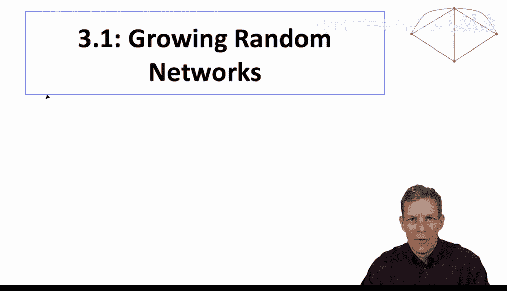

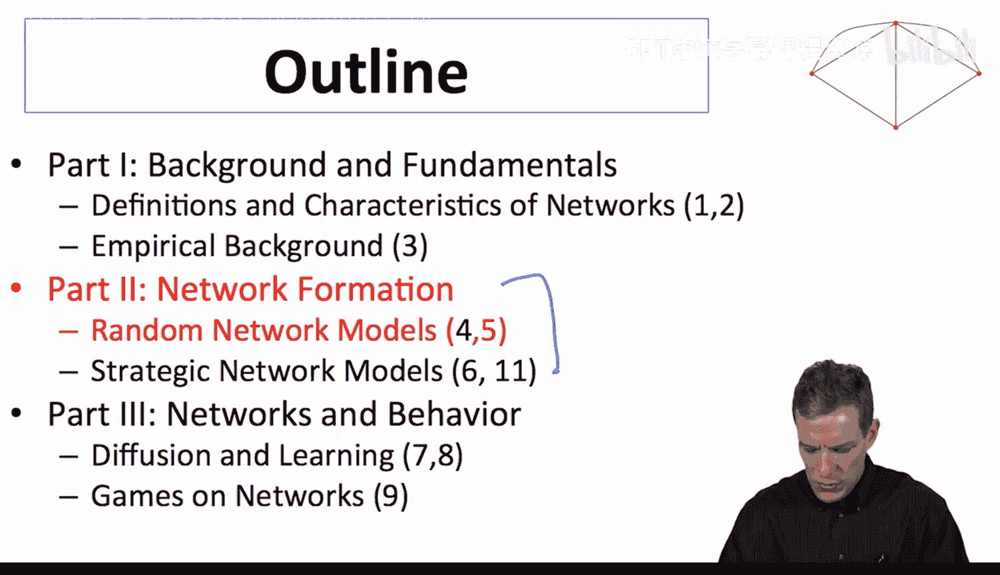

## 概述
在本节课中，我们将学习增长随机网络模型。我们将探讨节点随时间不断加入网络的动态过程，理解这种模型如何自然地产生节点度的异质性，并计算其度分布。

---

## 为什么需要增长随机网络？🤔

上一节我们介绍了静态随机网络模型。本节中，我们来看看动态的、节点随时间增长的随机网络模型。

现实世界中有许多网络是动态增长的。例如：
*   **引文网络**：新发表的论文可以引用旧论文，但旧论文无法引用新论文。因此，随着时间的推移，较早的论文会积累更多的引用链接。
*   **网页网络**：新的网页不断被创建并链接到现有网页。
*   **合作网络**：资深研究者通常比年轻研究者拥有更多的合作者。

这些例子表明，仅仅因为“年龄”差异，网络中就会自然形成节点度的异质性（即有些节点连接多，有些连接少）。增长随机网络模型能帮助我们理解这种异质性是如何产生的，而无需在模型假设中直接引入复杂的统计分布。

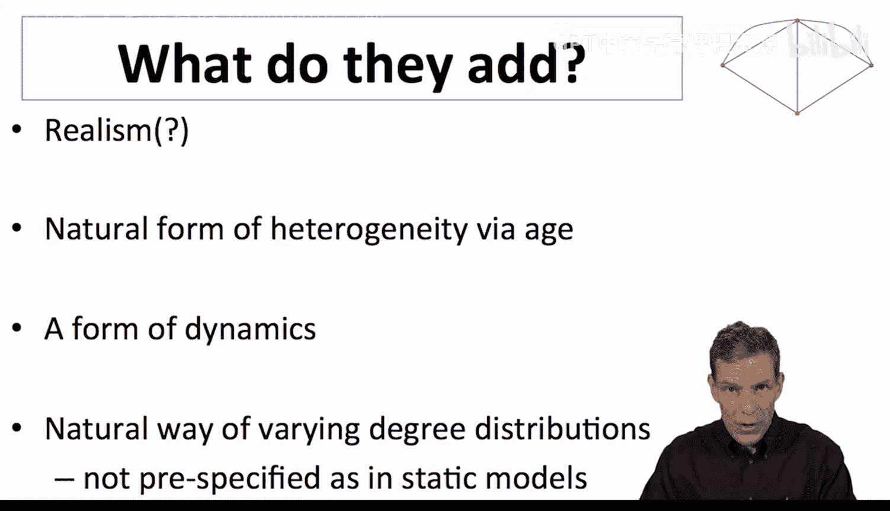

---

## 基础模型：均匀随机增长 🔗

为了建立增长随机网络模型，我们从经典的埃尔德什-雷尼（Erdős–Rényi）随机网络出发，并加入节点随时间增长的特性。

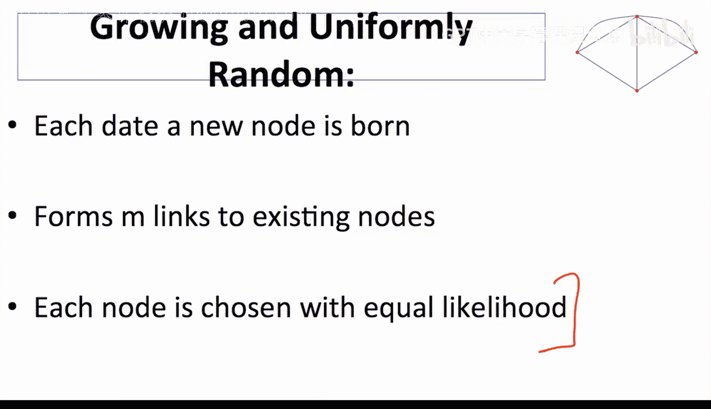

以下是模型的基本设定：
1.  **初始种子**：我们从 `m` 个完全连接的节点开始，以确保新节点有连接对象。
2.  **节点出生**：在每个时间点 `t`（`t = 1, 2, 3...`），有一个新节点加入网络。
3.  **链接形成**：每个新节点在出生时，会与网络中已有的 `m` 个节点建立链接。这些链接对象是从所有现有节点中**均匀随机**选择的。
4.  **链接积累**：节点只在出生时主动建立链接，但之后可以被动地获得来自未来新节点的链接。

因此，对于一个在时间 `i` 出生的现有节点，当时间 `t`（`t > i`）有一个新节点加入时，它获得一条新链接的概率大约是 `m / t`。随着网络规模（`t`）增大，任何特定节点获得新链接的概率会下降。

---

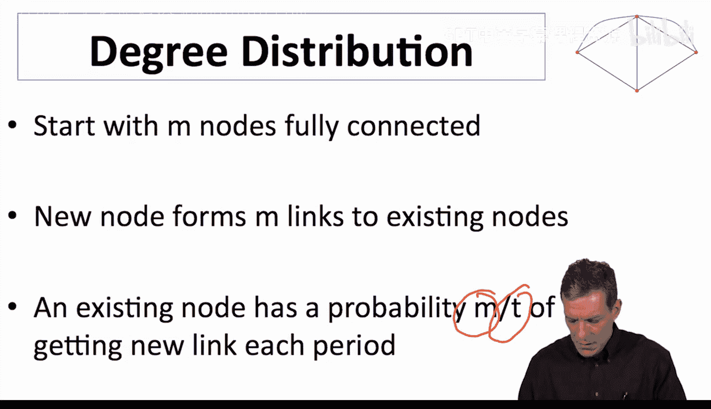

## 计算节点的期望度 📊

现在，我们来计算在时间 `T`，一个在时间 `i`（`i > m`）出生的节点的期望连接数（即期望度）。

节点的期望度由两部分组成：
1.  **出生时的链接**：节点出生时主动建立的 `m` 条链接。
2.  **后续积累的链接**：在出生后的每个时间点，新节点可能与之链接带来的期望增益。

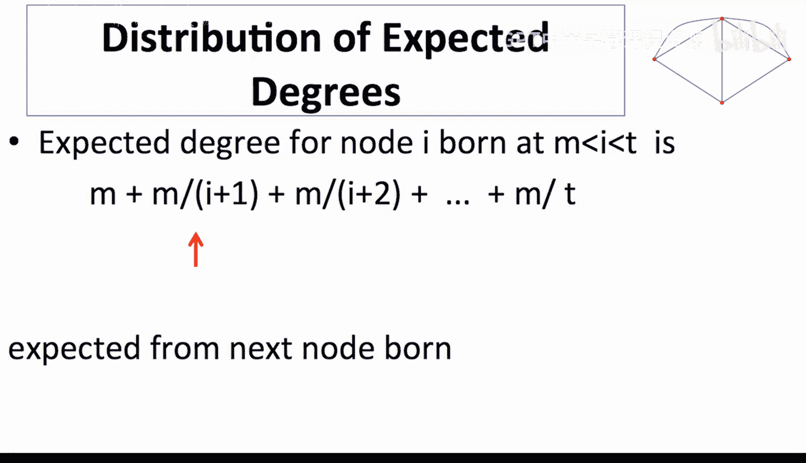

具体计算如下：
*   在时间 `i`，节点获得 `m` 条链接。
*   在时间 `i+1`，新节点带来 `m` 条新链接，该节点获得一条的概率为 `m/(i+1)`。
*   在时间 `i+2`，概率为 `m/(i+2)`。
*   … 以此类推，直到时间 `T`。

因此，到时间 `T` 时的总期望度 `d_i(T)` 为：
`d_i(T) = m + m/(i+1) + m/(i+2) + ... + m/T`

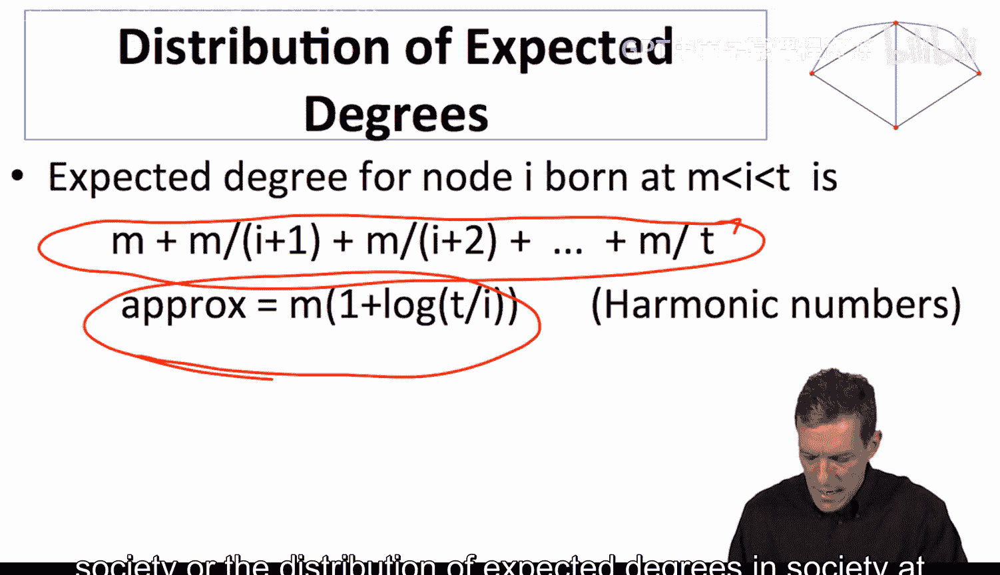

这个求和近似于调和级数。对于较大的 `T` 和 `i`，一个很好的近似公式是：
`d_i(T) ≈ m * [1 + log(T / i)]`
其中 `log` 是自然对数。

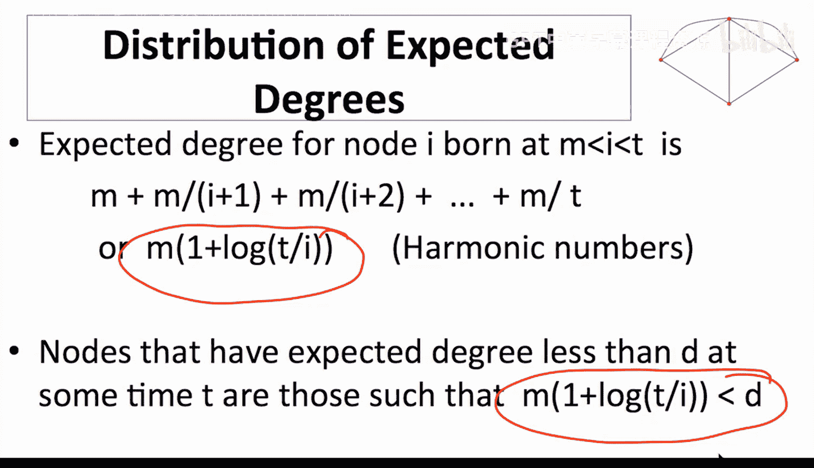

这个公式表明，节点的期望度与其“年龄”（`T/i`）的对数成正比。**节点出生越早（`i` 越小），其期望度就越高**。

---

## 分析度分布 📉

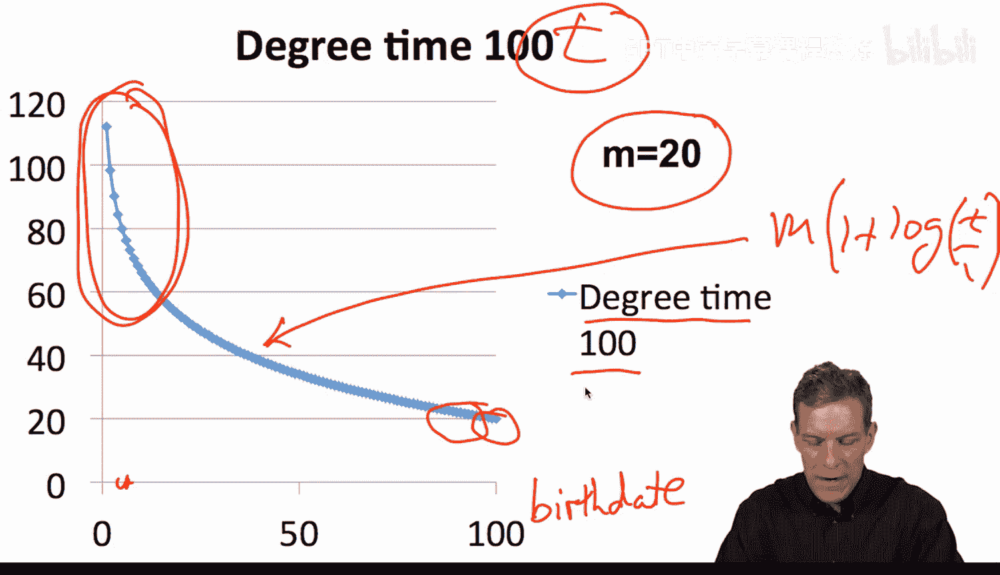

根据期望度公式 `d_i(T) ≈ m * [1 + log(T / i)]`，我们可以推导出在时间 `T` 网络的度分布。

我们关心的问题是：在时间 `T`，期望度小于某个值 `d` 的节点比例是多少？

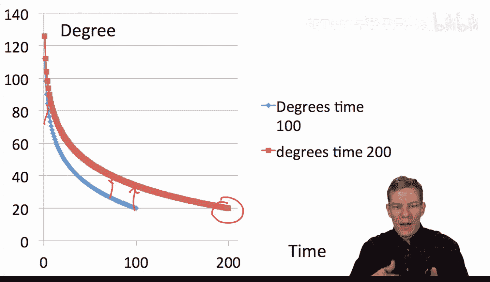

以下是推导步骤：
1.  **确定临界点**：找到满足 `m * [1 + log(T / i)] = d` 的出生时间 `i`。解这个方程得到：
    `i = T * exp(- (d - m)/m )`
2.  **计算比例**：所有在 `i` 之后出生的节点（即出生时间大于 `i` 的节点），其期望度都小于 `d`。在时间 `T`，总节点数为 `T`。因此，期望度小于 `d` 的节点比例 `F_T(d)` 为：
    `F_T(d) ≈ 1 - i/T = 1 - exp(- (d - m)/m )`

这个结果意味着，在增长随机网络模型中，**节点度（减去初始链接数 `m`）近似服从指数为 `-1/m` 的指数分布**。这是一个右偏的分布，大部分节点的度较低，少数早期节点拥有很高的度。

---

## 实例说明与模型意义 🧮

让我们通过一个具体例子来理解这个分布。

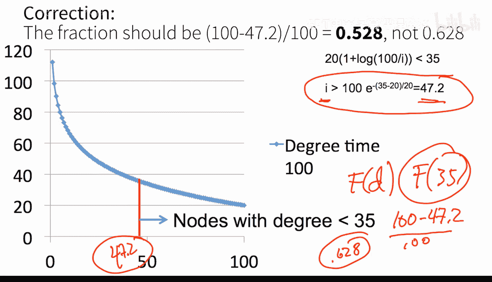

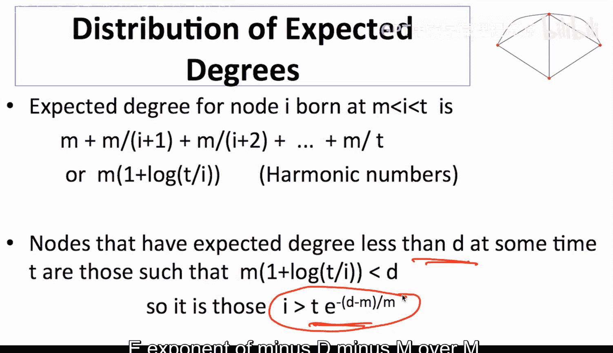

假设 `m = 20`，在时间 `T = 100`。我们想知道有多少节点的期望度小于 35。
*   根据公式 `F_{100}(35) ≈ 1 - exp(- (35-20)/20 ) = 1 - exp(-0.75) ≈ 0.528`。
*   这意味着大约 **52.8%** 的节点期望度小于 35。

这个简单的增长过程（均匀随机连接）**自然地产生了度的不均匀分布**。早期节点因为面对更小的“竞争池”（节点总数少），更容易获得新链接，从而形成“富者愈富”的优势。这解释了为何在引文、合作等网络中，资深者通常拥有更高的连接度。

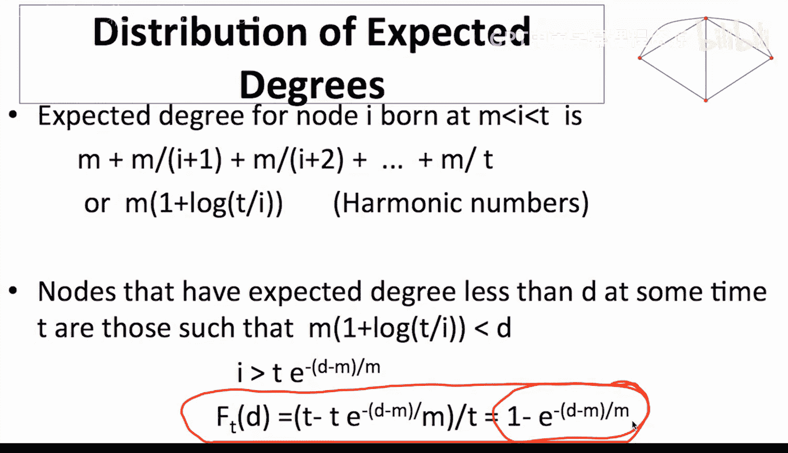

需要指出的是，我们计算的是**期望度**的分布。对于有限大的 `T`，实际观测到的度会围绕期望值波动。但当 `T` 很大时，根据大数定律，实际度的分布会很好地逼近这个期望度的分布。

---

## 总结

本节课中我们一起学习了增长随机网络的基础模型。
*   我们首先介绍了**为什么需要研究增长网络**——为了捕捉现实网络中因节点年龄差异而产生的自然异质性。
*   然后，我们构建了一个简单的**均匀随机增长模型**，其中新节点均匀随机地连接到现有节点。
*   通过分析，我们推导出任意节点的**期望度公式**：`d_i(T) ≈ m * [1 + log(T / i)]`，并发现早期节点具有度优势。
*   最后，我们得到了该模型的**度分布**，它近似为一个指数分布：`F_T(d) ≈ 1 - exp(- (d - m)/m )`。

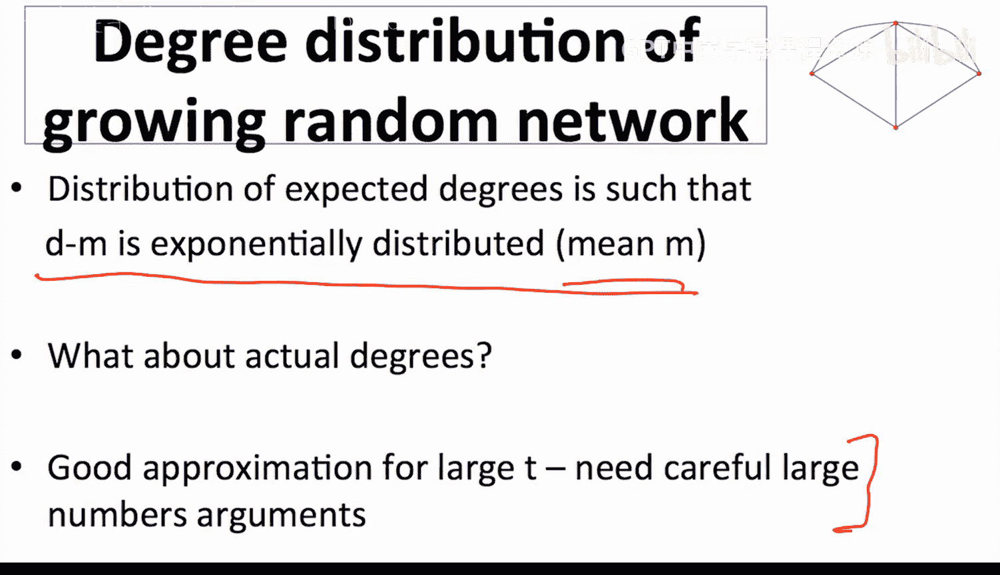

这个模型展示了，即使每个新节点都以完全随机的方式建立连接，单纯的网络增长动力学也能导致节点度出现显著差异。这为我们理解现实网络中的不平等结构提供了一个简洁而有力的理论起点。在接下来的课程中，我们将探讨更丰富的增长模型，以生成更接近现实世界（如幂律分布）的度分布。