#  025：平均场近似 📊

在本节课中，我们将深入探讨增长随机网络模型，并重点介绍一种用于求解此类模型的有用技术——平均场近似。我们将学习如何通过建立微分方程来近似节点度数的动态变化，并理解不同链接形成机制（如均匀随机连接与优先连接）如何导致不同的网络度分布。

---

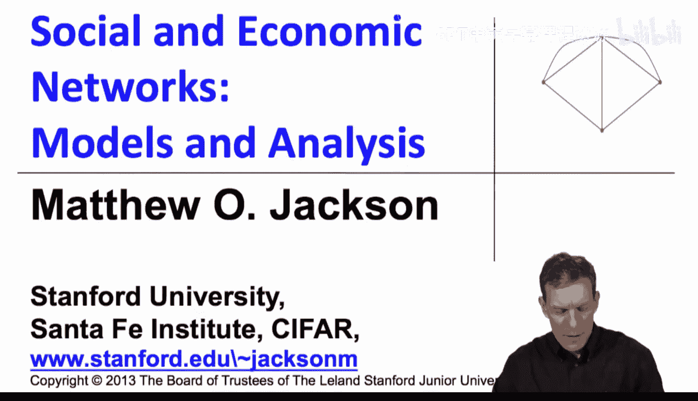

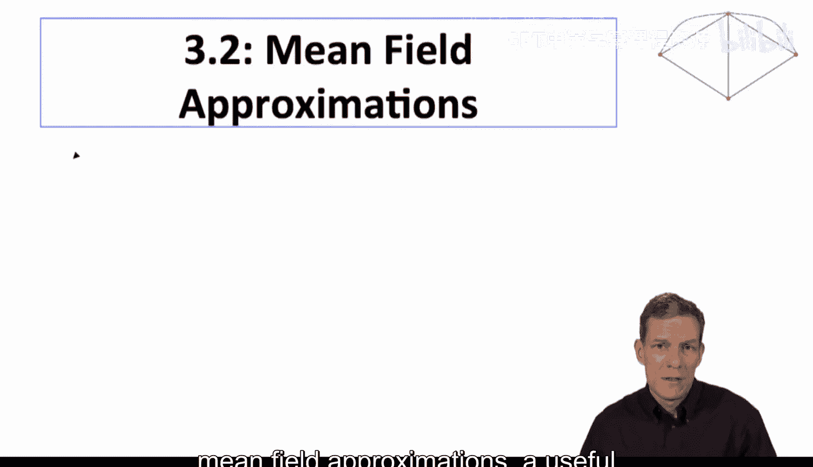

上一节我们介绍了增长随机网络的基本概念，本节中我们来看看如何使用平均场近似来简化模型分析。

平均场近似的核心思想是，我们不直接计算每个节点随时间获得链接的精确期望数量，而是采用连续时间近似。这允许我们通过求解一个微分方程，来推导节点期望度数随时间变化的规律。

让我们回到之前讨论的简单埃尔德什-雷尼模型变体。在该模型中，每个新节点在诞生时，会随机与 **M** 个现有节点建立链接。现在，我们将其平滑化，进行连续时间近似。

以下是该模型的基本结构推导：

首先，初始条件。当节点 **i** 在时间 **i** 诞生时，其度数 **d(i)** 为 **M**。公式表示为：
`d(i) = M`

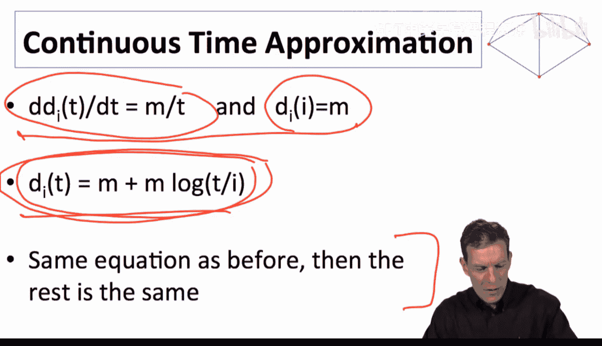

其次，度数随时间的变化率。节点 **i** 的度数 **d** 对时间 **t** 的微分 **dd/dt** 是多少？在每个时间单位，系统会形成 **M** 条新链接，而当时共有 **t** 个现有节点。因此，节点 **i** 获得其中一条新链接的概率是 **M/t**。所以，其度数的增长率与 **M/t** 成正比。微分方程为：
`dd/dt = M / t`

现在我们有了一个微分方程及其初始条件，求解变得相当简单。求解该微分方程，我们得到节点 **i** 在时间 **t** 的期望度数 **d(t)** 为：
`d(t) = M + M * log(t / i)`

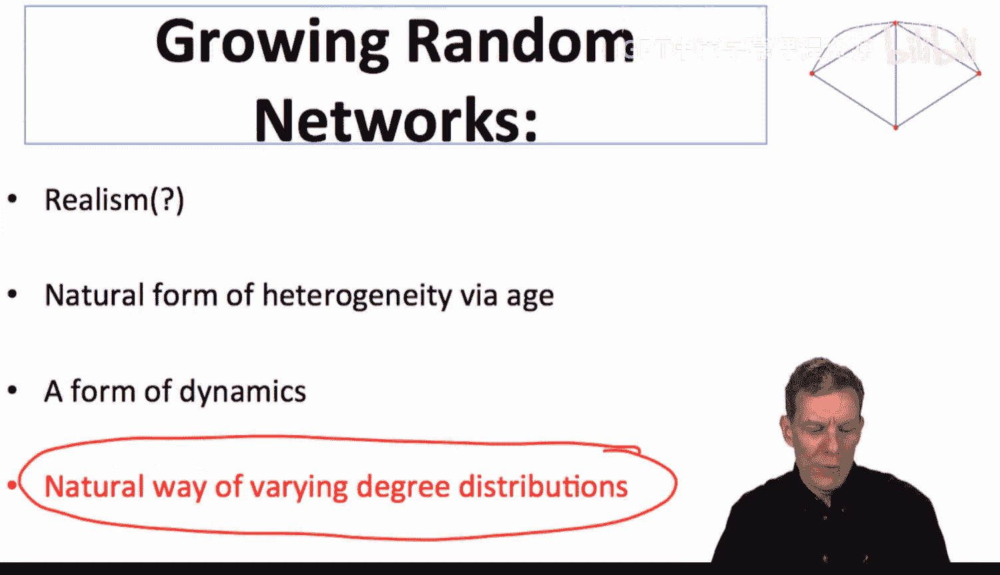

这个结果与我们之前通过精确计算得到的方程完全一致。一旦我们有了这个随时间变化的度数公式，计算度分布函数就很简单了。例如，要找出在时间 **t** 时度数小于某个值（如35）的节点数量，只需找出满足 `d(t) < 35` 条件的节点 **i** 即可。

这种方法表明，通过建立初始条件和微分方程，我们可以更简便地分析增长网络模型。你只需回忆或查阅微分方程知识，就能找到此类方程的解。

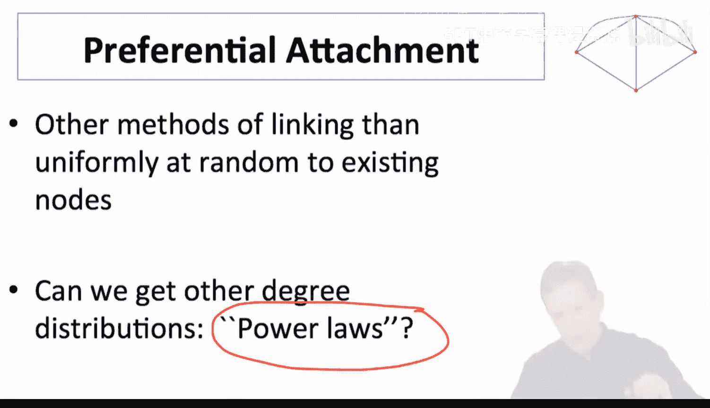

---

以上我们讨论了增长网络的度分布，现在让我们更详细地探讨其特性。

我们提到，这种模型通过“年龄”自然引入了异质性：更早出生的节点倾向于拥有更多链接。这为我们提供了一种动态视角。更重要的是，通过改变新节点形成链接方式的假设，我们可以自然地得到不同的度分布。

优先连接是这些增长系统中，最著名的替代性链接形成机制之一。它与均匀随机连接不同，能帮助我们得到像幂律分布这样的度分布，其特点是具有“肥尾”——即拥有极高或极低链接数的节点数量远超随机网络的预期。

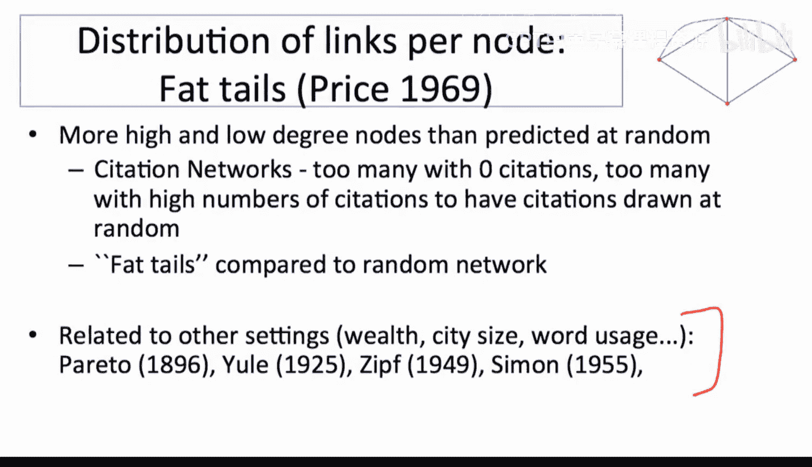

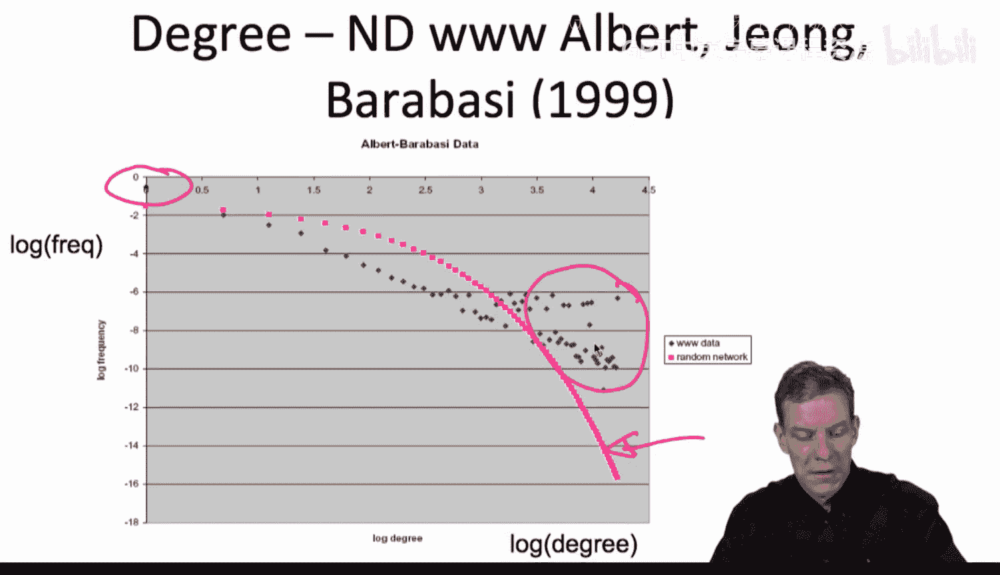

以下是支持幂律分布存在的一些早期证据和现象：

*   **引文网络**：普赖斯的研究发现，引文网络中无引用的论文和引用数极高的论文都过多，这无法用均匀随机连接解释。
*   **其他领域**：财富分布、城市规模、词汇使用频率等许多现象都表现出这种肥尾特征。
*   **万维网**：阿尔伯特和巴拉巴西对圣母大学部分网页的分析显示，高度数节点和低度数节点的数量都超过了均匀随机增长网络的预测曲线（即我们刚刚推导的指数型分布曲线）。这表明现实网络具有更“肥”的尾部。

西蒙在20世纪50年代提出的幂律解释模型，指出了产生这种现象的两个关键属性：

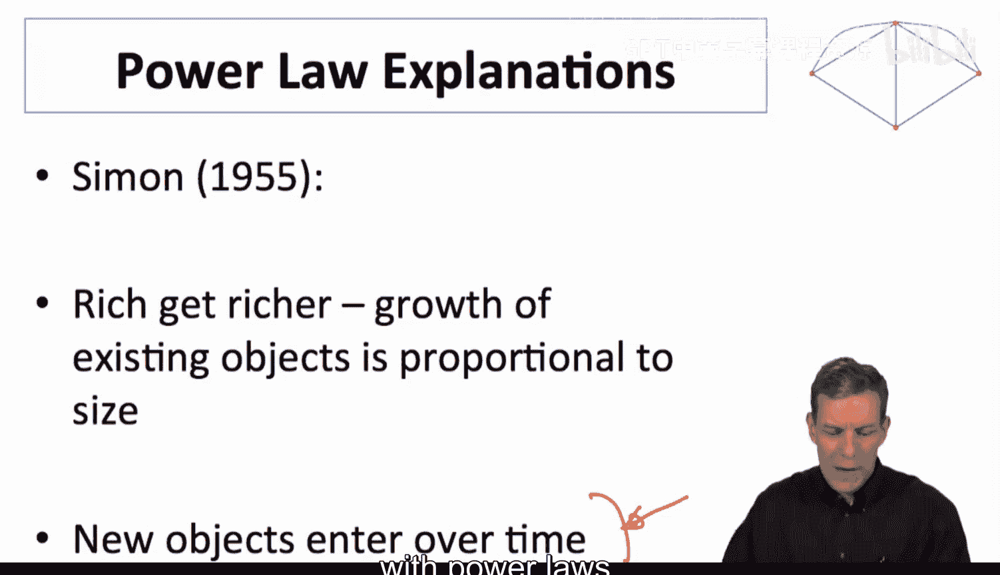

1.  **增长性**：新对象（节点、文章、城市等）随时间不断加入系统。
2.  **富者愈富**（优先连接）：现有对象获得新连接的概率与其已有规模（如链接数、财富、人口）成正比。这导致了一种乘性增长。

当增长性与优先连接结合时，系统就容易产生幂律分布。

普赖斯在引文网络研究中提出了一个简单版本的优先连接模型。巴拉巴西和阿尔伯特将其推广到更一般的优先连接模型类别。之前的均匀随机增长模型无法生成足够肥的尾部，因此我们现在考察的模型是：节点仍随时间诞生，但新链接的形成概率不再均匀随机，而是与目标节点已有的链接数成正比。这就是“富者愈富”机制，即优先连接到已拥有大量链接的节点。

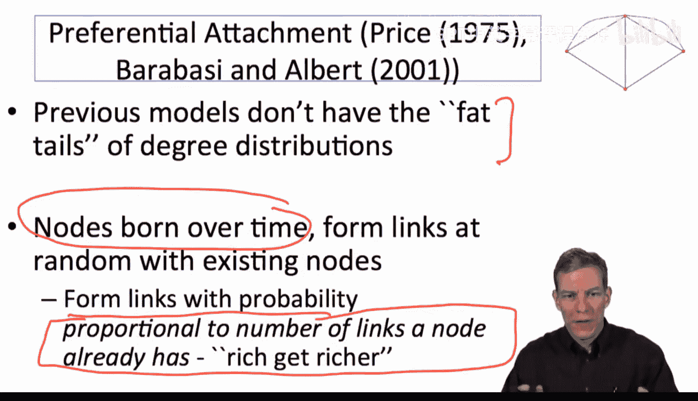

---

如果我们模拟一个这样的网络（例如，每个新节点形成2条链接），会观察到什么？我们会发现，早期出生的节点（如2、3、4号）比后期出生的节点拥有多得多的链接。虽然也有少数后期节点获得了额外链接，但大多数获得额外链接的都是那些一开始就有链接的节点。链接越多，就越容易获得新链接。在这个模拟中，度数最大的节点是2号节点。与埃尔德什-雷尼类系统相比，优先附件系统产生了更倾斜的网络结构。

---

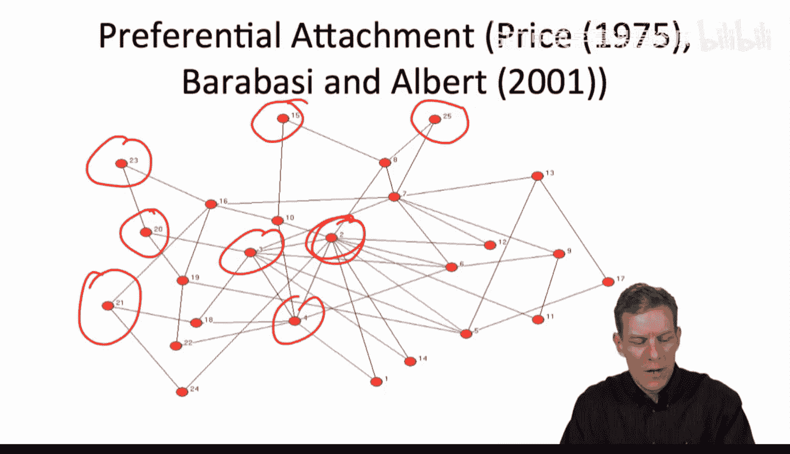

本节课中，我们一起学习了平均场近似这一分析增长随机网络模型的强大工具。我们通过建立和求解微分方程，推导了均匀随机连接下节点度数的变化规律。接着，我们探讨了优先连接机制的原理，并了解到它是解释现实世界中许多网络（如引文网络、万维网）呈现幂律度分布的关键。这种“富者愈富”的动态过程，与网络的增长特性相结合，能够产生具有肥尾特征的度分布。

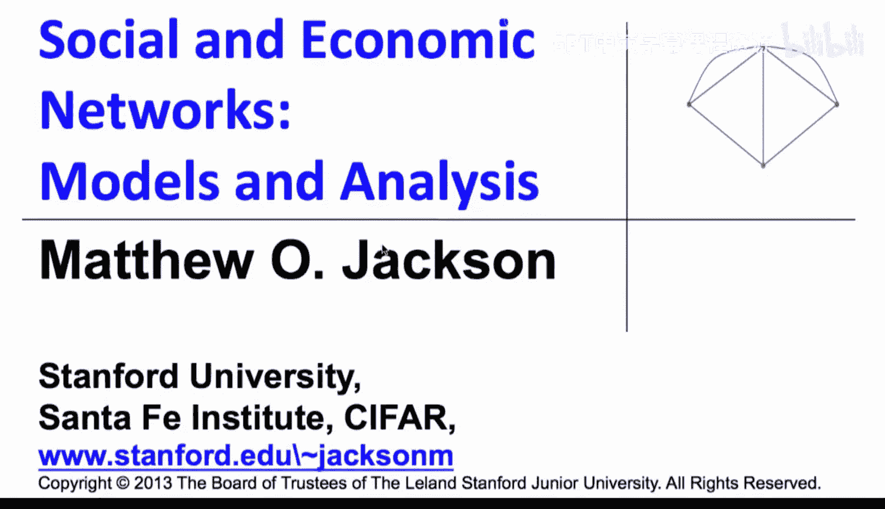

接下来，我们将更深入地分析优先附件模型下的精确度分布，并开始比较优先附件与其他网络形成模型。