#  026：优先连接模型详解 📈

在本节课中，我们将深入探讨优先连接模型，理解它如何生成网络链接以及度分布。我们将通过简单的数学推导，展示该模型如何产生幂律分布，这是许多真实网络（如万维网）的关键特征。

---

## 模型设定与核心规则

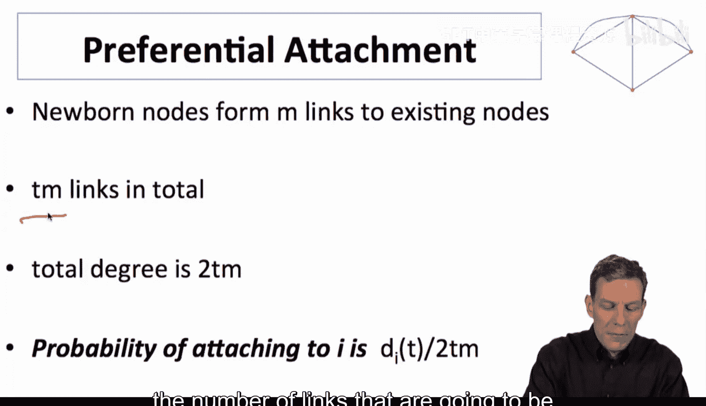

上一节我们介绍了指数模型，本节中我们来看看优先连接模型。该模型同样假设节点随时间依次“出生”。每个新节点在出生时，会与网络中已有的节点建立固定数量的链接。

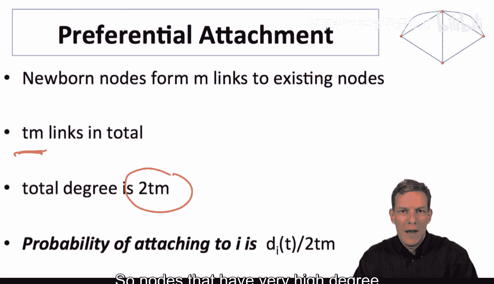

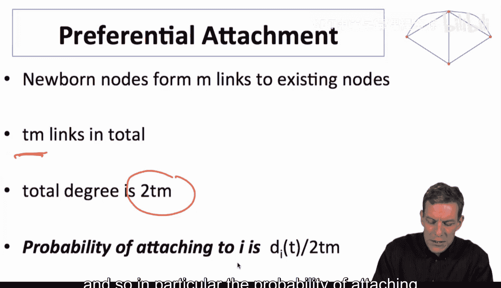

以下是模型的核心设定：

*   **时间与节点**：时间 `t` 记录节点的出生顺序。在时间 `t`，网络中总共有 `t` 个节点。
*   **链接数量**：每个新节点建立 `m` 条链接。因此，在时间 `t`，网络中的总链接数为 `t * m`。
*   **总度数**：由于每条链接贡献两个节点的度数，网络在任意时刻的总度数为 `2 * t * m`。

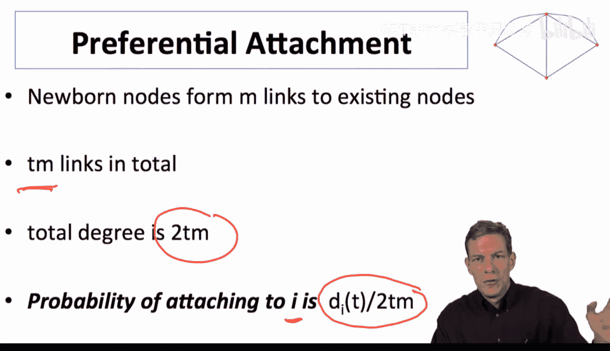

优先连接的核心规则在于新链接的形成方式。与之前每个已有节点被连接概率均等的模型不同，在优先连接模型中，新节点连接到某个已有节点 `i` 的概率，与该节点 `i` 的当前度数成正比。

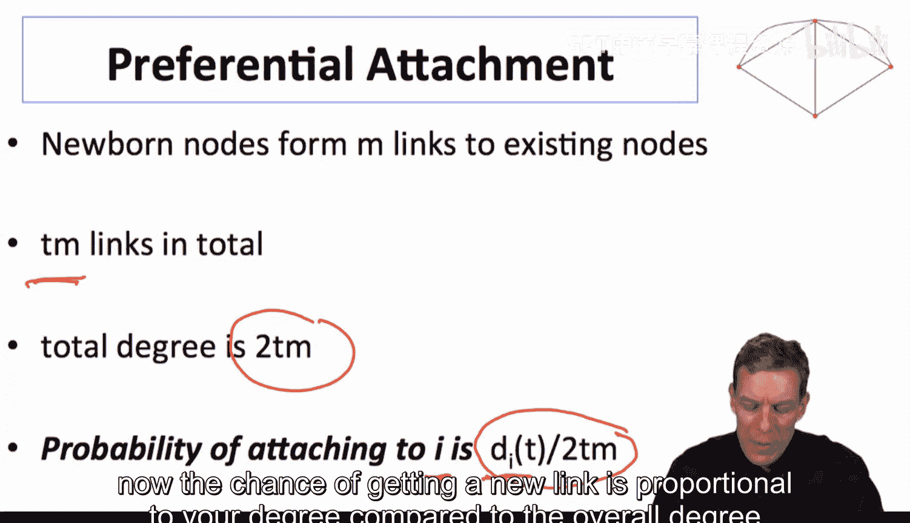

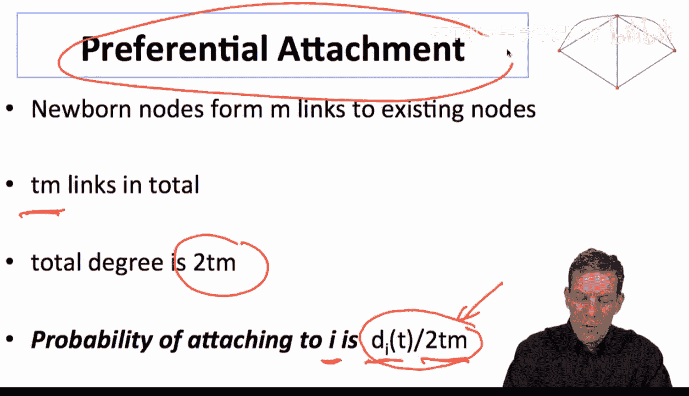

具体公式如下：

**连接概率公式**：
`P(连接到节点 i) = (节点 i 的度数) / (2 * t * m)`

这意味着度数越高的节点，获得新链接的机会就越大，形成“富者愈富”的正反馈效应。

---

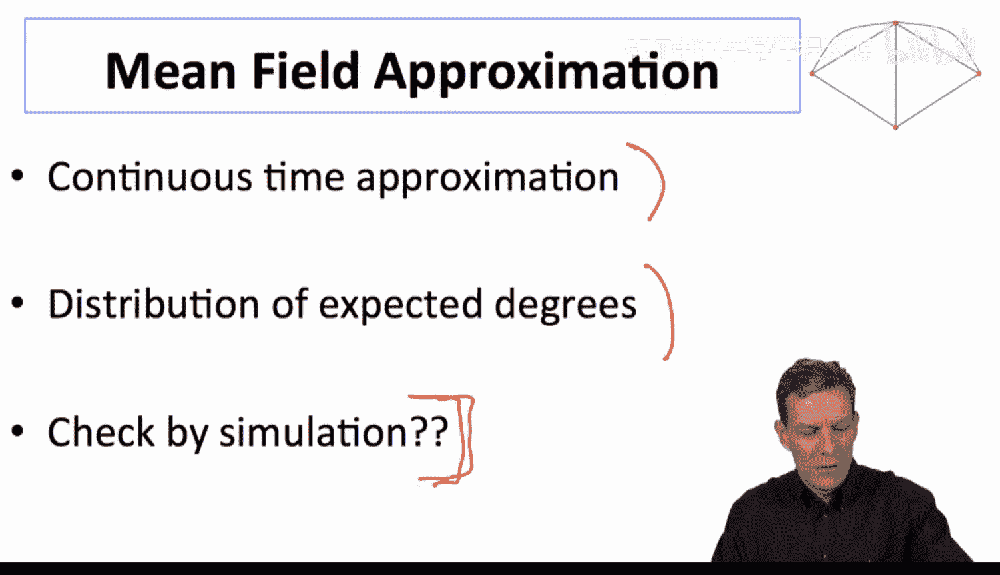

## 平均场近似与度数演化

为了分析模型的宏观行为，我们再次使用平均场近似，将离散过程近似为连续过程，研究期望度数的演化。

当一个节点 `i` 在时间 `i` 出生时，其初始度数为 `m`。此后，它的度数如何随时间增长？根据连接概率公式，在单位时间内，有 `m` 条新链接被创建，节点 `i` 获得其中一条的概率与其度数成正比。

因此，我们可以建立关于节点 `i` 度数 `d_i(t)` 的微分方程：

**度数演化微分方程**：
`d(d_i)/dt = m * [d_i / (2 * t * m)] = d_i / (2 * t)`

这是一个简单的微分方程，结合初始条件 `d_i(i) = m`，可以求解得到节点 `i` 在时间 `t` 的期望度数：

**度数演化公式**：
`d_i(t) = m * (t / i)^(1/2)`

这个公式表明，节点的度数与其“年龄”（`t/i`）的平方根成正比。年龄越大的节点，度数越高。

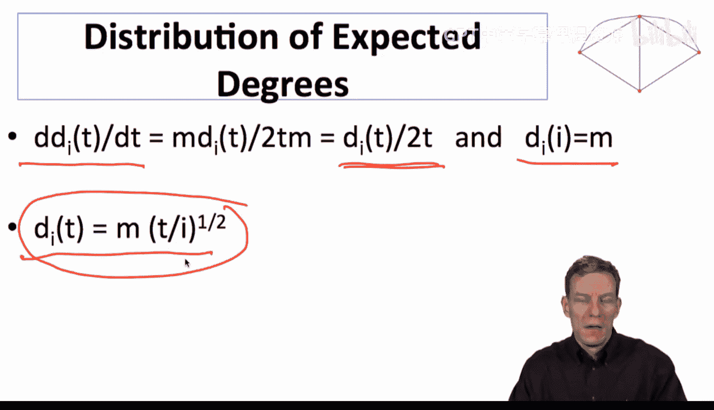

---

## 与均匀随机连接的对比

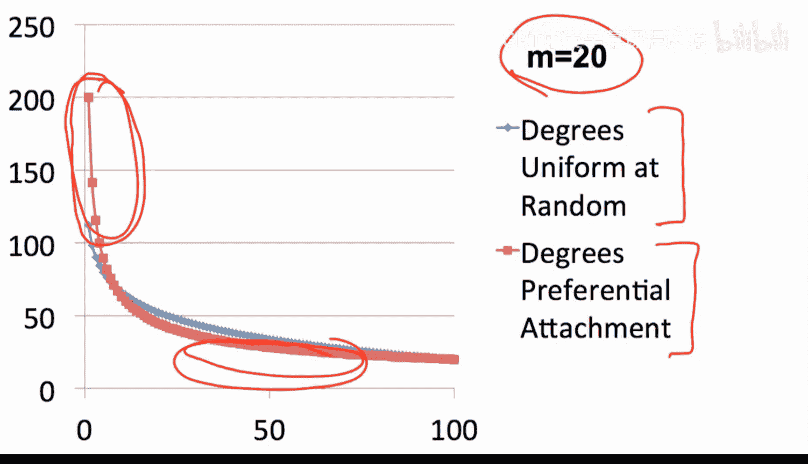

为了直观理解优先连接的效果，我们可以将其与之前讨论的均匀随机连接模型进行对比。假设两个模型中，每个新节点都建立 `m=20` 条链接。

以下是关键差异：

*   在优先连接模型中，**更早出生的节点（年龄大）** 度数增长更快，最终度数远高于均匀随机模型中的同龄节点。
*   相反，**较晚出生的节点（年龄小）** 由于初始度数低，在优先连接规则下更难获得新链接，其最终度数低于均匀随机模型中的同龄节点。

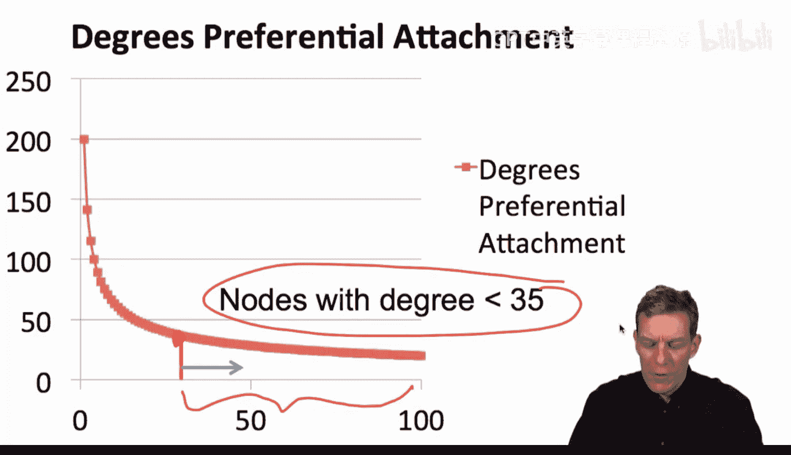

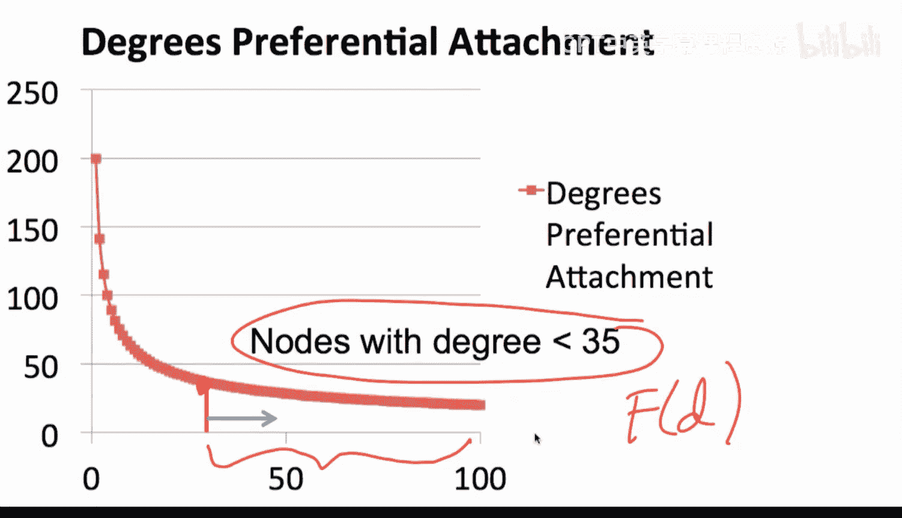

这种“强者恒强”的效应，导致了度分布中**更多的高度数节点和更多的低度数节点**，从而为生成我们观察到的“肥尾”或幂律分布奠定了基础。

---

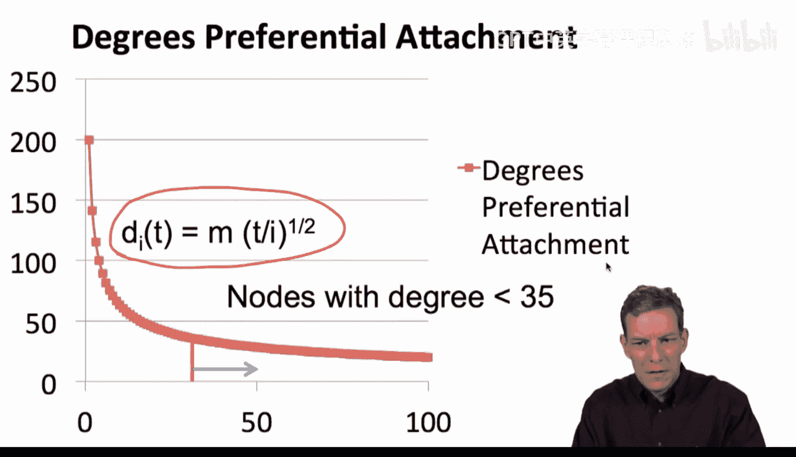

## 推导度分布：获得幂律

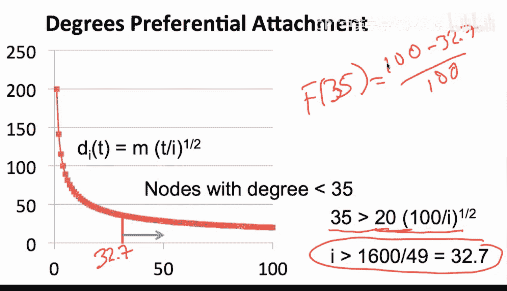

现在，我们来推导在优先连接模型下，网络的度分布函数 `F(d)`，即度数小于等于 `d` 的节点比例。

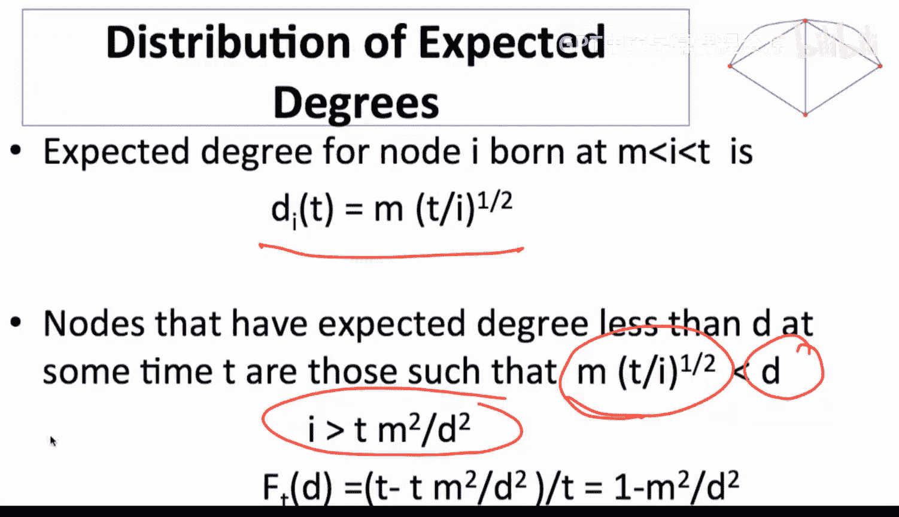

我们已知度数公式 `d_i(t) = m * (t / i)^(1/2)`。在某个固定时间 `t`（例如 `t=100`），我们想知道有多少节点的度数小于某个值 `D`（例如 `D=35`）。

求解不等式 `m * (t / i)^(1/2) < D`，可以得到满足条件的节点出生序号 `i` 的范围：

`i > t * (m / D)^2`

这意味着，所有出生序号大于 `t * (m/D)^2` 的节点，其度数都小于 `D`。因此，度数小于 `D` 的节点比例 `F(D)` 为：

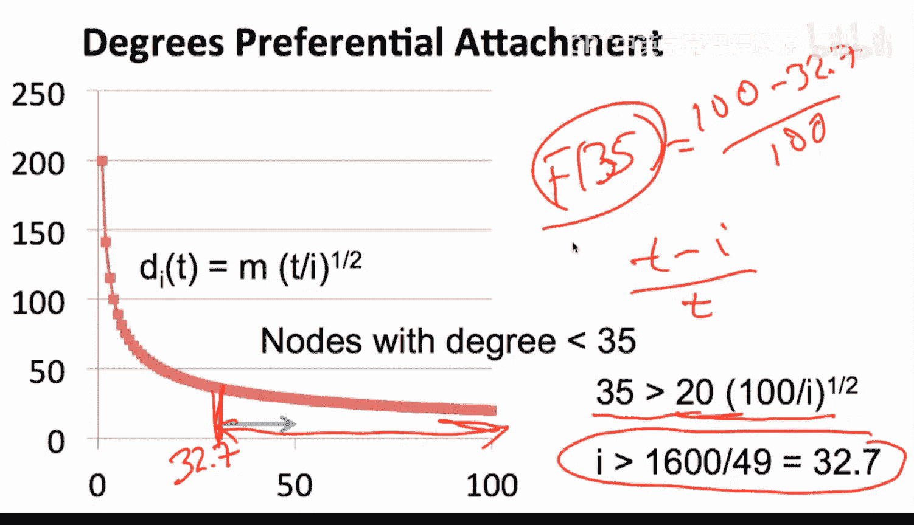

`F(D) = [t - t * (m/D)^2] / t = 1 - (m/D)^2`

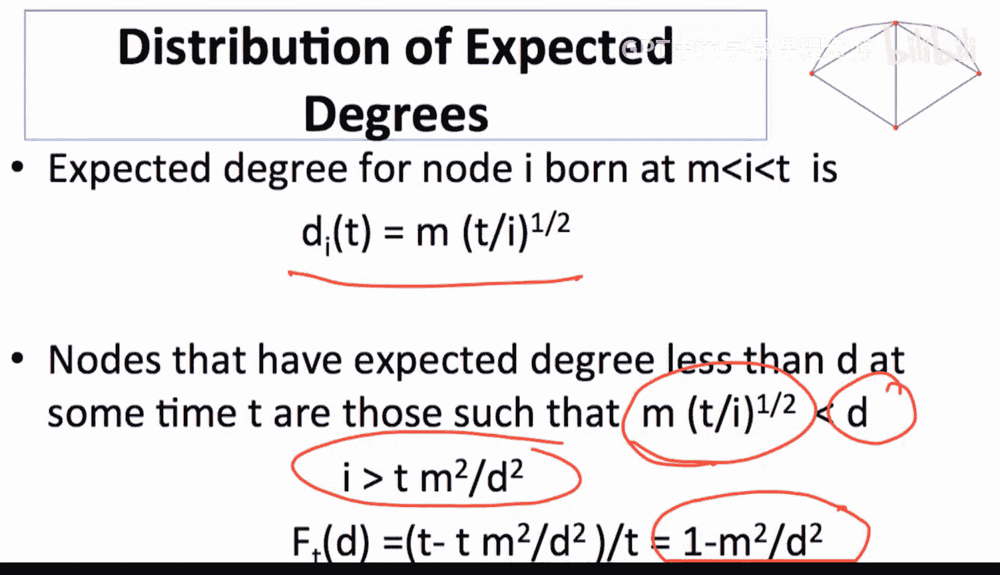

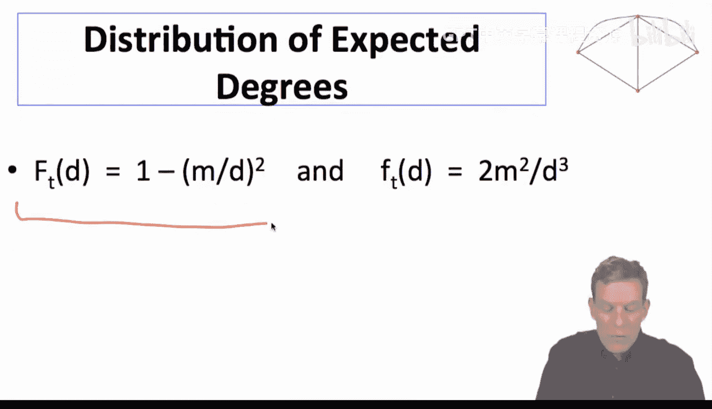

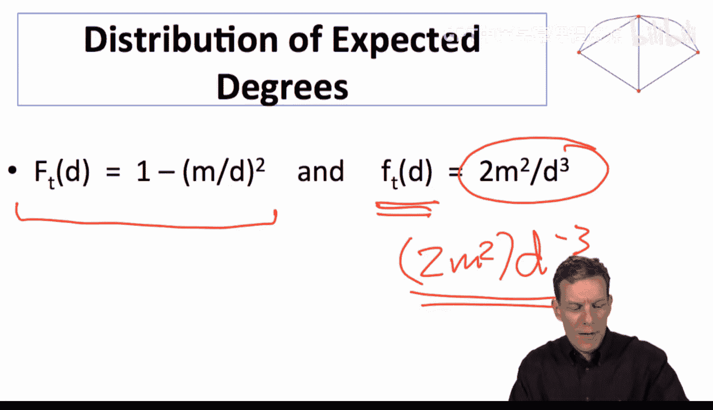

为了得到度分布的**概率密度函数** `f(d)`（即恰好拥有度数 `d` 的节点比例），我们对累积分布函数 `F(D)` 求导：

**度分布概率密度函数**：
`f(d) = dF/dd = 2 * m^2 / d^3`

这个函数形式 `f(d) ∝ d^{-3}` 正是一个**幂律分布**。如果我们对等式两边取对数，会得到一条直线：

`log(f(d)) = log(2*m^2) - 3 * log(d)`

这正是我们在对数坐标图中观察到的幂律特征。值得注意的是，这里的幂指数 `-3` 来自于模型设定（微分方程分母中的 `2`）。通过调整模型，例如改变网络增长速率，可以获得不同的幂指数，从而拟合多样的真实网络数据。

---

## 总结与展望

本节课中我们一起学习了优先连接模型。我们了解到，通过引入“连接概率与节点度数成正比”这一简单规则，模型能够自然地产生具有幂律特征的度分布，这解释了为什么许多现实网络中存在大量“枢纽”节点。

我们推导了节点度数的增长公式 `d_i(t) = m * (t / i)^(1/2)`，并最终得到了度分布的概率密度函数 `f(d) ∝ d^{-3}`。

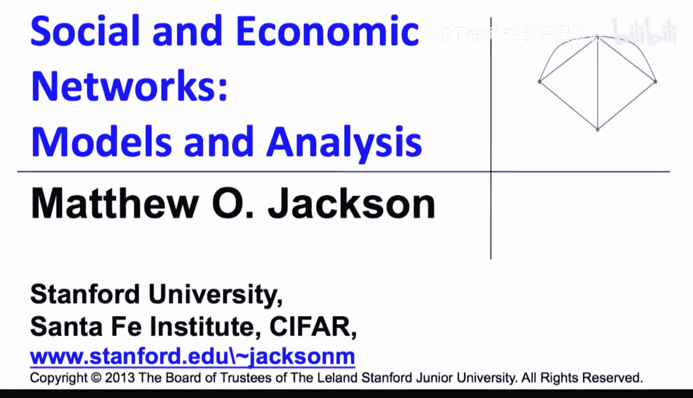

在接下来的课程中，我们将尝试丰富这个模型，构建一个介于均匀随机连接和优先连接之间的谱系。这将使我们能够将这些理论度分布与实际数据（如万维网、社交网络）进行比对，检验哪种模型变体最能刻画真实网络的生长机制。