#  027：混合模型 📊


在本节中，我们将探讨一种介于“均匀随机”模型和“偏好依附”模型之间的混合模型。我们将了解如何通过一个简单的参数来连接这两种模型，并学习如何利用该模型去拟合现实世界中的网络数据，从而判断网络的形成过程更偏向于哪种机制。

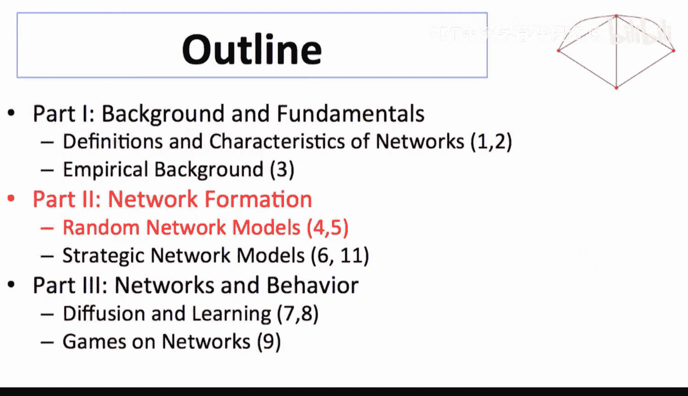

## 概述：混合模型的基本思想

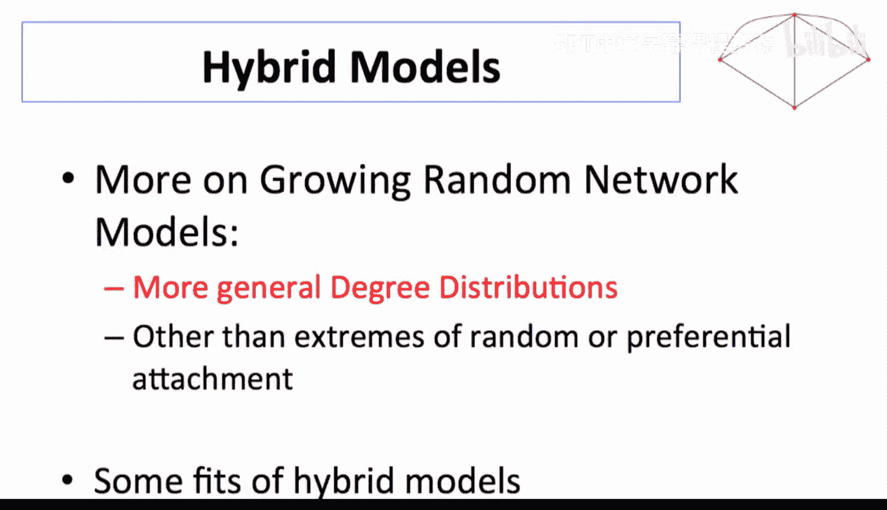

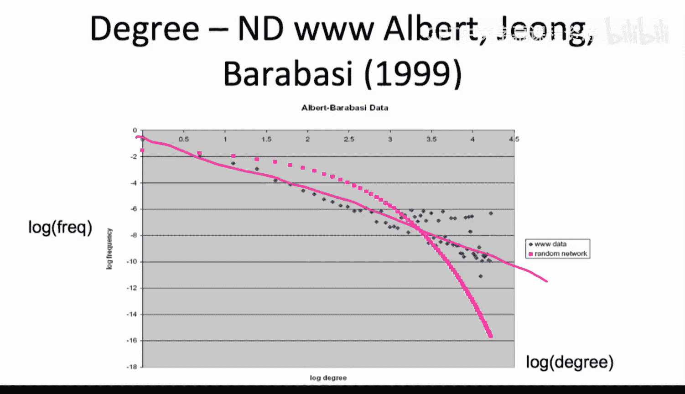

上一节我们介绍了偏好依附模型，它能够生成具有“厚尾”特征的度分布。然而，现实世界中的许多网络（例如合著网络）虽然也表现出厚尾，但其度分布并不完全符合幂律分布。本节我们将介绍一个混合模型，它结合了均匀随机连接和通过朋友网络搜索（即偏好依附）两种机制，从而能够生成介于指数分布和幂律分布之间的一系列度分布。

## 模型构建：随机连接与网络搜索的结合


以下是混合模型的基本设定。我们考虑一个随时间增长的网络，每个新节点在出生时，会建立 `m` 条新链接。这些链接的建立方式分为两种：

1.  **均匀随机连接**：以概率 `a`，新节点从现有节点中**完全随机地**选择连接对象。
2.  **网络搜索连接**：以概率 `1 - a`，新节点首先随机连接一些节点，然后**从这些“朋友”的“朋友”（即邻居）中**选择连接对象。

这个过程非常自然。例如，在万维网上，你可能会随机访问一些网页（均匀随机），然后通过点击这些网页上的链接去发现新的网页（网络搜索）。在社交中，你随机认识一些人，然后通过他们认识他们的朋友。

**核心思想**：网络搜索过程本质上会导致“偏好依附”。因为一个节点的朋友越多（度越高），你在随机探索其朋友网络时，遇到这个高连接度节点的概率就越大。

## 为什么网络搜索导致偏好依附？🤔

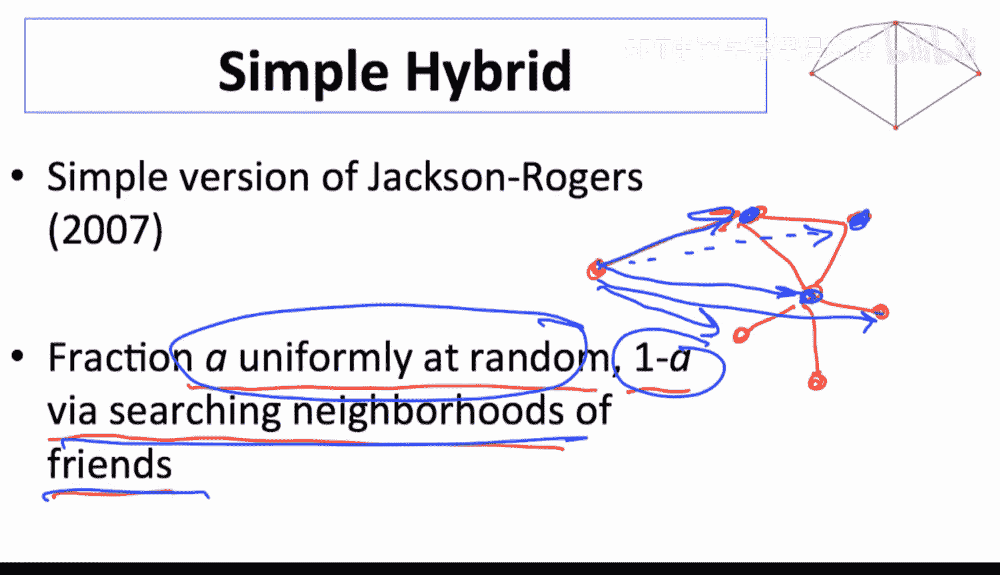

让我们通过一个简单的思想实验来理解这一点。

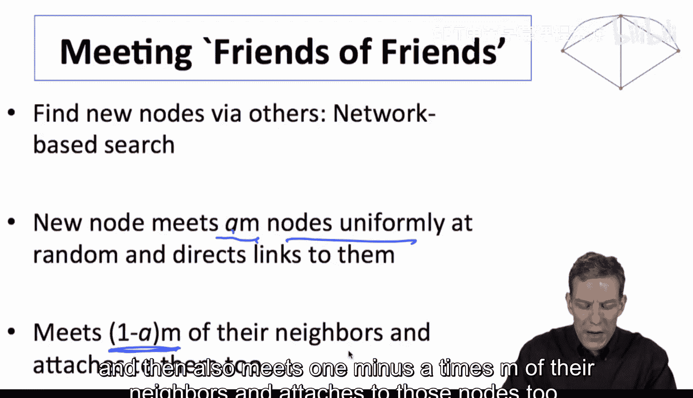

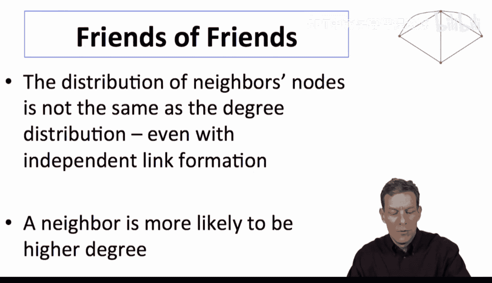

假设网络中有一半节点的度为 `k`，另一半节点的度为 `2k`。现在，我们随机选择一条链接，并观察其一端的节点。

*   一个度为 `2k` 的节点拥有 `2k` 条链接。因此，随机选到一条属于它的链接的概率是另一个节点的两倍。
*   所以，当你通过“朋友的朋友”这种方式寻找节点时，你**更有可能**找到那些高度连接的节点。


**结论**：通过朋友网络进行搜索的连接机制，天然地赋予了高连接度节点更高的被连接概率，这正是“偏好依附”的核心特征。参数 `a` 控制了两种机制的比例：`a` 接近 1 时，模型退化为均匀随机网络；`a` 接近 0 时，模型趋近于纯粹的偏好依附模型。

## 度分布的推导与性质

我们可以沿用之前“平均场近似”的方法来推导该混合模型的度分布。新节点 `i` 在时间 `t` 的期望度 `d_i(t)` 变化满足以下微分方程：


```
dd_i(t)/dt = a * (m/t) + (1 - a) * (d_i(t) / (2t))
```

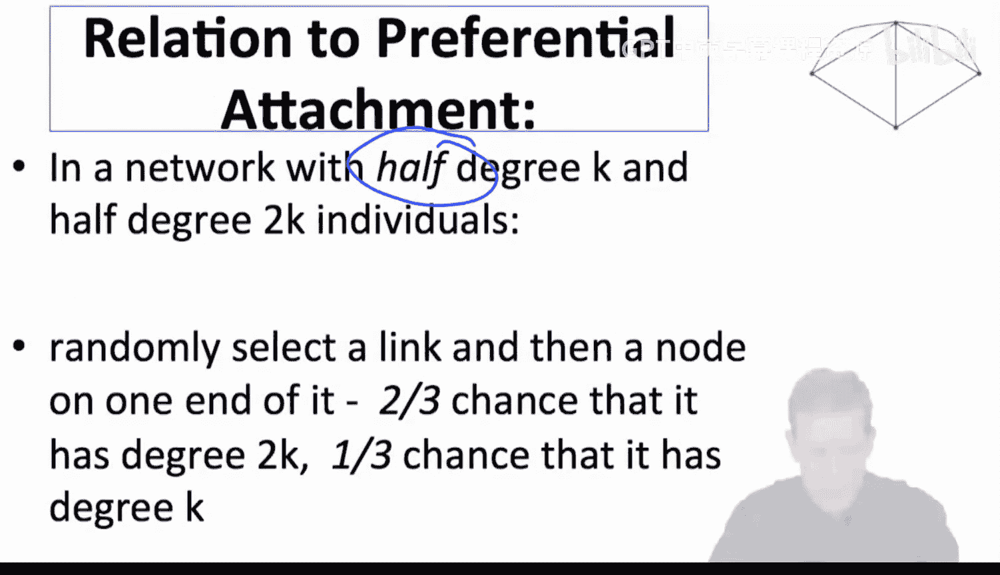

**公式解释**：
*   `a * (m/t)`：来自均匀随机连接部分的贡献，与节点当前度无关。
*   `(1 - a) * (d_i(t) / (2t))`：来自网络搜索（偏好依附）部分的贡献，与节点当前度 `d_i(t)` 成正比。


求解这个微分方程，并经过与之前课程类似的步骤（找出在时间 `t` 时刻度小于 `d` 的节点比例），我们可以得到累积度分布 `F(d)` 的表达式：

```
F(d) = 1 - [ (m/(d*(1-a/2)) + a/2 ) ]^{-2/(1-a)}
```

为了简化，令 `x = 2/(1-a)`，则上式可以写作：

```
F(d) = 1 - [ m/(d*(x-1)/x) + 1/x ]^{-x}
```

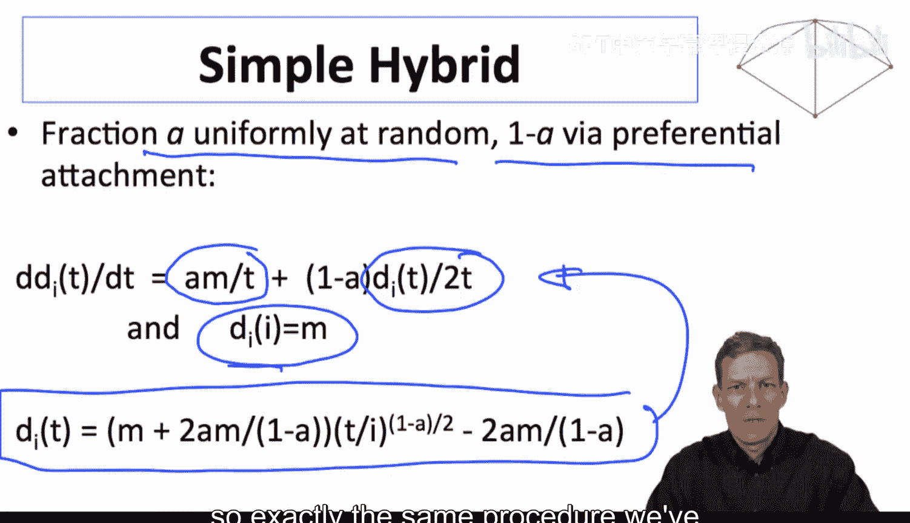

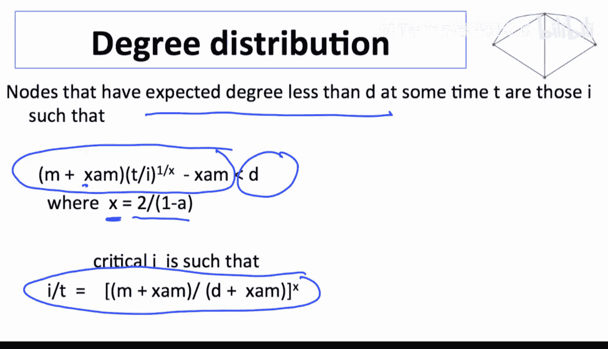

**模型的性质**：
*   当 `a -> 1`（全部随机连接）时，度分布近似为**指数分布**。
*   当 `a -> 0`（全部为网络搜索/偏好依附）时，度分布近似为**幂律分布**，其指数约为 -3。
*   当 `a` 取中间值时，度分布介于两者之间，呈现出“截断的幂律”或“带指数尾的分布”等形态。

## 模型拟合与数据应用

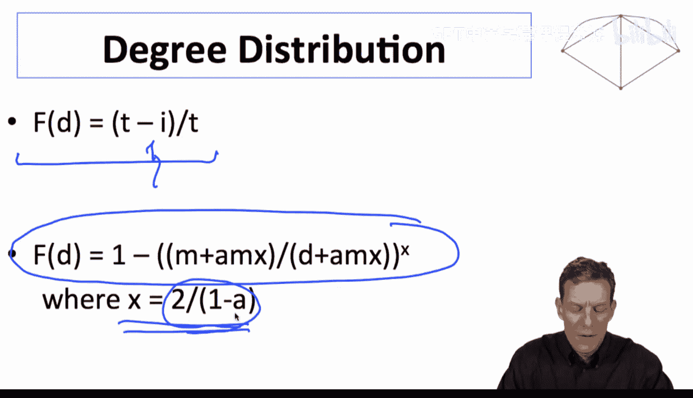

这个混合模型为我们提供了一个强大的工具。我们可以将模型生成的度分布 `F(d)` 与实际观测到的网络度分布进行拟合，从而反推出参数 `a` 的值。

**拟合的意义**：
*   如果拟合出的 `a` 值接近 0，说明该网络的生长过程主要由“朋友推荐”（偏好依附）机制驱动。
*   如果 `a` 值接近 1，说明网络的连接更接近于随机发生。
*   大多数现实网络可能对应一个中间的 `a` 值，表明其形成是随机相遇和社交搜索共同作用的结果。

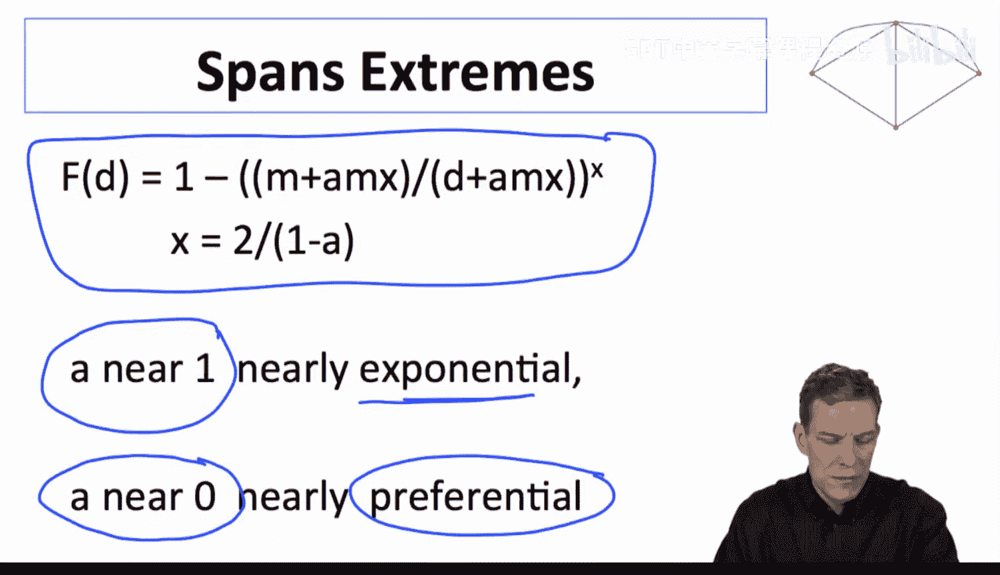

例如，在课程提到的经济学合著网络数据中，其度分布有厚尾但并非完美的直线（在双对数坐标下），这表明它可能适合用一个 `a > 0` 的混合模型来更好地描述，而不是纯粹的偏好依附模型。


## 总结

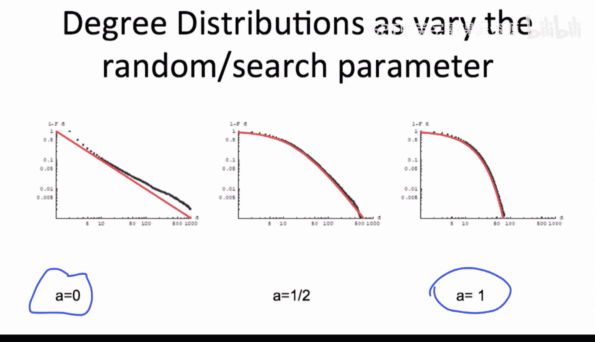

本节课我们一起学习了一种结合均匀随机连接和网络搜索机制的混合随机网络生长模型。


*   **核心机制**：新节点以概率 `a` 随机连接，以概率 `1-a` 通过其已连接节点的邻居进行连接（网络搜索）。
*   **关键洞见**：网络搜索过程自然地导致了“偏好依附”现象，因为高度数节点更容易在其邻居的搜索中被发现。
*   **模型产出**：该模型生成一系列度分布，通过参数 `a` 在指数分布 (`a=1`) 和幂律分布 (`a=0`) 之间平滑过渡。
*   **实际应用**：该模型可用于拟合真实网络数据，通过估计参数 `a` 来量化该网络中随机连接与基于网络结构的连接各自所占的比重，从而帮助我们理解网络背后的形成机制。