#  028：混合模型拟合 📊

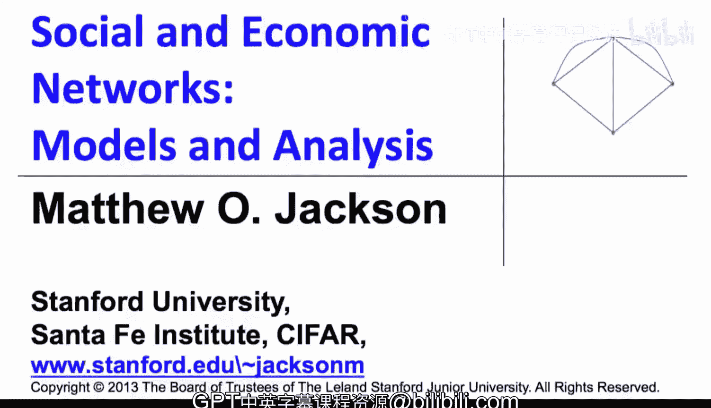

在本节中，我们将学习如何将上一节介绍的混合增长随机网络模型（结合了均匀随机连接和偏好连接）应用于实际数据，并进行参数估计与模型拟合。我们将看到如何通过拟合过程来理解真实网络的生成机制。

---

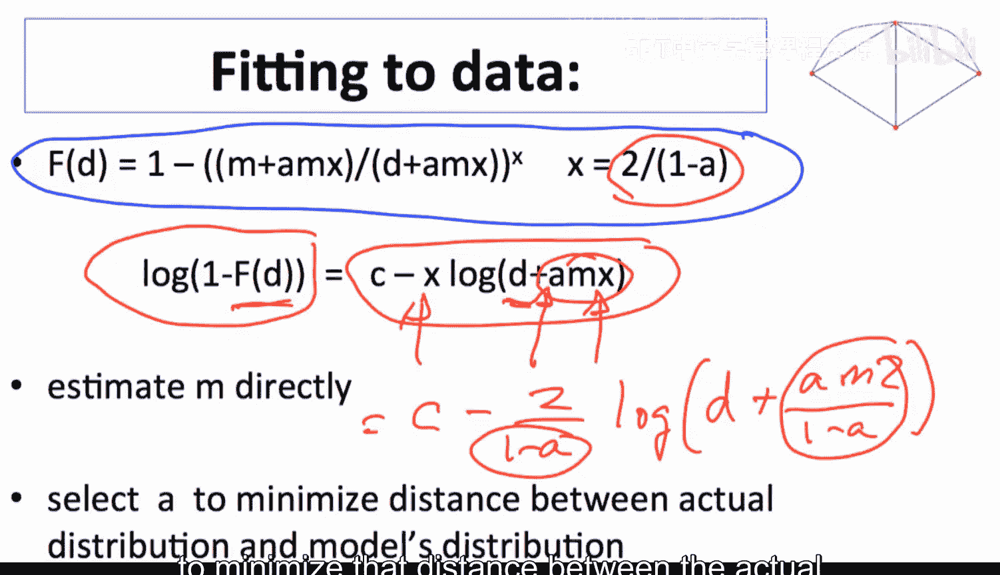

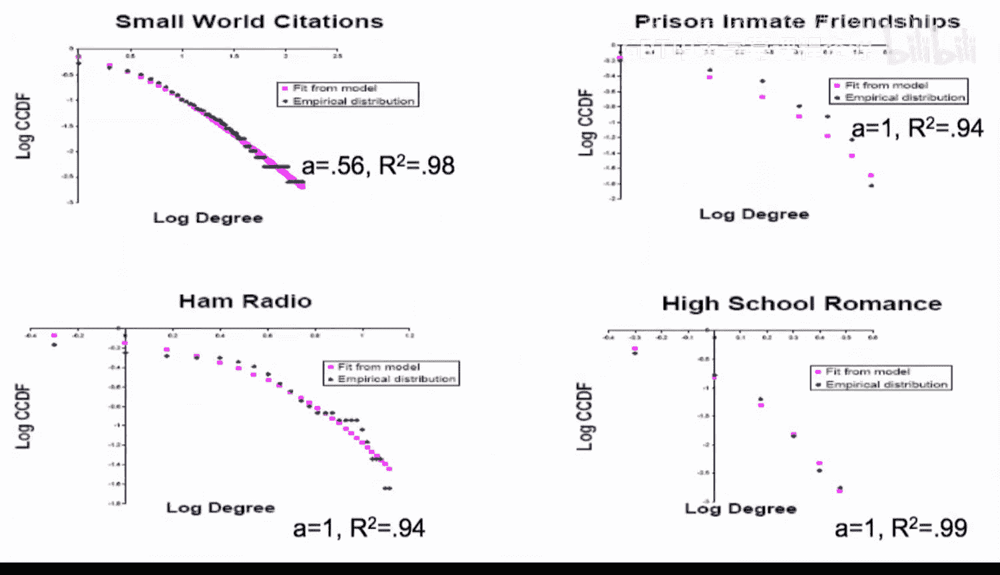

上一节我们介绍了能生成多种度分布的混合增长随机网络模型。本节中，我们来看看如何将这个模型与真实网络数据进行拟合。

模型给出的度分布公式如下：

\[
1 - F(d) \propto d^{-x}
\]

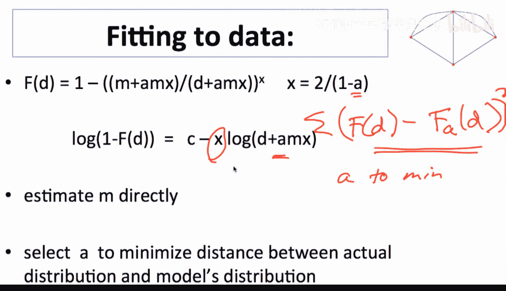

其中，\( x = \frac{2}{1-a} \)，参数 \( a \) 代表了均匀随机连接的比例（\( 1-a \) 则代表通过“朋友的朋友”机制进行偏好连接的比例）。我们的目标是从数据中估计出参数 \( a \)。

拟合这个方程的难点在于，参数 \( a \) 同时出现在公式的多个部分。它不仅直接影响度分布的形状，还通过 \( x \) 间接影响。因此，我们不能简单地通过线性回归来估计 \( a \)。

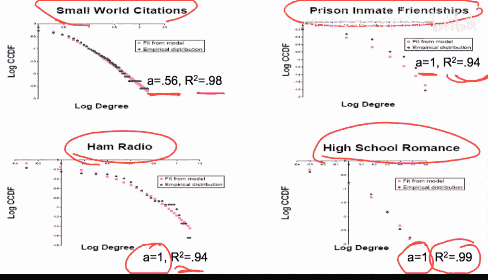

---

为了解决这个问题，我们将采用搜索策略来寻找最优的 \( a \) 值。以下是两种主要方法：

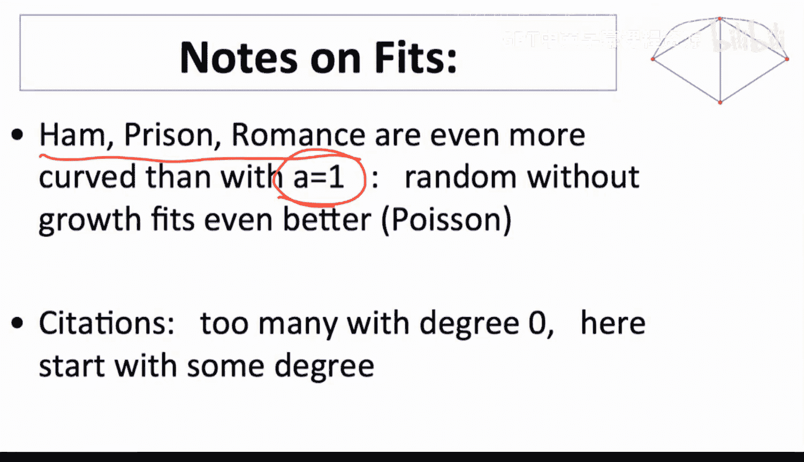

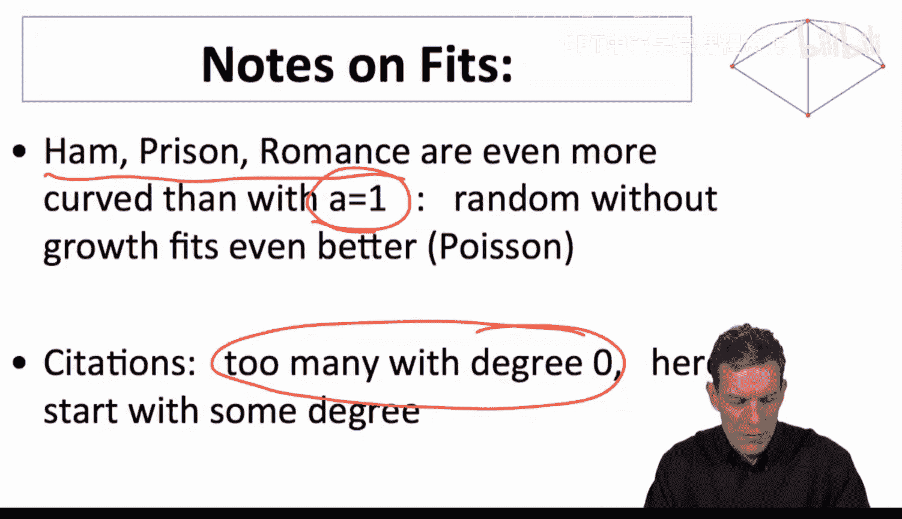

**方法一：网格搜索法**
这种方法较为直接。我们在0到1的区间内预设一系列 \( a \) 值。对于每一个 \( a \)，我们计算模型预测的度分布，然后与观测到的真实度分布进行比较。我们选择那个能使预测分布与真实分布之间差距最小的 \( a \) 值。衡量差距的常用指标是误差平方和。

**方法二：迭代回归法**
这是一种更精巧的数学方法。我们先猜测一个初始的 \( a \) 值，然后进行回归分析，根据回归结果可以得到一个新的 \( a \) 估计值。将这个新估计值代入，再次进行回归，如此反复迭代。可以证明，这个过程是一个“压缩映射”，最终会收敛到正确的 \( a \) 值。

---

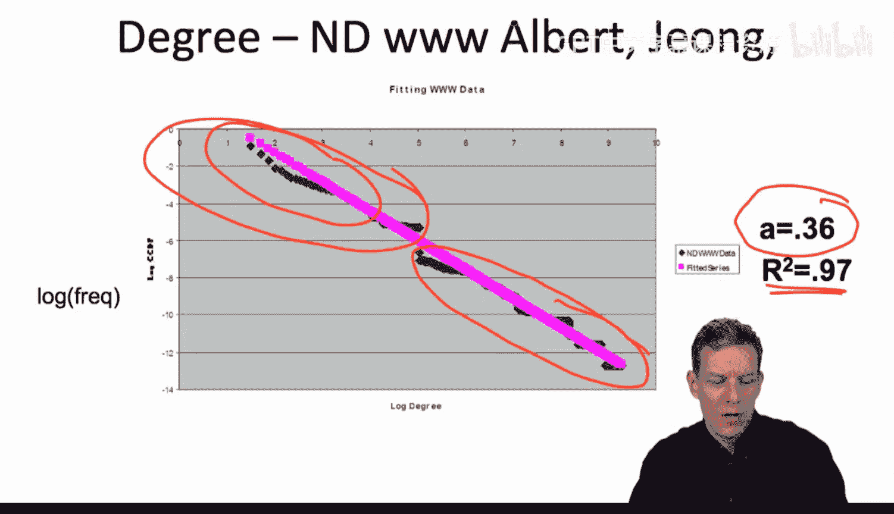

接下来，让我们看看将模型应用于不同数据集时的拟合结果。

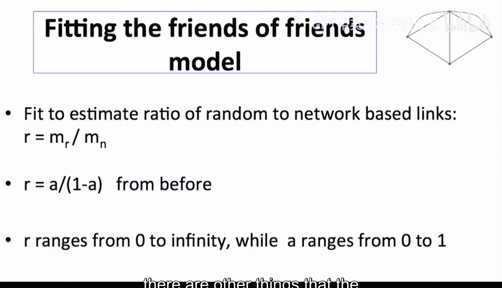

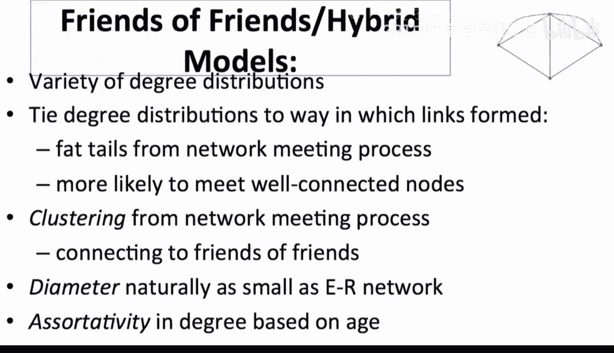

以下是几个数据集的拟合情况摘要：
*   **学术引用网络（Small论文）**：最佳拟合参数 \( a \approx 0.56 \)，拟合优度 \( R^2 \approx 98\% \)。模型解释力很强。
*   **监狱囚犯社交网络**：最佳拟合参数 \( a = 1 \)，拟合优度 \( R^2 \approx 94\% \)。这表明该网络的形成更接近均匀随机连接模型。
*   **业余无线电爱好者网络**：同样得到 \( a = 1 \)，拟合良好。
*   **高中恋爱关系网络**：\( a = 1 \)，拟合优度高达 \( R^2 \approx 0.99 \)，与均匀随机模型吻合得非常好。
*   **圣母大学网站链接网络**：最佳拟合参数 \( a \approx 0.36 \)，拟合优度 \( R^2 \approx 0.97 \)。这说明该网络大约有三分之一链接是随机形成的，三分之二符合偏好连接机制。

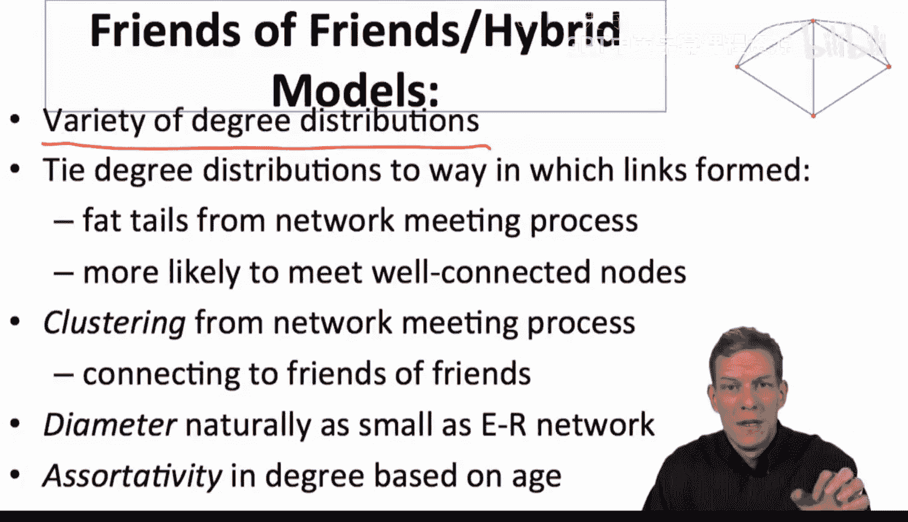

关于这些拟合，有几点需要注意：
1.  有些数据用静态的均匀随机模型拟合效果更好，说明增长性可能不是那些网络的主要特征。
2.  对于引文网络，模型可能无法完美拟合度为零的节点（即未被引用的文章），因为模型假设每个节点初始时都有一定连接。
3.  **重要警示**：仅通过观察对数坐标图（log-log plot）来判断幂律分布是危险的。对数变换会使图形“拉直”，人眼很难准确判断其曲率。统计拟合显示，许多看似线性的分布其实包含显著曲率，表明其生成机制是混合的，而非纯粹的偏好连接。

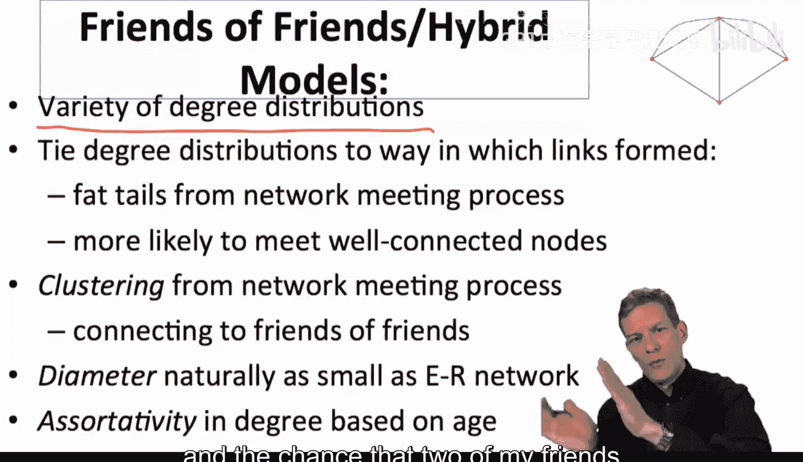

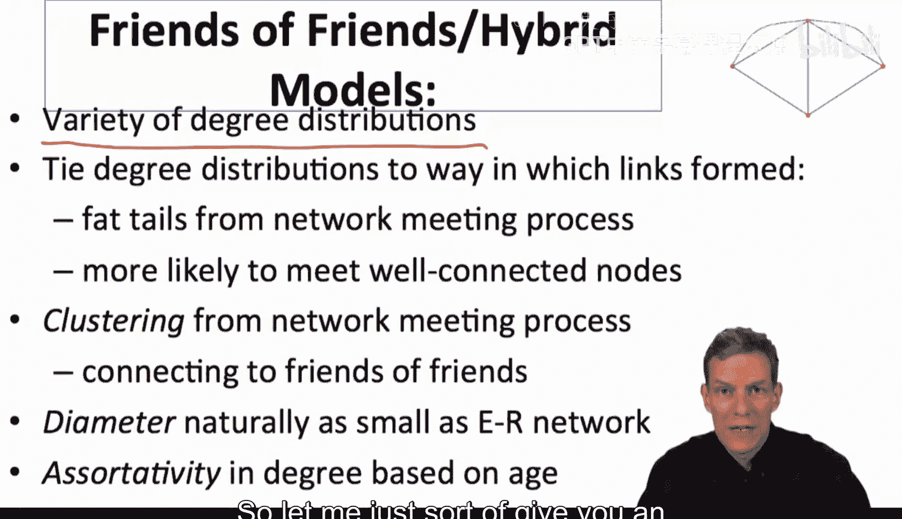

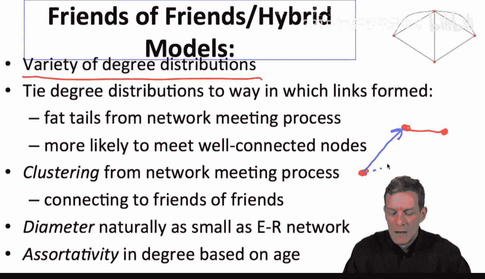

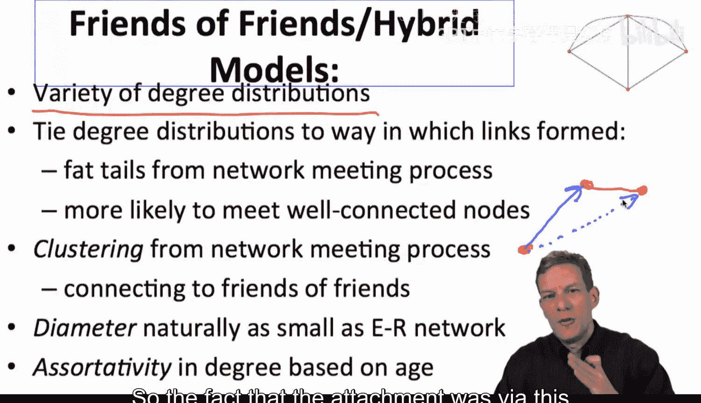

---

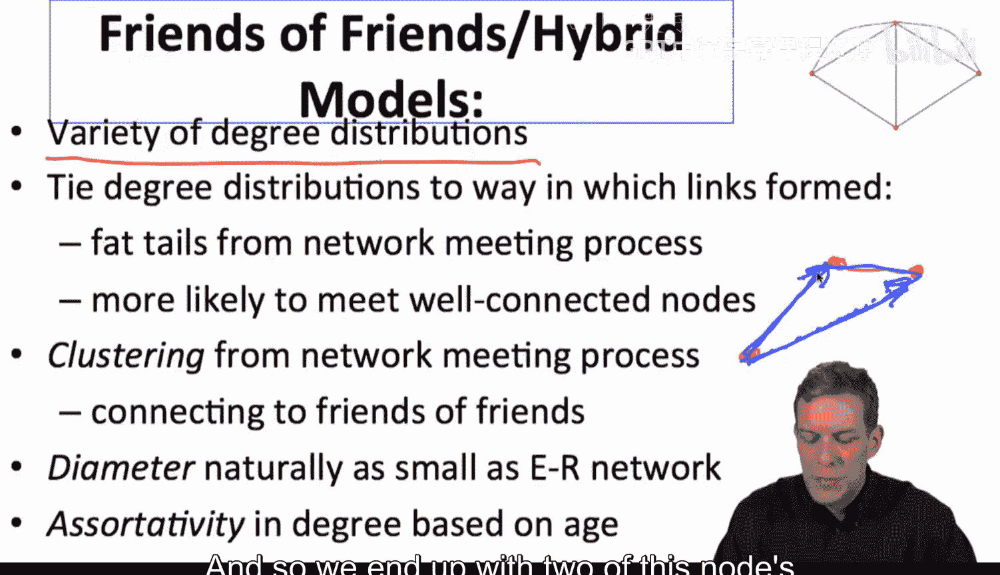

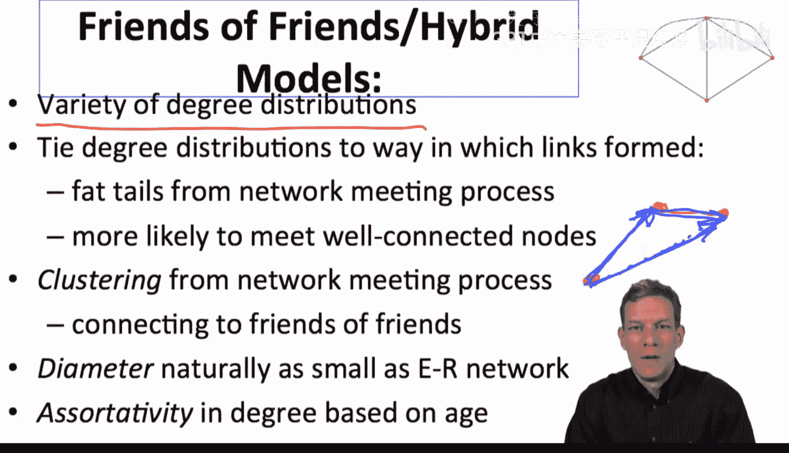

除了拟合度分布，朋友的朋友模型还能自然地生成真实网络的其他重要特征，这是纯偏好连接模型所不具备的。

**1. 聚类性**
由于新节点通过“朋友的朋友”方式建立连接，这直接导致了三角形结构的形成。例如，新节点先随机连接一个节点，再连接该节点的一个邻居，这三个节点就构成了一个三角形，从而产生了聚类系数。

**2. 同配性**
在增长模型中，更早出生的“老”节点在它们都年轻的时候有更多机会相互连接。因此，高度数节点（通常是老节点）之间更容易相连，低度数节点（通常是新节点）之间也更容易相连。这就产生了度值的正相关性，即同配性。

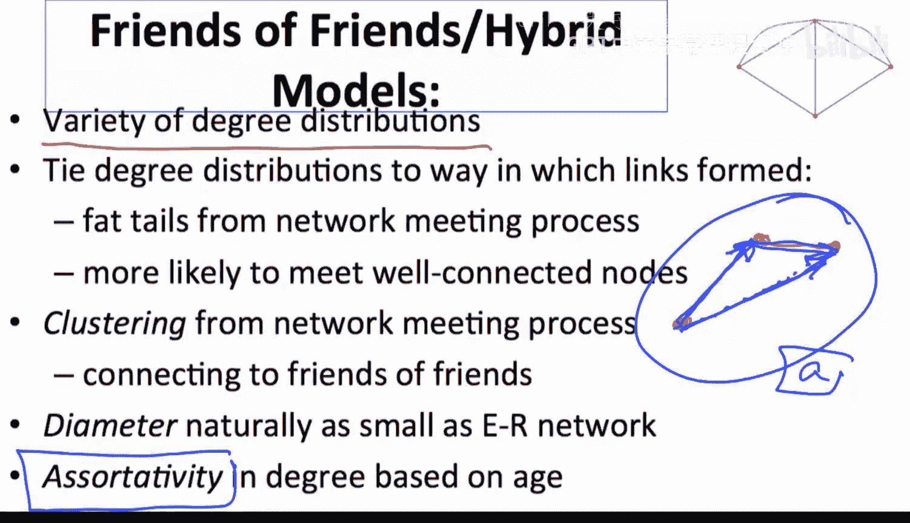

**3. 小世界特性**
模型中的随机连接部分保证了网络具有较小的直径，即“小世界”特性。

总结来说，增长性带来了同配性，随机性带来了小世界直径，而“朋友的朋友”连接机制则带来了聚类性。当我们用这个模型去拟合数据时，发现在聚类系数、网络直径等其他维度上，模型也常常能与实际数据匹配得相当好。

---

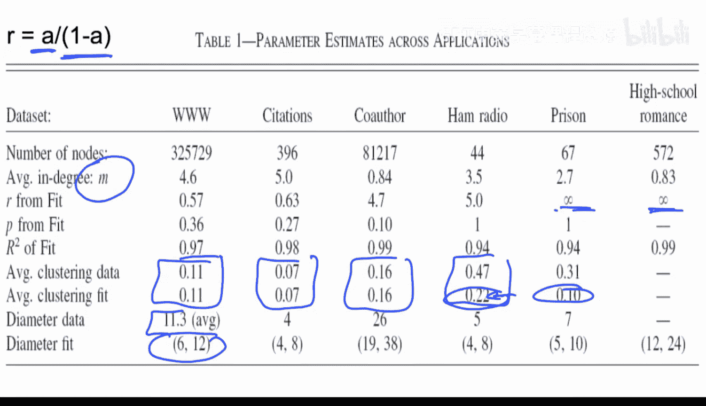

本节课中，我们一起学习了如何将混合增长随机网络模型与真实数据拟合。我们探讨了参数估计的方法，并分析了在不同数据集上的拟合结果。更重要的是，我们了解到这个模型不仅能生成丰富的度分布，还能同时解释真实网络中观察到的聚类性、同配性等关键特征。这为我们理解现实世界网络的生成机制提供了一个更丰富的视角。

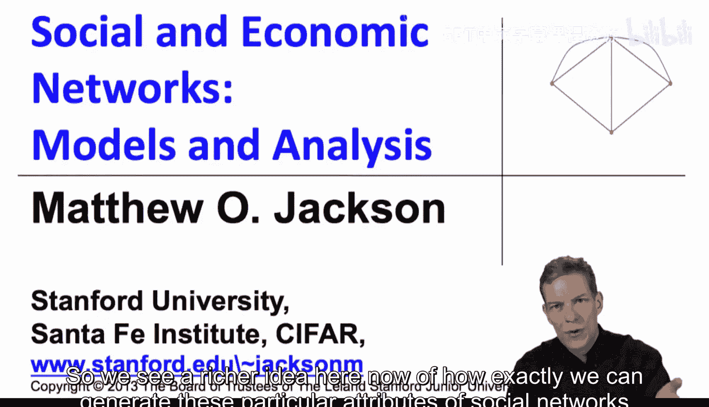

接下来，我们将开始研究其他类别的网络模型，并学习如何对它们进行统计估计。