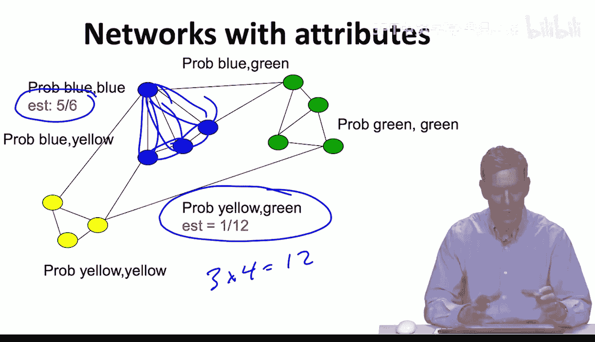
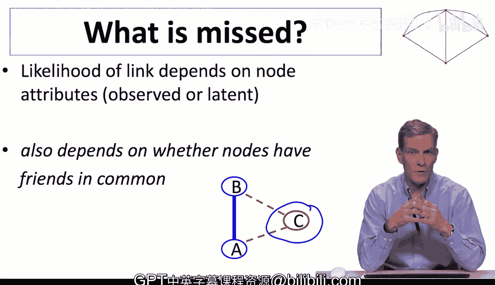

#  029：区块模型 🧱

在本节课中，我们将学习一种新的随机图模型类别——区块模型。这种模型将节点（个体）的属性引入了网络形成过程，使我们能够研究节点特征（如年龄、性别、职业）如何影响连接概率。

上一节我们讨论了能够捕捉聚类、度分布和相关性的链接模型。本节中，我们来看看如何将节点属性整合到模型中。

## 区块模型的基本概念

区块模型是埃尔德什-雷尼随机网络模型的自然扩展。其核心思想是：节点之间的连接概率取决于节点的特征或属性。这些特征可以是可观测的（如年龄、性别），也可以是潜在的（需要推断）。我们将从最简单的、所有特征都可观测的区块模型开始。

以下是区块模型的核心思想：
*   节点具有特征，例如年龄、性别、宗教、职业等。
*   节点之间的连接取决于这些特征。例如，年龄相近的人更可能建立连接，宗教信仰相同的人也是如此。

## 一个简单的区块模型示例

假设我们有一个包含三种类型节点的网络：蓝色、绿色和黄色节点。模型规定，不同类型的节点对之间具有不同的连接概率。

以下是该模型的关键假设：
*   如果存在同质性，蓝色节点之间更可能相互连接。
*   黄色节点之间、绿色节点之间也有各自的连接概率。
*   蓝色与绿色节点之间、黄色与绿色节点之间等，也都有特定的连接概率。
*   对于每种可能的节点类型组合，都有一个对应的连接概率。
*   除此之外，模型中的连接是独立形成的。只是概率根据节点类型而变化。
*   任何一对蓝色节点之间的连接概率相同，任何一对绿色与蓝色节点之间的连接概率也相同。我们只是允许概率随节点类型而变化。

如果这是我们观察到的网络，那么估计这些概率就非常简单。

以下是概率估计方法：
*   要估计两个蓝色节点之间的连接概率，我们观察蓝色节点间实际存在的连接数（5条）与所有可能的蓝色节点对总数（6对），得到估计概率为 **5/6**。
*   要估计黄色与绿色节点之间的连接概率，我们观察黄绿节点间实际存在的连接数（1条）与所有可能的黄绿节点对总数（12对），得到估计概率为 **1/12**。

这是一个非常简单的模型。与埃尔德什-雷尼随机网络（所有连接概率相同）不同，区块模型允许连接概率随节点属性变化。

## 更一般的模型：连续变量与逻辑回归

更一般地，这类模型通常处理连续变量。例如，我们记录以天或年为单位的年龄，而不是简单的颜色分类。

以下是处理连续特征的方法：
*   节点 `i` 和节点 `j` 各有一个特征向量。
*   连接概率可以更复杂地依赖于这些特征。例如，可能依赖于年龄差（年龄相近的人更可能连接），或地理距离（住得近的人更可能连接）。
*   我们有一个基于参数和特征计算概率的函数。

由于概率值必须在0和1之间，并且可能依赖于正负参数，标准做法是使用逻辑形式。

以下是标准的逻辑回归公式：
*   我们考察节点 `i` 和 `j` 之间存在连接的概率 `p_ij` 与不存在连接的概率 `(1-p_ij)` 的比值（即优势比）。
*   我们假设这个优势比的对数与节点特征的某个函数（如线性组合或距离函数）成正比。公式表示为：
    `log(p_ij / (1-p_ij)) = f(attributes_i, attributes_j)`
*   这使我们能够基于不同的属性连续地估计概率。
*   这是一个更复杂的随机模型，但仍然易于估计。任何标准的统计软件包都可以轻松进行逻辑回归来估计此类模型。

## 应用：检验同质性

使用此类模型的一个可能性是检验同质性。例如，检验同一类型节点之间的连接概率是否真的与不同类型节点之间的连接概率存在差异。

以下是一个来自真实研究的例子：
*   数据来自一项关于印度村庄社交网络的研究（Banerjee， Chandrasekhar， Duflo & Jackson， 2013， *Science*）。
*   我们观察其中一个村庄（26号村）的网络。节点按种姓着色：蓝色节点是“在册种姓/部落”（享受政府平权行动），红色节点是“普通种姓/其他落后种姓”。
*   我们可以建立一个简单的区块模型，计算与同一种姓的人连接的概率，以及与不同种姓的人连接的概率。

以下是统计结果：
*   红蓝节点之间的连接概率为 **0.006**。
*   红红或蓝蓝节点（即同一种姓内部）的连接概率为 **0.089**。
*   同一种姓内部建立连接的可能性是跨种姓连接的 **10倍以上**。
*   这表明基于种姓划分存在显著的同质性。区块模型使我们能够量化这一点。如果我们没有给节点着色，这种强烈的二分法可能不那么明显，但通过直接估计模型，我们可以发现它。

## 区块模型的局限性与展望

区块模型的重要性在于，连接概率依赖于节点属性（可观测或潜在的）。但在实践中，连接概率往往还依赖于网络结构本身。

以下是区块模型可能忽略的重要方面：
*   两个人互动的概率可能取决于他们是否有共同的朋友。这涉及到真实的社会结构。
*   如果A和B有一个共同的朋友C，那么他们彼此连接的可能性，会比没有共同朋友时更高。
*   这是因为人们倾向于通过朋友结识他人，或有共同的朋友圈而花时间在一起。
*   这种三元组结构会导致额外的相关性，我们需要更丰富的模型来捕捉它。

接下来，我们将讨论一类允许我们跟踪这些显式依赖关系的模型。这会使统计处理变得稍困难，因为连接不再独立，但将使我们能够捕捉网络中许多重要的特征。