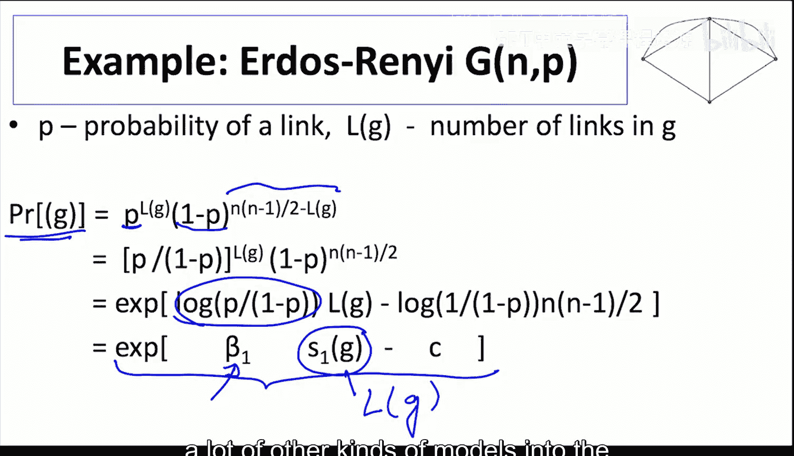
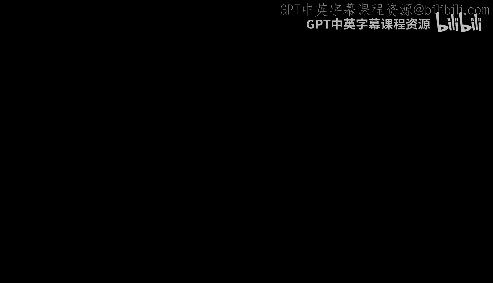
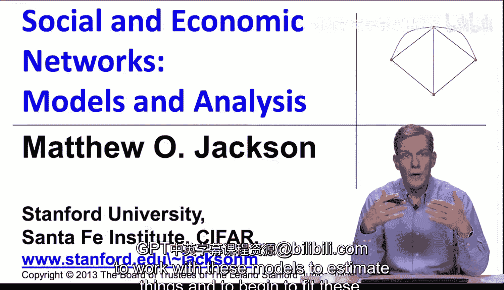
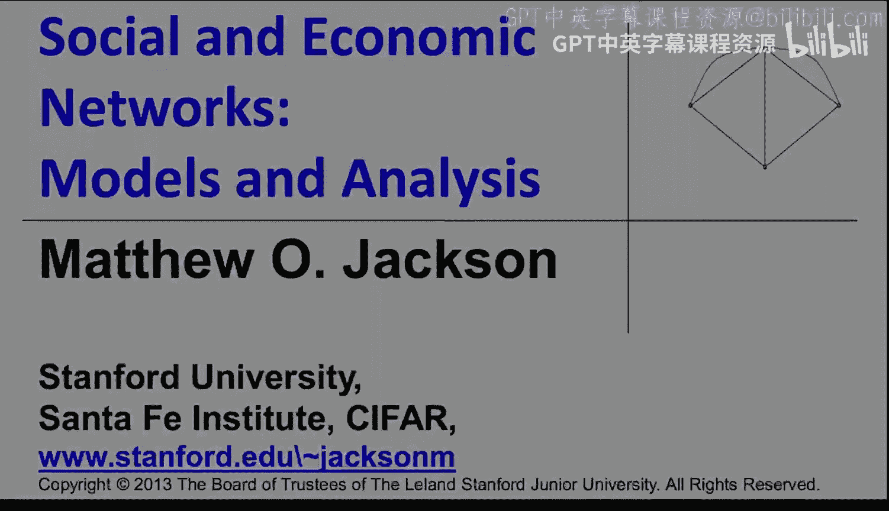

#  030：指数随机图模型 📊

在本节课中，我们将学习一种能够捕捉网络中各连接之间相互依赖关系的模型——指数随机图模型。我们将了解其基本思想、数学形式，并探讨其与传统模型的关系。

---

上一节我们讨论了随机分块模型。本节中，我们来看看另一类流行的模型，即指数随机图模型。我们还将讨论这类模型的一些变体，以及比指数随机图模型更容易估计的新模型类型。在掌握基础知识后，我会谈到这些内容。

Jacob Levi Moreno 和 Helen Hall Jennings 在1938年的一段引言指出，当我们研究社会互动和人与人之间的相互关系时，不能仅仅关注二元关系。我们必须着眼于更大的配置结构。他们的原话强调了这一点：“一种恰当的统计处理形式是将社会配置视为一个整体，而不是或多或少从整体图景中人为分离出来的单一事实系列。”

这里有一张来自Moreno在1932年的图片。Moreno也被称为社会测量学之父，他是一位社会心理学家。图中，他描绘了纽约不同房屋中个体之间的联系。他在20世纪30年代于哥伦比亚大学工作，这是最早以图形形式绘制个体间社会互动网络的社会图之一。

---

之前讨论的模型在拟合具有大量聚类和其他类型依赖关系的数据方面并不理想。特别是在检验许多社会和经济理论时，这些理论会解释人们为何会以特定形式互动。这里的核心思想是，个体 `i` 和 `j` 之间的连接可能取决于他们是否有一个共同的朋友 `k`。我们想要捕捉这种关系。

困难在于，一旦我们允许一个连接依赖于另一个连接，我们就打开了一个潘多拉魔盒，现在所有连接都可能相互依赖。如果 `i` 和 `j` 的连接取决于他们是否有共同的朋友，而这个朋友的存在又取决于他们是否有其他共同的朋友，并且还取决于 `i` 和 `j` 本身是否存在，那么所有因素都交织在一起。因此，我们必须明确所有的相互依赖关系。

Frank 和 Strauss 在1986年开始研究一类模型，后来被称为 `p*` 模型。这类模型在20世纪90年代被Wasserman和Patterson引入社会网络文献并加以推广，此后被称为指数随机图模型。

---

让我们从一个例子开始。这是对给定模型最简单的一种扩展。之前，我们只考虑连接。现在，我们将允许网络出现的概率不仅取决于存在的连接数量，还取决于存在的三角形数量。我们可以说，包含三角形的网络比不包含三角形的网络更可能出现。我们只是在一个非常简单的维度上增加了复杂性，但事实证明，这在丰富我们的模型图景方面非常强大。

特别是，这种“一个连接可能取决于你们是否有共同朋友”的想法，会导致比类似随机图中出现更多三角形的情况。

那么，指数随机图模型背后的核心思想是什么？现在，概率取决于我们拥有的连接数量、三角形数量乘以一些参数。如果我们把这个参数设为零，那么三角形项就不起作用，只有连接数量重要。但如果参数不为零，那么连接和三角形都会影响概率。

为了将其转化为概率，我们需要确保结果是非负的，并且介于0和1之间。因此，我们首先可以做的不是让概率直接与此成正比，而是将其指数化。这样它总是非负的。这是统计学中处理指数族的标准技巧。所以现在，我们得到的是一个关于连接数量和三角形数量的指数函数的正比项。

Hammerley 和 Clifford 的一个非常强大的定理表明，几乎任何网络模型都可以用一些图统计量的计数在指数族中表达。它可能不是连接和三角形，可能是连接、三角形、三叉星的数量，也可能取决于大小为6的团的数量，可能是一个相当复杂的统计量列表。但他们的定理指出，几乎任何你能想到的网络模型都可以用这种形式表达。

---

作为验证，让我们回到我们的厄尔多尼随机网络模型，看看这是如何工作的。设 `p` 为连接概率，`L(G)` 为给定图中的连接数。在那个模型下，出现这个特定网络的概率是：所有存在的连接形成的概率 `p` 的乘积，乘以所有不存在的连接未形成的概率 `(1-p)` 的乘积。这就是获得一个具有 `L` 条连接的特定网络的概率。

让我们重写这个公式。我们提取出 `L` 项，重新整理后可以写成：`(p/(1-p))^L(G) * (1-p)^(n(n-1)/2)`。

现在，让我们用指数形式来写。另一种写法是：`exp( log(p/(1-p)) * L(G) - 某个常数项 )`，其中常数项不涉及连接数量。这看起来像什么？它看起来像一个图统计量（具体是图中的连接数）的指数函数。你可以将厄尔多尼图的概率写成这种形式，其中参数 `β` 看起来像 `log(p/(1-p))`。

这绝不是Hammerley-Clifford定理的证明，但它给了我们一个思路：你可以将许多其他类型的模型转换到指数随机图族中。这将非常有用。

---

当然，要使这成为一个概率，所有概率之和必须为1。具体来说，这意味着我们必须通过所有图的概率之和来进行归一化，以确保当我们对所有图求和时，一个特定图的概率之和为1。因此，这个概率的分母必须是所有可能图的相对概率之和。

现在，如果我们对所有图求和，所有 `P(G)` 的和将等于1，因为分子和分母的和会相同。你也可以把这个不依赖于 `G` 的分母移到分子中作为一个负的常数项，这个常数项就对应了这个分母。

---

我们得到了一个指数随机图族，它允许我们捕捉不同类型的统计量。这在使我们能够拟合许多事物并纳入许多因素方面将非常强大。主要的挑战将在于估计这类模型。

在下一个视频中，我将讨论如何使用这些模型进行估计和拟合。