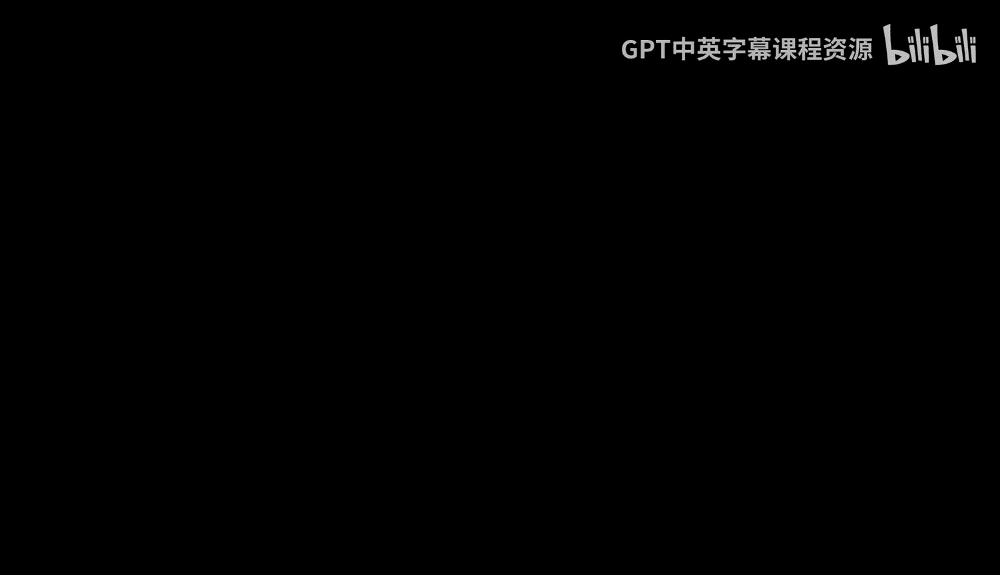
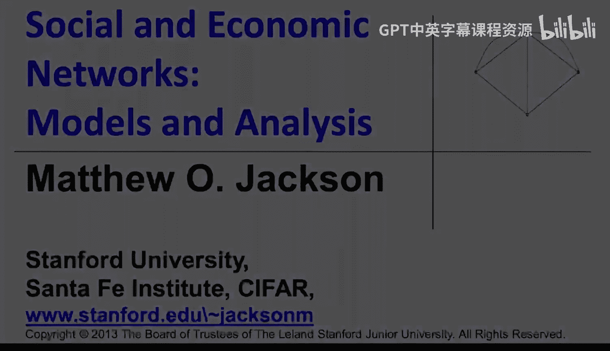

#  033：稀疏通用图模型 📊

在本节课中，我们将学习另一类易于估计的模型，它们与指数随机图模型（ERGM）相关。这类模型被称为“子图生成模型”（Suumms）。我们将探讨其核心思想、与ERGM的联系，以及其在稀疏网络中的估计优势。

上一节我们介绍了指数随机图模型，本节中我们来看看子图生成模型。

## 子图生成模型的核心思想

子图生成模型的核心思想是，网络是由各种子图（如链接、三角形、小星形等）独立生成后叠加而成的。人们形成不同类型的关系和小团体，网络正是这些微观互动的产物。

具体而言，我们设想每种类型的子图（例如链接或三角形）以一定的概率 **P_j** 独立形成。最终，我们会得到一定数量的各类子图，记为 **S_j**（例如45条链接或10个三角形）。难点在于，这些生成的子图可能会重叠。例如，在合著网络中，我与某人合写了一篇论文（形成一条链接），同时我们又与第三个人合写了另一篇论文（可能形成一个三角形）。我们最终观察到的网络数据，是这些重叠子图叠加后的结果。我们的目标是从观察到的网络中，推断出生成各类子图的概率 **P_j**。

## 一个简单示例

我们从一个节点集合开始，假设只生成链接和三角形。

以下是生成过程：
*   首先生成9个三角形（从所有可能的三角形中随机选择）。
*   随后生成一批链接。

当我们将这些生成的子图叠加起来时，可能会“偶然”产生新的三角形。例如，下图中的两条边原本来自已生成的三角形，而第三条边是后来生成的链接，这三条边共同形成了一个新的三角形。

最终，我们观察网络时，无法直接区分哪些三角形是“有意”生成的，哪些是“偶然”形成的。我们只能看到最终的链接和三角形，并试图估计生成各类子图的原始概率。

## 与指数随机图模型（ERGM）的联系

我们之前学习过，即使是简单的随机链接生成模型（如Erdős–Rényi模型），也可以表示为指数族的形式。对于同时包含链接和三角形生成的子图生成模型，同样可以如此表示。

具体而言，存在一个定理表明：对于一个参数为 **P_j** 的子图生成模型，令 **S** 为各类子图真实生成数量的向量。那么，观察到特定网络结构的概率，与一个指数族分布成正比，即它属于ERGM家族。

其概率形式可近似表示为：
`概率 ∝ exp( Σ_j β_j * s_j ) / K`
其中，**β_j** 是生成第j类子图的对数优势比（log odds），**K** 是一个归一化常数，与可能形成特定数量 **s_j** 个子图的方式总数有关。

这里的困难在于，子图真实生成数量 **S** 是无法直接观测的，我们只能看到叠加后的网络。

## 稀疏性的关键作用

然而，在**稀疏网络**中，我们可以较好地估计这些参数。

回顾之前的示例，由于生成的链接和三角形数量都不多，我们只偶然产生了一个额外的三角形。当网络足够稀疏时，子图之间意外重叠形成新结构的情况就非常罕见。

因此，在稀疏条件下，网络中观察到的三角形数量可以很好地近似替代真实生成的三角形数量，链接亦然。这使得我们能够利用观察到的网络统计数据，来可靠地估计子图生成模型的参数。

下一节视频中，我们将具体探讨如何估计这类模型。

## 本节总结

本节课我们一起学习了子图生成模型（Suumms）。
*   其核心思想是网络由各类子图独立生成后叠加而成。
*   该模型可以表示为指数随机图模型（ERGM）的特例。
*   模型估计的关键挑战在于无法直接观测子图的真实生成数量。
*   在**稀疏网络**中，由于子图重叠的偶然事件很少，我们可以利用观测网络来有效估计模型参数。