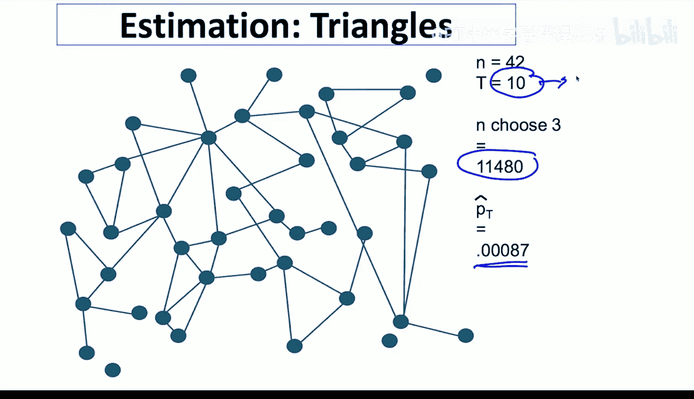
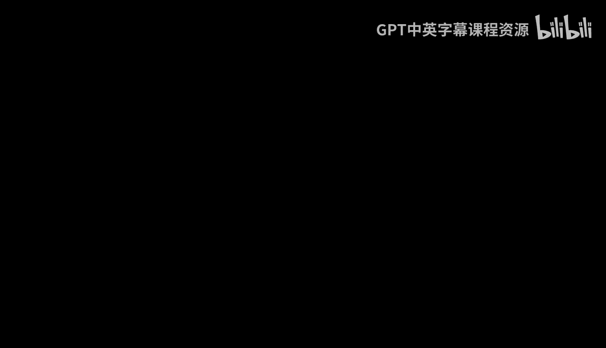
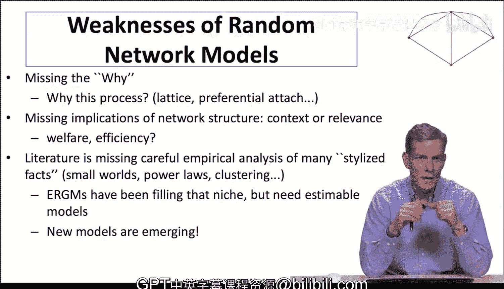

#  034：稀疏子图生成模型的估计（可选-进阶）

## 概述

在本节中，我们将学习如何估计子图生成模型。我们将探讨两种方法：一种适用于稀疏图的直接估计法，另一种适用于非稀疏图的算法校正法。重点是理解在稀疏条件下，如何通过简单的计数统计来一致地估计模型参数，并了解此类模型在捕捉真实网络特征（如聚类）方面的优势。

## 子图生成模型回顾

上一节我们介绍了允许链接依赖关系和不同类型子图形成的模型。本节中我们来看看如何对这些模型进行统计估计。

模型的基本形式是：链接和三角形等子图以特定概率独立形成。这些子图可能相交和重叠。我们观察到一个生成的网络，并试图推断这些子图的形成概率。例如，三角形是否真的独立于链接而形成？我们的目标是估计这些概率。

## 稀疏图下的估计方法

对于稀疏图，子图间的偶然重叠会很少见，此时直接估计是有效且一致的。直观上，稀疏性条件意味着不同类型的子图足够稀少，以至于它们不太可能相互作用。

以下是理解稀疏性条件的一个直观例子，假设我们只考虑链接和三角形：

*   只要链接形成的概率 `p_link` 小于 `1/sqrt(n)`。
*   且三角形形成的概率 `p_triangle` 小于 `n^(-3/2)`。

这通常意味着典型节点参与的链接和三角形数量都少于 `sqrt(n)` 个。对于大型社交网络，这个条件相对容易满足。

### 直接估计步骤

在稀疏条件下，我们可以通过简单的计数来直接估计参数。

**1. 估计三角形概率**

首先，我们尝试估计三角形的形成概率。方法是统计网络中观察到的三角形数量，并除以网络中所有可能形成的三角形总数。

*   **统计观察值**：在网络中直接数出三角形的数量。
*   **计算可能总数**：对于 `n` 个节点，可能的三角形总数为组合数 `C(n, 3)`。
*   **计算估计概率**：`p_triangle_estimate = (观察到的三角形数量) / C(n, 3)`

**2. 估计链接概率**

接着，我们估计不属于任何三角形的链接（即“无支撑链接”）的形成概率。方法是统计这些链接的数量，并除以所有可能形成此类链接的节点对数量。

*   **统计观察值**：数出网络中不属于任何三角形的链接数量。
*   **计算可能总数**：首先计算所有可能的节点对 `C(n, 2)`，然后减去那些已经包含在观察到的三角形中的链接对（因为这部分链接已被计入三角形形成过程）。
*   **计算估计概率**：`p_link_estimate = (无支撑链接数量) / (C(n, 2) - 3 * (观察到的三角形数量))` （注：每个三角形包含3条链接）

### 估计的一致性与准确性

相关论文中的定理表明：在满足稀疏性条件的子图生成模型序列中，使用上述简单的经验频率计数法得到的估计量是**一致**的。这意味着随着网络规模增大，估计值会收敛到真实参数值。此外，估计误差的分布近似于正态分布，这便于我们进行统计推断。

这种方法的优势在于极其简单——本质上只是进行二项计数，却能提供与指数随机图模型类似的信息，并且估计准确。

## 模型应用与比较：以印度村庄数据为例

现在，让我们看看为什么需要这类模型，以及它们与简单的分块模型相比有何优势。

我们将使用印度村庄的社交网络数据，分别拟合一个**分块模型**和一个包含三角形的**子图生成模型**，然后比较它们重现原始网络特征的能力。

### 模型设定

我们进行一个简单的分类：根据种姓和地理距离（GPS）将节点分为“相似”和“不同”两类。
*   **相似**：两个家庭种姓相同 **且** 房屋距离小于中位数距离。
*   **不同**：种姓不同 **或** 房屋距离大于中位数距离。

**1. 分块模型**
我们估计两个概率：
*   `p_link_same`: 相似节点间形成链接的概率。
*   `p_link_diff`: 不同节点间形成链接的概率。

**2. 子图生成模型**
在分块模型的基础上，增加对三角形的估计：
*   `p_triangle_same`: 三个节点都相似时形成三角形的概率。
*   `p_triangle_diff`: 节点不完全相同时形成三角形的概率。

### 模型拟合与网络生成

拟合这两个模型非常容易，只需对链接和三角形按节点类型进行计数即可。得到参数估计后，我们可以根据这些概率随机生成新的网络，并与真实网络进行比较。

以下是模型拟合后，在**未直接拟合**的网络特征上的表现比较：

| 网络特征 | 真实数据 | 分块模型 | 子图生成模型 (含孤立节点校正) |
| :--- | :--- | :--- | :--- |
| **聚类系数** | ~0.10 | 远低于真实值 | **接近真实值** |
| **巨连通分量占比** | - | 拟合一般 | **拟合更好** |
| **邻接矩阵第一特征值** | - | 拟合一般 | **拟合更好** |
| **随机游走矩阵第二特征值(同质性)** | 很高 | 分布较散 | **能捕捉高同质性** |
| **平均路径长度** | - | 拟合一般 | **更接近真实值** |
| **度分布** | - | 匹配较差 | **能更好匹配分布形态和尾部** |

### 结果分析

*   **分块模型的局限**：虽然它通过节点分组捕捉了链接的密度差异（同质性），但由于假设链接独立，**无法生成观测到的高聚类水平**。它在度分布等特征上也匹配不佳。
*   **子图生成模型的优势**：通过显式地引入三角形形成过程，它能**显著更好地捕捉网络的聚类特性**。同时，它在度分布、同质性、连通性等多个未直接拟合的特征上也表现更优。
*   **依赖关系的重要性**：这个例子表明，捕捉链接间的**依赖关系**（如三角形所代表的“朋友的朋友也是朋友”）对于准确建模社交网络至关重要。

## 总结

本节课中我们一起学习了子图生成模型的估计方法及其应用价值。

1.  **稀疏估计**：在稀疏图条件下，可以通过简单的子图计数与可能总数的比值，直接、一致地估计模型参数。
2.  **模型价值**：与简单的分块模型相比，子图生成模型通过引入三角形等子结构，能**更有效地捕捉社交网络中关键的依赖关系和聚类特征**，从而在多个网络统计特征上提供更优的拟合。
3.  **工具与理论结合**：这类统计模型为我们提供了估计和测试网络结构的强大工具。指数随机图模型和子图生成模型都是丰富的模型家族。然而，我们需要**社会或经济理论**来指导模型的选择（例如，为什么包含三角形？），并将模型特征与具体的社会过程（如强化、社会实施）联系起来，从而理解现象背后的“原因”及其社会意义（如隔离与不平等）。

这些模型使我们能够生成具有明确性质的大型随机网络，模拟真实网络的某些关键特征，并将特定的网络属性与特定的生成过程联系起来，为后续基于网络的理论检验奠定了基础。