#  036：策略性网络形成 🕸️

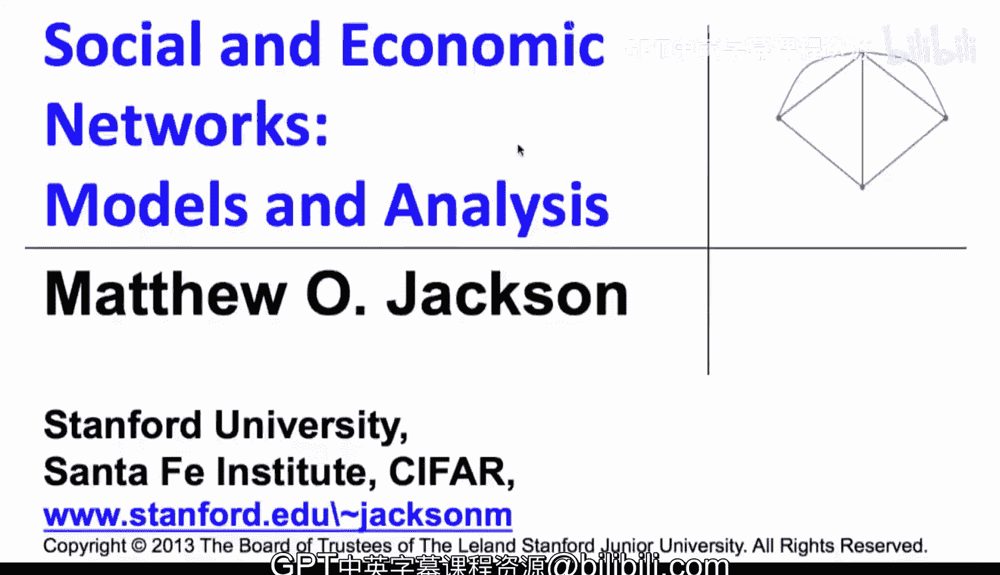

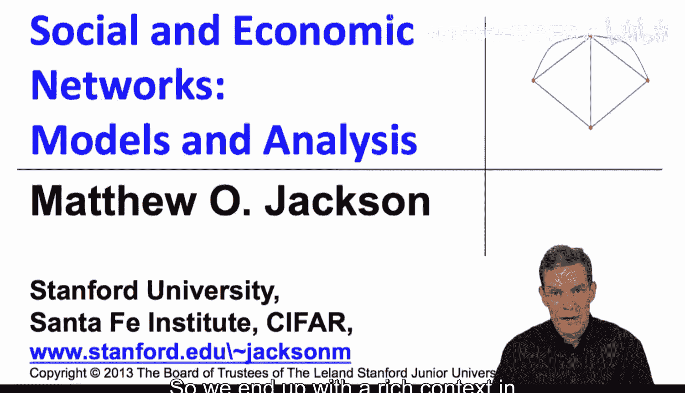

在本节课中，我们将要学习策略性网络形成。这意味着网络中的个体（节点）会主动做出选择，并且他们的决策会受到他人行为的影响。他们关心的不仅仅是直接的连接关系，还包括间接的收益。这为我们分析网络的形成提供了一个丰富的背景。

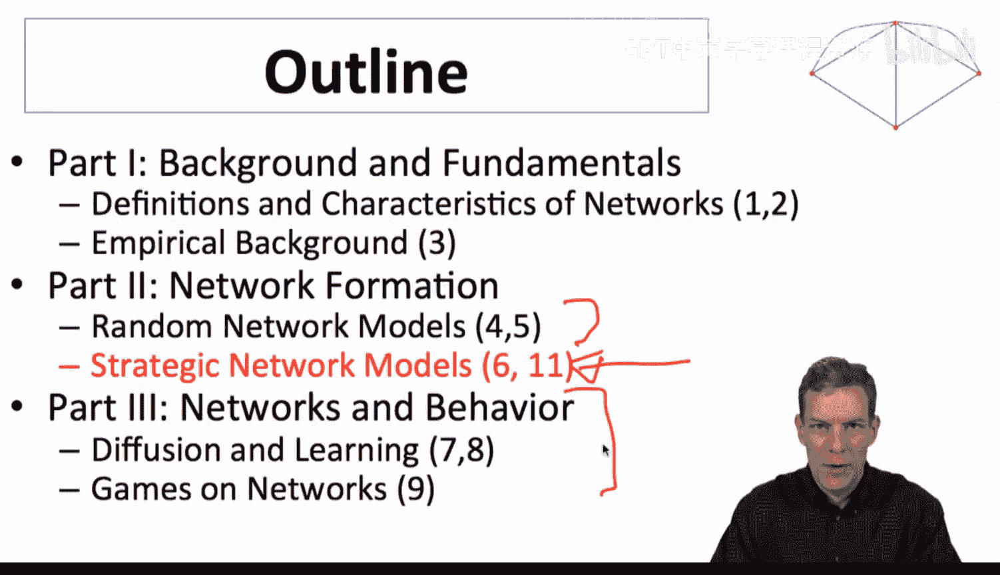

## 课程概述与背景

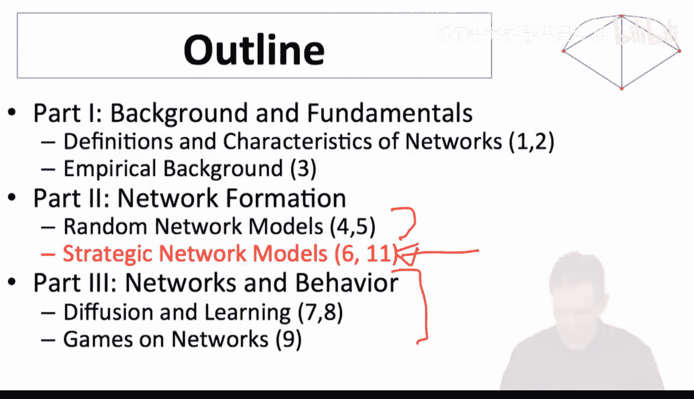

上一节我们介绍了随机网络模型。现在，我们将进入网络形成的另一个核心部分：个体的选择。完成这部分内容后，我们将开始研究网络如何影响行为。

为了理解网络形成的博弈论模型，即人们如何做出选择，我们需要将节点视为主动做出决策的行动者。

## 基本建模思路

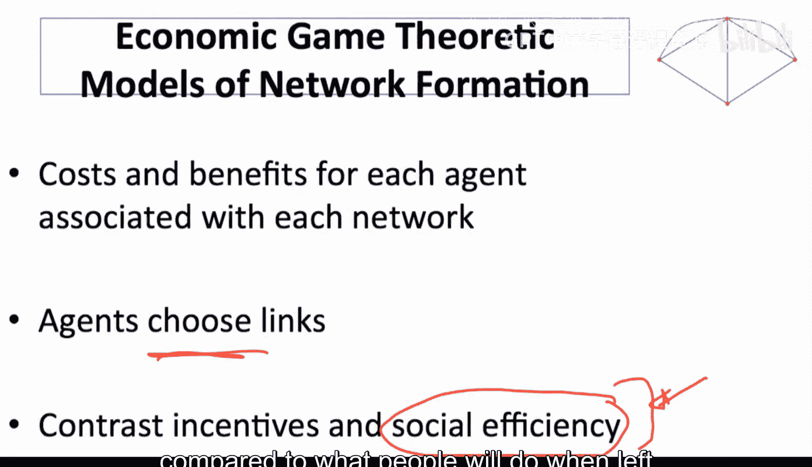

节点（或称为行动者、玩家、代理人）在形成连接时，会权衡成本与收益。这里的“行动者”概念很宽泛，可以是国家、选择朋友的人、选择合作者的研究者、选择研发伙伴的公司，甚至是选择雇主的员工。核心在于他们拥有选择权。

我们将对比个体形成关系的激励与社会最优（即社会效率）之间的差异。社会效率指的是从整体角度看最优的网络结构，而个体激励则是个体在自主决策下会形成的网络。这是本节的基本主题。

## 建模中的关键选择

一旦我们确定了这个方向，就需要做出许多建模选择。以下是需要考虑的一些关键问题：

*   **共识需求**：网络是有向的还是无向的？形成连接是否需要双方同意？（例如，引用网络无需对方许可，但建立友谊或联盟则需要共识。）
*   **协调变化**：人们能否协调网络中的同时变化？（例如，“只有你也和某人结盟，我才和你结盟。”）
*   **过程动态性**：网络形成过程是静态的（一次性形成）还是动态的（持续进行）？
*   **行动者复杂性**：行动者的计算能力如何？（例如，是计算国际协议价值的专家，还是偶然相遇形成友谊的学生？）
*   **前瞻性与信息**：他们有多前瞻？做决策时知道多少网络结构信息？会犯错吗？
*   **价值来源**：价值（收益）从何而来？成本是什么？
*   **补偿与强度**：人们能否互相补偿？（例如，给有价值的朋友提供好处。）连接是否有不同的强度？（我们通常考虑0-1连接。）

文献中已经探讨了许多这类问题。由于时间有限，我们不会深入每一个细节，而是通过一些基本示例，让你了解这类模型是如何构建的以及核心问题是什么。你可以根据需要进一步查阅相关文献。

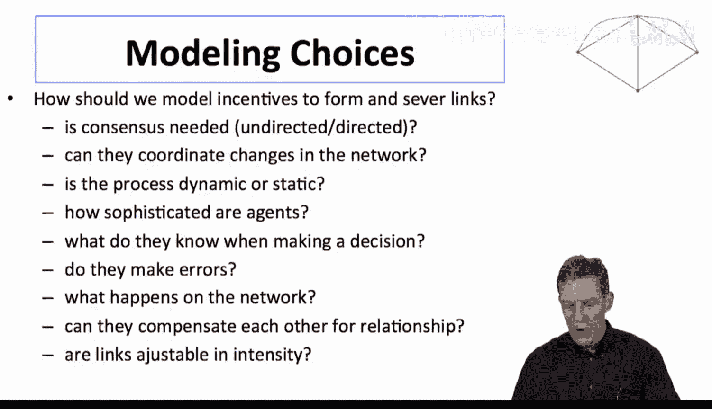

## 核心问题

在我们学习的过程中，请始终思考以下问题：

*   哪些网络会形成？哪些网络更稳定？
*   形成的网络从社会角度看是“正确”的吗？如果不是，偏差有多大？
*   外部力量（如政府）能否改善网络？（例如，通过补贴促进企业间研发合作。）
*   这些模型能否帮助我们理解观察到的网络特征？它们能否与数据结合？

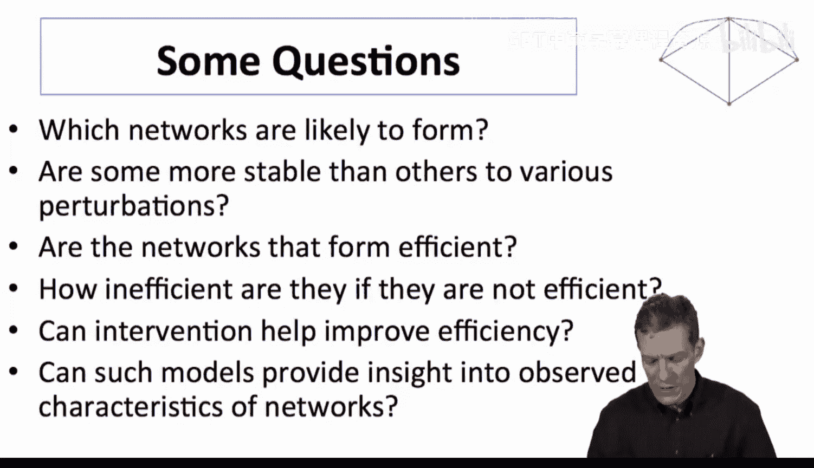

## 基本建模框架：效用函数

接下来，我们从一个基本方法开始，介绍如何表示这些概念。这源于我与Asher Wolinsky在90年代中期的工作。

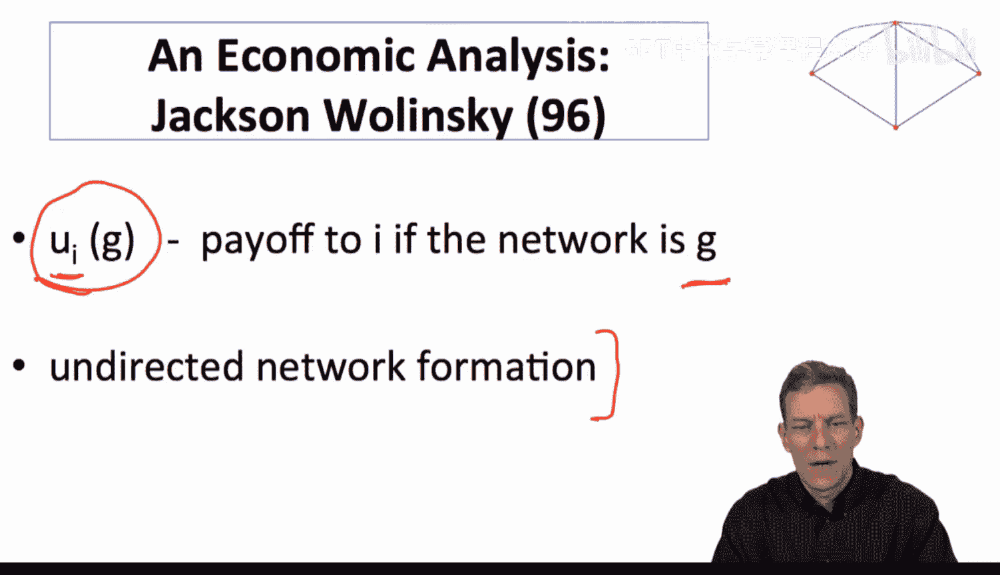

我们将网络视为一个图 **G**。每个个体 **i** 会从图 **G** 中获得一个**效用**（或收益）**u_i(G)**。在最简单的版本中，我们考虑无向网络，但模型可以扩展到有向网络、加权网络等。

## 示例：连接模型

让我们从一个简单的例子开始，即“连接模型”。这个模型的基本思想是：我从朋友那里获得收益，也从朋友的朋友那里获得收益。

*   **收益**：个体 **i** 与 **j** 的直接连接带来收益 **δ**（δ 是一个介于0和1之间的参数）。间接连接的收益会随着距离衰减。例如，与朋友的朋友（距离为2）的收益是 **δ²**，与距离为 **d** 的个体的收益是 **δ^d**。
*   **成本**：维持一条直接连接需要成本 **c**（c > 0）。

参数 **δ** 决定了收益衰减的速度。如果 **δ** 较小（如0.5），间接连接的价值迅速下降；如果 **δ** 较大（如0.9），间接连接的价值衰减较慢。

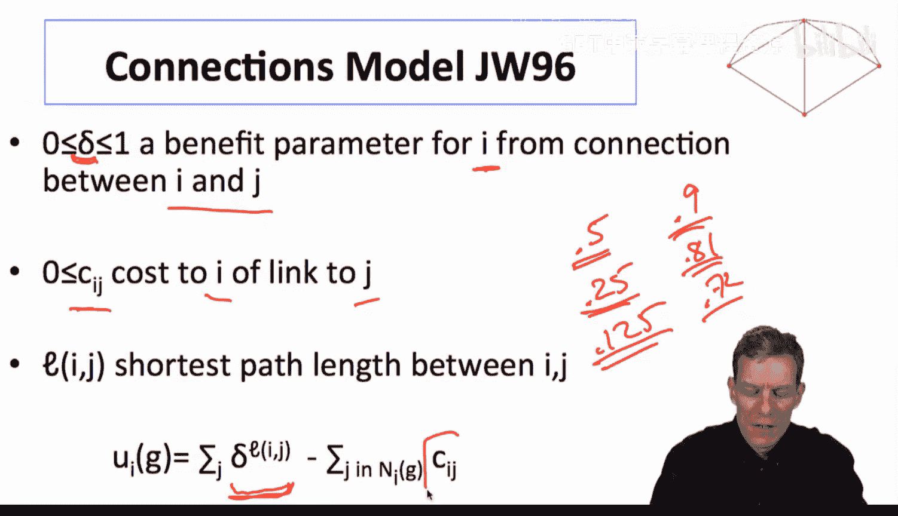

### 计算示例

假设 **δ = 0.5**，**c = 0.4**。

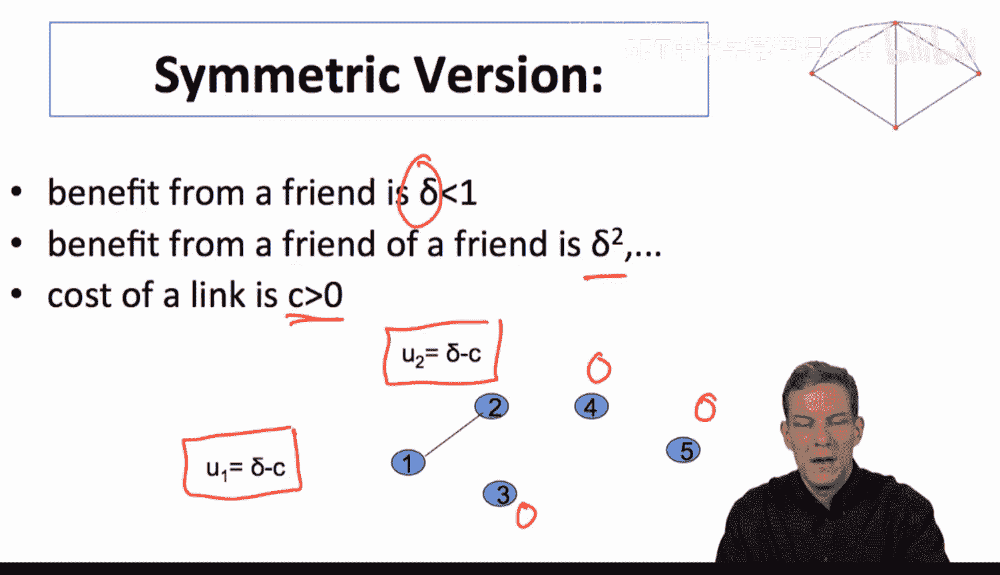

1.  **单条连接**：个体1和2相连。
    *   个体1的效用：**δ - c = 0.5 - 0.4 = 0.1**
    *   个体2的效用：**0.1**
    *   其他个体效用：**0**

2.  **星形网络**：个体1与2、3相连，但2和3不相连。
    *   个体1的效用：**2δ - 2c = 1.0 - 0.8 = 0.2**（两条直接连接）
    *   个体2的效用：**δ（来自1） + δ²（间接来自3） - c = 0.5 + 0.25 - 0.4 = 0.35**
    *   个体3的效用：**0.35**

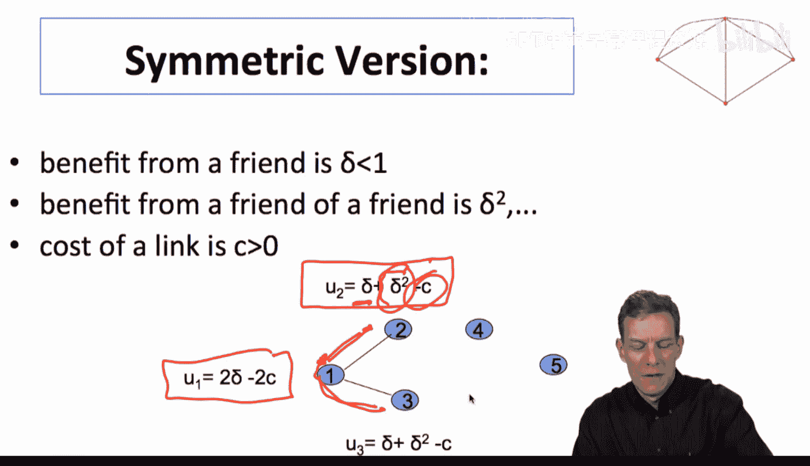

3.  **三角形网络**：1-2, 2-3, 1-3全部相连。
    *   个体1的效用：**2δ（来自2和3） + 0（无距离为2的连接） - 2c = 1.0 - 0.8 = 0.2**
    *   （注意：在基本模型中，通常只计算最短路径的收益。个体1到2和3都是直接连接，收益已计入。到其他节点没有更远的连接需要计算。）

通过这种方式，对于任何网络配置，我们都可以计算出每个个体的效用值。

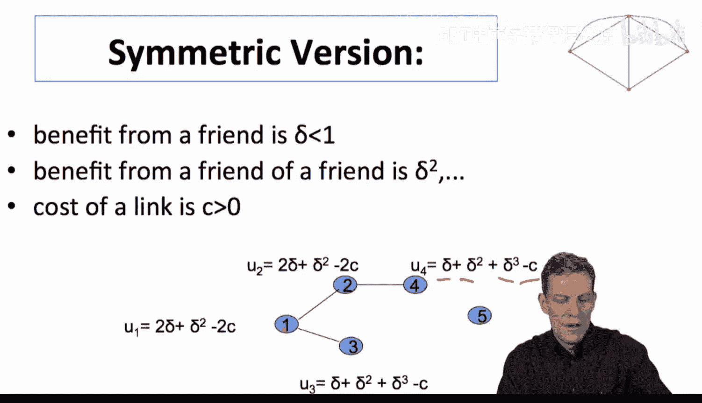

## 核心分析问题

有了这个模型框架，我们就可以分析两个主要问题：

1.  **社会最优**：哪个网络结构能使所有个体效用之和最大化？
2.  **均衡形成**：在个体自主决策下，哪些网络会实际形成？（这需要我们定义网络形成的过程和稳定性的概念。）

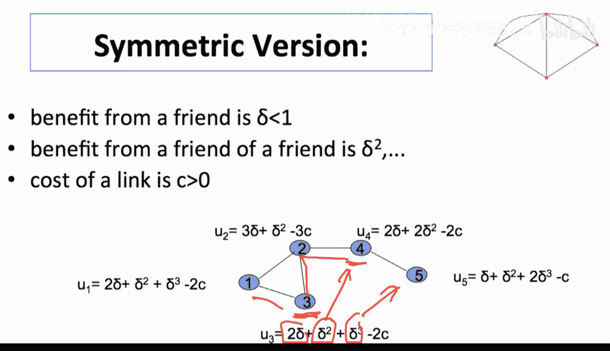

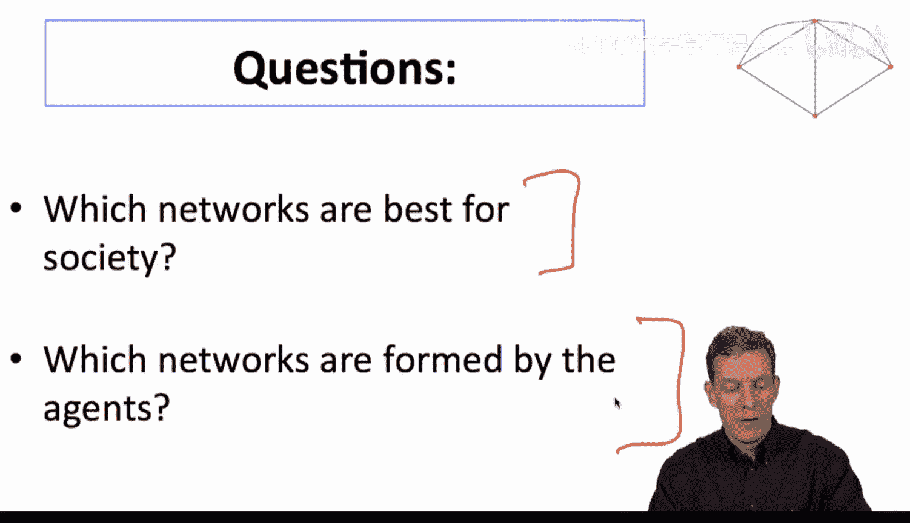

## 总结

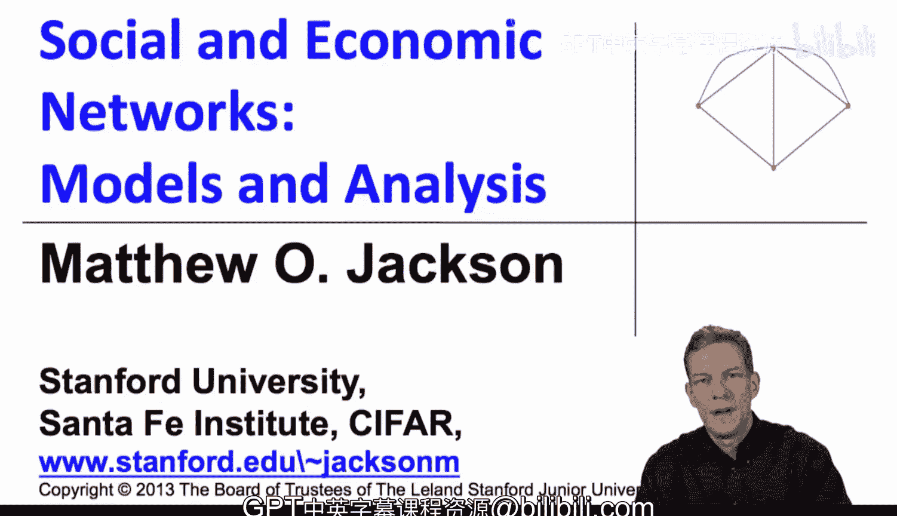

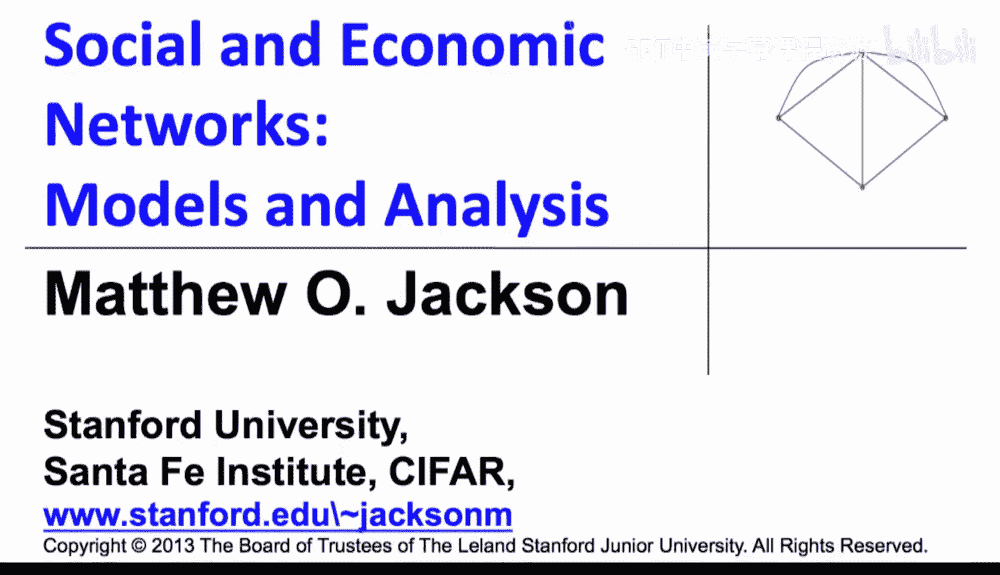

本节课中，我们一起学习了策略性网络形成的基本概念。我们了解到，个体在形成连接时会进行成本收益分析，并且他们的决策具有策略性，会考虑他人的行为。我们介绍了一个简单的“连接模型”作为示例，它用参数 **δ** 和 **c** 来量化直接与间接连接的收益和维持成本。通过为每个网络配置计算个体效用 **u_i(G)**，我们可以为后续分析社会最优网络和预测均衡网络打下基础。下一节，我们将具体探讨如何利用这个模型来回答“哪个网络最好”以及“哪个网络会形成”这两个核心问题。