#  037：配对稳定性与效率 📊

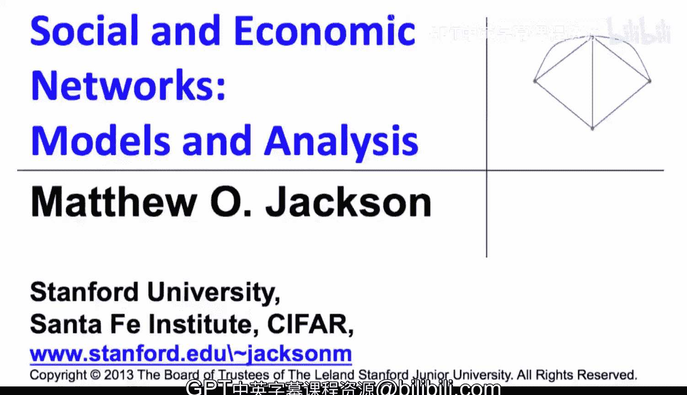

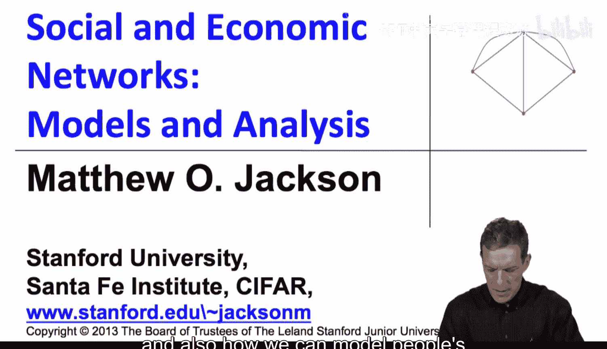

在本节课中，我们将学习如何衡量网络形成的效率，以及如何建模个体在形成或删除链接时的决策动机。我们将引入“配对稳定性”这一核心概念，并将其与“帕累托效率”和“整体效率”进行比较，以理解个体激励与社会整体福利之间可能存在的冲突。

---

## 战略形成的基本思路

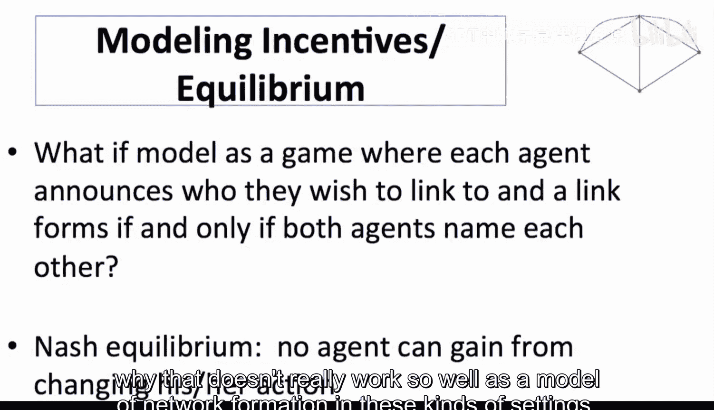

上一节我们介绍了网络战略形成的基本思路。本节中，我们来看看如何具体建模个体的激励，并衡量网络的效率。

首先，我们考虑一个需要双方同意才能建立链接的世界。一个简单的建模方式是将其视为一个博弈：每个人宣布他们希望与谁成为朋友，如果双方都宣布了彼此，则链接形成。纳什均衡是指，给定其他人的宣布列表，没有人愿意改变自己的宣布。

然而，这种简单的博弈模型存在一些问题。让我们通过一个例子来说明。

## 简单博弈模型的局限性

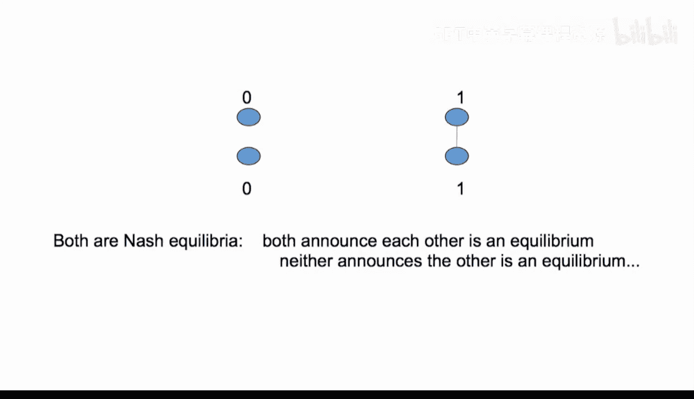

假设只有两个个体。如果他们分开，各自获得收益 `0`；如果他们连接，各自获得收益 `1`。

在这个同时宣布意愿的博弈中，存在两个纳什均衡：
1.  双方都不宣布对方，链接不形成。
2.  双方都宣布对方，链接形成。

这个最简单的模型预测了“任何事情都可能发生”，但现实中，任何合理的沟通都应导致链接形成。这表明，使用现成的非合作博弈论来建模网络形成激励可能并不理想。

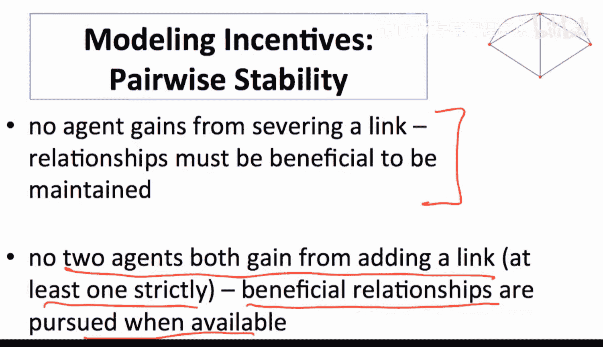

因此，我们将采用一个更简单、更直接的概念来建模激励：**配对稳定性**。

---

## 配对稳定性

配对稳定性是一个简单而强大的概念。它基于一个直观的想法：在需要双方同意才能建立链接、单方即可删除链接的设定下，一个稳定的网络应满足以下条件：
*   **无人愿意单方面删除链接**：对于网络中的任何现有链接，涉及的双方都不应因删除该链接而获益。
*   **无人能共同获益并建立新链接**：对于网络中任何不存在的链接，不能出现双方都因建立该链接而获益（至少一方严格获益）的情况。

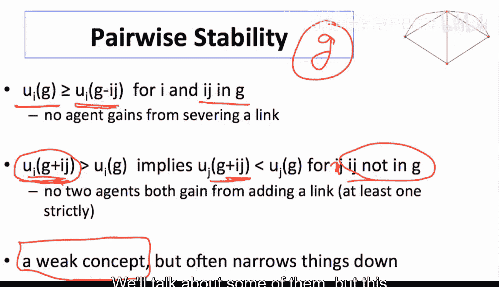

以下是配对稳定性的正式定义：

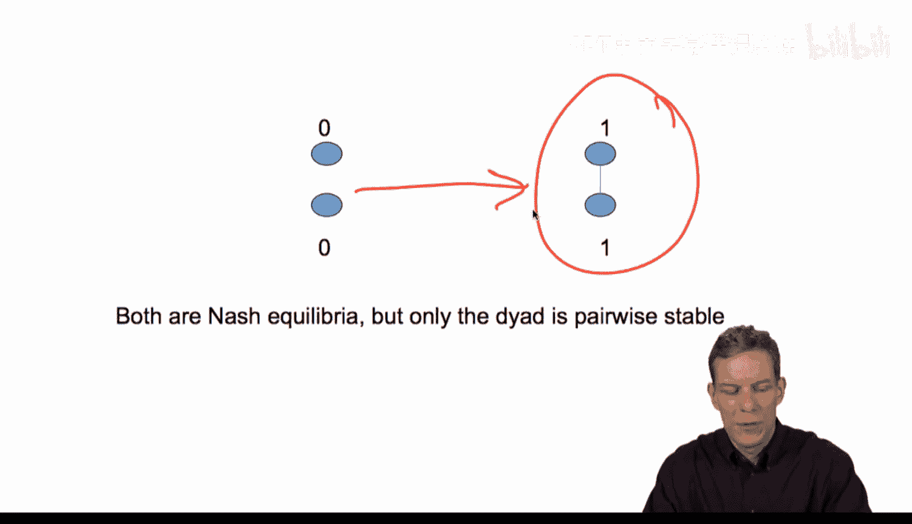

一个网络 `G` 是**配对稳定**的，当且仅当：
1.  对于所有存在于 `G` 中的链接 `ij`，有 `u_i(G) ≥ u_i(G - ij)` 且 `u_j(G) ≥ u_j(G - ij)`。这意味着无人能从删除链接中获益。
2.  对于所有不存在于 `G` 中的链接 `ij`，如果 `u_i(G + ij) > u_i(G)`，那么必须有 `u_j(G + ij) < u_j(G)`。这意味着如果一方想添加链接，另一方必须不想添加。

回到之前的双人例子，在配对稳定性下，**只有完全连接的网络（收益为 `(1, 1)`）是稳定的**，因为双方都能从添加链接中获益。这解决了简单博弈模型预测模糊的问题。

配对稳定性是一个相对较弱的概念，因为它只考虑成对的个体和单条链接的变动。然而，它通常能为网络结构施加相当强的约束，是思考稳定性的最小要求集。

---

## 配对稳定性的应用示例

让我们看一个更丰富的例子。假设有四个对称的个体，没有连接时收益为 `0`。
*   如果两人形成一条链接，各自获得收益 `3`。
*   然而，如果一个人有了新朋友，他原来的朋友会因相处时间减少而“嫉妒”，收益下降。
*   下图展示了不同网络结构下的收益变化，箭头表示个体有激励通过添加链接从当前网络移动到下一个网络。

在这个设定中，经过一系列由个体激励驱动的链接添加后，**唯一的配对稳定网络是所有人都彼此连接的完全网络**，此时每人收益为 `2.33`。

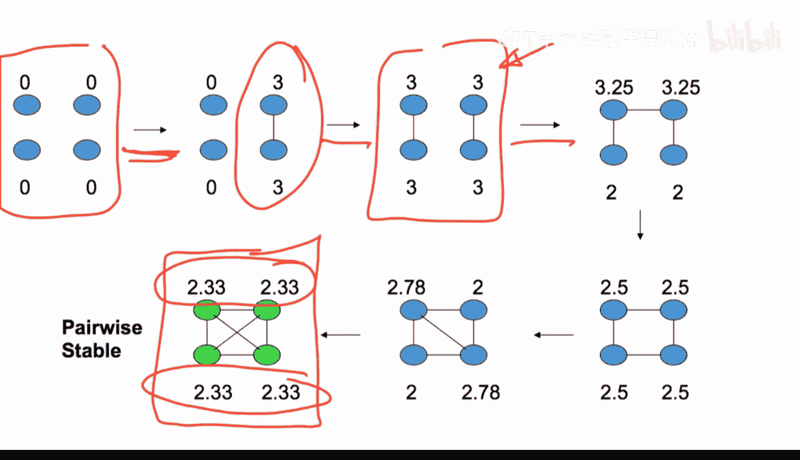

---

## 效率：社会整体视角

配对稳定性处理的是个体激励。现在，让我们从社会整体福利的角度来评估网络。

**帕累托效率**是一个源自经济学的较弱效率概念。一个网络是**帕累托有效**的，如果不存在另一个网络，能在不使任何人变差的情况下，使至少一个人变得严格更好。它排除了那些可以“毫无争议地改进”的情况。

一个更强的效率概念是**整体效率**（或强效率）。一个网络 `G` 是**整体有效**的，如果它最大化所有个体收益的总和：`∑ u_i(G)`。这被称为**功利主义**标准，它关心社会总效用。

---

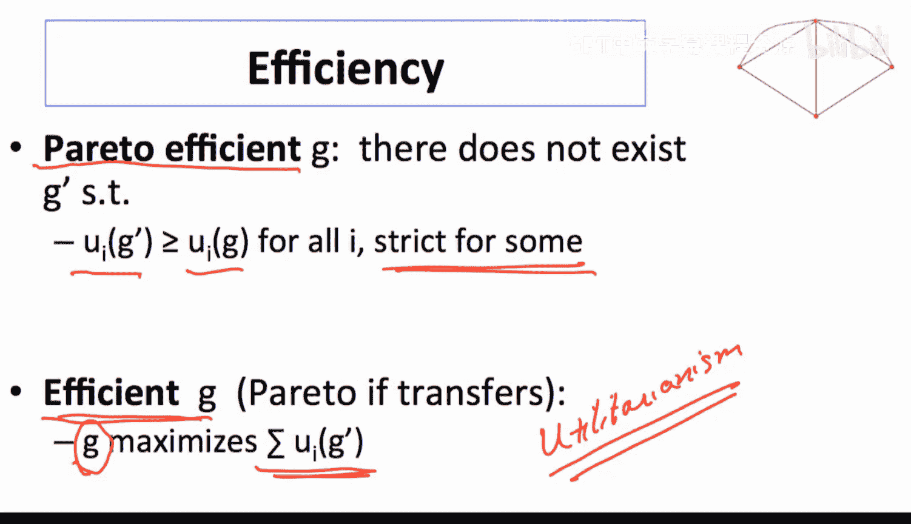

## 稳定性与效率的冲突

现在，对比我们例子中的结果：
*   **配对稳定网络**：完全连接网络，每人收益 `2.33`，总收益 `9.32`。
*   **整体有效网络**：包含两条链接的网络（上图左上），每人收益 `3` 或 `2.5`，总收益 `11`。它同时也是帕累托有效的。

这个例子揭示了一个关键冲突：**个体激励驱动形成的配对稳定网络（完全连接），其社会总福利低于另一个非稳定但更高效的网络（部分连接）**。

原因在于，个体在决定建立新链接时，只考虑自身的收益增加，而没有考虑其行为给网络中其他个体带来的负面外部性（如“朋友因自己交新朋友而收益下降”）。这种个人收益与社会收益的不一致，是战略网络形成中的一个基本主题。

---

## 总结

本节课中，我们一起学习了网络形成分析的核心框架：
1.  我们引入了**配对稳定性**作为建模个体链接形成决策的基本工具，它要求没有单方面删除或共同添加链接的激励。
2.  我们介绍了评估网络社会价值的两个效率标准：**帕累托效率**和更强的**整体效率**。
3.  通过具体示例，我们看到了**个体激励与社会整体福利之间可能存在冲突**。配对稳定的网络不一定是整体有效的，因为自私的个体不会考虑其行为施加给他人的外部成本。

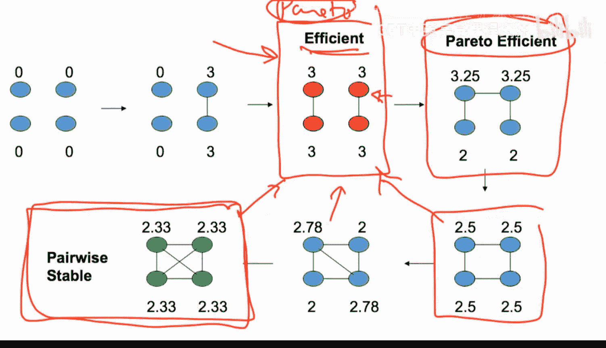

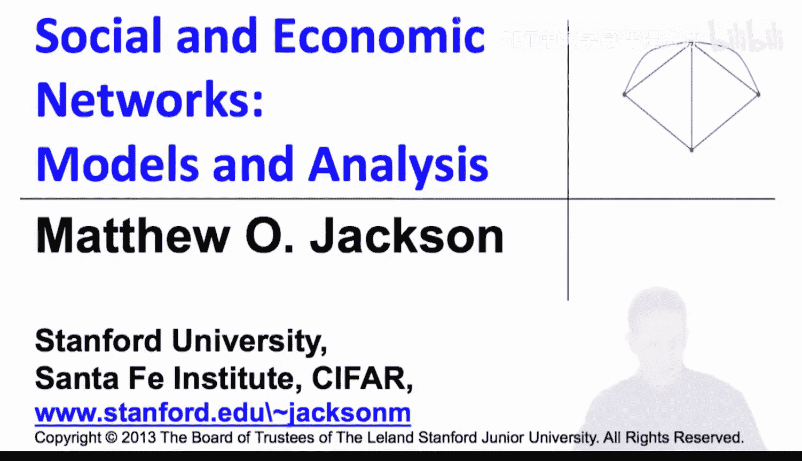

理解这种冲突何时发生、为何发生以及如何通过干预来缓解，是研究战略网络形成的一系列核心问题。在接下来的课程中，我们将回到“连接模型”等具体模型，深入分析高效网络与稳定网络的特征及其关系。