#  039：连接模型中的效率（可选-进阶）🔗

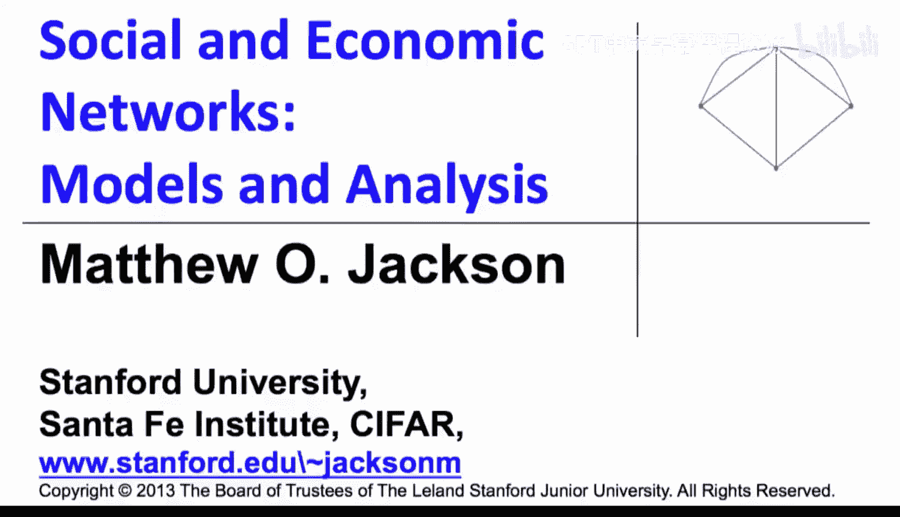

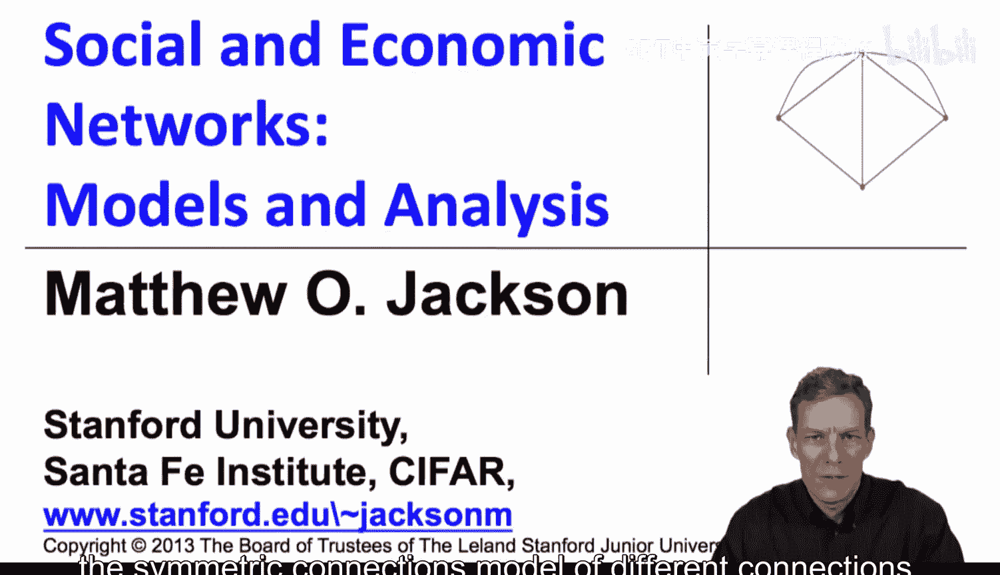

在本节中，我们将深入分析对称连接模型中不同连接的价值，并解释为何在中等成本范围内，星形网络会成为最有效率的网络结构。

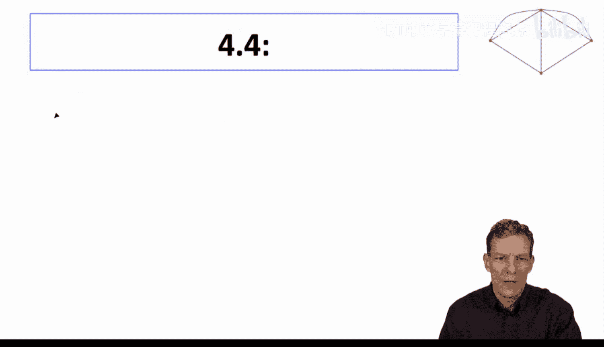

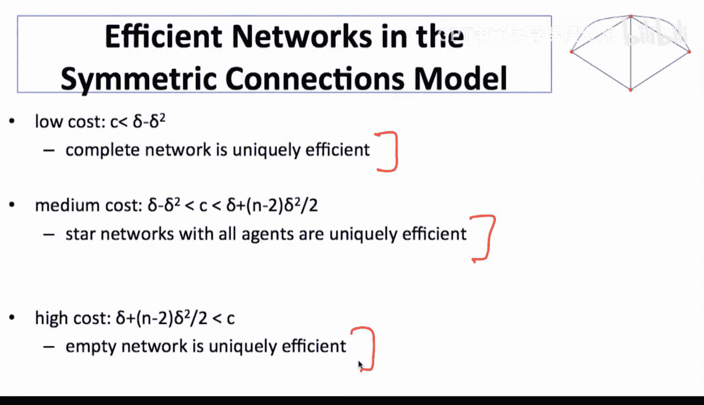

## 概述 📋

上一节我们介绍了连接模型的基本概念。本节中，我们将通过严谨的数学分析，证明在不同成本参数下，何种网络结构（完全网络、星形网络或无连接网络）能最大化社会总福利。核心在于理解直接连接与间接连接的价值权衡。

## 成本区间与网络结构回顾 🔄

首先，回顾我们之前得出的结论，网络结构随连接成本 `c` 的变化如下：

*   **低成本** (`c < δ - δ²`): 形成**完全网络**。
*   **中等成本** (`δ - δ² < c < δ + (n-2)δ²/2`): 形成**星形网络**。
*   **高成本** (`c > δ + (n-2)δ²/2`): 形成**空网络**（无连接）。

我们的目标是证明，在中等成本区间，星形网络是唯一有效率的架构。

## 低成本情况：完全网络 ✅

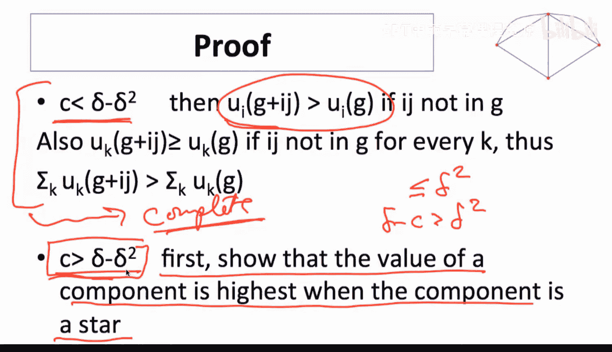

当 `c < δ - δ²` 时，证明完全网络最优是直接的。

对于任意两个未直接连接的个体 `i` 和 `j`，他们从彼此关系中获得的间接价值最多为 `δ²`。如果他们建立一条直接链接，每人将获得 `δ - c` 的净收益。由于 `c < δ - δ²`，可推出 `δ - c > δ²`。因此，建立直接链接使 `i` 和 `j` 的收益严格增加。此外，在连接模型中，新增链接会缩短网络中其他节点间的路径，因此其他所有人至少不会变得更差。综上，增加任何缺失的链接都能提升总福利，故完全网络是最优的。

## 中等与高成本情况：星形网络的优势证明 ⭐

现在，我们重点分析 `c > δ - δ²` 的情况。此时，建立过多直接链接（如完全网络）不再划算。证明分为三步：
1.  证明在连接 `k` 个节点的前提下，星形结构能产生最高价值。
2.  证明一个包含所有人的大星形网络，优于多个分离的小星形网络。
3.  比较大星形网络与空网络的价值，确定中等成本与高成本的确切边界。

### 第一步：星形是连接k个节点的最优组件

考虑一个包含 `k` 个玩家的组件。设 `m` 为该组件内的链接数量。为了保持连通性，至少需要 `m ≥ k-1` 条链接。

**星形网络的价值计算**
在一个 `k` 个节点的星形网络中：
*   中心节点有 `k-1` 条直接链接，外围节点各有1条直接链接。总链接数 `m = k-1`。
*   **直接连接价值**：每条链接为两端参与者各带来 `δ - c` 的净收益。共有 `2(k-1)` 人次参与直接连接，总价值为 `2(k-1)(δ - c)`。
*   **间接连接价值**：每个外围节点（共 `k-1` 个）与其他 `k-2` 个外围节点的距离为2。每个这样的间接连接带来 `δ²` 的收益。因此，间接连接总价值为 `(k-1)(k-2)δ²`。

综合以上，星形网络的总价值 `V_star` 为：
`V_star = 2(k-1)(δ - c) + (k-1)(k-2)δ²`

**任意连通组件价值的最大可能上界**
现在考虑一个拥有 `k` 个节点和 `m` 条链接的任意连通组件。
*   **直接连接价值**：与星形网络计算方式相同，为 `2m(δ - c)`。
*   **间接连接价值**：最大可能情况是所有非直接连接的节点对都恰好距离为2。`k` 个节点间最多有 `k(k-1)/2` 对关系，其中 `m` 对是直接连接。因此，最多有 `[k(k-1)/2 - m]` 对关系可以贡献间接价值，每对最多价值 `δ²`。

因此，该任意组件的价值 `V_any` 满足：
`V_any ≤ 2m(δ - c) + [k(k-1)/2 - m]δ²`

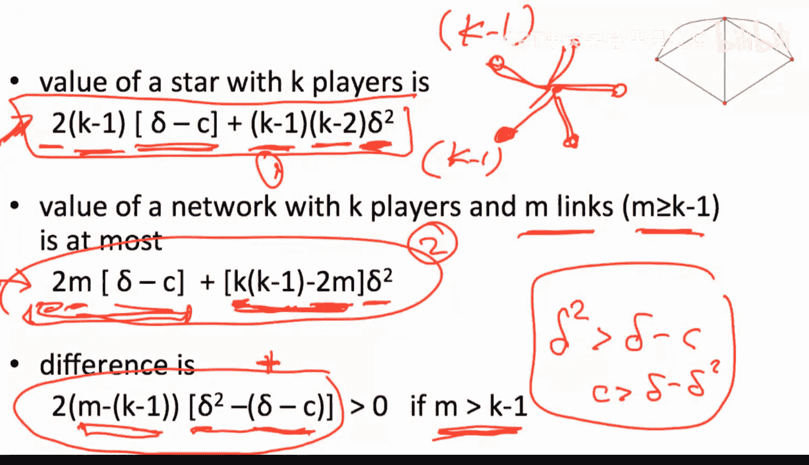

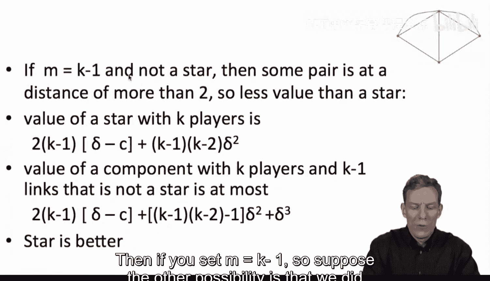

**比较星形与任意组件**
计算星形价值与任意组件价值上界之差：
`V_star - V_any ≥ [2(k-1)(δ - c) + (k-1)(k-2)δ²] - [2m(δ - c) + (k(k-1)/2 - m)δ²]`

经过代数运算（详细步骤可展开），该差值可简化为：
`差值 ≥ [2m - (k-1)] * [δ² - (δ - c)]`

由于我们处于 `c > δ - δ²` 的区间，这意味着 `δ² > (δ - c)`，因此 `[δ² - (δ - c)] > 0`。

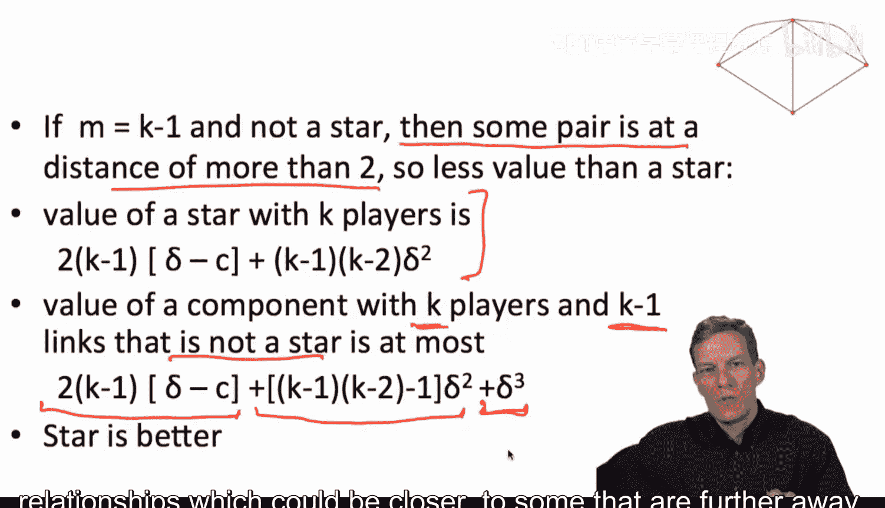

于是：
*   如果 `m > k-1`（即使用了比星形更多的链接），则差值 `> 0`。说明星形优于该任意组件。
*   如果 `m = k-1`（即链接数与星形相同），但组件不是星形，则至少有一对节点距离大于2（例如为3）。那么，其实际间接价值将低于我们上面计算的最大上界（因为部分 `δ²` 被替换为更小的 `δ³` 或更低），而直接价值相同。因此，星形仍然更优。

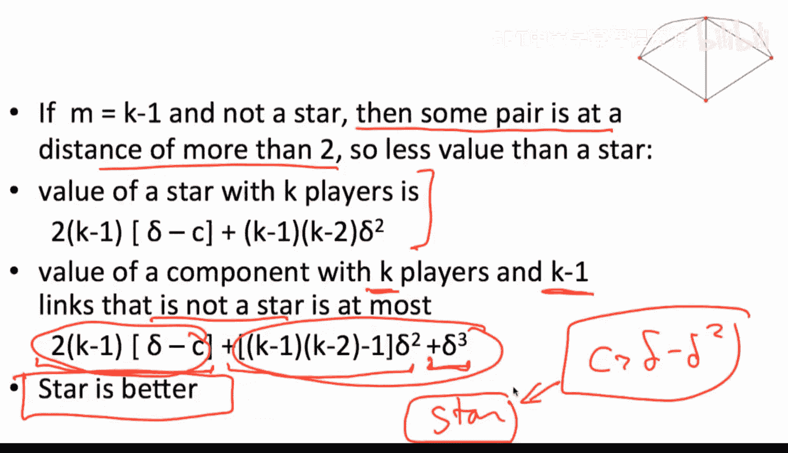

**结论**：在 `c > δ - δ²` 的条件下，若要连通 `k` 个节点，星形结构是产生最高总价值的唯一最优方式。

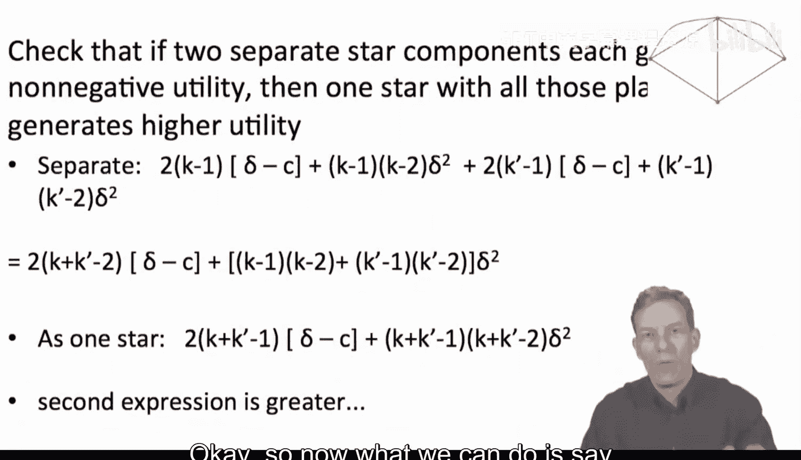

### 第二步：一个大星形优于多个小星形

假设有两个分离的星形组件，分别有 `k` 和 `k'` 个节点。每个组件内部产生正效用。现在考虑将它们合并为一个包含所有 `k + k'` 个节点的大星形网络。

可以分别计算两个小星形的总价值之和，以及一个大星形的总价值。通过直接比较（涉及代数运算，核心是合并后节省了链接并增加了有价值的间接连接），可以证明：
`V_大星形(k+k') > V_星形(k) + V_星形(k')`

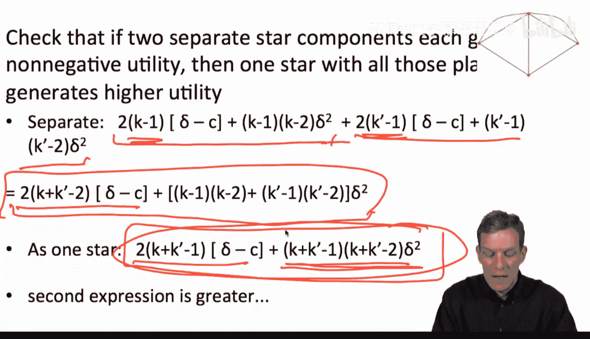

原因在于：合并后，我们节省了一个中心节点的角色（实际上需要重新安排链接，但总链接数可能变化），更重要的是，原来分属两个星形的外围节点之间现在建立了距离为2的间接连接，从而创造了额外的价值。因此，将所有节点纳入一个星形网络优于形成多个分离的星形。

### 第三步：确定星形有效率的成本边界

根据前两步，有效率的网络要么是包含所有 `n` 个节点的单一星形，要么是空网络。我们需要找出星形网络总价值大于0的条件。

计算包含 `n` 个节点的星形网络总价值 `V_star(n)`：
`V_star(n) = 2(n-1)(δ - c) + (n-1)(n-2)δ²`

令 `V_star(n) > 0`，求解 `c`：
`2(n-1)(δ - c) + (n-1)(n-2)δ² > 0`
`=> 2(δ - c) + (n-2)δ² > 0`
`=> c < δ + (n-2)δ²/2`

因此：
*   当 `δ - δ² < c < δ + (n-2)δ²/2` 时，大星形网络具有正的总价值，且优于任何其他结构，故为有效率的网络。
*   当 `c > δ + (n-2)δ²/2` 时，即使是最优的星形结构，其总价值也为负，因此空网络（无任何连接）成为有效率的选择。

## 模型讨论与扩展 💡

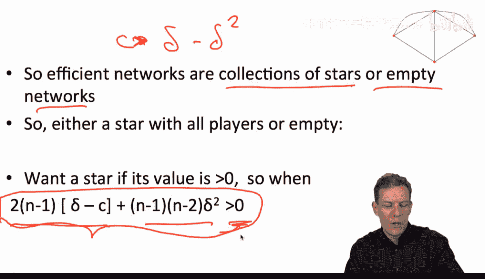

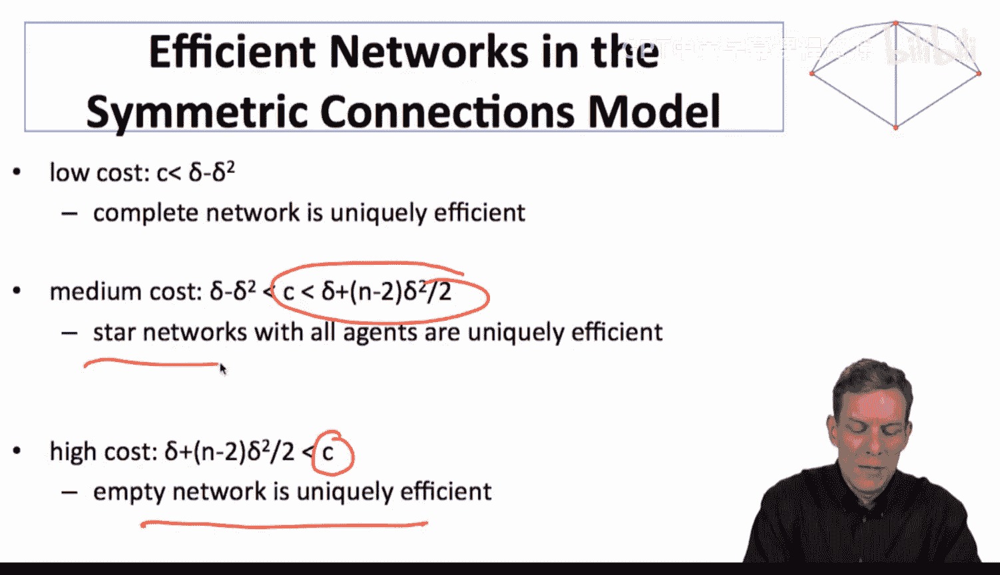

以上分析基于一个特定模型，其关键假设是间接连接的价值随距离呈几何级数衰减（`δ^d`）。只要连接价值随距离增加而递减（不一定是几何级数），星形结构作为高效中介结构的直觉仍然成立，类似的命题也可能成立。

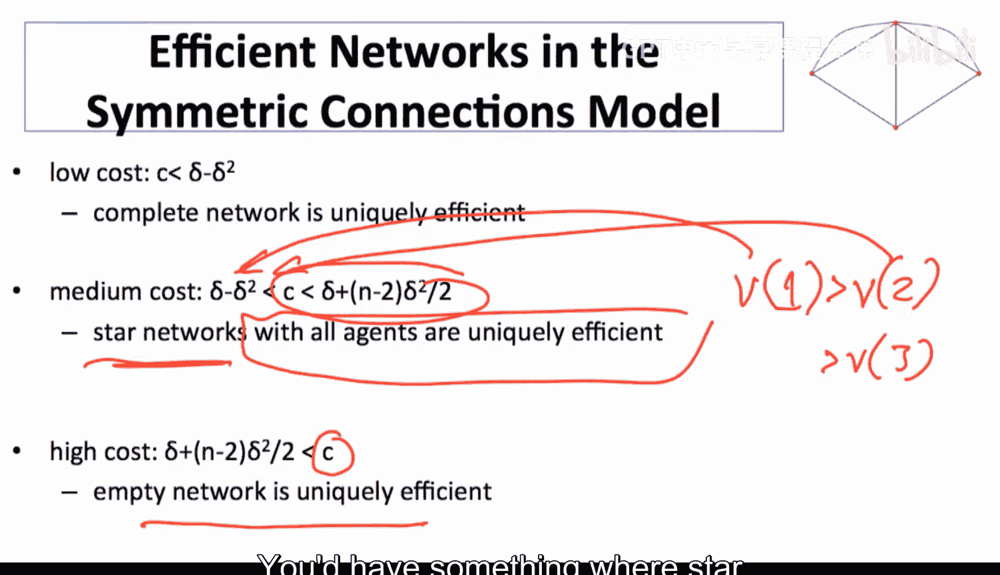

本模型的特殊性在于它没有考虑“收益递减”——即新增第100个间接连接的价值与新增第1个间接连接的价值相同。如果引入收益递减，可能会产生其他类型的有效率网络结构。这个简单模型为我们提供了最基础的直觉，我们可以在此基础上丰富和修改模型，探索更多可能性，这正是网络建模方法论所强调的。

## 总结 📝

本节课中，我们一起深入分析了对称连接模型中有效率网络的结构。我们通过严谨的数学推导证明了：
1.  在低成本 (`c < δ - δ²`) 下，**完全网络**最有效率。
2.  在中等成本 (`δ - δ² < c < δ + (n-2)δ²/2`) 下，**包含所有节点的星形网络**是唯一有效率的架构。
3.  在高成本 (`c > δ + (n-2)δ²/2`) 下，**空网络**最有效率。

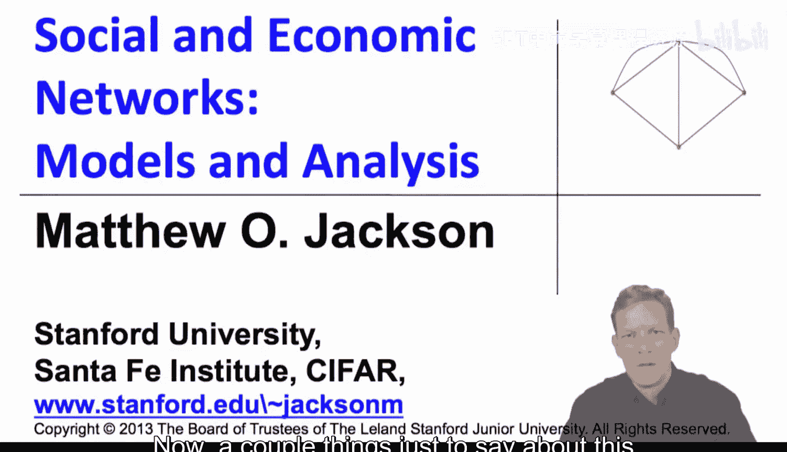

证明的核心在于权衡直接连接的成本与直接、间接连接带来的收益，并展示了星形结构在最小化连接成本（链接数最少）和最大化间接连接可及性方面的独特优势。下一节，我们将探讨网络的“配对稳定性”，看看个体理性下的稳定网络与整体有效率的网络之间是否存在差异。