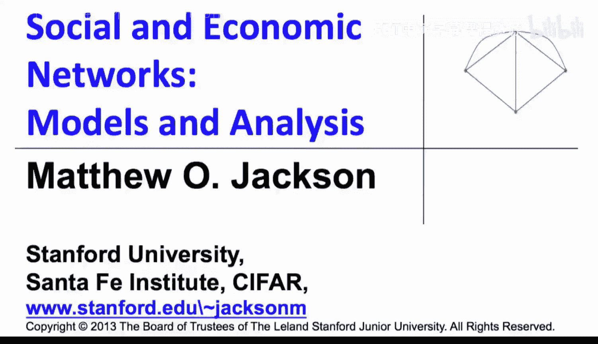
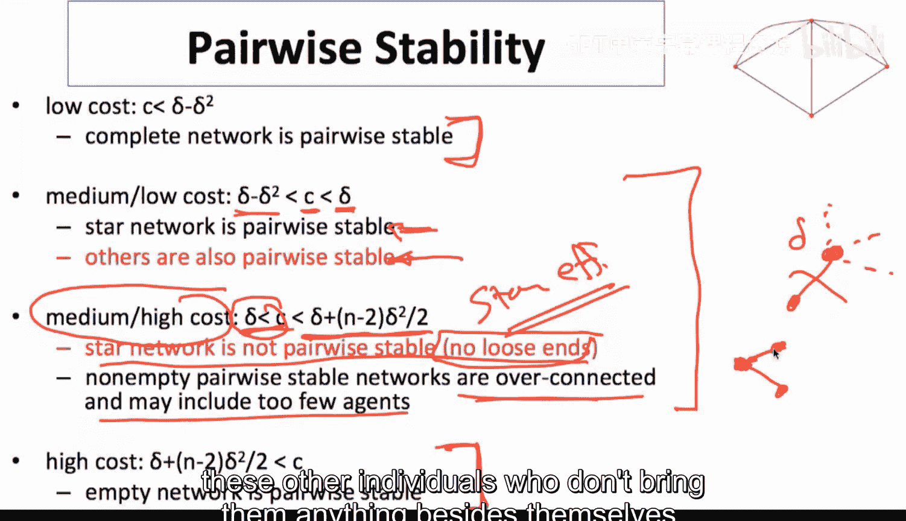
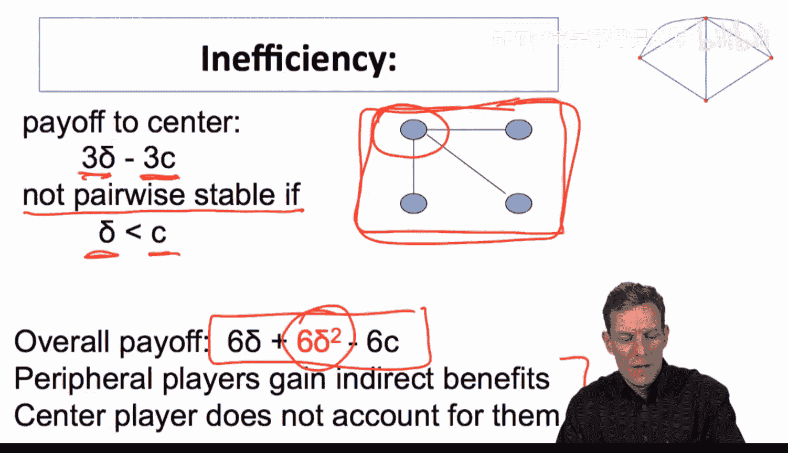
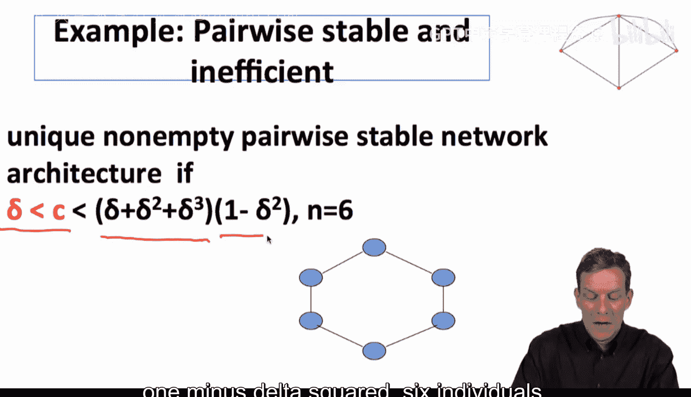
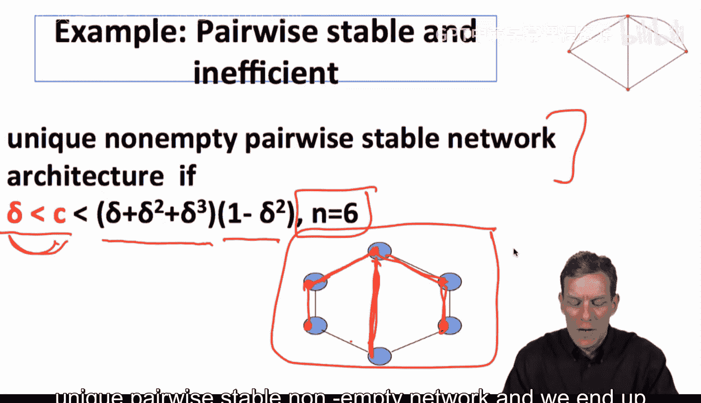
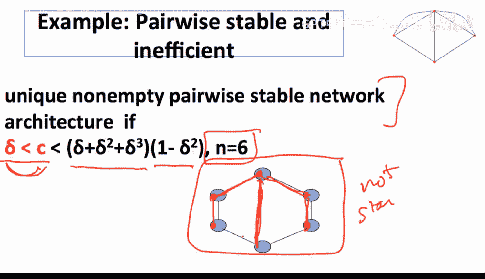
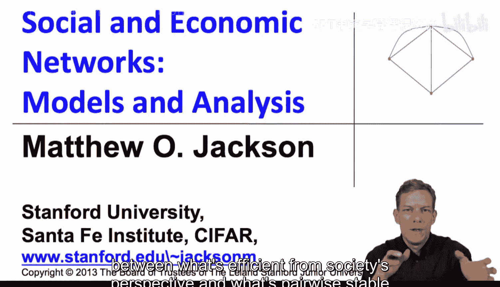
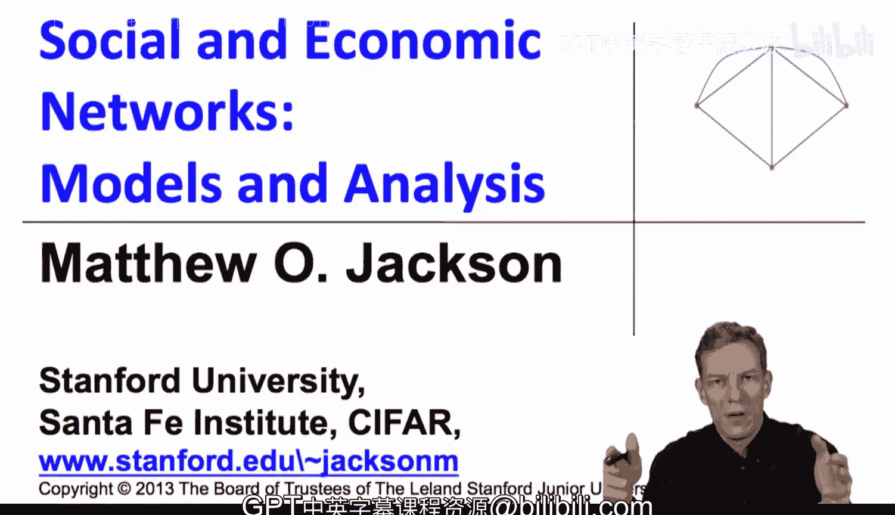

#  040：连接模型中的配对稳定性 🔗



在本节课中，我们将学习连接模型中配对稳定性的概念。我们将探讨在不同成本参数下，哪些网络结构是有效的，哪些是个人愿意自发形成的，并理解两者之间可能存在的差异。

上一节我们介绍了连接模型中的效率概念，本节中我们来看看网络的配对稳定性。

配对稳定性是指，在一个网络中，没有个体有动机单方面删除自己的任何一条连接，也没有任何两个未连接的个体有动机共同建立一条新的连接。这是一种基于个体理性选择的网络均衡概念。

## 成本参数与网络结构

以下是不同成本范围下，有效网络与配对稳定网络的对比：

*   **低成本范围**：当连接成本 `c` 非常低时，完全网络（所有个体两两相连）是有效的。在这个范围内，完全网络也是配对稳定的，并且是唯一配对稳定的网络。因此，个体激励与社会最优结果一致。
*   **高成本范围**：当连接成本 `c` 非常高时，空网络（没有任何连接）是有效的。此时，空网络也是配对稳定的，并且是唯一配对稳定的网络。
*   **中等成本范围**：情况变得复杂，并分为两个子区间。

## 中等成本范围的细分

在中等成本范围内，配对稳定性取决于成本 `c` 相对于连接价值 `δ` 的具体大小。

### 中低成本区间

当 `δ - δ² < c < δ` 时，直接连接本身是有价值的，但将间接连接（距离为2）升级为直接连接不一定划算。

*   **有效网络**：星形网络是有效的。
*   **配对稳定网络**：星形网络是配对稳定的，但可能不是唯一的。在某些参数下，一些低效的网络也可能成为配对稳定网络。



### 中高成本区间

当 `δ < c < δ + (n-2)δ²/2` 时，情况变得有趣。此时，直接连接的成本已经超过了其直接收益（`c > δ`），个体建立连接的唯一动机是获取间接收益（例如，通过朋友认识朋友）。

*   **有效网络**：星形网络仍然是社会最优的。
*   **配对稳定网络**：星形网络**不是**配对稳定的。任何非空的配对稳定网络都可能是“过度连接”的，并且可能包含的个体数量少于最优。

## 为什么星形网络不稳定？

关键在于“无松散末端”原则。由于 `c > δ`，任何个体都不愿意维持一条仅带来一个直接连接、而没有间接收益的链接。





考虑一个星形网络：中心节点与每个外围节点相连。中心节点从每条连接中获得的直接收益是 `δ`，但付出的成本是 `c`。由于 `c > δ`，这条连接对中心节点来说是净亏损的。中心节点无法从外围节点之间的连接中获得任何间接收益，因此它有动机切断所有连接，导致星形网络瓦解。

> 外围节点其实从星形结构中获得了间接收益（通过中心节点彼此连接，收益为 `δ²`），但中心节点无法分享这些收益。这就产生了外部性，导致个体激励（中心节点切断连接）与社会最优（维持星形网络）发生冲突。

## 一个配对稳定网络的例子

假设有6个个体，参数满足 `δ < c < δ + δ² + (1-δ²)δ³`。在这个中高成本区间内，存在一个唯一的非空配对稳定网络，其结构如下：



```
      1 —— 2
      |    |
      6    3
      |    |
      5 —— 4
```



这个网络看起来像一个环或圈。每个个体都愿意维持两条连接，因为尽管直接成本高于直接收益（`c > δ`），但他们能从整个网络结构中获取足够的间接收益，使得总收益大于成本。同时，没有两个未连接的个体愿意增加新的连接，因为增加连接带来的路径缩短收益（例如，将距离从3缩短到1）不足以覆盖其成本 `c`。

这个环状网络是配对稳定的，但它不是一个星形网络，并且其产生的总价值低于星形网络。这正是一种由个体决策导致的社会效率损失。

## 总结






本节课中我们一起学习了连接模型中的配对稳定性。我们看到了在不同成本参数下，有效网络与配对稳定网络可能一致（低成本和高成本时），也可能出现分歧（特别是中高成本时）。核心矛盾在于网络连接带来的**外部性**：个体在决定建立或断开连接时，只考虑自身的收益与成本，而无法完全内部化其行为对网络中其他成员的影响（如间接收益的创造或破坏）。这导致了社会最优结果与基于个体理性的均衡结果之间的差异，这是战略网络形成文献中一个普遍存在的主题。接下来，我们将观察其他类型的模型，看看在不同的外部性设置下，低效率是如何产生的。