#  041：外部性与合著者模型 📊

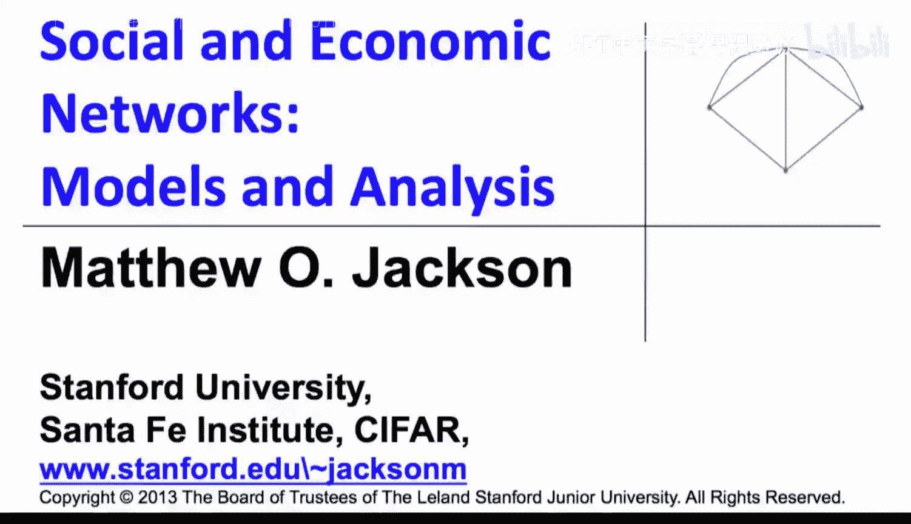

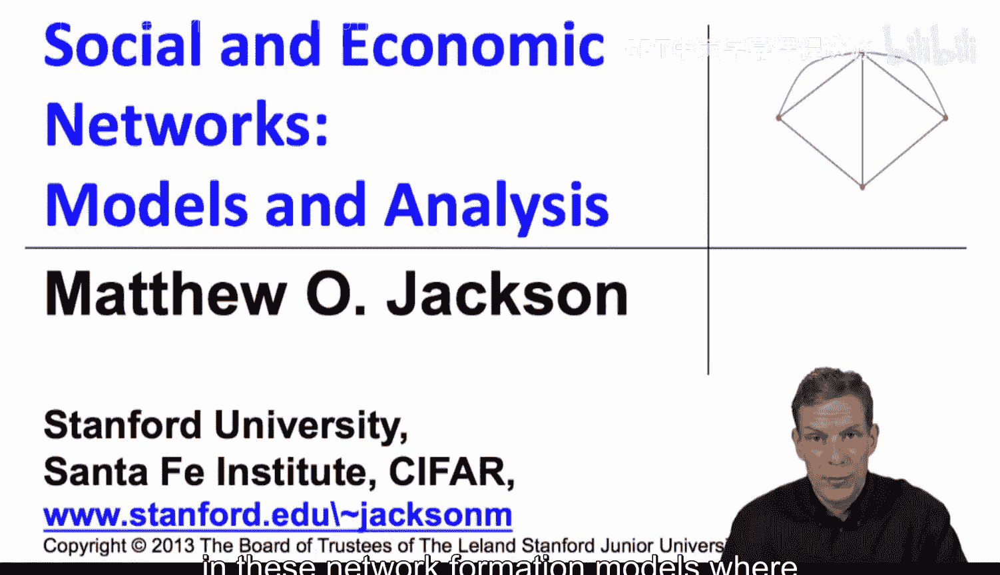

在本节课中，我们将学习网络形成模型中的外部性概念，并深入分析一个具体的模型——合著者模型。我们将了解外部性如何影响网络的结构和效率，以及为什么个体理性决策可能导致整体非最优的结果。

## 外部性的类型

上一节我们介绍了网络形成模型中的收益结构。本节中，我们来看看外部性如何影响这些收益。外部性是指个体建立或断开连接时，对其他未直接参与该连接的个体所产生的间接影响。

我们可以将外部性分为两种主要类型：

*   **正外部性**：当两个个体在网络G中增加一条连接IJ时，其他未参与此连接的个体因此变得更好。任何从一段关系中溢出到其他个体的收益都是净正值。例如，在连接模型中，增加一条连接要么缩短了、要么保持了其他个体间的路径长度，没有人因此受损，有时他们甚至受益。
*   **负外部性**：与正外部性相反。当两个人增加一条连接时，其他个体因此受到损害。这可能发生在多种情境中，例如，我花在新朋友上的时间减少了与老朋友相处的时间；或者两家公司结盟，可能损害你与它们竞争的能力。

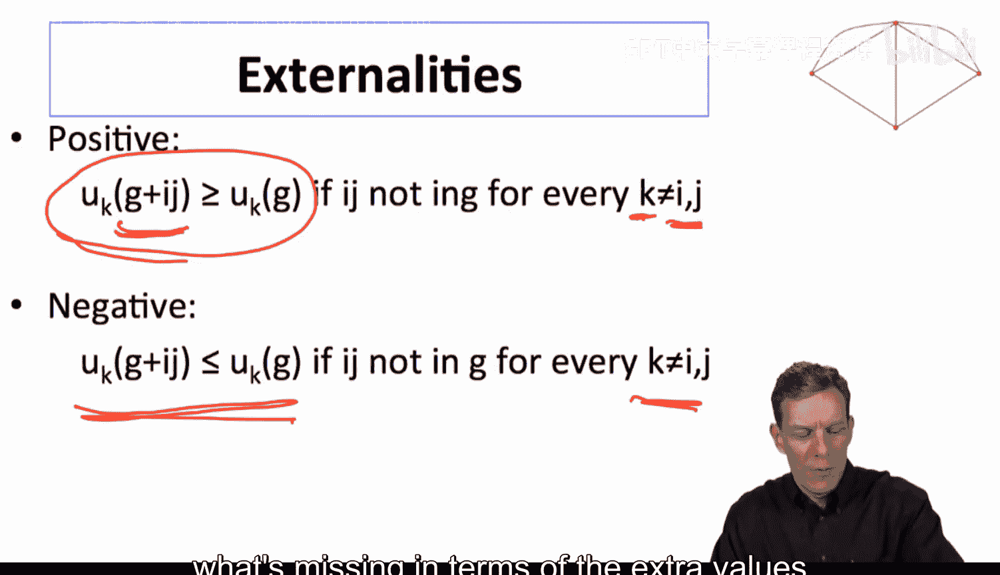

在某些情况下，两种外部性可能同时存在。理解外部性的性质对于分析网络结构、预测网络是连接不足还是连接过度至关重要。

## 合著者模型：一个负外部性的例子

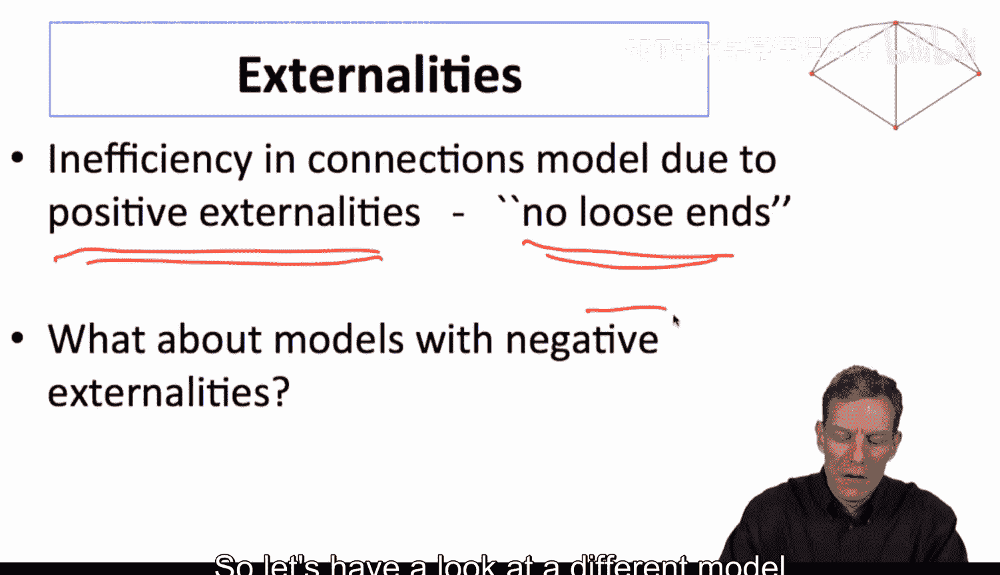

在连接模型中，我们看到了正外部性导致的效率问题。现在，让我们来看一个不同的模型，它展示了负外部性。这个模型被称为**合著者模型**，它模拟了研究合作中的价值创造。

在这个模型中，个体通过合作关系获得价值，而价值取决于他们在每段合作中投入的时间，以及一个代表协同效应的交互项。

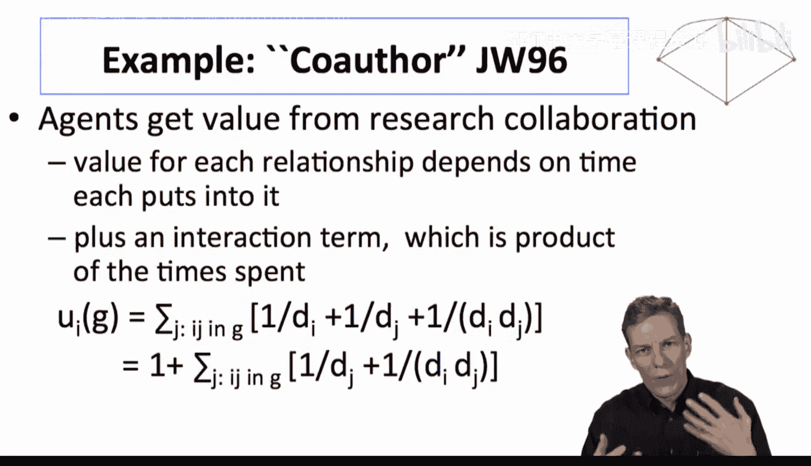

以下是每个个体从网络中的每段关系获得收益的计算方式：

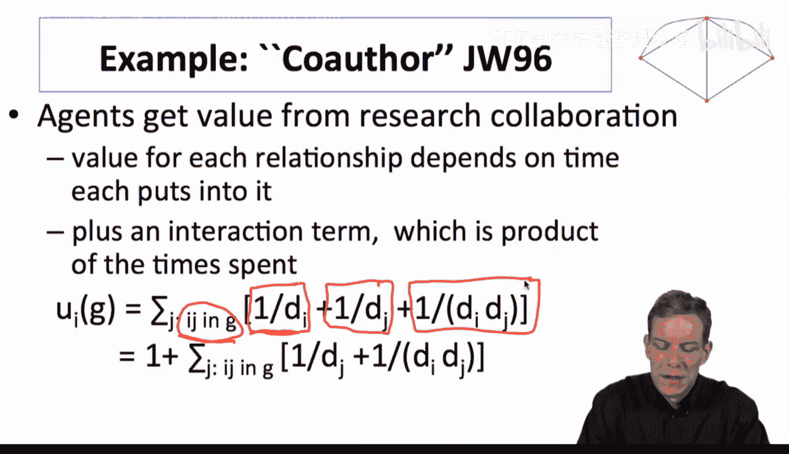

对于个体i的每个合作者j（即连接ij存在），个体i获得的收益为：

`收益_ij = (1 / d_i) + (1 / d_j) + (γ * (1 / d_i) * (1 / d_j))`

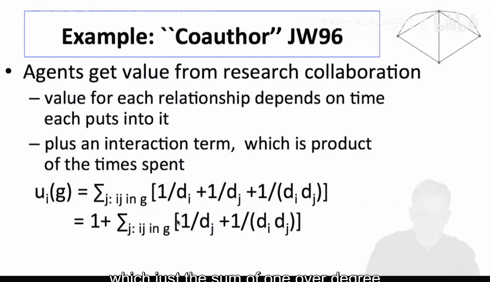

其中：
*   `d_i` 和 `d_j` 分别是个体i和j的度数（即他们拥有的合作者数量）。
*   `γ` 是协同效应系数（通常设为1以简化）。

**公式解释**：
1.  `1 / d_i`：个体i将其总时间平均分配给所有合作者，因此投入到与j合作的时间比例。
2.  `1 / d_j`：个体j投入到与i合作的时间比例。
3.  `γ * (1 / d_i) * (1 / d_j)`：协同效应项，与双方投入的时间乘积成正比。双方投入时间越多，协同效应越大。

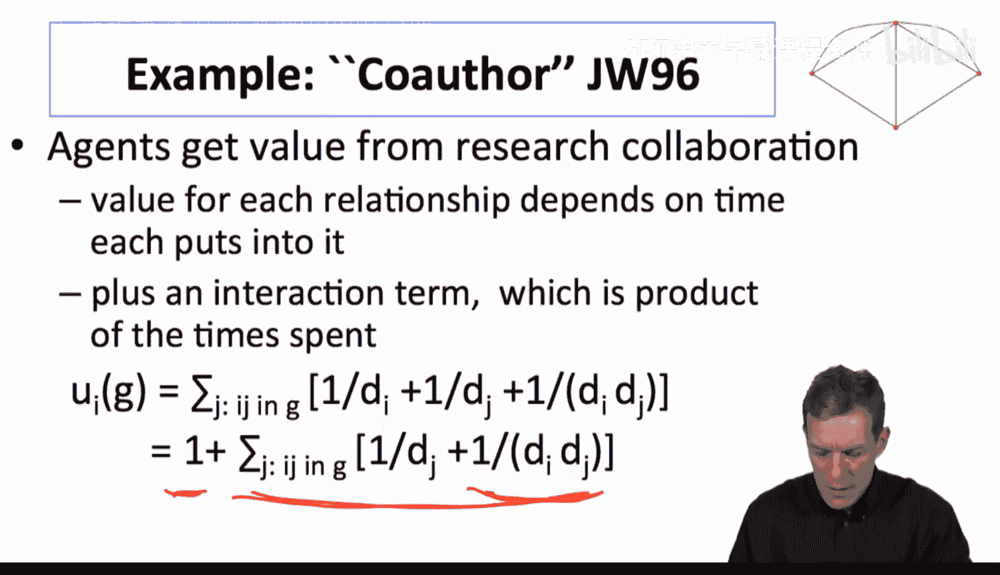

个体的总收益是其所有合作关系收益的总和。这个模型的成本是隐性的：增加额外的连接会稀释你在每段现有合作中投入的时间，从而降低每段关系的协同效应价值。

## 模型示例与分析

让我们通过一个具体例子来理解这个模型。

考虑一个只有两个研究者的网络，他们相互合作。
*   每人度数 `d_i = d_j = 1`。
*   每人收益 = `(1/1) + (1/1) + (1*1/1*1/1) = 1 + 1 + 1 = 3`。

现在，考虑一个三人网络，其中一人（中心者）与另外两人合作，而另外两人之间没有合作。
*   **中心者 (度数=2)**：
    *   与合作者A的收益：`(1/2) + (1/1) + (1*1/2*1/1) = 0.5 + 1 + 0.5 = 2`
    *   与合作者B的收益同样为2。
    *   总收益 = `2 + 2 = 4`。
*   **边缘者A (度数=1)**：
    *   与中心者的收益：`(1/1) + (1/2) + (1*1/1*1/2) = 1 + 0.5 + 0.5 = 2`。

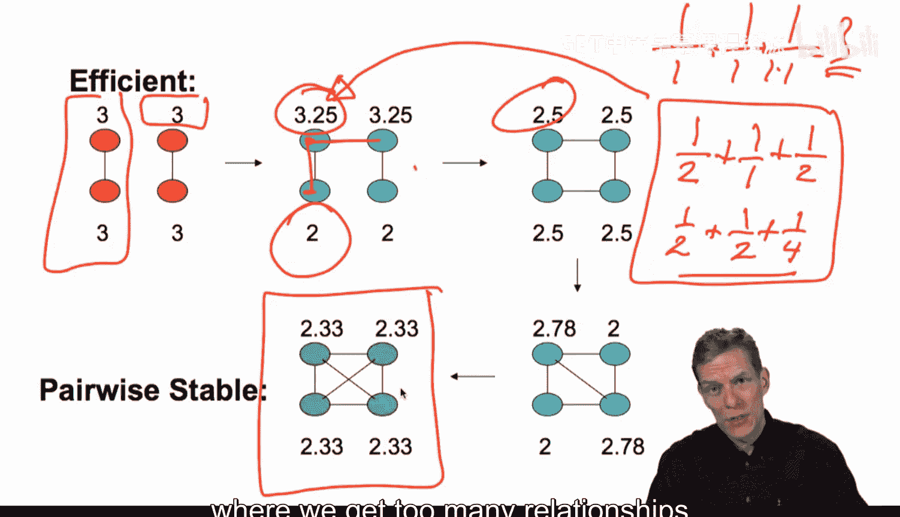

如果边缘者A和B之间也建立连接，网络变成完全连接（三人两两相连）。
*   每人度数 `d_i = 2`。
*   每人从每段关系获得收益：`(1/2) + (1/2) + (1*1/2*1/2) = 0.5 + 0.5 + 0.25 = 1.25`。
*   每人有两段关系，总收益 = `1.25 * 2 = 2.5`。

**分析结果**：
*   **有效网络**：在这个模型中，社会总福利最大化的网络是将所有人两两配对。在三人例子中，有效结构是一个配对加一个落单者（但落单者收益为0），或者任何能使协同效应最大化的结构，但通常配对是最优的。
*   **成对稳定网络**：然而，个体基于自身收益做决策。从三人星型网络开始，对于边缘者A和B来说，如果他们彼此连接，每人收益从2增加到2.5。尽管这会降低中心者的收益（从4降到2.5*? 实际上中心者也变成2.5），但A和B有动机建立连接。最终，唯一的成对稳定网络是所有人都过度连接形成的完全网络，每人收益2.5，低于星型网络下的某些收益配置。

这个例子清晰地展示了**负外部性**：当A和B新建连接时，他们提高了自己的收益，但却**损害了**中心者的利益（稀释了中心者与他们的协同效应）。由于个体决策时不考虑这种对他人造成的损害，导致了过度连接，从而使整体效率下降。

## 核心结论与延伸

本节课中我们一起学习了外部性的概念及其在网络形成中的关键作用。

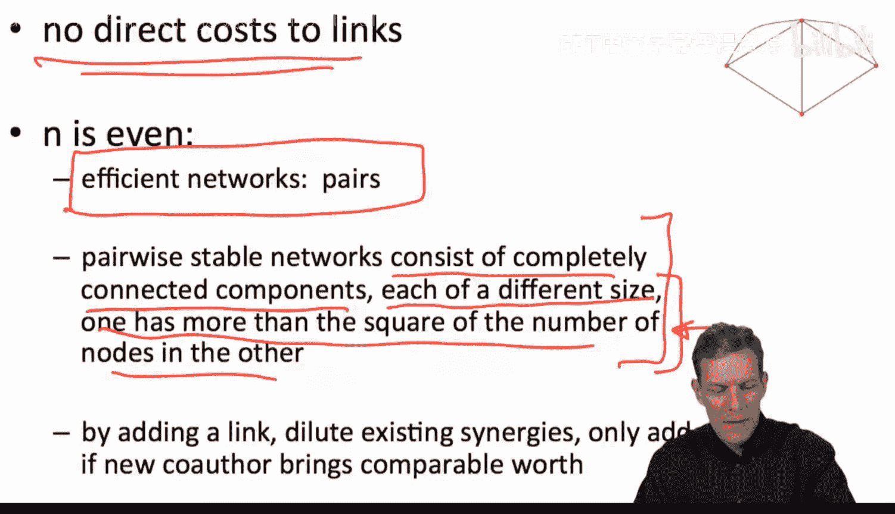

*   **正外部性**（如连接模型）可能导致网络**连接不足**，因为个体未考虑给他人带来的好处。
*   **负外部性**（如合著者模型）可能导致网络**连接过度**，因为个体未考虑对他人造成的损害。
*   因此，**稳定网络（如成对稳定）与有效网络只在特殊情况下才会重合**。通常，个体理性决策无法达到社会最优。

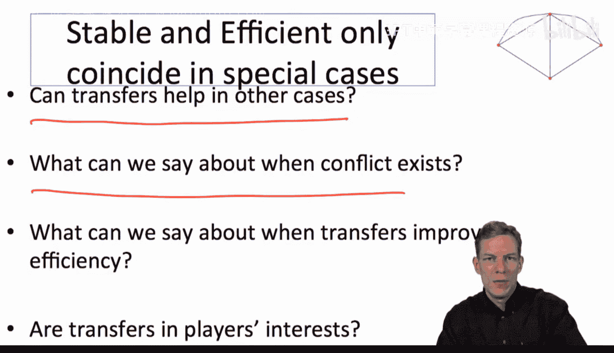

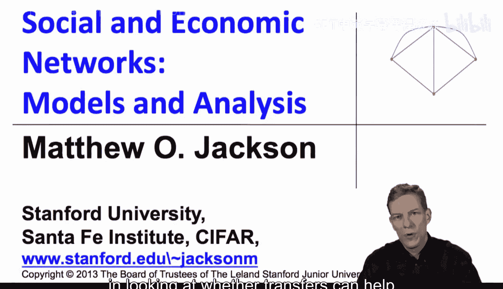

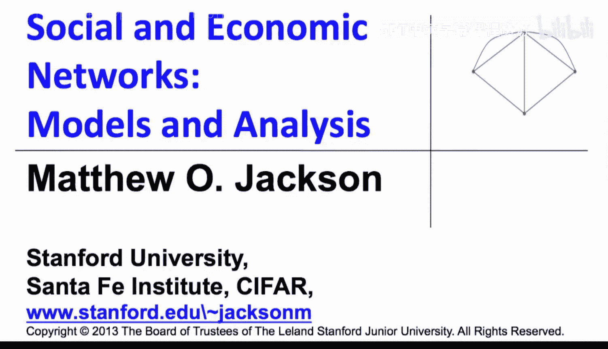

这引出了一系列重要问题：我们能否通过转移支付（例如补贴中心人物）来改善效率？在什么条件下这些冲突会发生？我们将在接下来的课程中探讨如何通过机制设计（如转移支付）来缓解这些网络形成中的效率问题。