#  042：网络形成与转移支付 💸

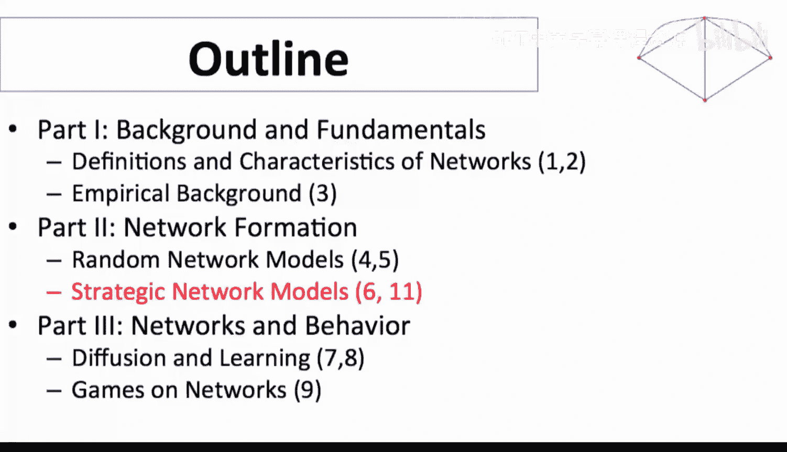

在本节课中，我们将探讨战略网络形成中的转移支付问题。我们将了解如何通过补贴或征税来调整个体在网络中的收益，从而可能解决网络效率与稳定性之间的冲突。

---

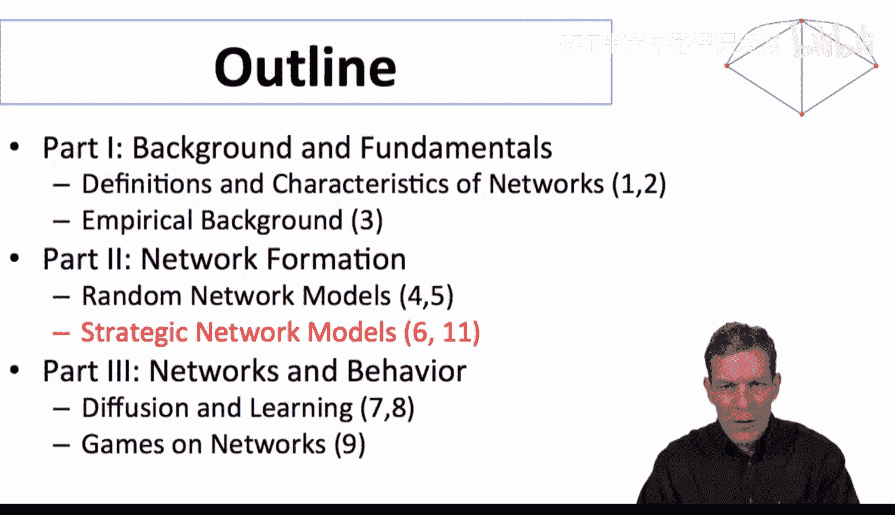

我们一直在讨论战略网络形成，并简要介绍了正负外部性模型的变体，以及为什么形成的网络可能缺乏效率。

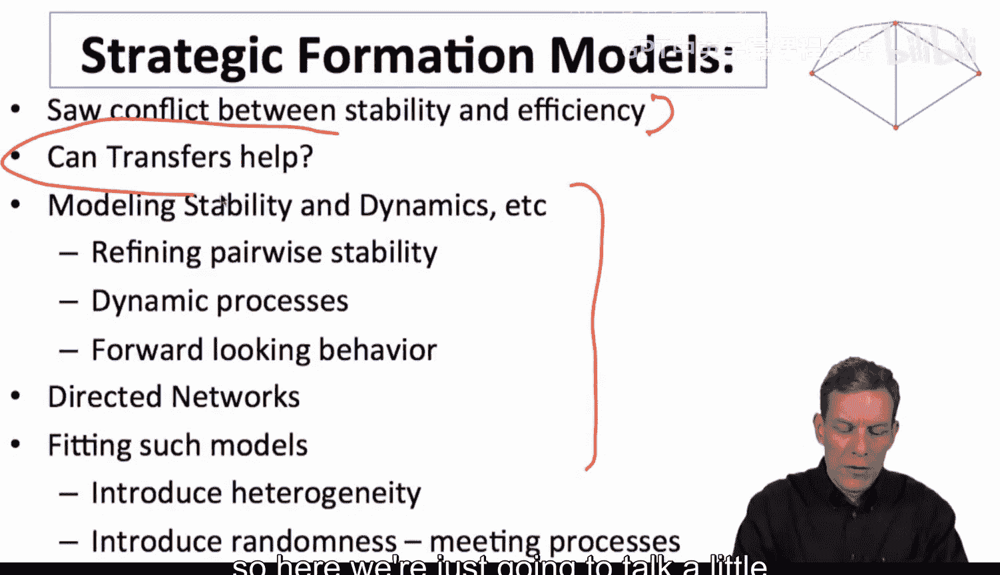

现在，我们想讨论一下转移支付的可能性。转移支付指的是不同个体之间的补贴或支付，旨在理解这如何能纠正网络形成中的问题。根据我们之前的观察，网络中存在冲突。虽然有许多建模和分析方法，但本节我们将重点讨论转移支付，并理解其作用。关于这个主题还有很多内容可以探讨，但本节旨在提供一个基本概念和理解。

**什么是转移支付？** 在这里，转移支付指的是某种外部干预，例如政府对某些关系征税或补贴，比如支持研发合作。它也可能源于个体之间的讨价还价，例如一方认为建立连接有价值，愿意向另一方支付报酬。朋友之间交换帮助也属于此类。核心思想是，无论我们处理的效用数值是什么，都可以通过外部实体（如政府）或个体间的协商，将效用从一个节点转移到另一个节点。在国家间形成联盟时，也常常存在明确或隐含的支付安排，以确保建立关系符合双方利益。

接下来，让我们详细探讨这一点。我们可以将基础效用模型修改为：**效用 + 转移支付**。这里的转移支付可以是正数或负数，取决于个体在网络中是净支付方还是净接收方。例如，在星型网络中，外围节点可能认为连接到中心非常有益，愿意为中心节点提供帮助；而中心节点则因为能从其他节点获得价值而愿意维持这些关系。

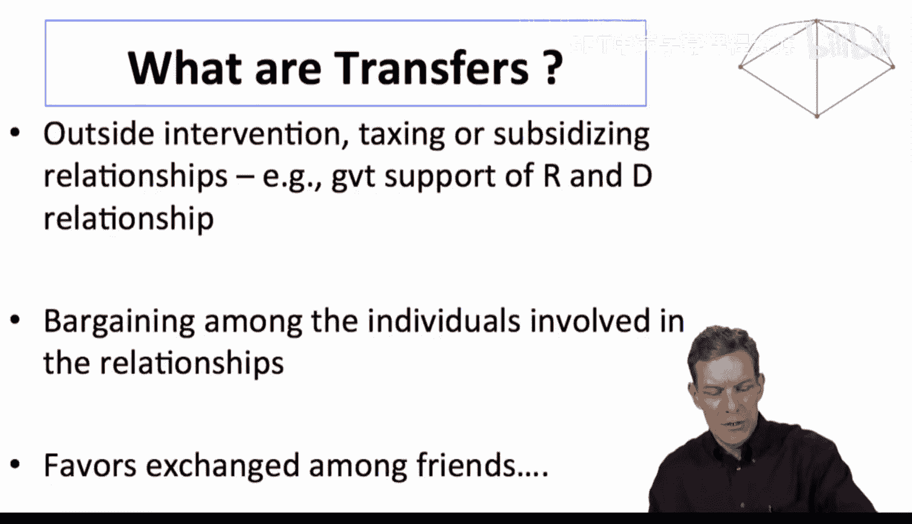

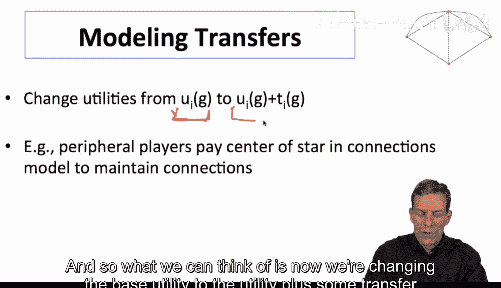

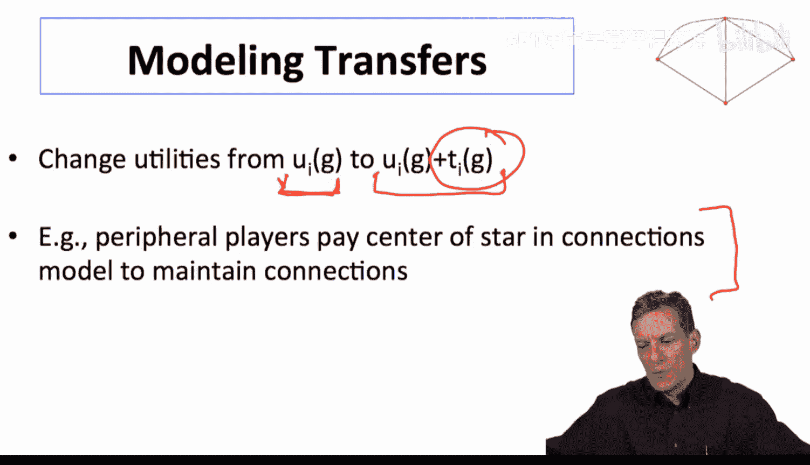

---

## 转移支付的应用示例

上一节我们介绍了战略网络形成中的效率问题，本节我们来看看转移支付如何具体应用。

让我们回到合著模型中的效率低下问题。回想一下上一视频讨论的合著模型，当时的问题是人们倾向于过度连接。

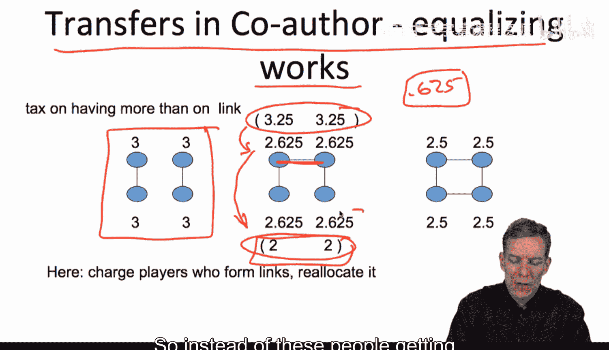

考虑以下情况：政府决定对建立额外连接的人征税，并将税款重新分配给其他参与者。在原始模型中，每人只建立一个关系时，收益为3。当某些人建立了额外的连接后，他们的收益上升到3.25，而其他人的收益则下降到2。

一种可能的转移支付方案是：向建立额外连接的个体每人征收0.625的税，然后将这些税款分配给收益下降的个体。这样，原本收益为2的个体现在获得2.625。通过这种税收和补贴的方式，我们重新平衡了模型中的收益分配。

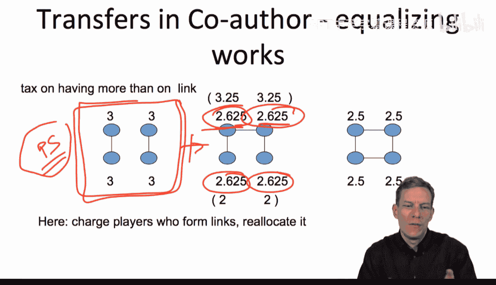

现在，当我们审视激励时，情况发生了变化。个体不再有动机去建立额外的连接，因为他们必须支付相应的税款。因此，在考虑税收成本后，这个网络变成了**成对稳定**的。我们通过转移支付调整了个人利益，现在每个人都看到了网络价值的平等份额，从而没有动机去破坏或过度建立连接。

---

## 完全平等化的转移支付

上一节我们看了一个具体的税收补贴例子，本节中我们来看看一种更系统化的转移支付思路。

一种可能性是采用完全平等化的方式进行征税和补贴。具体做法是：计算网络的总价值，然后将其在所有个体间平均分配。如果某个个体获得的原始收益低于平均值，他将获得正的转移支付（补贴）；如果高于平均值，他将进行负的转移支付（缴税）。这样，在考虑转移支付后，每个人的净效用都恰好等于社会的平均效用。

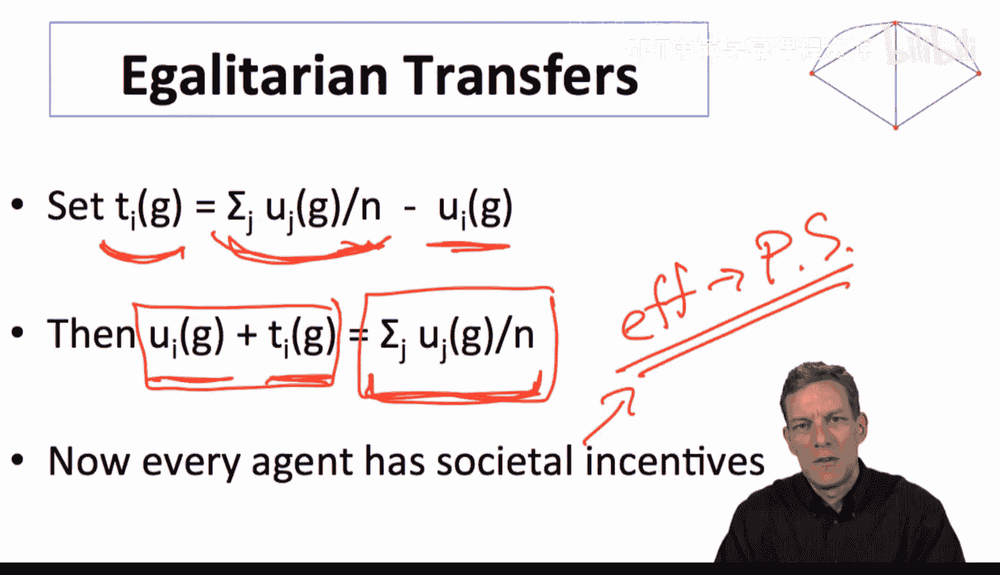

在这种机制下，社会中每个个体的激励与一个功利主义计划者的激励完全一致，因为每个人的效用都只是社会总效用的 **1/n**。因此，更高效的网络会让每个人都获得更多价值，而低效的网络则让每个人都获得更少。最直接的结果是，整体高效的网络将成为成对稳定的网络。通过平衡收益并确保每个人获得平等的份额，我们解决了效率与稳定性之间的冲突。

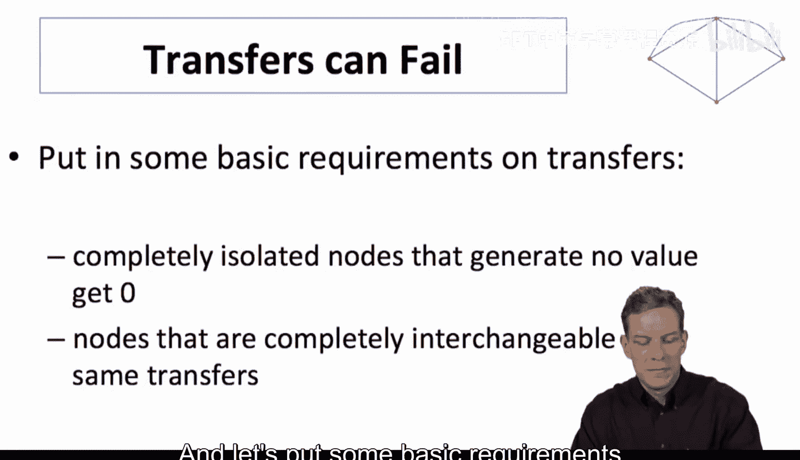

这种方法效果很好，但可能涉及大量的转移支付，需要将大量“效用”或“金钱”进行再分配。特别是，它可能违反一些相当基本的条件。

---

## 对转移支付施加限制

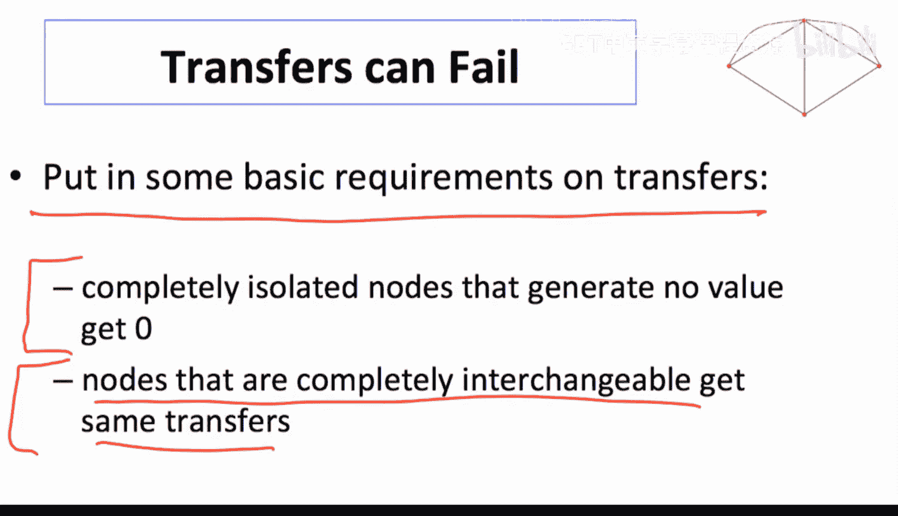

上一节我们看到了完全平等化转移支付的威力，但本节中我们来看看如果对转移支付施加一些基本限制，是否还能实现完全效率。

我们将对允许的转移支付类型施加两个非常基本的要求：
1.  **完全孤立的节点获得零转移支付**：完全不产生任何价值、完全孤立的节点不应获得支付。这个条件可以确保社会不会分裂或碎片化，不产生价值的人不会得到他人的补贴。这个条件有一定争议性。
2.  **完全可互换的节点获得相同的转移支付**：在任何配置下都完全可互换、产生相同价值的节点，应获得完全相同的转移支付。这个想法非常直观，我们将在例子中看到其含义。

让我们通过一个例子来说明，在这些限制下，转移支付并不总能解决问题。这个例子来自Jackson和Moenonsky的论文。

考虑以下情景：
*   如果所有人完全连接，每人获得价值4，社会总价值为12。
*   如果形成星型网络，中心节点获得5，外围节点获得4，社会总价值为13（这是最大值）。
*   如果两个节点自成一对，每人获得6，总价值为12。

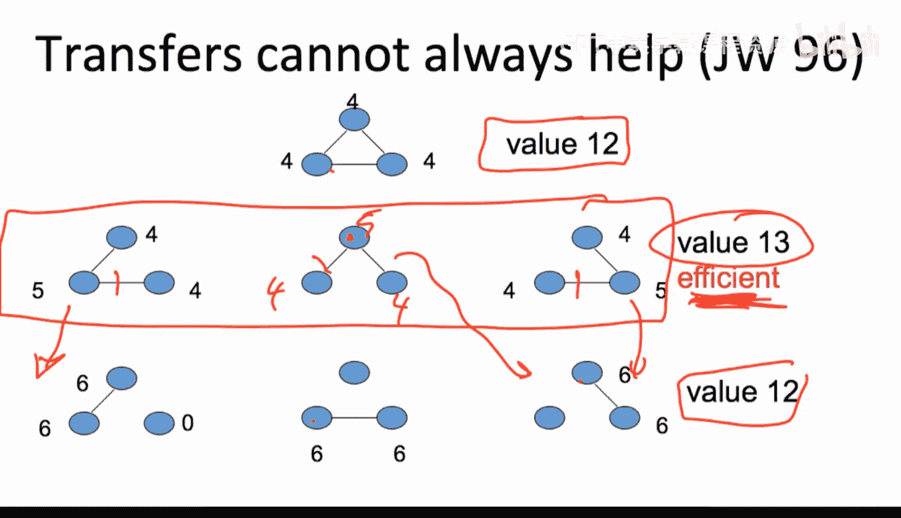

在这个设定中，高效的网络是星型网络。然而，这些网络并不是成对稳定的。为什么呢？星型网络的中心节点可以通过删除一条连接，将收益从5提高到6。因此，无论处于哪种配置，总有人可以通过删除连接获得更高收益。所以，高效的星型网络都不是成对稳定的。

我们想看看是否可以通过转移支付来解决这个问题。假设我们希望其中一个星型网络（例如中心收益为5，外围收益为4的网络）成为成对稳定的。

首先，为了让中心节点愿意维持两条连接，他的收益必须至少为6（因为删除一条连接能得6）。因此，我们需要通过转移支付至少给他增加1点收益。

其次，根据我们的限制条件：那两个完全孤立的节点（在星型网络中未连接的两个节点）不产生价值，因此他们必须获得零转移支付。而那两个外围节点在星型网络中角色对称，因此他们必须获得相同的转移支付。

为了让外围节点不彼此形成新的连接（这会破坏星型结构），他们每个人的收益必须至少维持在4（因为如果他们自己连接，每人能得6，但会破坏网络，这里需要具体分析激励，但核心是他们需要足够的收益才不去新建连接）。这意味着我们不能从他们那里拿走任何收益。

因此，为了让高效的网络稳定，唯一的办法是从外部注入额外的价值给中心节点。但这意味着我们损失了试图创造的价值。在这种情况下，**没有任何一组转移支付能在满足“平等对待平等者”和“不补贴孤立者”这两个条件的同时，使这个星型网络稳定**。我们必须同时满足中心节点不删边、外围节点不添边的激励约束，而一组转移支付无法做到这一点。

---

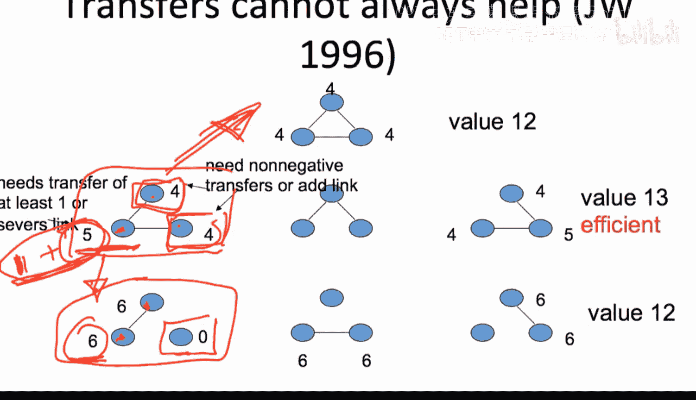

## 理论背景与总结

上一节我们通过一个具体例子看到了转移支付的局限性，本节我们来探讨其背后的理论思想。

经济学中有一个著名的**科斯定理**，它源于科斯多年前的一篇论文。该定理的核心思想是：如果人们拥有完全信息，并且清楚情况中的外部性，那么应该存在某种他们可以达成的协议（讨价还价），以确保社会采取有效的行动。在没有摩擦的情况下，转移支付可以帮助解决这类低效率问题。

然而，在我们的网络例子中，尽管我们处于一个信息完全的世界，人们可以看到每种情况的价值并意识到需要支付，但我们仍然无法通过支付来确保形成正确的网络。困难在于，我们必须**同时处理多个外部性**：既要确保中心代理愿意保持连接，又要确保其他代理不想形成新的关系。我们必须向一个代理支付，同时不能从其他代理那里拿走收益。正是这些需要同时处理的激励约束的组合，导致了效率与稳定性之间的冲突，而这种冲突无法通过合理的转移支付来解决。

这告诉我们，转移支付有时有帮助，但并非总是有效，这取决于具体情况。网络环境引入了一个有趣的问题：通过讨价还价或转移支付并不一定能完全纠正问题。这取决于我们允许何种转移支付以及具体情境。有时有解决办法，有时则没有。

---

## 总结与展望

本节课中，我们一起学习了战略网络形成中的转移支付问题。

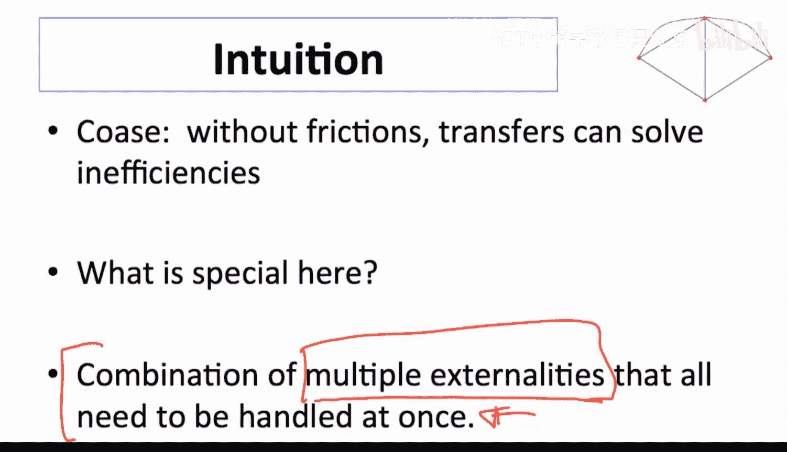

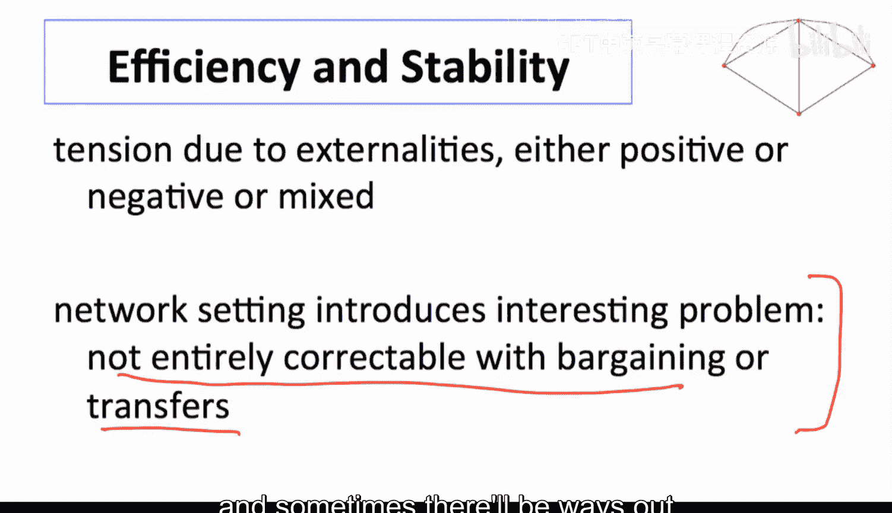

**总结如下：**
1.  在各种模型中，高效网络可以呈现非常简单的形式。
2.  高效网络与成对稳定网络不一定重合。
3.  转移支付可能有帮助，但并非总能解决问题，有时会违反一些基本条件。

以上是对战略网络形成中一些问题的一个快速概览。我们还可以探讨更高级的主题，例如使用更丰富的解概念、考虑动态过程、讨论有向链接形成等其他设定。相关文献已经非常丰富，很难在几节课内全面理解，但希望本节能让你对基本问题以及该领域有趣的原因有所了解。

这是一个活跃的研究领域。未来的一个研究方向是将这类战略形成模型与我们之前看到的随机网络模型结合起来，尝试用数据拟合，以更好地理解现实中的网络形成过程。

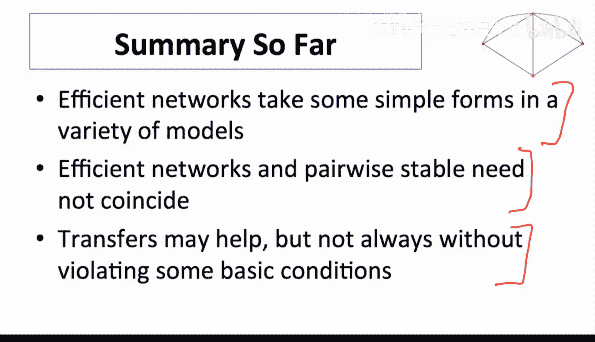

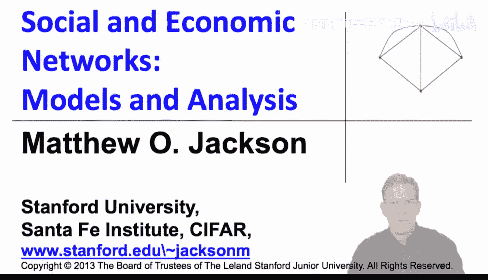

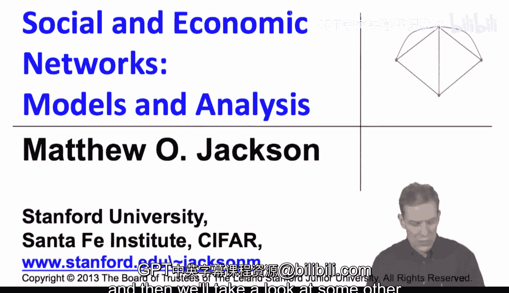

本节课到此结束，稍后我们将继续探讨其他网络形成模型。