#  043：策略模型中的异质性 🧩

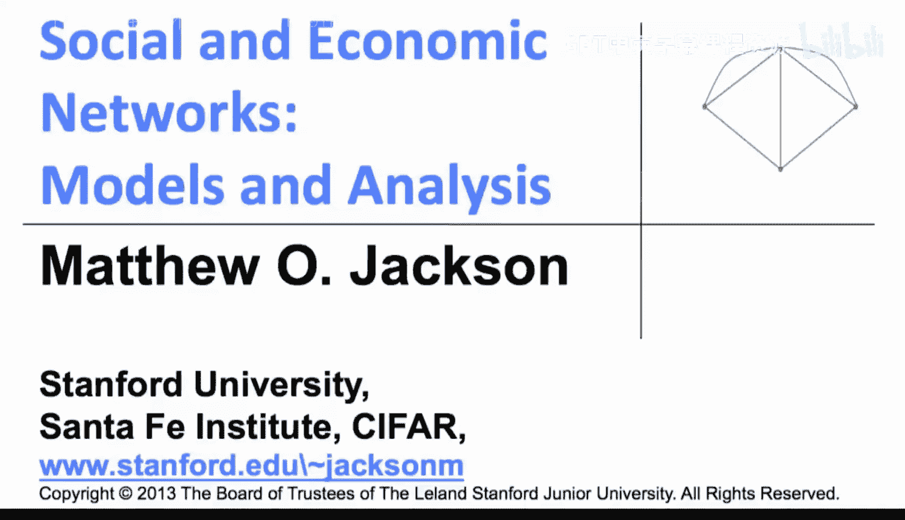

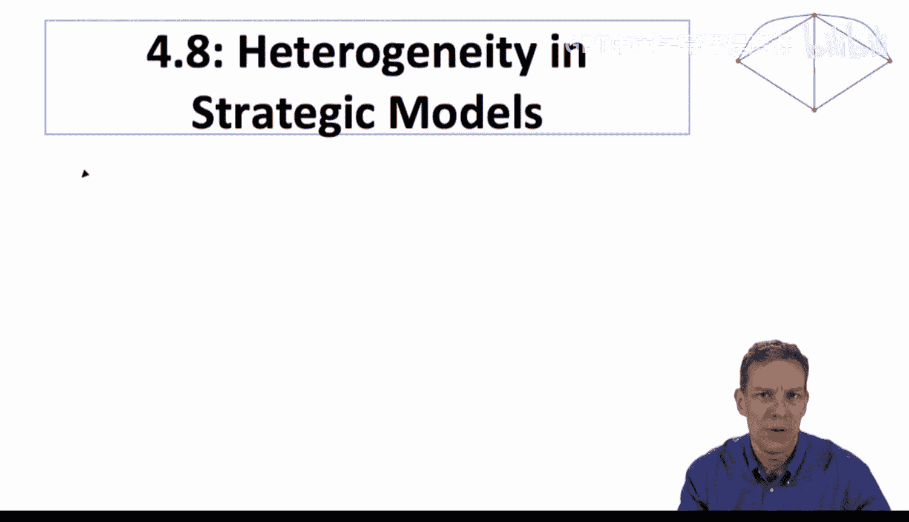

在本节课中，我们将学习如何通过引入异质性来丰富策略网络形成模型，以更好地解释现实数据中观察到的现象，特别是“小世界”网络的高聚类和短平均路径长度特性。

上一节我们讨论了策略网络形成的基本模型，本节中我们来看看如何通过引入节点间的异质性来扩展这些模型。

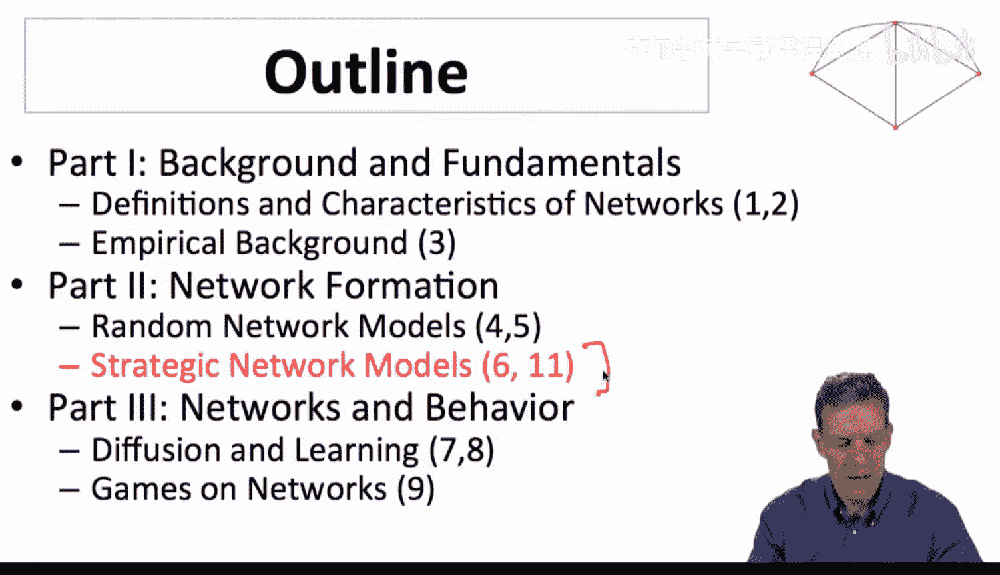

## 概述：引入异质性的动机

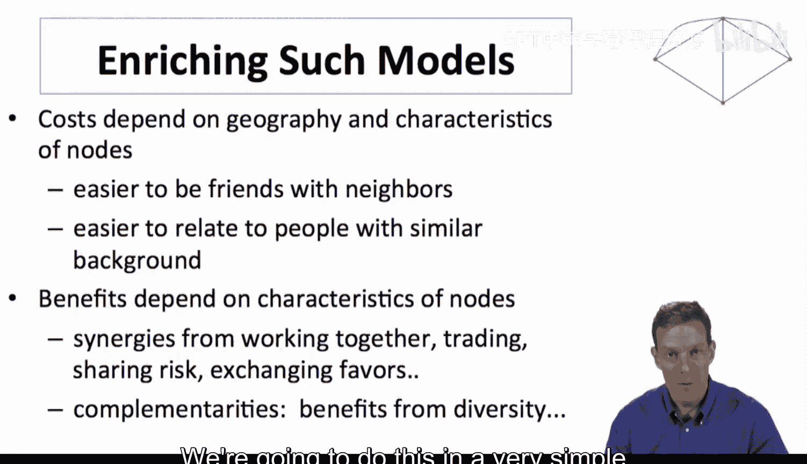

我们希望通过在模型中引入异质性来解释一些观察到的网络事实。具体来说，我们仍然在策略网络形成的框架内，但将主要丰富其成本结构。

*   关系的形成成本可以取决于地理和节点特征。例如，与住得很近的人成为朋友更容易，与背景相似的人建立联系也更容易。
*   收益也可能取决于节点特征。例如，具有相似特征的人可能更容易合作或共担风险。
*   多样性也可能带来互补性和收益。

我们可以通过多种方式丰富这些模型。本节将采用一种简单的方式来阐述核心思想。

## 核心目标：解释“小世界”现象

这里的核心思想是，我们可以通过成本和收益结构来解释所谓的“小世界”观察结果。我们希望同时解释网络倾向于具有**短平均路径长度**和**高聚类系数**这两个事实。我们将探讨是否能用策略模型来解释这一点。

在深入细节之前，先给出基本直觉：
*   **高聚类**源于与非常相似或非常邻近的人建立链接的成本非常低。这会导致在局部层面形成非常密集的网络。
*   **低直径**源于与远距离连接能带来高价值。如果我没有连接到远方的人，我就无法访问网络中离我较远的部分。与远方的人建立关系可以让我访问到许多以前无法访问的信息或人，这倾向于带来高收益，从而有助于缩小网络直径。
*   **远距离连接的高成本**意味着你不会拥有太多远距离链接。因此，你会在局部层面拥有高密度连接，同时只有少数长距离链接。这不会过多地削弱聚类，但由于人们会在未连接时选择连接远方，你仍然会拥有较低的直径。

这就是基本思路，接下来让我们更详细地梳理逻辑。

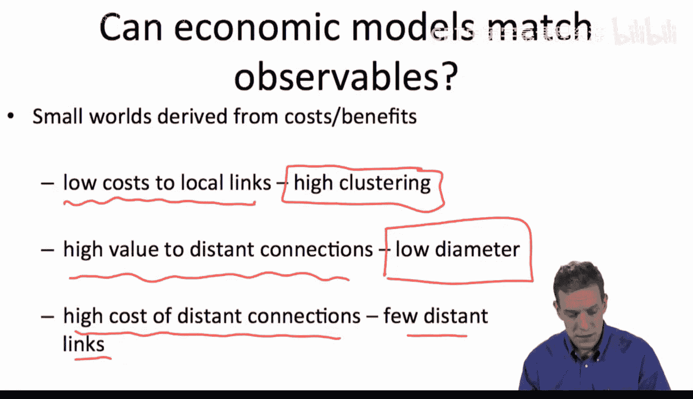

## 岛屿模型：一个具体的异质性示例

有一系列模型研究了连接模型的变体，其中以某种方式加入了地理因素。我将带你了解其中一个版本：**岛屿模型**。

在这个模型中，人们居住在不同的岛屿上。
*   居住在同一岛屿上的人可以非常容易地相互连接。
*   连接不同岛屿上的人则需要更高的成本。

具体设定如下：
*   连接同一岛屿上的人的成本为 **`c`**（小c）。
*   连接不同岛屿上的人的成本为 **`C`**（大C）。
*   收益（δ 等参数）则与原始连接模型完全相同。

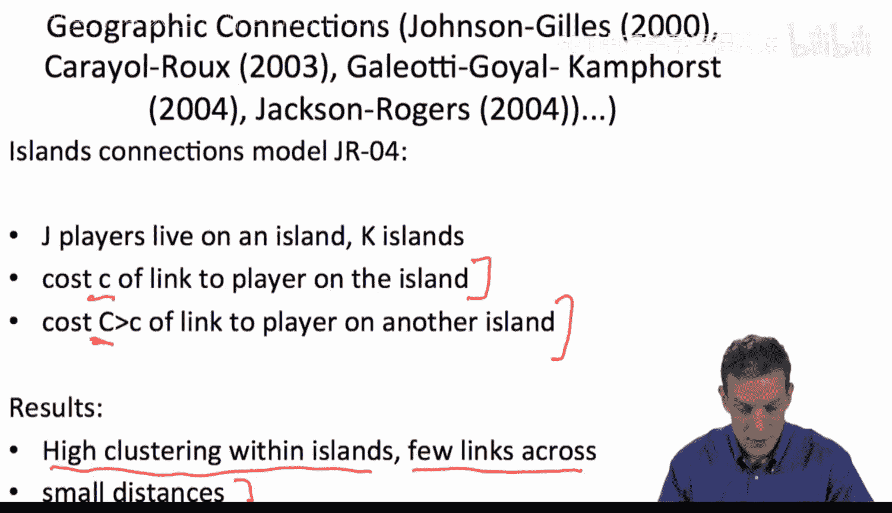

这个模型将导致：
*   岛屿内部的高聚类。
*   岛屿之间的少量链接。
*   但仍然有足够的跨岛链接来保证较短的网络距离（至少在某些参数取值下）。

这里的“岛屿”是一个隐喻，它可以代表：
*   **地理距离**：物理上接近的人。
*   **特征相似性**：具有非常相似特征的人发现彼此连接更容易；特征不同的人连接成本更高。

因此，“岛屿”是一个相当直观的隐喻。

## 模型示例与分析

假设我们观察一个网络，其中每个群体（岛屿）有5个个体，总共有5个岛屿。因此，总节点数 J = 5（每个岛的人数）x 5（岛屿数）= 25。

我们可以计算网络中某个特定个体从其链接中获得的收益。例如，考虑下图中标记的个体：

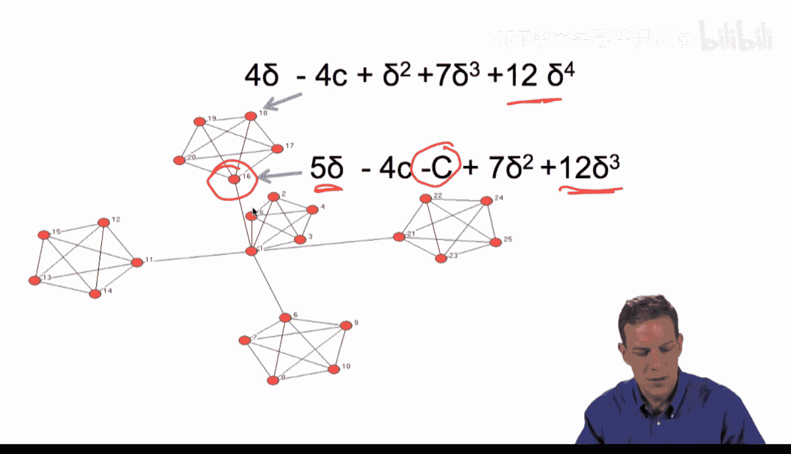

其收益计算如下：
*   **成本**：支付4个小c（连接本岛其他4人）。
*   **直接收益**：获得4个δ（来自直接邻居）。
*   **间接收益**：获得1个δ²（距离为2的节点），7个δ³（距离为3的节点），12个δ⁴（距离为4的节点）。

这与连接模型类似，但现在我们丰富了成本结构，加入了地理因素。根据你只拥有近距离连接、只拥有远距离连接或某种组合，收益会有所不同。

图中这个个体维持了一个到其他岛屿的连接。他为此支付了高成本（大C），但获得了额外的收益并缩短了与网络中其他部分的距离。相比之下，一个没有跨岛连接的个体则无法访问其他岛屿。

因此，个体有动机建立跨岛连接。同时，如果这个人断开了这个链接，他所在岛屿上的所有人都将无法访问其他岛屿。

## 稳定网络与“小世界”特性

以下是该模型可能形成的一个**成对稳定网络**示例：

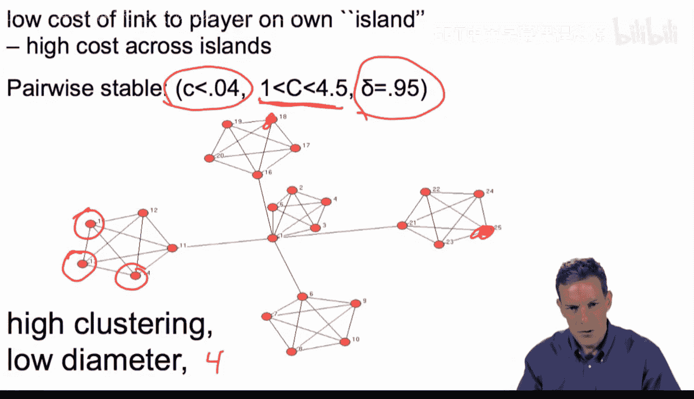

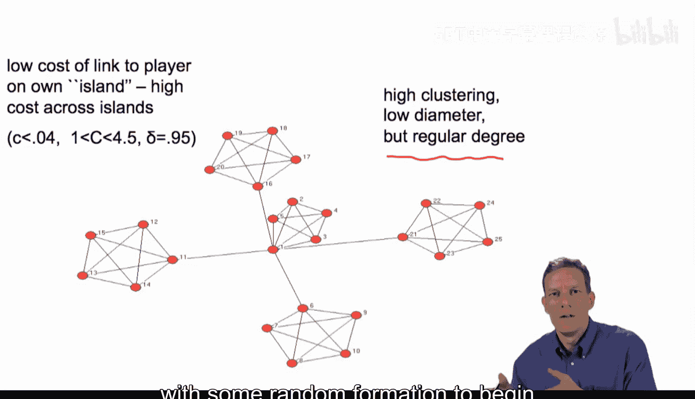

对于特定的参数值（例如，小c < 0.04，大C > 1且 < 4.5，δ = 0.95），可以验证这个网络是成对稳定的：没有人想删除一条链接，也没有两个未连接的个体想增加一条链接。

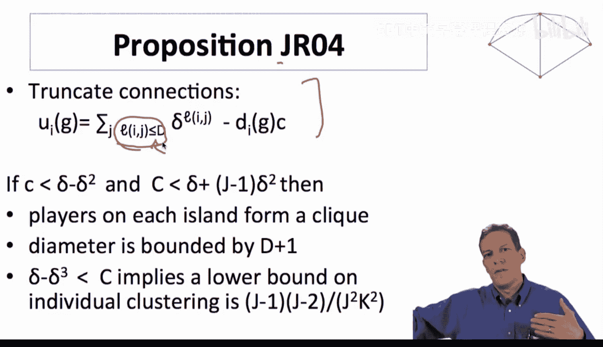

在这个网络中我们得到了什么？
*   **高聚类**：许多个体，他们的所有朋友都彼此相连。
*   **低直径**：网络中任意两人之间的最大距离是4。随着岛屿和节点数量的增加，你会在节点数很大的情况下仍保持相对较低的直径。

因此，我们在这个模型中同时获得了**高聚类**和**低直径**，即“小世界”特性。显然，这仍然是一个非常简化的模型，其稳定网络具有特定的规律性和度分布，可能与现实不完全匹配。但它为我们理解为何会出现“小世界”网络提供了一个不同的解释和推理基础。我们可以开始用一些随机形成过程来丰富这类模型，以尝试拟合实际数据。

## 理论结果概述

关于这个模型，可以证明一些理论性质（例如，在Jackson & Rogers， 2004的论文中）。

首先，可以对连接模型进行截断，只计算到一定距离内的价值（例如，只考虑距离3或4以内的节点）。

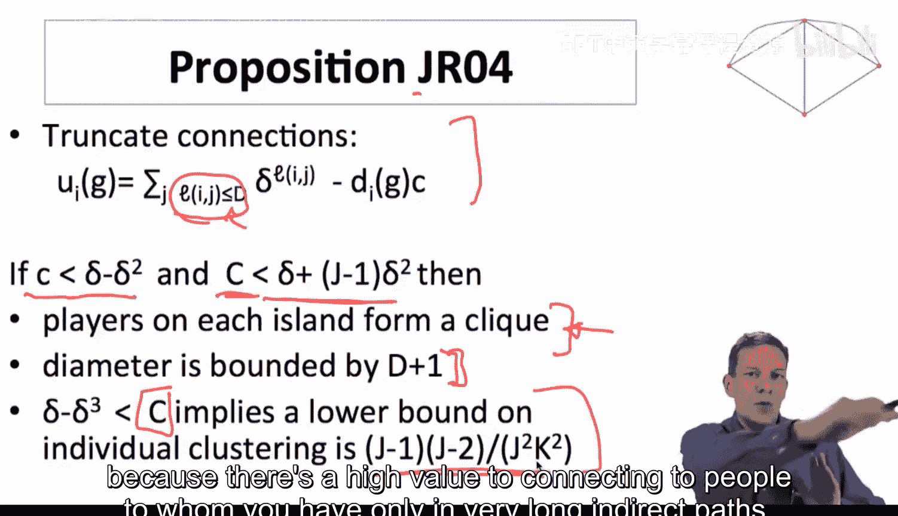

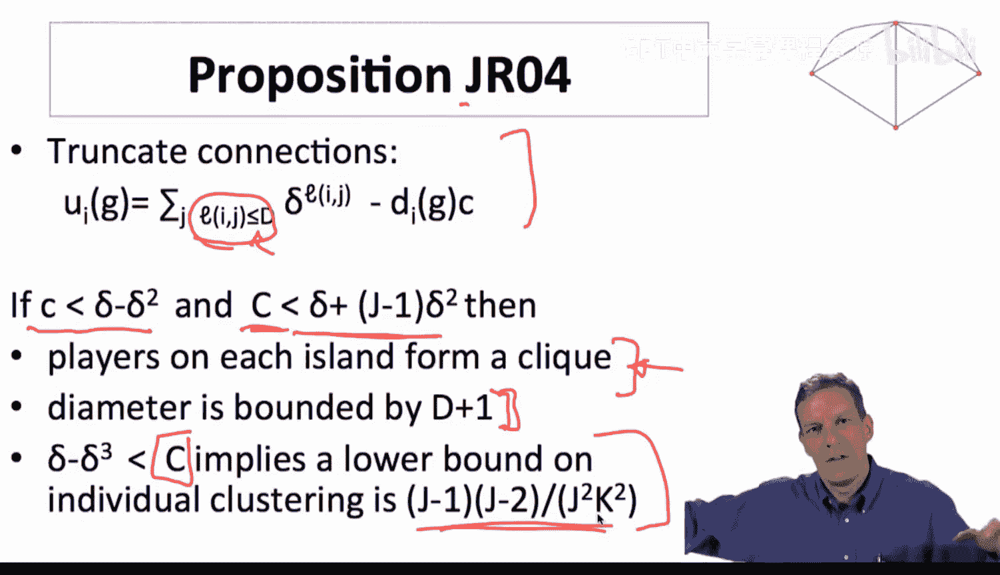

在岛屿模型中，基本上可以证明：
*   如果小c足够小，且大C不是太大，那么每个岛屿上的参与者会形成一个**团**（完全连接的子图），并且网络直径会有一个**上界**。
*   因此，你会从岛内连接中获得**聚类**，并获得一个有界的**直径**。
*   如果大C足够大，那么跨岛连接就不会太多，并且你可以得到一个**聚类系数的下界**，该下界取决于岛屿数量和每个岛屿的大小。

总之，对于这类地理连接模型中的某些参数值，可以证明上述性质集合成立。

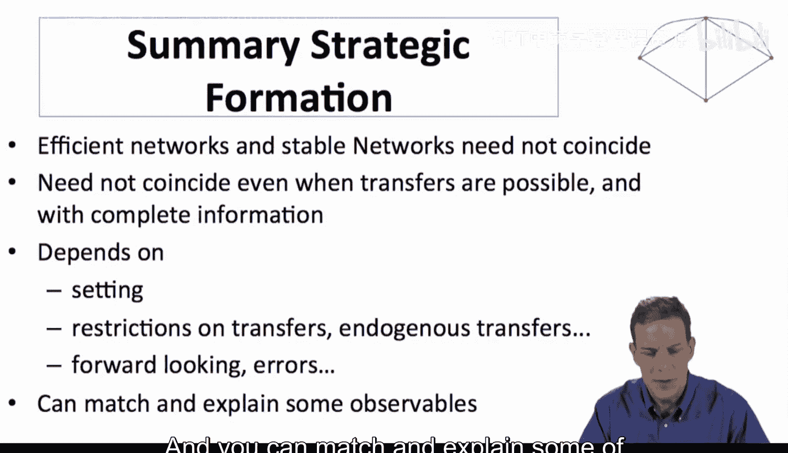

**最重要的启示是**：
*   我们获得**高聚类**，是因为与邻近的人连接成本低廉。
*   我们获得**低直径**，是因为与那些你只有非常长的间接路径才能到达的人建立直接连接具有高价值。如果缺失的连接太多，就会有人有动力去添加它们，从而限制了直径的增长。

## 策略网络形成模型总结

到目前为止，我们对策略网络形成模型的总结如下：

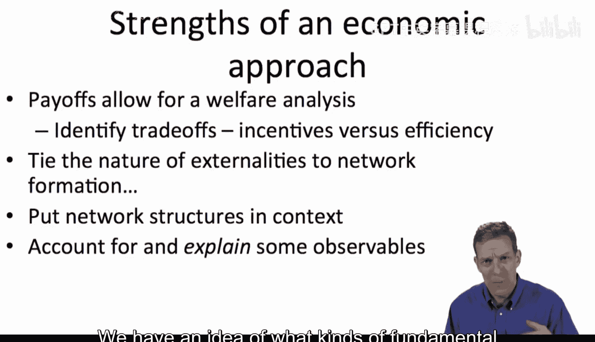

*   **效率与稳定性**：有效率的网络和稳定的网络可能不一致，即使在允许某些转移支付且信息完全的情况下也是如此。这取决于具体情境和可能进行的转移支付类型。
*   **前瞻性**：我们未过多讨论前瞻性行为，但这可以添加到这些模型中。
*   **解释力**：这类模型可以匹配和解释一些可观察到的网络特征。

## 策略模型的优势与挑战

### 优势
这类方法的主要优势在于：
*   **福利分析**：基于收益函数，我们可以进行福利分析，判断哪些网络是“好”的，哪些是“坏”的。
*   **识别权衡**：我们可以识别个体形成关系的动机与社会目标之间的权衡，从而真正理解网络形成过程是否导致了理想的结果。
*   **关联外部性**：我们将外部性的性质（正外部性或负外部性）与网络形成联系起来，并理解这如何依赖于具体情境。
*   **解释现象**：我们能够解释如聚类和低直径等可观察事实，并理解其发生的原因是基于对人类行为的基本假设，而不是简单地机械模仿。

### 挑战与局限
当然，目前所讨论的经济学方法也存在问题：
*   **模型简单化**：为了便于解析求解，我们看过的许多模型都非常简单，往往过于规则、对称。
*   **需要异质性**：如果想要丰富这些模型，我们必须引入异质性，此时模拟方法会有所帮助。
*   **随机性与策略性**：需要根据具体应用判断网络形成在多大程度上是随机的，多大程度上是策略性的。不同应用可能需要混合这两种因素。
*   **收益函数的确定**：一个重大挑战是如何确定收益函数。如何将网络结构和结果与收益联系起来？如何识别它们？这并非易事，高度依赖于具体情境。必须深入思考：是什么激励人们形成关系？他们为何维持某些关系？他们从中得到了什么？什么影响了他们的行为？这是构建此类模型需要纳入的重要元素。

## 未来方向：结合策略模型与随机模型

将我们之前见过的**策略网络模型**和**随机网络模型**结合起来是非常必要的。

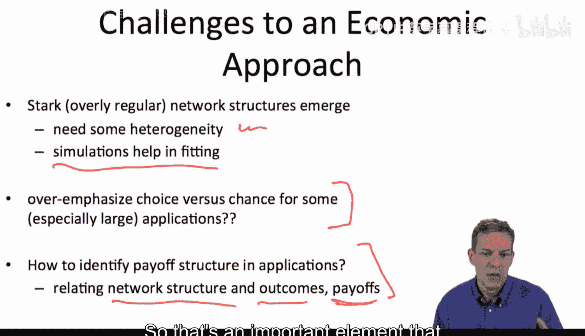

*   随机网络模型在匹配或拟合数据方面的优势，在某种程度上正是经济学方法的弱点，反之亦然。
*   我们基本上拥有两套具有非常互补性质的模型。将它们混合在一起，将使我们能够：
    *   进行福利和效率分析。
    *   理解现象发生的原因。
    *   将模型应用于数据。
    *   在广泛的应用领域中做到以上几点。

这类结合模型正在发展中，我们将在其他视频中讨论其中一些。

---

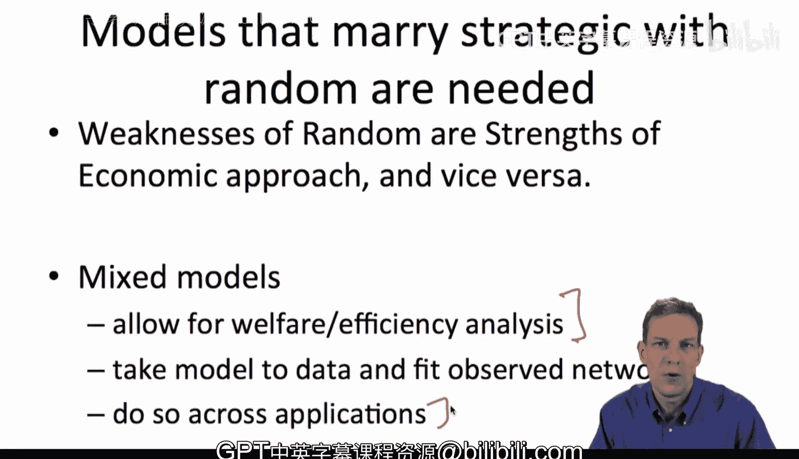

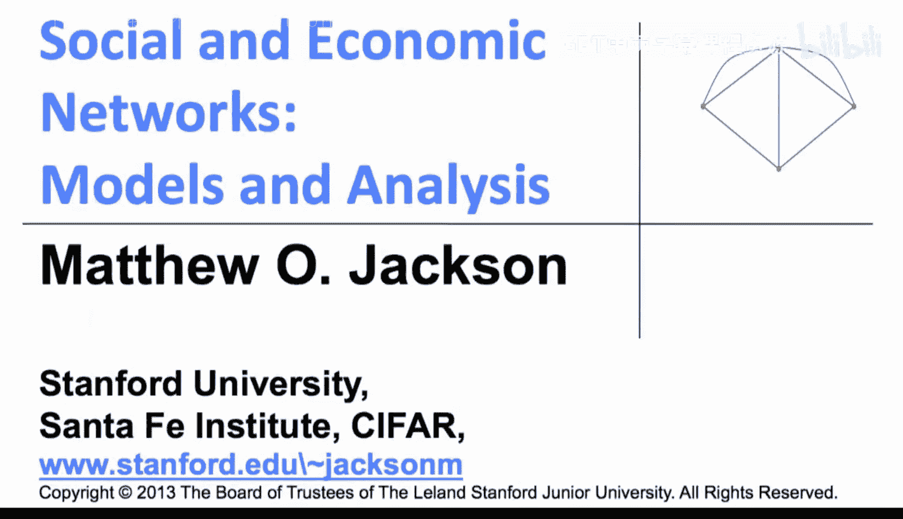

**本节课中我们一起学习了**如何通过在策略网络形成模型中引入异质性（特别是成本结构的异质性）来解释“小世界”网络特性。我们通过“岛屿模型”这一具体示例，看到了高聚类和低直径如何从“本地连接低成本”和“远程连接高收益”的权衡中自然产生。最后，我们总结了策略模型的优势、挑战，并指出了将其与随机网络模型结合是未来重要的发展方向。