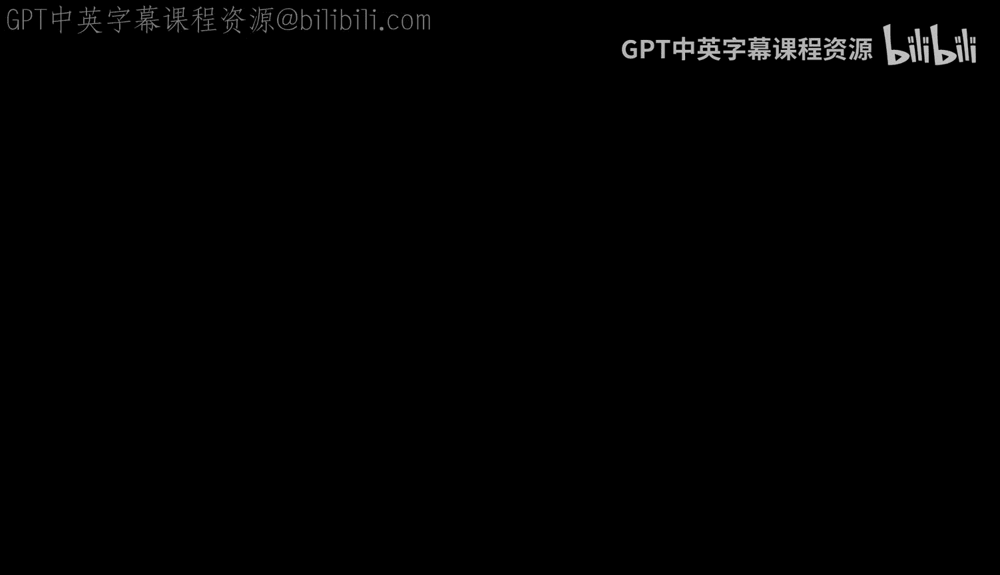
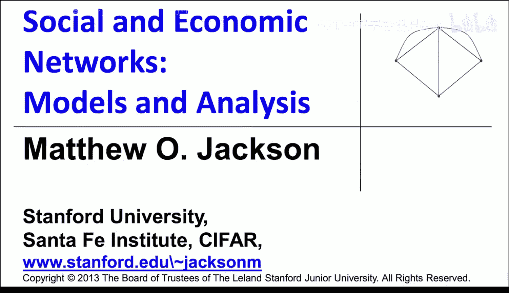

#  044：稀疏通用图模型与策略性网络形成（可选-进阶）📊

## 概述
在本节中，我们将探讨如何将之前学习的策略性网络形成模型，与用于估计网络的早期模型（特别是随机网络模型）结合起来。我们将重点研究稀疏通用图模型，并尝试将基于效用的计算融入其中，以分析网络形成的策略性因素。

---

## 结合策略形成与随机网络模型 🔗

上一节我们介绍了策略性网络形成模型。本节中，我们来看看如何将这些模型与用于估计网络的早期随机网络模型相结合。我们将聚焦于稀疏通用图模型，并尝试将基于效用的计算框架整合进去。

具体做法是，在形成子图（如链接、三角形）的效用函数中引入随机性。让我们通过一个具体例子来理解如何操作。

---

## 研究案例：种姓关系与社会压力 🏘️

我们将尝试确定，在观察种姓关系时，是否存在某种社会压力在起作用。一个具体的问题是：当观察跨种姓关系时，这些关系是更可能在没有共同朋友的私下场合发生，还是在有共同朋友的情况下与没有共同朋友时发生的频率相同？

让我们回顾一下与A. Banerji, R. Car和E. Straud等人合作研究中的一些数据。我们再次查看村庄26的煤油和大米共享网络。节点根据二分法种姓分类着色：表列种姓和表列部落为蓝色，普通种姓和其他落后种姓为红色。数据显示，跨种姓边界的关系数量少于种姓内部的关系（跨种姓概率为0.006，种姓内概率为0.009）。在另一个更稠密的社交访问网络（村庄48）中，我们也看到了类似的隔离模式。

我们想探究的问题是：对于一个来自红色类别和一个来自蓝色类别的人，我们是否看到他们拥有共同朋友的跨种姓关系（即形成三角形）的相对频率，低于没有共同朋友的简单链接关系？这是否意味着人们更倾向于在没有见证人的私下场合建立关系？

---

## 估计中的挑战与偏好建模 ⚖️

开始估计此类模式的一个困难在于，三角形的形成需要三个人同意，而链接只需要两个人。因此，三角形自然更难形成，这会导致一种偏差，使得三角形相对更不可能出现。如果我们再假设跨种姓链接本身可能性较低，那么跨种姓三角形出现的可能性就会因为涉及三个人而显得更低。

因此，我们需要明确地考虑偏好因素，否则我们自然会发现，相对于更受欢迎的链接，不受欢迎的三角形看起来会比不受欢迎的链接更少，除非我们仔细地对此进行建模。

以下是我们的建模方法：将偏好构建到模型中，然后考察子图生成模型，并试图理解链接形成的概率如何取决于双方都希望形成该链接的可能性。

我们可以这样思考：个体 `i` 具有某些特征（例如种姓），他们从与具有特征 `j` 的个体形成链接中获得的效用基于双方的特征。此外，还存在一些未观测到的因素或个人特质，也会影响该效用，我们将其纳入一个误差项 `ε_ij`。

因此，个体 `i` 从与 `j` 的链接中获益的条件是：
`u_ij - ε_ij > 0`
其中 `u_ij` 是基于特征的效用。如果误差 `ε_ij` 的幅度小于效用 `u_ij`，则该项为正，`i` 希望形成该链接；否则不希望。

---

## 融入子图生成模型 🔄

在成对稳定性下，链接形成当且仅当双方都偏好它（假设获得恰好为零效用的概率为0）。因此，链接形成需要满足：
`u_ij - ε_ij > 0` 且 `u_ji - ε_ji > 0`

如果我们知道误差项的分布，那么给定链接形成的概率就与 `i` 偏好该链接的概率乘以 `j` 偏好该链接的概率成比例。这基于一个隐含假设：误差是独立同分布的。

对于三角形，原理相同。三角形的形成取决于三个人的特征，我们需要将三个条件概率相乘（分别对应 `ij`、`ik`、`jk` 三对关系）。我们可以通过相同的技术为任何类型的子图生成概率，根据涉及个体的特征为不同子图形状设定效用，然后计算每个人的误差小于该效用的概率。

---

## 假设检验：社会压力是否存在？❓

我们的零假设是：不存在社会压力。这意味着，一个人对于参与一个跨种姓三角形（相对于种姓内三角形）的偏好，与其对于跨种姓链接（相对于种姓内链接）的偏好是相同的。我们允许个体在意种姓，但我们假设他们在三角形和链接情境下对跨种姓的相对偏好没有差异。

根据我们的模型，如果我们假设每个人具有相似的效用函数（效用值仅因“跨种姓”或“种姓内”而异），并且只在特定关系上存在特异噪声，那么跨种姓三角形与种姓内三角形的频率比将与此效用比的立方成正比，而跨种姓链接与种姓内链接的频率比将与此效用比的平方成正比。这样就校正了三角形更难形成的事实。

由此，我们可以从观测频率中反推出“偏好形成跨种姓关系”的概率：
*   对于三角形：`(频率比)^(1/3)`
*   对于链接：`(频率比)^(1/2)`

在零假设下，这两个反推出来的“偏好概率”应该相等。因此，我们可以绘制校正后的三角形频率比（的立方根）与校正后的链接频率比（的平方根）的散点图。如果社会压力无关紧要，这些点应落在45度线上。

---

## 数据分析与结果 📈

当我们对75个不同的村庄进行这种分析时，发现大多数数据点落在45度线以下。一个保守的统计检验是：如果零假设成立，那么一个村庄落在线之上或之下的概率应像抛硬币一样各为50%。然而，实际上绝大多数村庄落在线之下，这在统计上是高度显著的（p < 0.0001）。

一个有趣的延伸是，我们可以根据村庄内种姓构成的平衡程度（即少数群体与多数群体的相对规模）对村庄进行细分。分析发现：
*   种姓构成相对平衡的村庄（用浅蓝色表示），其数据点大多远低于45度线，表明社会压力效应更强。
*   种姓构成更不平衡的村庄（用红色表示），其数据点更接近45度线，表明社会压力效应较弱。

这一发现与一些其他数据集的结果一致：当群体规模更平衡时，形成跨群体联系可能面临更大的张力。在本案例中，相对于链接，在平衡的村庄中跨种姓三角形的形成受到更强的抑制。

---

## 总结 🎯

本节课中，我们一起学习了如何将策略性网络形成模型与基于子图的统计模型（如稀疏通用图模型）相结合。我们通过一个研究印度村庄种姓关系的具体案例，演示了如何构建包含随机误差的效用模型，并利用该模型检验关于社会压力的假设。

这种方法表明，我们可以将偏好分析与统计模型结合起来，估计网络形成中的策略性因素，并识别数据中的特定模式。虽然此类模型的因果解释需要谨慎，但它们为我们提供了观察社会网络复杂动态的一个有力透镜。当前，能够同时处理子图和策略性形成的动态模型家族正在不断发展，这成为了一个非常有趣的研究领域。