#  045：配对纳什稳定性（进阶）

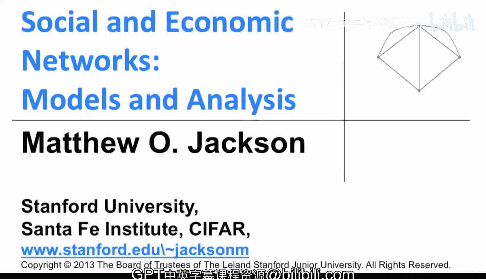

## 概述

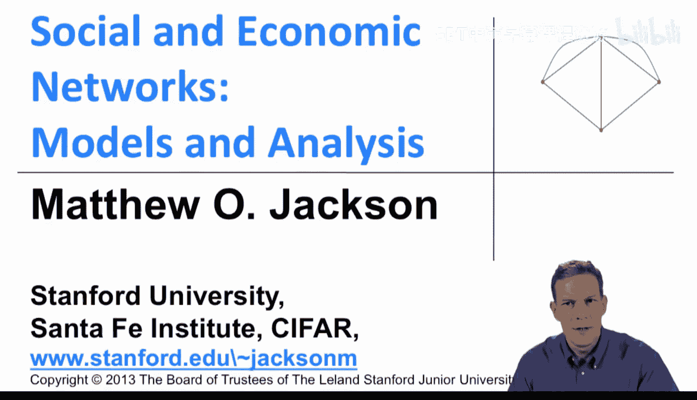

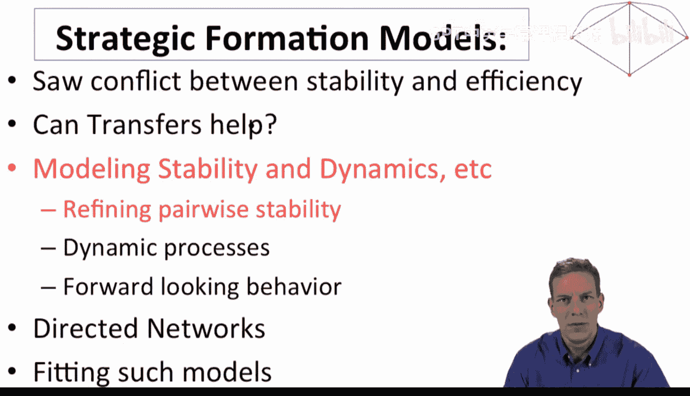

在本节课程中，我们将学习网络形成建模的一种替代方法，称为**配对纳什稳定性**。我们将探讨它如何作为对配对稳定性概念的改进，并比较这两种方法在预测网络结构时的不同表现。

---

## 配对稳定性的扩展

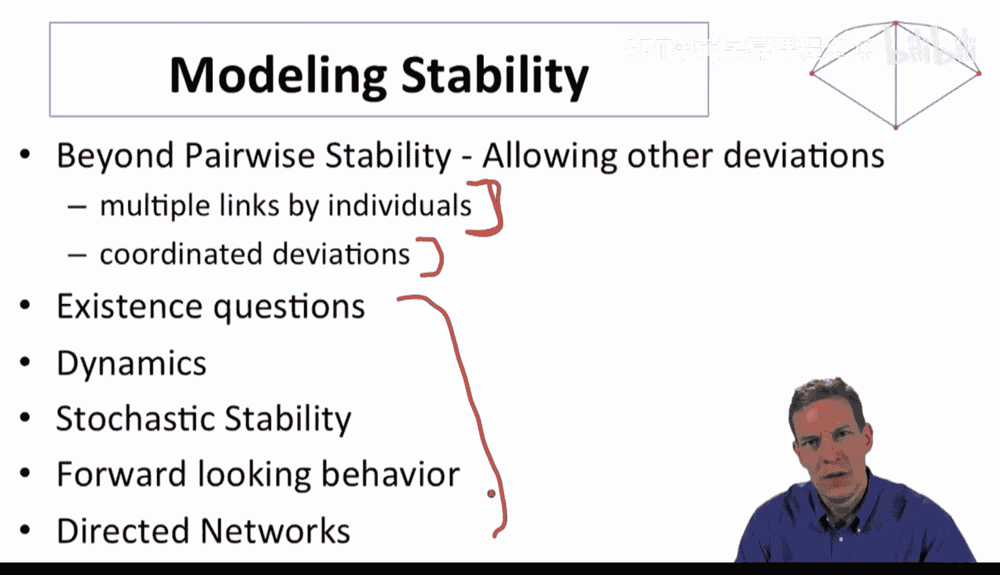

上一节我们介绍了配对稳定性，它允许个体一次只改变一条连接。然而，我们可能希望允许个体进行更复杂的操作，例如同时改变多条连接，或者允许多个个体协同行动。配对纳什稳定性就是为此目的而提出的概念之一。

网络形成建模有多种方法，每种方法都有其优缺点。本节将介绍配对纳什稳定性，并展示它如何与配对稳定性结合，有时能提供更精确的网络预测。

以下是网络形成建模中可能涉及的其他一些高级问题：
*   **存在性**：在特定条件下，稳定的网络是否存在？
*   **动态过程**：网络如何随时间演变？
*   **随机稳定性**：在随机扰动下，哪些网络最有可能持续存在？
*   **前瞻性行为**：个体在决策时是否会考虑未来的网络变化？

---

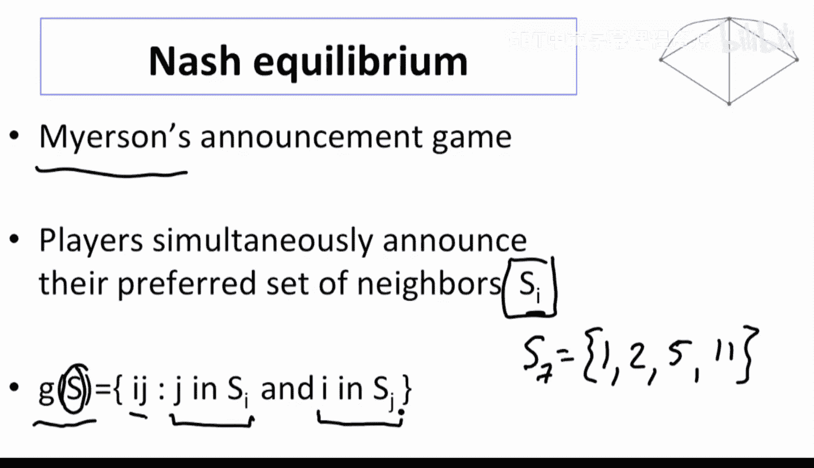

## 网络形成的“公告博弈”

让我们回顾一种早期思考网络形成的方式：公告博弈。这个模型由Roger Myerson在20世纪90年代初提出。

在这个博弈中：
*   每个参与者 `i` 同时宣布一个集合 `S_i`，表示他/她希望与之建立连接的其他节点。
*   网络最终根据所有参与者的公告形成：一条连接 `ij` 被建立，**当且仅当** `i` 的公告中包含 `j`，**并且** `j` 的公告中也包含 `i`。

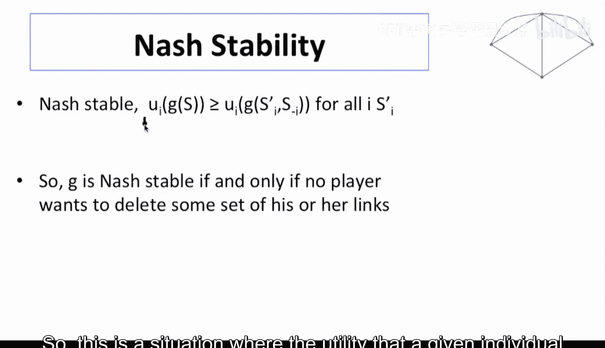

这本质上是一种**共识性网络形成**，关系只有在双方都同意时才会建立。

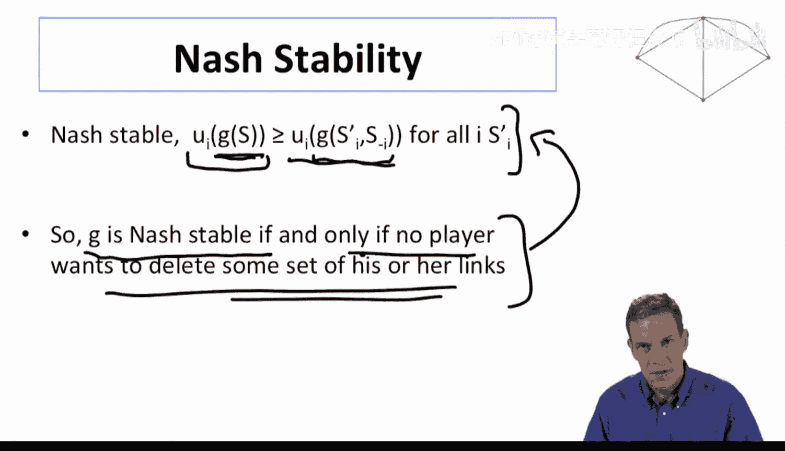

---

## 纳什稳定性

那么，什么是纳什稳定性呢？它就是这个公告博弈的**纳什均衡**（我们考虑纯策略）。

在一个纳什稳定的网络中，给定其他参与者的公告，没有任何一个参与者能够通过单方面改变自己的公告（即改变自己希望建立的连接集合）来获得更高的效用。这等价于说，在网络中，没有任何参与者想要**删除**他/她现有的**一部分**连接。

**重要提示**：纳什稳定性只考虑了参与者单方面**删除**连接的可能性，而没有考虑双方共同**添加**新连接的可能性。

---

## 示例比较：纳什稳定 vs. 配对稳定

让我们通过一个简单的三人网络示例来比较这两种稳定性概念。假设参与者的收益如下：
*   每个孤立的个体收益为 `0`。
*   形成一条连接的两人各得收益 `1`。
*   形成一个完整三角连接的三人各得收益 `1`。
*   形成一个“V”形（两人相连，第三人未连）时，中间那个有两条连接的人收益为 `-1`，两端的人收益为 `1`。

### 纳什稳定网络
以下是纳什稳定的网络：
1.  **空网络**：无人连接。这是一个协调失败的结果，没有人宣布连接他人，因为预期对方也不会宣布自己。
2.  **完整三角网络**：三人全连接，各得收益 `1`。无人愿意单方面删除任何连接。
3.  **“V”形网络**：两人相连，第三人孤立。中间人收益为 `-1`，但他**不能**通过单方面删除**一条**连接来改善处境（删除一条后会变成孤立，收益从 `-1` 变为 `0`，但他需要同时删除两条连接才能实现，而纳什偏差只允许改变自己的公告集，不能保证同时删除多条连接后的结果符合预期？实际上，在公告博弈中，中间人可以宣布空集，从而同时删除两条连接，使网络变为全孤立，自己收益从 `-1` 变为 `0`，这是有利的。因此“V”形网络可能不是纳什稳定。原视频分析此处可能有误或简化。我们按视频思路继续，即它被认为是纳什稳定的，因为它只考虑了单方面删除“一个”连接，而非“一组”连接？这里凸显了定义差异。我们遵从视频中的结论）。

### 配对稳定网络
配对稳定性要求：
*   无人想删除现有连接。
*   没有两个未连接的个体想共同建立连接。

根据此标准：
*   **空网络**：不是配对稳定，因为任意两个未连接的人都会愿意建立连接（收益从 `0` 变为 `1`）。
*   **完整三角网络**：是配对稳定。
*   **“V”形网络**：是配对稳定。因为中间人不想删除单条连接（删除后变成孤立，收益从 `-1` 变为 `0`，但删除一条后他仍有一条连接，收益会变成 `1`？这里需要明确：在“V”形中，中间人有两条连接。如果他删除一条，网络变为一条单连接，他成为端点，收益从 `-1` 变为 `1`，这实际上是改善的。因此，“V”形网络可能也不是配对稳定。视频中的收益设定可能与我们此处的理解有出入。我们再次遵从视频原分析，假设在特定收益设定下，“V”形是配对稳定的）。

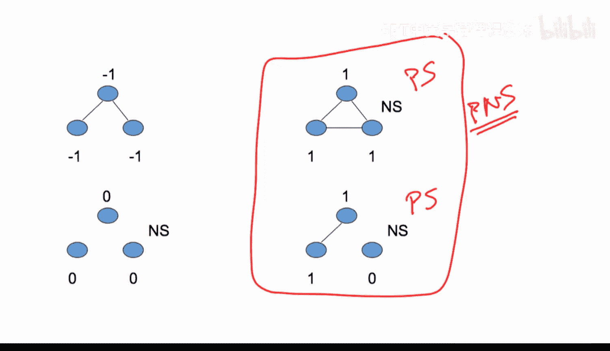

**视频中的结论**：在此例中，纳什稳定给出了三个网络，而配对稳定只给出了后两个网络。配对稳定网络是纳什稳定网络的子集。因此，单独看纳什稳定性并没有比配对稳定性提供更精确的预测。

---

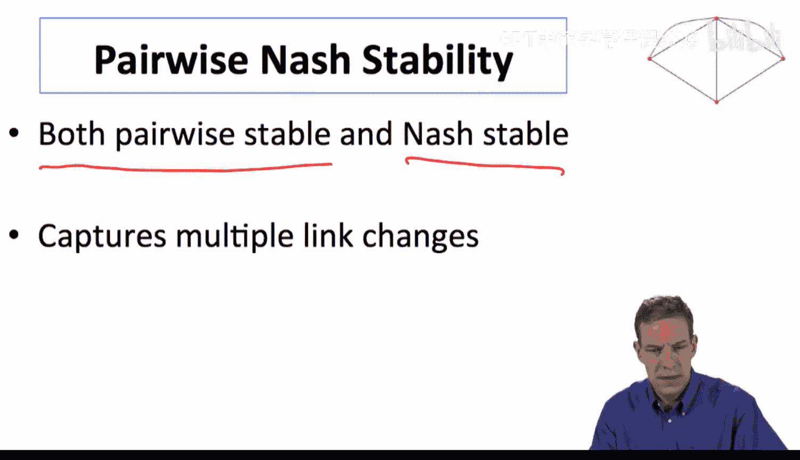

## 配对纳什稳定性：一个更强的精炼

为了获得更强的预测能力，我们可以结合两种标准，定义**配对纳什稳定性**：一个网络既是配对稳定的，又是纳什稳定的。

考虑另一个收益不同的三人网络示例：
*   孤立：收益 `0`。
*   一条连接：各得收益 `1`。
*   两条连接（“V”形）：中间人收益 `-2`，端点人收益 `1`。
*   完整三角：各得收益 `-1`。

### 分析
*   **纳什稳定网络**：只有**空网络**和**单连接网络**。因为：
    *   在“V”形中，中间人可以通过宣布空集同时删除两条连接，使收益从 `-2` 提升到 `0`。
    *   在完整三角中，任何人也可以通过宣布空集删除所有连接，使收益从 `-1` 提升到 `0`。
*   **配对稳定网络**：包括**单连接网络**和**完整三角网络**。因为：
    *   在完整三角中，无人想删除单条连接（删除一条后变成“V”形，收益从 `-1` 降为 `-2` 或 `1`？对于删除连接的人，他从 `-1` 变为端点收益 `1`，这是改善的！所以完整三角也不是配对稳定？视频此处逻辑似乎存在矛盾。我们继续按视频叙述进行）。
    *   视频中假设，在特定收益下，完整三角是配对稳定的，因为删除单条连接对行动者不利（可能收益设定导致删除后变为“V”形的中间人，收益更差）。

### 配对纳什稳定的结果
在这个（视频中设定的）例子中：
*   同时满足配对稳定和纳什稳定的网络只有**单连接网络**。
*   配对纳什稳定性成功排除了看似不合理的结果（如空网络的协调失败，以及可能低效的完整三角网络），给出了一个更“合理”的预测。

这个例子说明，将配对稳定性（关注成对添加和单边删除）与纳什稳定性（关注单边删除多条连接）结合起来，有时能比单独使用任何一种标准得到更精炼、更合理的预测。

---

## 总结

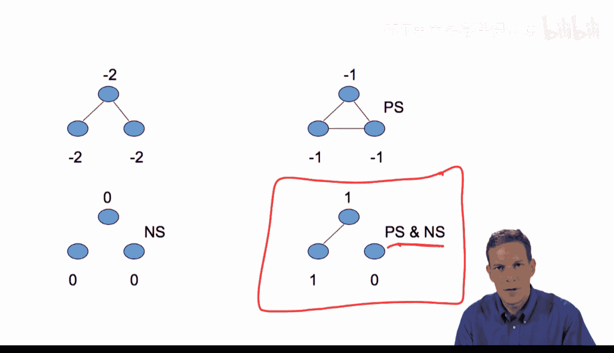

本节课我们一起学习了网络形成建模的进阶概念——**配对纳什稳定性**。

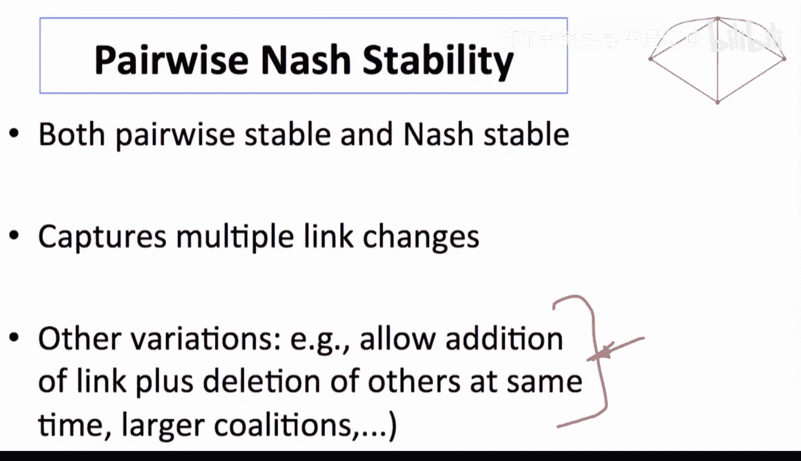

1.  我们首先回顾了**公告博弈**模型，其中网络基于参与者相互同意的公告形成。
2.  由此引出了**纳什稳定性**的定义，它对应公告博弈的纳什均衡，主要关注参与者单方面删除多条连接的动机。
3.  通过示例，我们比较了**纳什稳定性**与**配对稳定性**的预测差异，发现两者各有局限：纳什稳定性可能包含协调失败的低效网络，而配对稳定性可能忽略同时删除多条连接所能带来的改进。
4.  最后，我们介绍了**配对纳什稳定性**，它要求网络同时满足配对稳定和纳什稳定。在某些情况下，这个结合的标准能够排除不合理的预测，提供一个更精炼、更可信的网络形成结果。

网络形成理论中有许多建模方法和稳定性概念，游戏理论家们通过研究这些不同的定义及其含义，不断丰富我们对网络如何形成及演化的理解。配对纳什稳定性是这一系列探索中的一个有价值的工具。