#  046：动态策略性网络形成（可选-进阶）🚀

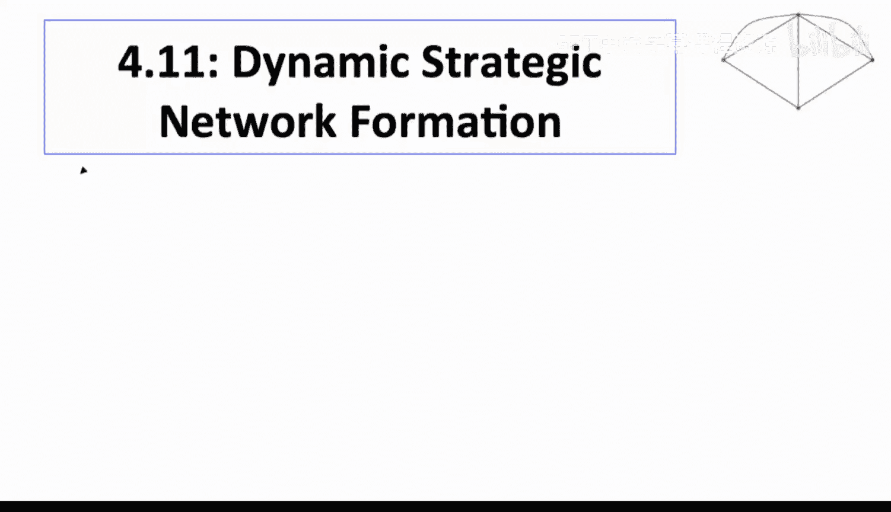

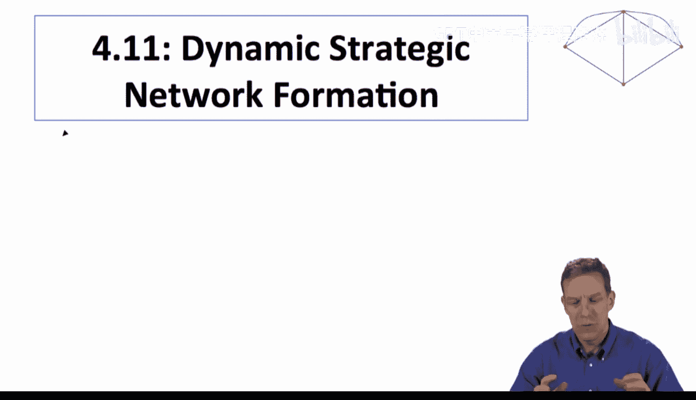

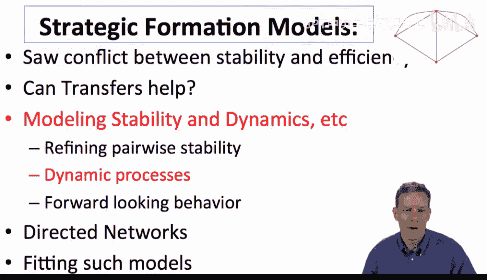

在本节中，我们将探讨网络形成的动态过程。我们将超越静态的稳定性分析，引入一个简单的时间演化模型，看看网络如何随着时间的推移而演变，以及最终可能稳定在何种结构上。通过这个动态视角，我们可以更好地理解，当存在多个稳定网络时，实际中更可能形成哪一个。

上一节我们介绍了成对稳定网络的概念。本节中，我们来看看如果让网络随时间动态演化，会发生什么。

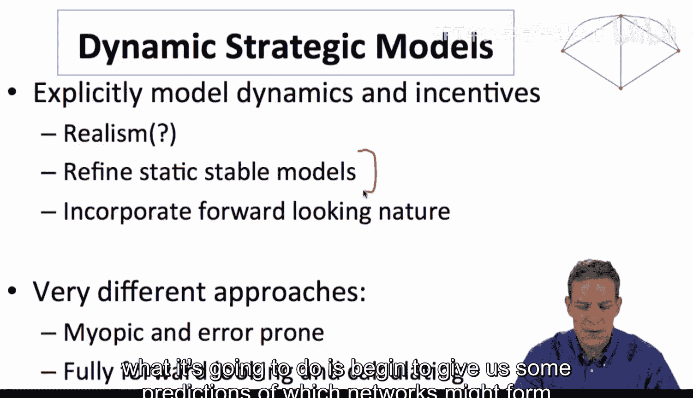

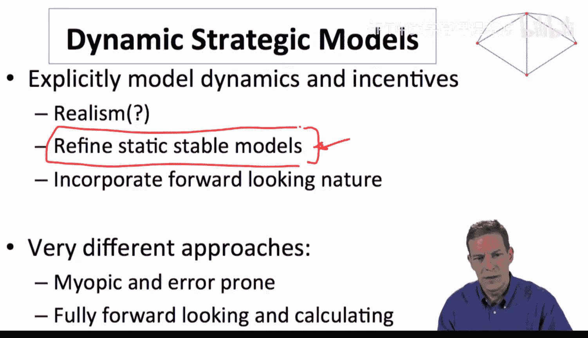

## 为何引入动态模型？🤔

在课程早期我们提到，丰富模型并非仅仅为了增加现实感，因为这会使模型复杂化。我们只在动态性能带来新见解时才引入它。在这里，动态模型主要有两个作用：
1.  **在多个稳定网络中做出预测**：当存在多个成对稳定网络时，动态过程可以帮助我们预测哪一个更可能实际出现。
2.  **捕捉前瞻性行为**：虽然本节主要关注一个相对“短视”的模型，但动态框架为研究人们考虑未来后果的“前瞻性”行为奠定了基础。

我们将从一个相当简单且短视的动态模型开始。

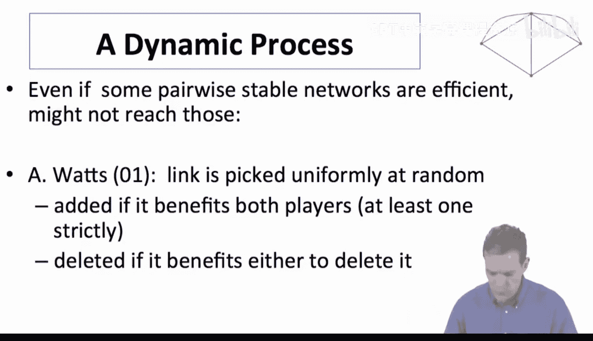

## 瓦茨动态过程 ⏳

这个由艾莉森·瓦茨在2001年提出的过程，是你能想到的最简单的动态网络形成模型。

以下是该过程的核心规则：

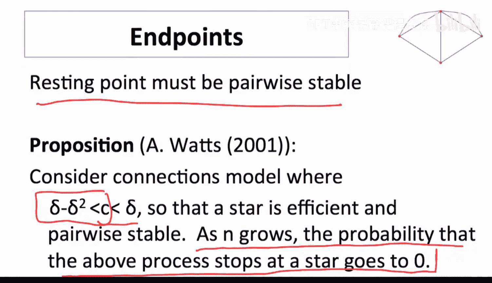

1.  **初始状态**：从某个初始网络开始（例如空网络）。
2.  **随机选择**：在每一时间步，均匀随机地选择一对节点（即一条潜在的边）。
3.  **决策与更新**：
    *   如果这对节点之间**没有**边，并且**添加**这条边能使**双方**都受益（至少一方严格受益），则添加这条边。
    *   如果这对节点之间**已经存在**边，并且**删除**这条边能使**其中至少一方**受益，则删除这条边。
4.  **重复**：不断重复步骤2和3。

可以看到，这个决策规则与成对稳定性的定义非常相似。区别在于，动态过程每次只随机检查一条边，并根据短视的收益计算决定其存废。

## 动态过程与稳定网络的关系 🔗

这个动态过程有一个重要性质：**任何该过程的静止点（即过程停止不再变化的状态）必然是一个成对稳定网络**。因为如果过程停止，意味着没有节点愿意添加任何缺失的边，也没有节点愿意删除任何现有的边，这正是成对稳定的定义。

因此，这个动态过程最终会收敛到成对稳定网络。但问题在于，它会收敛到**哪一个**成对稳定网络？

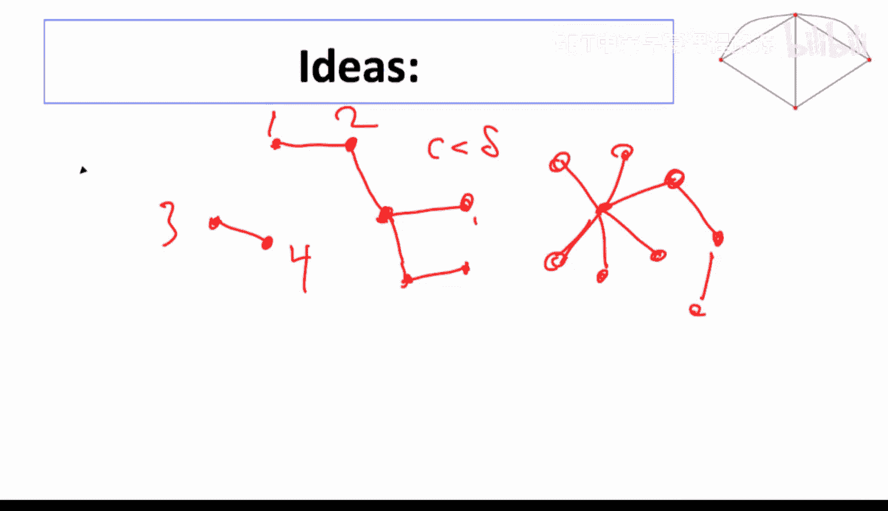

## 一个关键发现：效率未必可达 📉

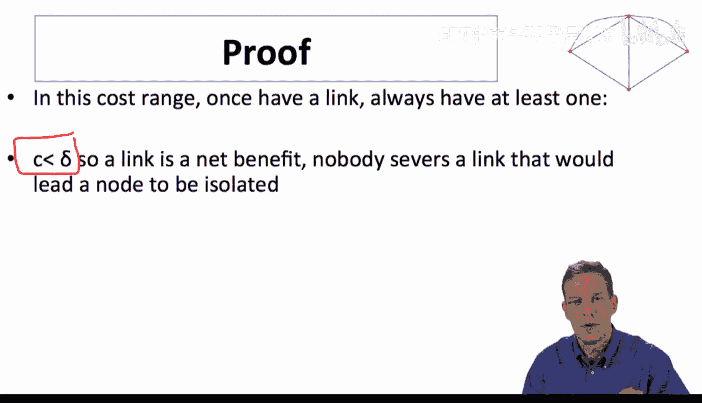

瓦茨在一个经典模型——连接模型中，得到了一个深刻的结论。考虑连接模型，其中成本 `c` 满足：`δ - δ² < c < δ`。
*   在这个成本范围内，**星形网络**既是有效率的，也是成对稳定的。
*   然而，瓦茨证明：随着节点数量 `n` 的增长，上述动态过程**终止于一个星形网络的概率趋近于零**。

这意味着，尽管星形网络是稳定且有效率的，但这个自然的动态过程几乎不可能达到它。系统更可能终结于某个**无效率**的成对稳定网络。

## 结论背后的直观理解 💡

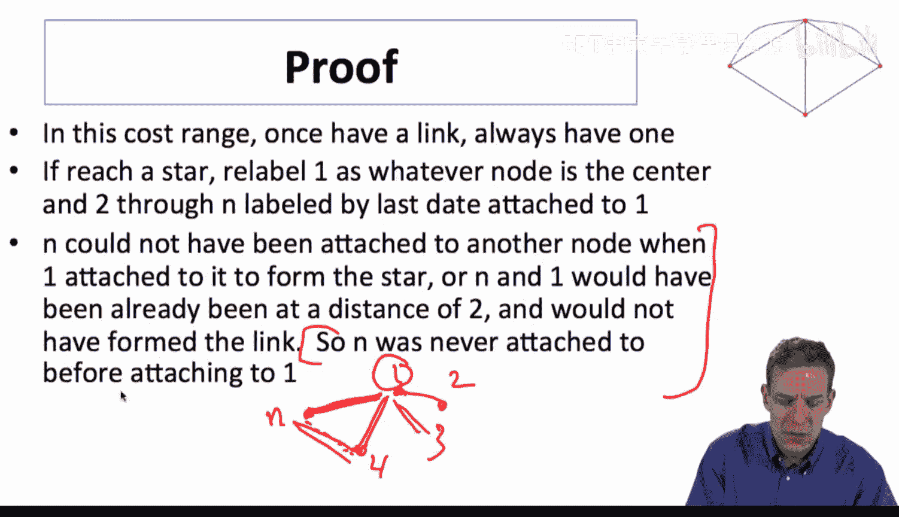

为什么会这样？核心在于过程的**随机性**和参与者的**短视行为**。

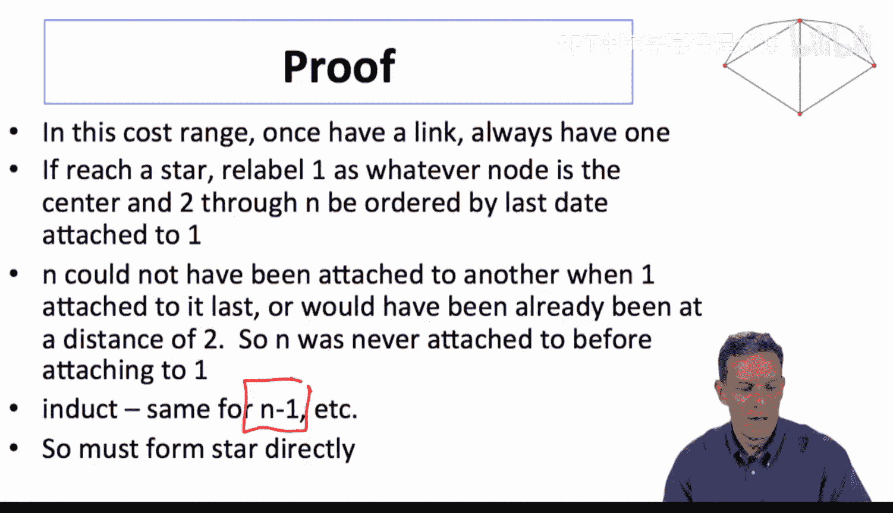

1.  **一旦连接，永不孤立**：由于 `c < δ`，连接到一个孤立的节点总是有益的。因此，一个节点一旦被接入网络，就永远不会因为删除边而变得完全孤立。
2.  **形成星形的苛刻条件**：要最终形成一个以节点1为中心的星形，连接必须严格按照特定顺序发生：第一个连接必须在节点1和某个节点（比如节点2）之间；下一个连接必须在节点1或节点2与一个新的节点之间，依此类推。
3.  **概率极低**：在每一步，随机选中的边恰好是“正确”的、能导向星形的那条边的概率非常小。随着节点增多，可能的边数呈平方级增长，而导向星形的路径却非常狭窄。因此，随机游走恰好遵循这条狭窄路径的概率趋近于零。

简单来说，动态过程就像在黑暗中随意摸索建网。虽然星形是一个“好”的终点，但通往它的路太窄，而通往其他稳定（但可能低效）网络的路却很宽，因此几乎总会走到别的终点。

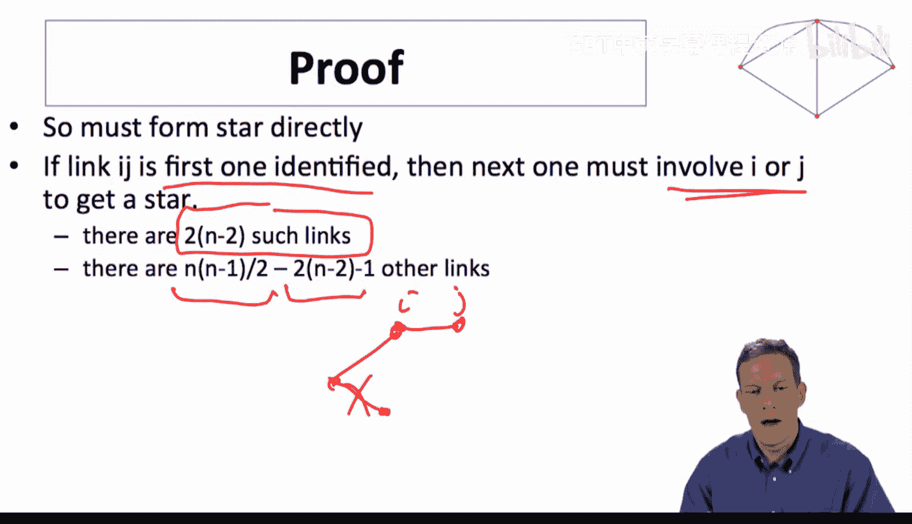

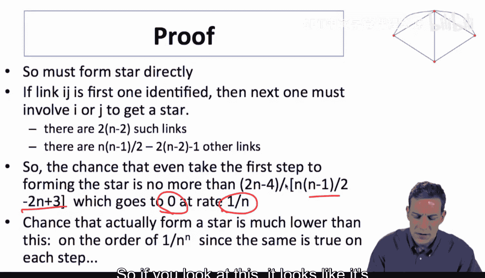

## 本节总结 📚

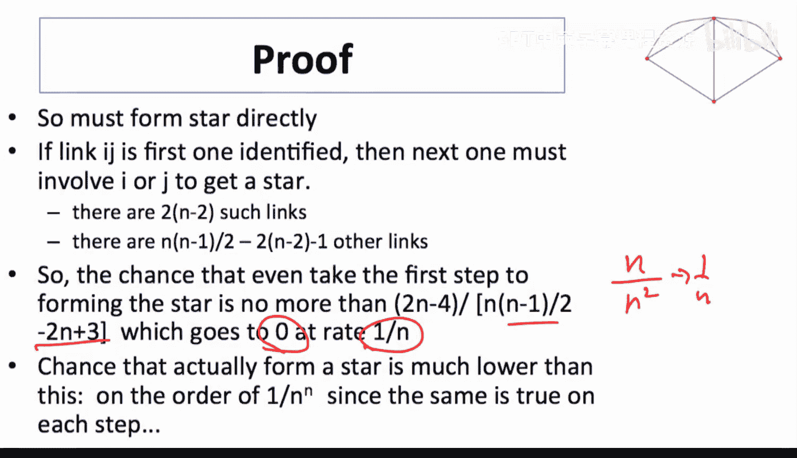

本节课我们一起学习了网络形成的动态策略模型。
*   我们引入了**瓦茨动态过程**，这是一个基于短视收益计算、随机选择边进行添加或删除的简单模型。
*   我们了解到，该过程的静止点必然是**成对稳定网络**。
*   通过连接模型中的分析，我们得到了一个关键洞见：**即使存在有效率的稳定网络，动态过程也未必能实现它**。瓦茨证明，在经典条件下，动态过程达到有效率星形网络的概率随着网络规模增大而趋近于零。
*   这个结论提醒我们，在预测网络形成结果时，必须仔细考虑具体的形成过程或动态机制，而不仅仅是静态的稳定性。

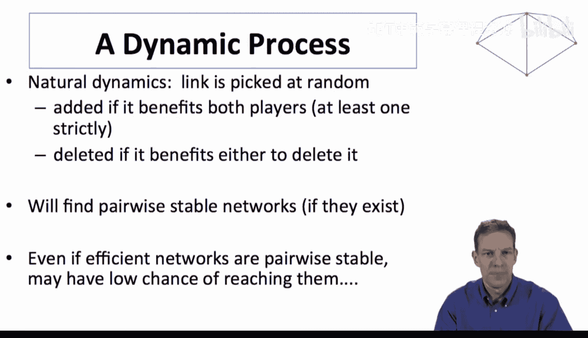

在下一节中，我们将进一步丰富这个模型，例如通过添加随机噪声，来获得对均衡结果的更强预测力。