#  047：演化与随机性（进阶）

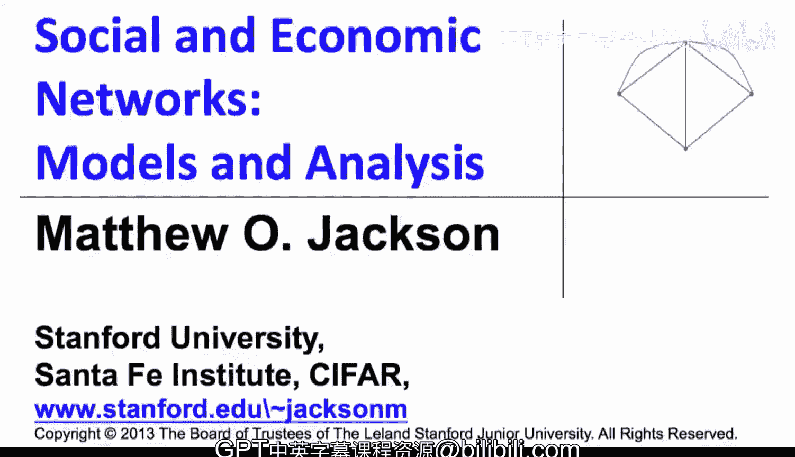

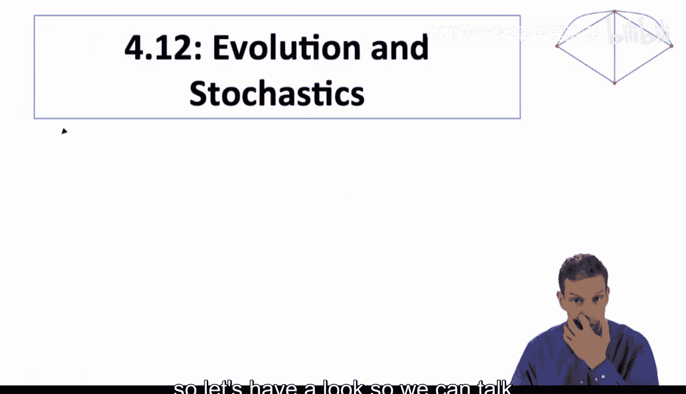

在本节课程中，我们将深入探讨网络形成的动态过程，并引入一个关键概念：随机性。我们将看到，在动态演化路径中加入微小的“噪声”或“错误”，可以帮助我们更精确地预测网络的长期稳定状态。

上一节我们介绍了基于改进路径的网络动态演化。本节中，我们来看看如何通过引入随机扰动来精炼我们的预测。

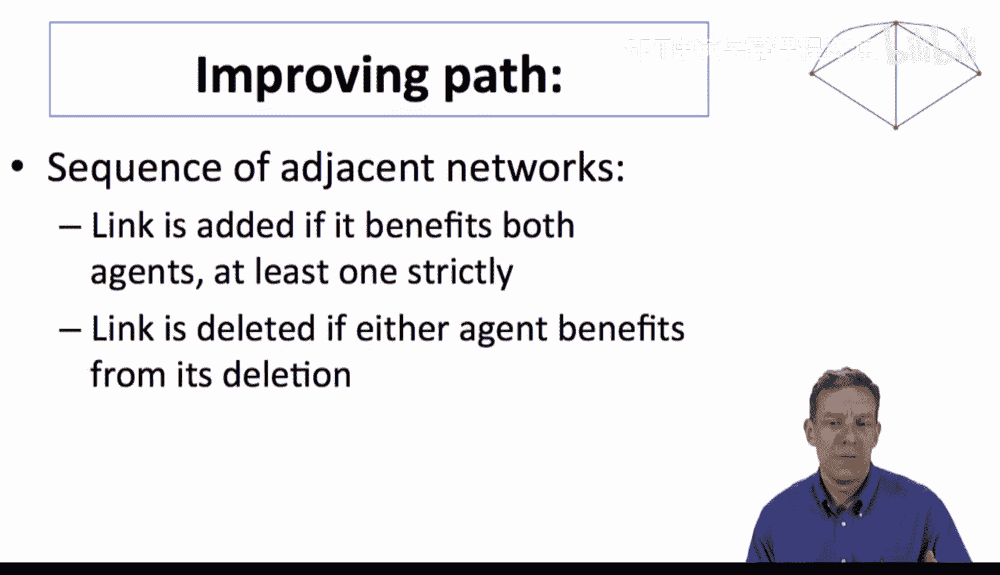

## 改进路径的概念

改进路径的概念源于Jackson和Watts（2002）的研究。其核心思想是观察一系列相邻的网络状态，其中每一步变化都至少使一方严格受益（例如，增加一条对双方都有利的链接，或删除一条至少一方希望删除的链接）。

以下是一个简单的示例，展示了不同网络状态及其之间的改进路径（用箭头表示）：

*   **空网络（0条链接）**：所有参与者收益为0。
*   **单链接网络（1条链接）**：孤立的一条链接给参与者带来负收益（例如-1），因此不是稳定的。
*   **双链接网络（2条链接）**：此时网络变得有价值。
*   **全连接网络（3条链接）**：这是最有价值的状态。

箭头方向表示“改进”的方向。例如，从空网络出发，增加任意一条链接都是一个改进步骤（尽管增加后状态不稳定）。从单链接网络出发，可以退回空网络，也可以增加第二条链接以形成双链接网络。

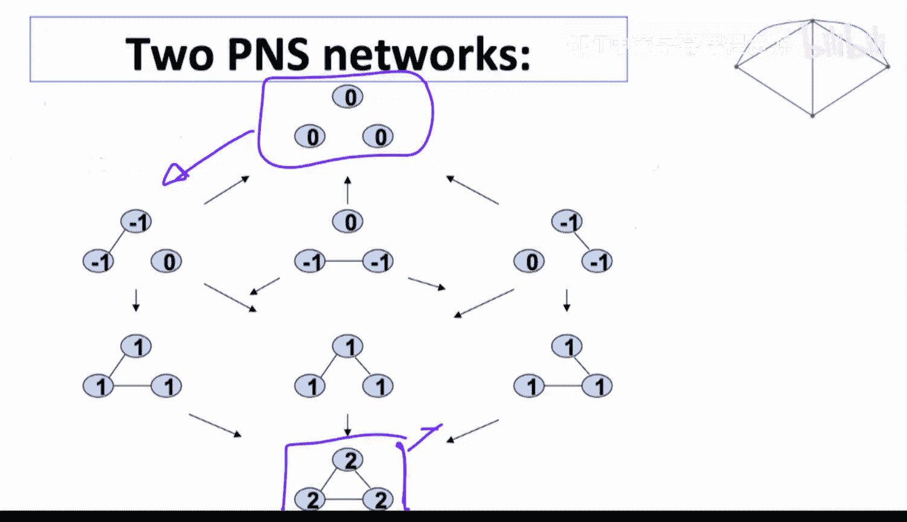

在这个例子中，存在两个成对纳什稳定网络：**空网络**和**全连接网络**。从许多中间状态出发，都存在改进路径最终导向这两个稳定状态之一。

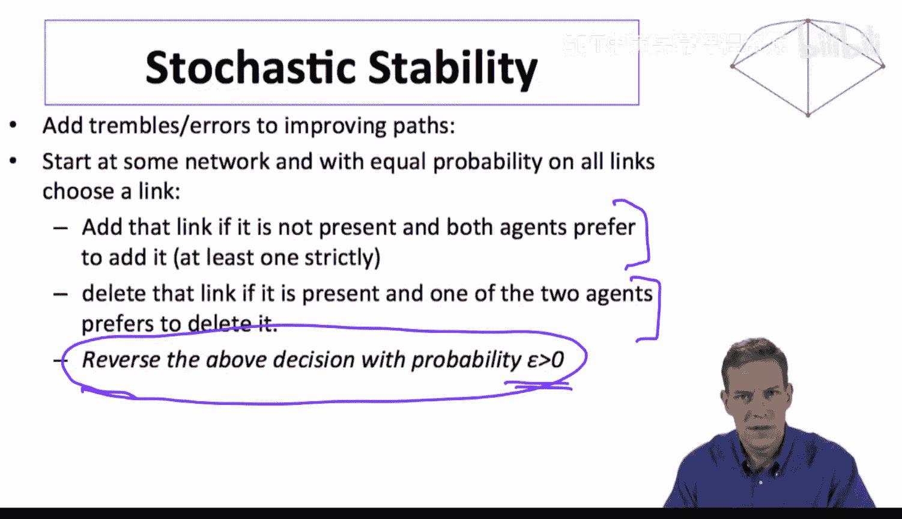

## 引入随机扰动：噪声改进路径

尽管存在两个稳定状态，但两者都是严格的均衡。为了判断哪一个更可能成为长期结果，我们在动态过程中引入微小的随机错误（或称为“颤抖”）。

以下是该随机过程的具体规则：

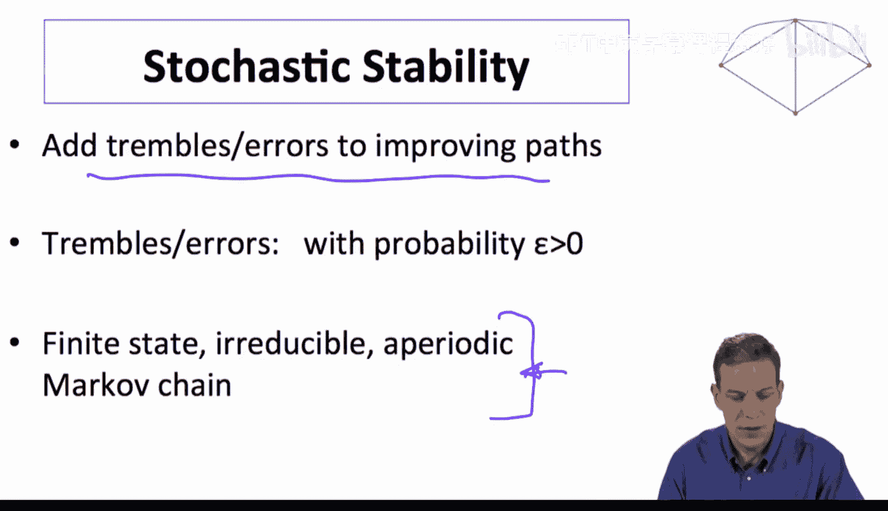

1.  从某个网络开始。
2.  以均等概率“识别”网络中的任意一条潜在链接（无论当前是否存在）。
3.  对于这条被识别的链接：
    *   如果链接不存在，且双方都希望添加它，则添加该链接。
    *   如果链接存在，且至少一方希望删除它，则删除该链接。
4.  **关键步骤**：以一个小概率 **ε** （ε > 0）执行与上述决策相反的操作。也就是说，无论参与者“想”做什么，都有 ε 的概率发生错误（该加时不加，该删时不删，或反之）。

这个过程为改进路径添加了“颤抖”。只要 ε > 0，这个过程就永远不会永远停留在某个状态，并且可以通过一系列改进和错误从任何网络到达任何其他网络。

## 作为马尔可夫链分析

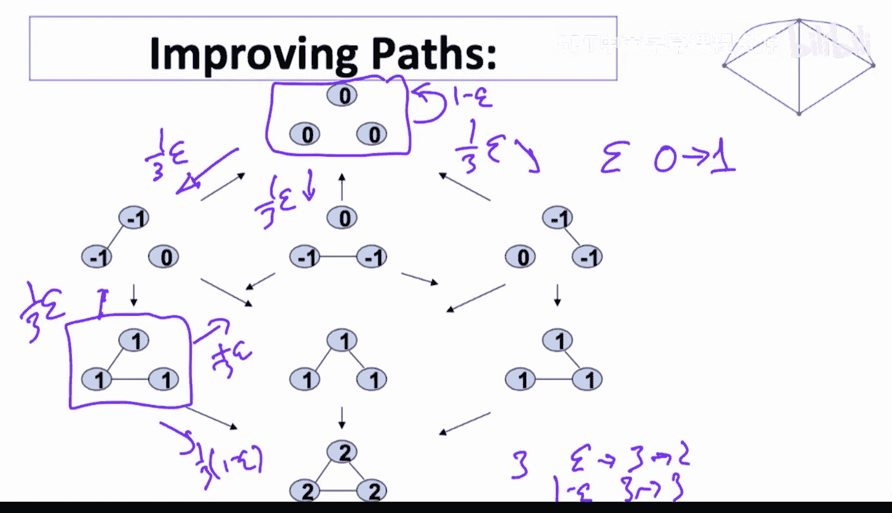

由于网络状态（节点和链接的组合）是有限的，这个添加了噪声的动态过程构成了一个**有限状态、不可约、非周期的马尔可夫链**。这是一个性质良好的随机过程，拥有唯一的**稳态分布**。

稳态分布告诉我们，在长期运行中，系统停留在每个可能网络状态的时间比例。我们可以通过求解该马尔可夫链的转移概率矩阵的左单位特征向量来得到这个分布。

为了简化分析，我们仅根据**链接数量**来跟踪状态：0条、1条、2条、3条。我们可以计算出在状态间转移的概率。例如：
*   从0链接状态：有 (1-ε) 的概率保持，有 ε 的概率错误地增加一条链接进入1链接状态。
*   从1链接状态：有可能退回0链接，或通过改进进入2链接状态，也可能因错误停留在原地或跳转到其他状态。

由此我们可以构建一个转移概率矩阵 **P**。

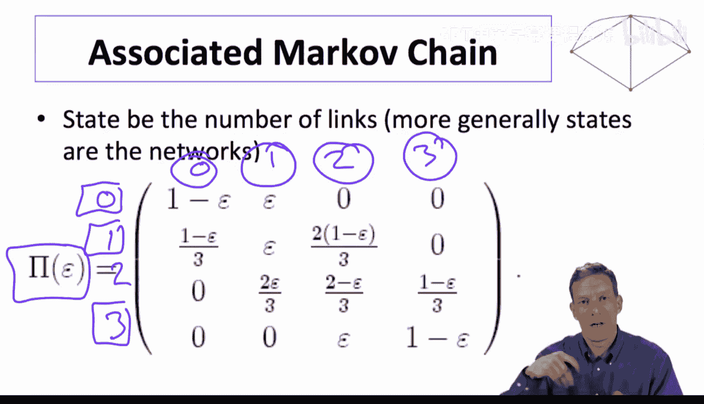

## 随机稳定性与长期预测

当我们计算这个马尔可夫链的稳态分布，并观察当错误概率 **ε 趋近于0** 时的极限情况，会得到一个有趣的发现：

> 尽管空网络和全连接网络都是成对纳什稳定的，但随机动态过程在长期内将**几乎全部时间**都花费在全连接网络上。

用公式表示，若用 π(g) 表示网络 g 的稳态概率，则有：
**lim_(ε→0) π(全连接网络) = 1**
**lim_(ε→0) π(空网络) = 0**

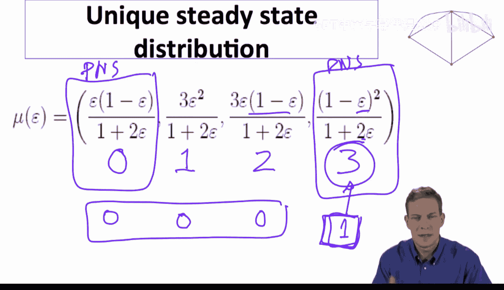

这个极限下的最常访问状态被称为**随机稳定**状态。这是一个强大的均衡精炼概念。

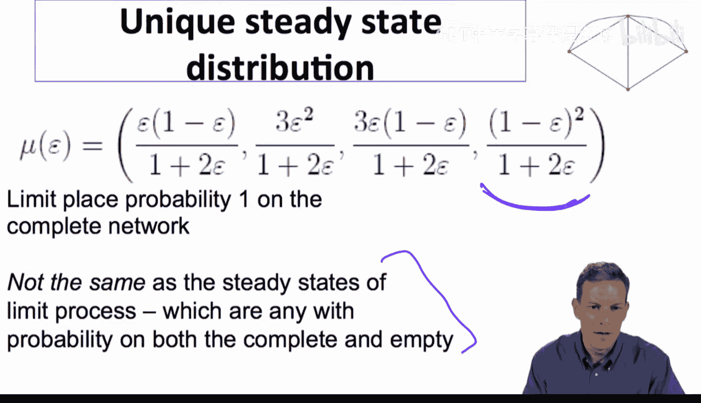

## 直观理解：吸引域的深度

为什么全连接网络更“稳定”？关键在于离开它的“吸引域”需要更多的连续错误。

*   **离开全连接网络**：需要先发生一个错误（意外删除一条链接），到达一个2链接状态。但从2链接状态，通过改进路径很容易回到全连接网络。要最终到达空网络，需要连续发生多个错误，且中途不被改进路径拉回。
*   **离开空网络**：只需要一个错误（意外增加一条链接），就可能进入一个导向全连接网络的改进路径。

因此，全连接网络拥有更“深”或更“大”的吸引域，使得系统一旦进入就难以离开，从而在长期中占据主导。

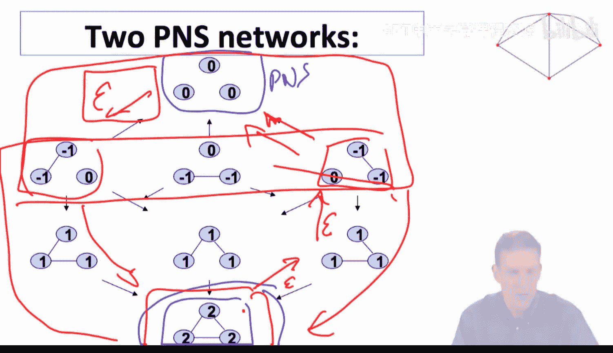

## 总结与延伸

本节课中我们一起学习了：

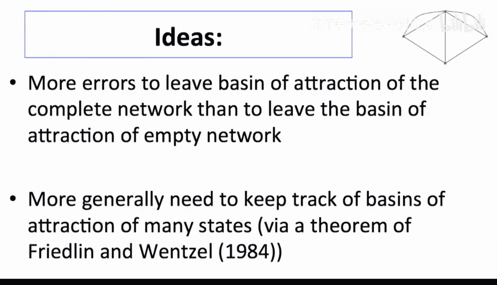

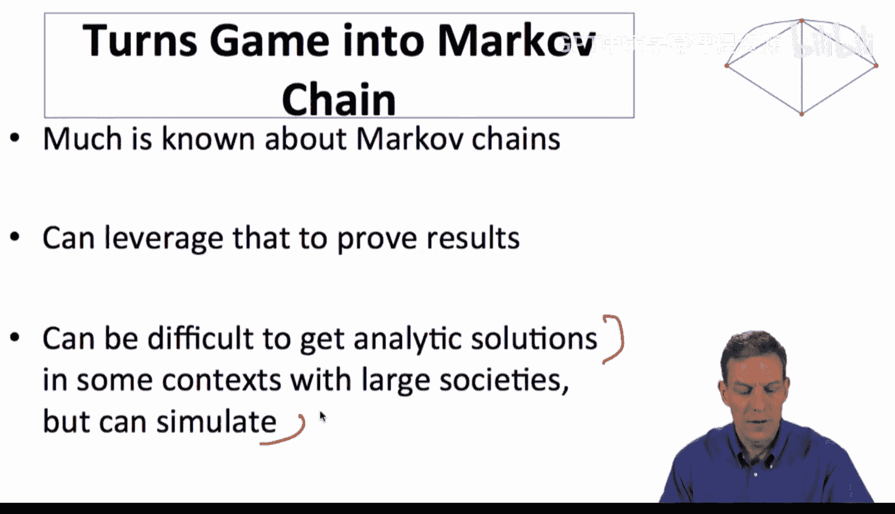

1.  **改进路径**：描述了网络通过一系列使参与者受益的步骤进行演化的过程。
2.  **随机扰动**：通过在动态中引入小概率错误（ε），将确定性过程转化为随机过程。
3.  **马尔可夫链分析**：该随机过程可以建模为马尔可夫链，其稳态分布预测了长期行为。
4.  **随机稳定性**：当错误概率趋于零时，系统花费绝大多数时间所处的状态。这提供了一个在多个纳什均衡中进行选择的有力判据。
5.  **核心洞见**：随机稳定性评估了不同均衡的“鲁棒性”。需要更多连续错误才能逃离的均衡，更可能在长期中显现。

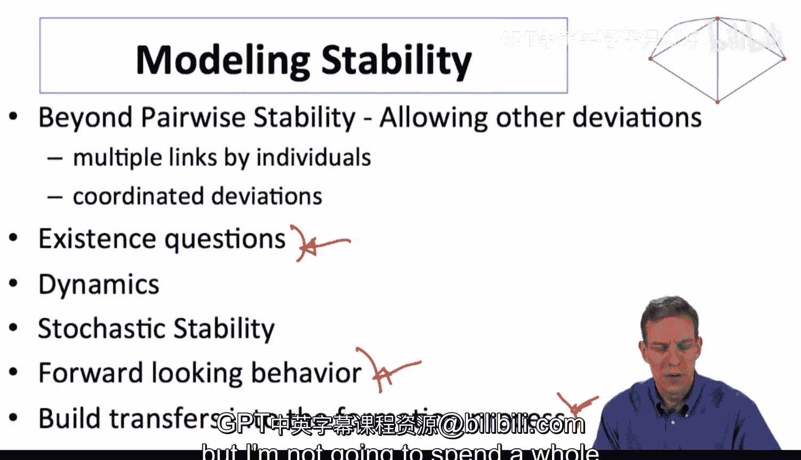

这种方法（随机稳定）是分析网络演化动态的强大工具。对于更复杂的网络和收益结构，虽然解析解可能难以获得，但可以通过模拟来进行分析。这超越了简单的成对稳定性分析，为我们理解哪些网络结构最终会盛行提供了更细致的视角。