#  048：有向网络形成（可选-进阶-16-38）📡

在本节课中，我们将学习有向网络的形成模型。我们将探讨在有向网络设定下，个体如何单方面选择建立连接，以及这与之前讨论的需双方同意的无向网络模型有何不同。我们将分析两种主要的收益流模型：双向流和单向流，并比较其效率与纳什稳定性。

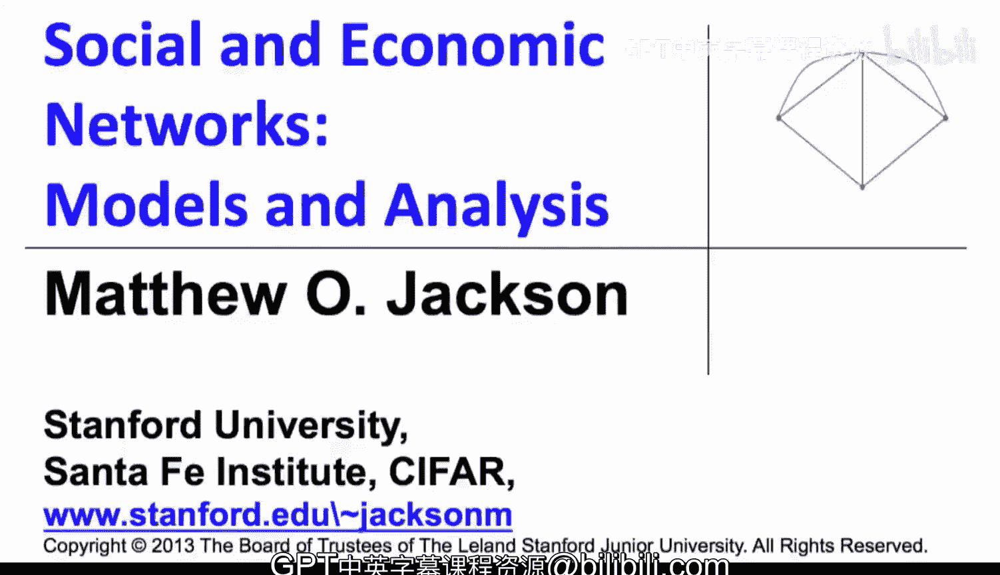

---

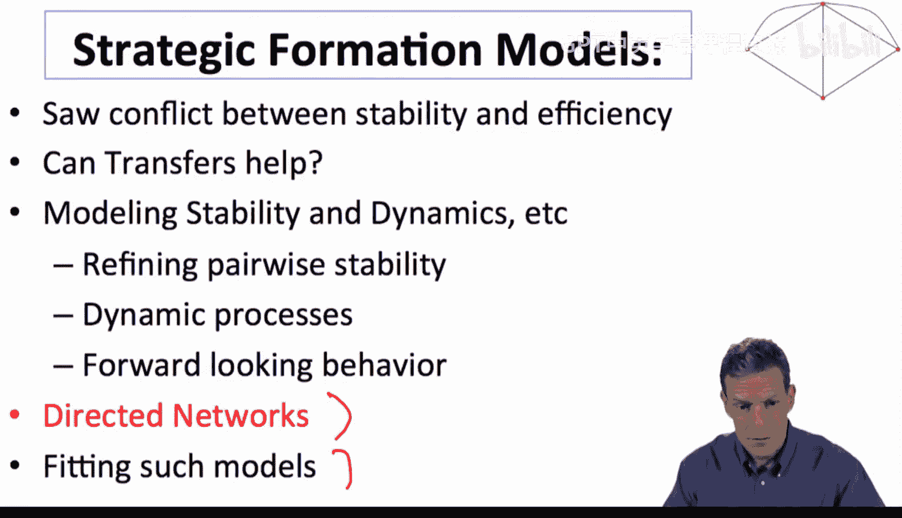

## 概述

之前我们讨论了战略网络形成的多种模型，包括稳定性、动态和转移支付等。本节我们将转向有向网络的形成。在有向网络中，个体可以单方面选择连接到他人，无需对方同意，这使得建模过程更为简化。关键在于应用场景：它必须适用于一方可以不经另一方许可而建立连接的情况。

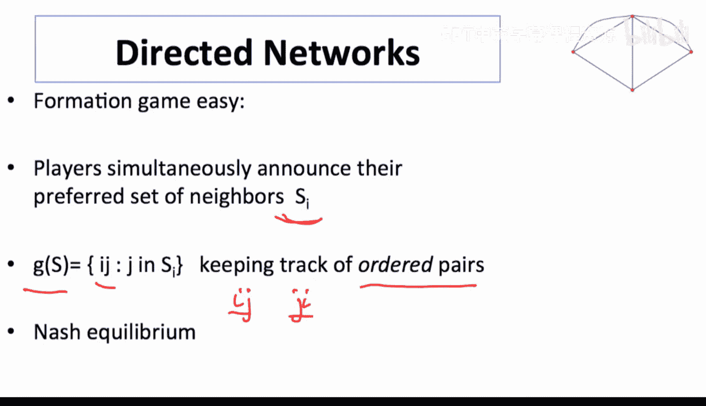

## 有向网络的形成游戏

在有向网络的形成游戏中，个体只需宣布他们偏好的邻居集合。网络将基于人们希望形成的所有链接而形成。现在，我们需要跟踪有序对 `(i, j)`，其中 `i` 指向 `j` 的链接 `ij` 与 `j` 指向 `i` 的链接 `ji` 是不同的。

**代码表示**：网络 `g` 现在是一个有向图，其中链接 `ij ∈ g` 表示 `i` 指向 `j`。

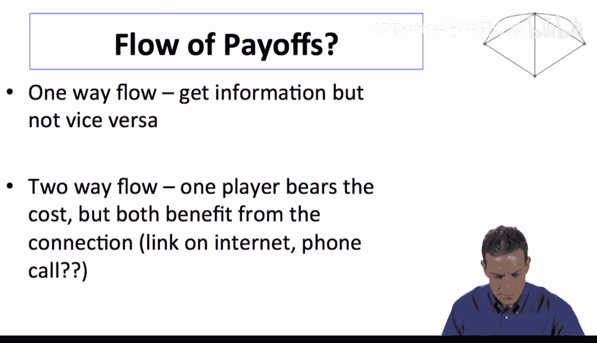

我们关注纳什稳定网络集，即给定其他人形成的链接，每个人都形成了他们想要的链接。

## 收益流：双向流与单向流

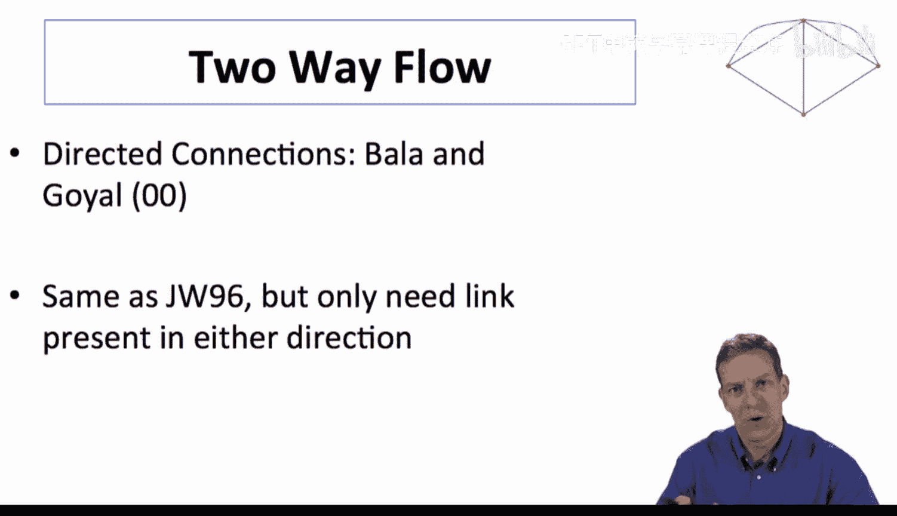

在考虑这类设定时，我们必须思考收益的流向。主要有两种情况：

**1. 单向流**：例如，我在Twitter上关注某人，但他们没有关注我。那么，我可以听到他们的发言，但他们听不到我的。在这种情况下，承担链接成本的人从他们访问的节点获取信息收益。

**2. 双向流**：一方形成链接并承担成本，但双方都从中受益。例如，我在我的网页上添加一个指向另一个网页的链接，这对我有益（用户可以从我的页面跳转），也对目标网页有益（它获得了新的流量）。在某些情况下，如电话通话，双方都可能承担成本（如时间）。

## 双向流连接模型

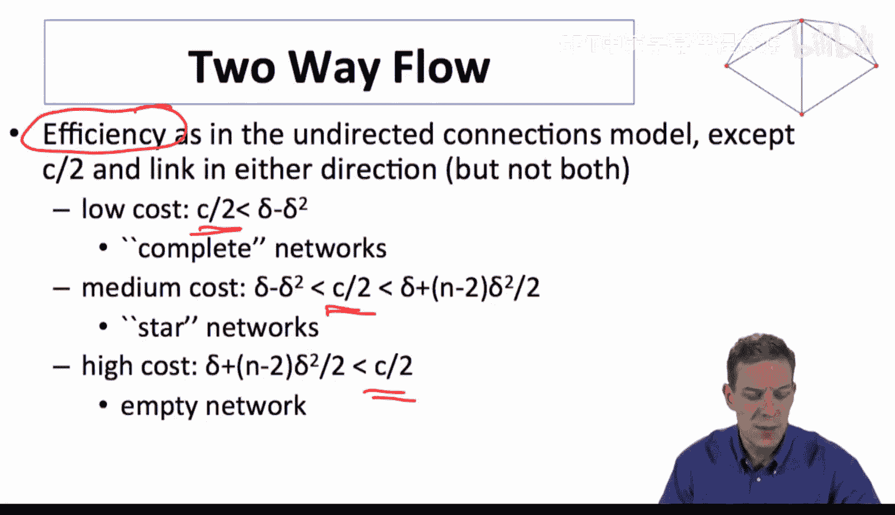

Bala和Goyal在2000年的一篇论文提出了连接模型的有向版本。其收益结构与原始的Jackson-Wolinsky连接模型相同，但形成过程不同：人们可以单方面形成链接。

**核心概念**：收益结构与原模型相同，但成本结构不同。只有形成链接的人承担成本 `c`。

**公式**：个体 `i` 的效用 `u_i(g)` 可以表示为：
`u_i(g) = ∑_{j≠i} δ^{d_{ij}(g)} - c * d_i^{out}(g)`
其中，`d_{ij}(g)` 是 `i` 到 `j` 的最短有向路径长度，`d_i^{out}(g)` 是 `i` 的出度（即 `i` 发起的链接数）。

### 效率分析

效率分析与之前类似，但由于每条链接现在只产生一份成本 `c`（而非无向模型中的 `2c`），因此成本因素整体减半。

以下是不同成本区间下的高效网络结构：
*   **低成本 (`c` 很低)**：形成“完全”网络（每对节点之间至少有一个方向的链接）。
*   **中等成本**：形成“星形”网络。
*   **高成本 (`c` 足够高)**：形成空网络。

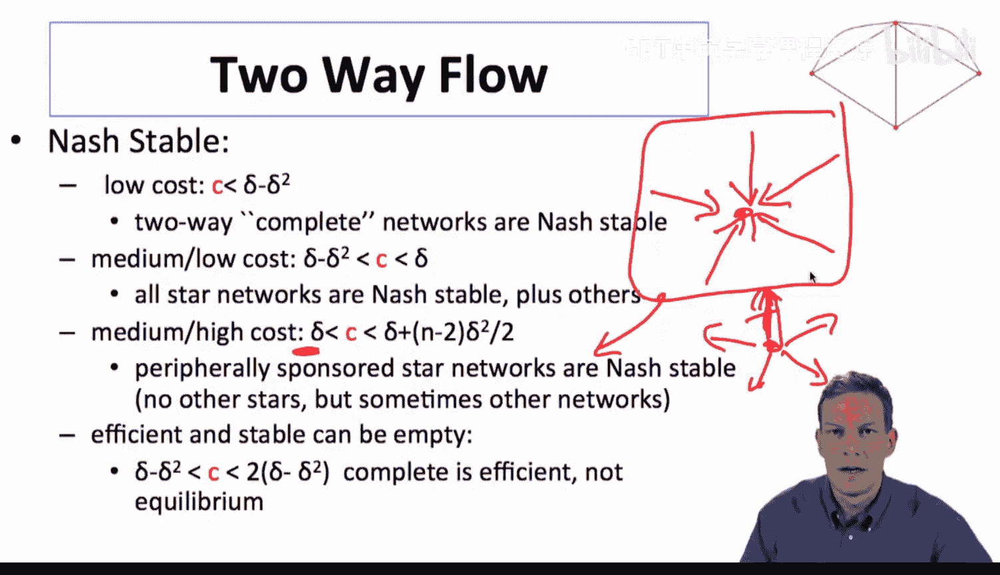

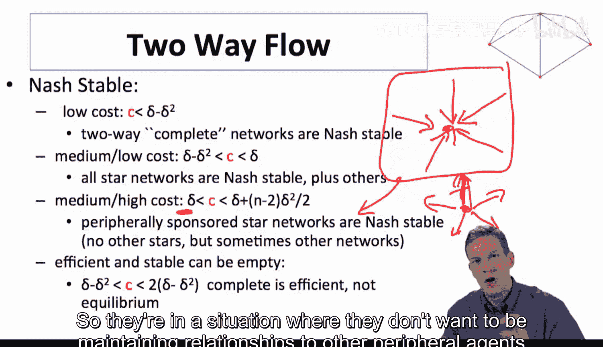

注意，这里的“完全”网络并不意味着每对节点间都有双向链接，因为那样会产生双倍成本且不增加信息流。因此，在任何两个体之间，只需一人承担成本形成一条链接即可。

### 纳什稳定性分析

现在，我们来看看纳什稳定网络。

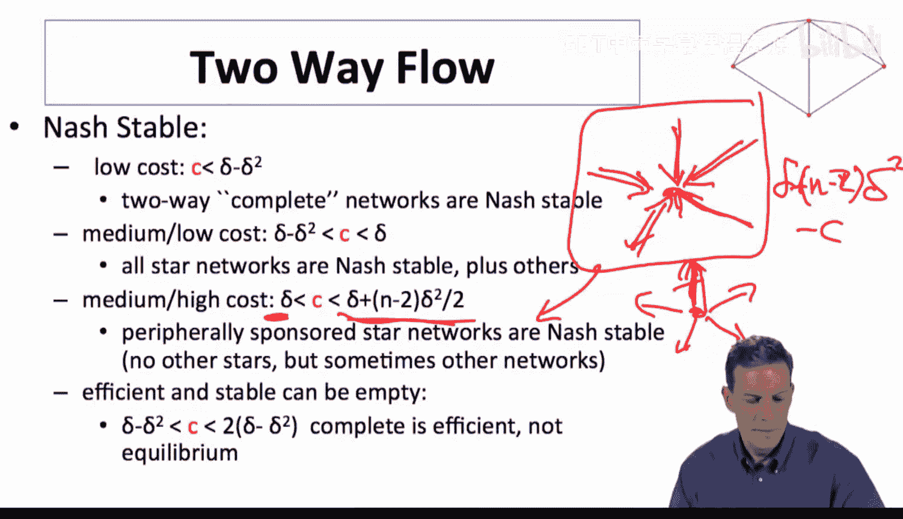

以下是不同成本下的纳什稳定网络类型：
*   **低成本时**：类似“完全”的网络是纳什稳定的。将间接关系变为直接关系是有利的。
*   **中低等成本时**：所有星形网络都是纳什稳定的，此外可能还有其他网络。星形网络中的链接可以有不同方向（中心指向外围，或外围指向中心，或混合），但双向链接没有意义。
*   **高成本时 (`c > δ`)**：空网络是纳什稳定的。

一个关键区别在于，相对成本结构将决定谁可能形成链接。例如，考虑两种极端的星形网络：
1.  **外围指向中心**：所有外围个体链接到中心。中心不承担成本但获得收益。这种星形是纳什稳定的，因为外围个体通过连接中心获得了大量间接收益（`δ + (n-2)δ² - c`），只要收益大于成本，他们就愿意保持链接。
2.  **中心指向外围**：中心链接到所有外围个体。中心为每条链接承担成本 `c`，但每条直接链接只带来 `δ` 的收益。如果 `c > δ`，中心会倾向于切断链接。因此，这种星形在 `c > δ` 时不是纳什稳定的。

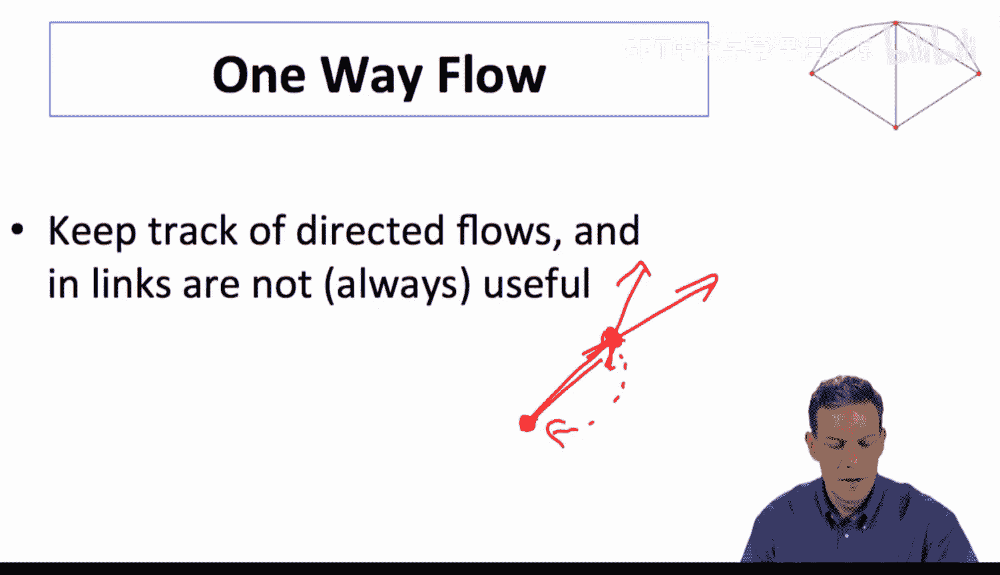

因此，即使收益是双向流动的，成本结构也会预测链接形成的方向。

## 单向流连接模型

接下来，我们简要讨论单向流模型。在这种情况下，收益只沿着链接方向流动。如果我链接到某人，我可以访问他们，并通过他们间接访问他们链接的人。但我链接到他们，并不会给他们带来收益，除非他们也链接回我。

考虑一个衰减因子 `δ = 1` 的简化版单向流连接模型（即无衰减）。

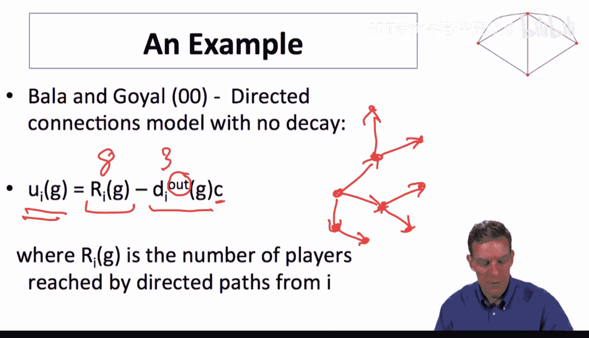

**公式**：个体 `i` 的效用为：
`u_i(g) = |R_i(g)| - c * d_i^{out}(g)`
其中，`R_i(g)` 是 `i` 通过网络中的有向路径可以访问到的所有节点集合，`d_i^{out}(g)` 是 `i` 的出度。

### 效率分析

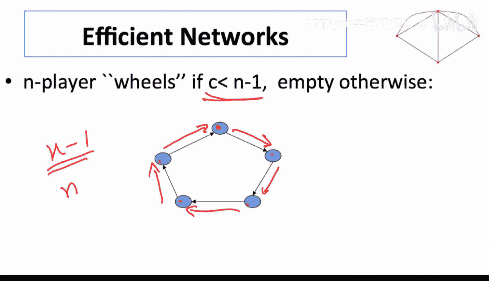

只要成本 `c < n-1`，高效网络就是“轮辐”状结构（Bala和Goyal称之为“wheels”）。这是一个有向环，每个节点指向下一个节点，最终形成一个闭环。

**图示**：想象一个由n个节点组成的环：1→2→3→...→n→1。在这种结构中，每个节点通过一条出链，就能访问到所有其他 `n-1` 个节点（通过沿着环的方向）。这是用最少的链接数（`n` 条）实现最大覆盖（每人访问 `n-1` 人）的方式，因此是高效的。如果 `c ≥ n-1`，则空网络更高效。

### 纳什稳定性分析

在稳定性方面：
*   **低成本时**：轮辐状网络是唯一的严格纳什均衡。
*   **较高成本时**：轮辐状网络和空网络是唯一的严格纳什稳定网络。此时可能陷入空网络，因为除非直接收益足够大，否则没人愿意主动形成链接。

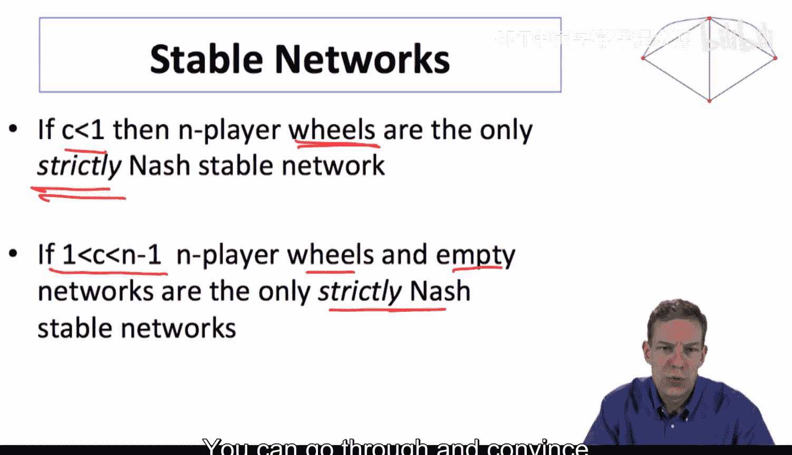

严格性在这里很重要。存在许多是纳什均衡但不是严格纳什均衡的网络。例如，一个非轮状但连通的有向图，其中某些个体对于将某条链接指向哪个节点是无差异的（因为通过其他路径也能访问到目标节点）。这种网络是纳什稳定的，但不是严格稳定的。而在轮辐状网络中，任何人改变其唯一的出链都会失去对某些节点的访问，因此有严格动机保持现有链接。

## 模型选择取决于应用场景

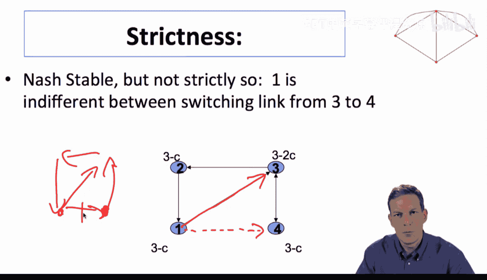

最后需要强调的是，应该使用哪种模型（单边形成还是双边同意）与模型本身的优劣无关，而完全取决于实际应用场景的需求。
*   **需要双边同意的场景**：联盟、友谊、婚姻、许多社交关系。这些通常需要双方同意和双向形成过程。
*   **适用单边形成的场景**：引用文章、网页超链接、社交媒体关注。这些可以自然地用有向、单边网络形成来建模。

因此，选择哪个模型是一个应用问题，而不是理论偏好问题。它们是适用于不同情况的不同模型。

---

## 总结

本节课中，我们一起学习了有向网络的形成。
*   我们首先介绍了有向网络形成游戏的基本设定，其中个体可以单方面建立链接。
*   接着，我们探讨了**双向流连接模型**，分析了其效率与纳什稳定性，并发现成本结构会影响链接方向。
*   然后，我们研究了**单向流连接模型**，看到了轮辐状结构在效率和严格纳什稳定性中的核心作用。
*   最后，我们强调了模型的选择应基于实际应用场景的本质，而非模型本身的复杂性或优雅程度。

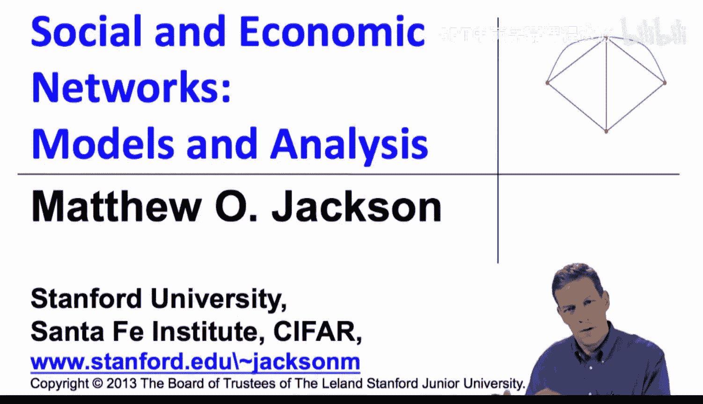

至此，我们完成了战略网络形成建模的主要部分。接下来，我们将转向网络上的行为分析，研究给定网络结构后，行为如何在其上扩散及其后果。