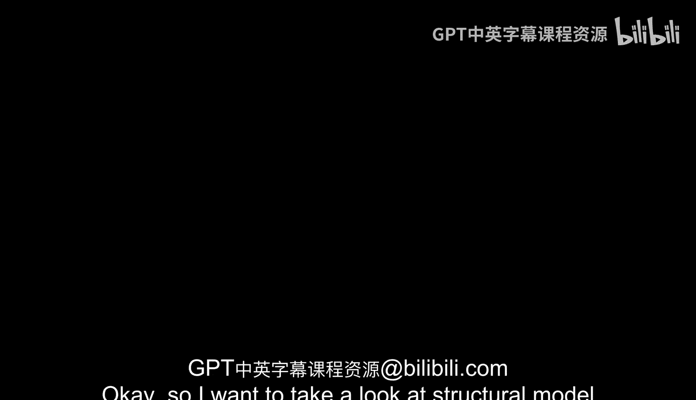
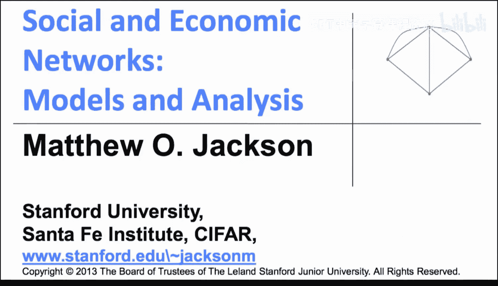

#  049：应用-结构模型（可选-进阶）📊

在本节课中，我们将学习如何构建和拟合一个结合了策略形成与随机相遇的网络形成结构模型。我们将通过一个具体的例子，探讨如何量化同质性现象中个人选择与随机相遇各自的作用。

## 概述

上一节我们讨论了网络形成的不同模型。本节中，我们将看看如何构建一个结构模型，将策略性选择与随机相遇结合起来。这种模型允许我们估计在观察到的网络模式（如同质性）中，有多少是源于个体的偏好选择，有多少是源于他们更可能遇到同类型个体的随机过程。我们将通过一个简化的模型来演示这种方法的核心思想：设定模型、生成预测、与数据匹配以估计参数，并进行统计检验。

## 模型构建思路 💡

当我们试图估计策略形成模型时，我们观察到的是个体所做选择的结果。这类似于经济学中的“显示性偏好理论”：通过观察个体实际形成的友谊（而非他们声称的偏好），我们可以推断其内在偏好。然而，这种推断必须考虑“机会”因素——个体遇到不同类型人的频率。因此，我们的模型需要同时包含：
1.  **偏好（选择）**：个体从不同类型友谊中获得的效用。
2.  **相遇过程（机会）**：个体随机遇到潜在朋友的速率。

这种方法提供了一种不同于直接问卷调查的视角，它基于实际行为而非自我报告的态度。

## 一个简单的结构模型

以下是构建模型的具体步骤。我们将设定一个非常简化但能阐明核心方法的模型。

### 模型设定

假设社会中有 `K` 种类型（如不同种族）。每个个体 `i` 的效用取决于其拥有的同类型朋友数量和不同类型朋友数量。

个体的效用函数设定如下：
`U_i = (s_i + γ_i * d_i)^α - c * t_i`
其中：
*   `s_i`：个体 `i` 拥有的同类型朋友数量。
*   `d_i`：个体 `i` 拥有的不同类型朋友数量。
*   `t_i = s_i + d_i`：个体 `i` 的朋友总数（即其度数）。
*   **`γ_i`**：**偏好偏差参数**。这是核心参数：
    *   若 `γ_i = 1`，个体对同类型和不同类型朋友无差异。
    *   若 `γ_i < 1`，个体更偏好同类型朋友（同质性偏好）。
    *   若 `γ_i > 1`，个体更偏好多样性（偏好不同类型朋友）。
*   **`α`**：**友谊的边际收益递减参数**（通常 `α < 1`），使得效用函数呈凹性。
*   **`c`**：形成朋友关系的成本。

个体遇到他人的过程是随机的。令 `q_i` 为个体 `i` 遇到同类型人的概率，`1 - q_i` 则为遇到不同类型人的概率。因此，`s_i = q_i * t_i`，`d_i = (1 - q_i) * t_i`。

个体选择朋友总数 `t_i` 以最大化其期望效用。求解此优化问题，可以得到最优朋友数量 `t_i*` 的表达式，它是参数 `γ_i`、`α`、`c` 和 `q_i` 的函数。在实际数据中，我们观察到的朋友数量 `T_i` 是这个最优值加上一个随机误差项 `ε_i`：`T_i = t_i* + ε_i`。

### 参数识别与估计

现在，我们有了一个将可观测数据（朋友数量 `T_i`）与模型参数（`γ_i`， `α` 等）联系起来的框架。以下是关键步骤：

**1. 从数据中识别偏好参数 `γ_i`**
在数据中，我们观察到不同群体在不同学校中的平均朋友数量。模型预测，如果 `γ_i < 1`（即偏好同类型朋友），那么当个体所处环境中同类型人的比例较高（即 `q_i` 较大）时，其最优朋友数量 `t_i*` 也会较高。因此，通过分析“群体规模”与“该群体平均朋友数”之间的正相关关系，我们可以估计出 `γ_i` 的大小。数据显示，这种正相关关系是显著存在的。

**2. 定义并求解相遇过程参数 `β_i`**
相遇概率 `q_i` 并非外生给定。它取决于所有个体的交友决策，形成一个均衡。我们将会面过程比喻为一个大型聚会（鸡尾酒会）。在聚会中，你遇到某类型人的概率不仅取决于该类型人在总人口中的比例，还取决于他们活跃交友的程度（他们的 `t_i`）以及是否存在“相遇偏差”。

我们引入 **`β_i`**：**相遇偏差参数**。
相遇概率 `q_i` 的公式为：
`q_i = (n_i * t_i)^β_i / Σ_j [(n_j * t_j)^β_j]`
其中 `n_i` 是类型 `i` 的人口比例。
*   若 `β_i = 1`，相遇概率与各类型人的“活跃度”成比例。
*   若 `β_i > 1`，则存在“粘性”或“偏见”，导致个体遇到同类型人的速率远高于随机混合的预期。

由于所有类型的相遇概率之和必须为1（`Σ_i q_i = 1`），这提供了一个平衡方程，帮助我们结合数据估计出 `β_i` 参数。

**3. 拟合技术**
我们拥有来自多个学校网络的数据。对于一组给定的参数（`α`, 所有 `γ_i`, 所有 `β_i`），模型可以预测出每个群体在每个学校中的 `T_i`（朋友数量）和 `q_i`（同类型朋友比例）。我们将这些预测值与实际观测值进行比较，计算误差平方和。通过网格搜索或优化算法，我们寻找能使所有学校、所有群体的总误差平方和最小化的那组参数。成本参数 `c` 可以通过比较不同群体的相对朋友数量来消除，因此无需直接估计。

## 模型应用与发现 🔬

将上述模型应用于“青少年健康”数据集（Add Health）的高中生友谊网络后，得到了以下估计结果：

**参数估计值：**
*   `α ≈ 0.55`，表明友谊的边际效用递减。
*   **偏好偏差 `γ_i`**：
    *   亚裔：0.90
    *   黑人：0.55
    *   西班牙裔：0.65
    *   白人：0.75
    *   （所有值均小于1，表明普遍存在同质性偏好，但程度不同）。
*   **相遇偏差 `β_i`**：
    *   亚裔：7.0
    *   黑人：7.0
    *   西班牙裔：2.5
    *   白人：1.0
    *   （`β_i > 1` 表明相遇过程本身也存在同质性偏差，亚裔和黑人群体尤为明显）。

**统计显著性检验：**
通过F检验等统计方法，我们可以检验这些参数估计是否显著不等于某些基准值（例如，所有 `γ_i = 1` 或所有 `β_i = 1`）。
*   **偏好偏差**：假设所有种族的 `γ_i` 都等于1（无偏好偏差）的模型，其误差显著增大。我们可以拒绝“无偏好偏差”的原假设。进一步检验表明，不同种族间的 `γ_i` 也存在显著差异（例如，黑人与白人的偏好参数显著不同）。
*   **相遇偏差**：同样，我们可以拒绝“无相遇偏差”（所有 `β_i = 1`）的原假设。相遇过程的同质性偏差也是真实存在的。

## 总结

本节课中，我们一起学习了一种构建和拟合网络形成结构模型的方法。我们通过一个结合了策略性偏好（`γ_i`）和随机相遇过程（`β_i`）的简化模型，演示了如何：
1.  从实际网络数据（如朋友数量和类型构成）中推断出个体的偏好参数。
2.  估计相遇过程中存在的系统性偏差。
3.  使用统计检验（如F检验）来评估这些参数的显著性和差异性。

该模型的应用表明，在观察到的种族同质性友谊模式中，**既有个人选择（偏好偏差）的作用，也有社交机会结构（相遇偏差）的影响**。更重要的是，这种结构建模方法不仅限于此特定模型。它提供了一个通用框架：针对具体研究问题构建合适的模型，用其生成可检验的预测，通过与数据匹配来估计关键参数，并最终用于分析反事实情景（例如，改变学校混合政策会如何影响友谊模式），从而为理解和干预社会网络提供定量依据。