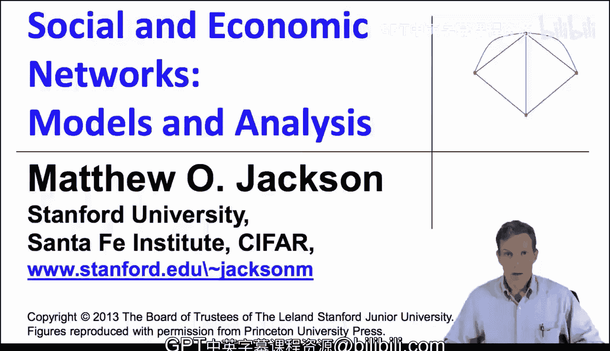
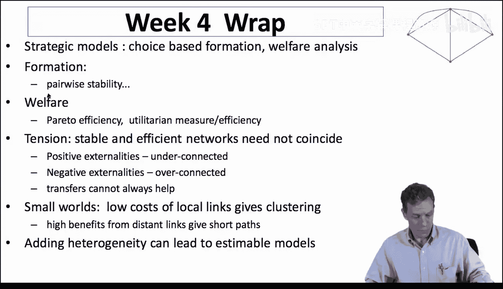

#  050：第四周总结

## 📚 概述
在本节课中，我们将回顾第四周学习的核心内容。我们重点探讨了策略性网络形成模型，该模型将网络中的节点视为自主决策的个体或组织，他们选择建立哪些连接。这使我们能够从不同角度审视网络，并评估网络带来的社会福利。

## 🔍 回顾：策略性网络形成与稳定性
上一节我们介绍了网络形成的不同模型，本节中我们来看看第四周的核心概念。我们主要研究了节点如何基于自身利益选择建立或断开连接。

以下是本周涉及的关键概念：

*   **成对稳定性**：这是网络形成分析中的一个核心概念。一个连接只有在**对双方都有利**时才会形成。相反，任何节点都可以**单方面断开**对自己不利的连接。这个概念帮助我们预测哪些网络结构可能是稳定的。
*   **帕累托效率**：这是一个来自经济学的标准福利概念。如果一个网络状态无法在不损害任何节点收益的情况下，使至少一个节点变得更好，那么这个状态就是帕累托有效的。
*   **功利主义福利**：这个衡量标准关注社会总收益的最大化，即最大化所有节点收益的总和：`总福利 = ∑ 节点i的收益`。

## ⚖️ 稳定性与效率的张力
一个重要发现是，由于网络中存在**外部性**，个体基于自身利益选择的稳定网络与社会福利最大化的高效网络之间往往存在差异。

*   **正外部性**：当一个人的连接行为对他人产生积极影响（如信息传播）时，个体在决策时不会完全考虑这些外部收益，可能导致**连接不足**。这意味着对社会有益的连接可能因为对个体激励不足而无法形成。
*   **负外部性**：当连接行为对他人产生负面影响（如造成拥堵或分散朋友注意力）时，个体不会内化这些外部成本，可能导致**过度连接**。

如果同时存在正负外部性，情况会更为复杂。虽然可以通过**转移支付**（如贿赂、利益交换）来激励连接形成，但在多重外部性并存且影响模式复杂的情况下，转移支付并不总能解决问题。

因此，**稳定性与效率之间的根本矛盾**是这一研究领域的核心主题。

## 💡 模型的应用与解释力
这类策略模型能帮助我们解释观察到的现象。以“小世界”现象为例：

*   **高聚类系数**：可以解释为与社交或地理上“接近”的个体建立连接的成本很低，因此具有相似特征或位置的个体之间很容易相互连接，形成紧密的圈子。
*   **短平均路径长度**：可以解释为建立远距离“捷径”连接能带来很高的收益，因此尽管本地连接紧密，但少数长距离连接足以显著缩短整个网络的平均路径。

## 🚀 未来研究方向
展望未来，一个非常重要且正在发展的研究方向是，将早期学习的**随机网络形成模型**与本周的**策略性网络形成模型**结合起来。将随机的相遇过程与个体的策略性选择相结合，可以引入异质性，匹配观测到的特征，从而让这些模型更好地应用于实际数据分析。

## 📝 总结
本节课中我们一起学习了第四周的核心内容。我们重点掌握了策略性网络形成模型，理解了**成对稳定性**、**帕累托效率**和**功利主义福利**等关键概念。我们认识到，由于网络**外部性**的存在，个体理性决策形成的稳定网络与社会最优网络之间常存在差异，表现为**连接不足**或**过度连接**。最后，我们看到这类模型对现实现象（如小世界网络）的强大解释力，以及其与随机模型结合的未来潜力。

接下来，我们将更多地转向对网络上的**行为**进行直接分析。