#  051：扩散模型 🧠

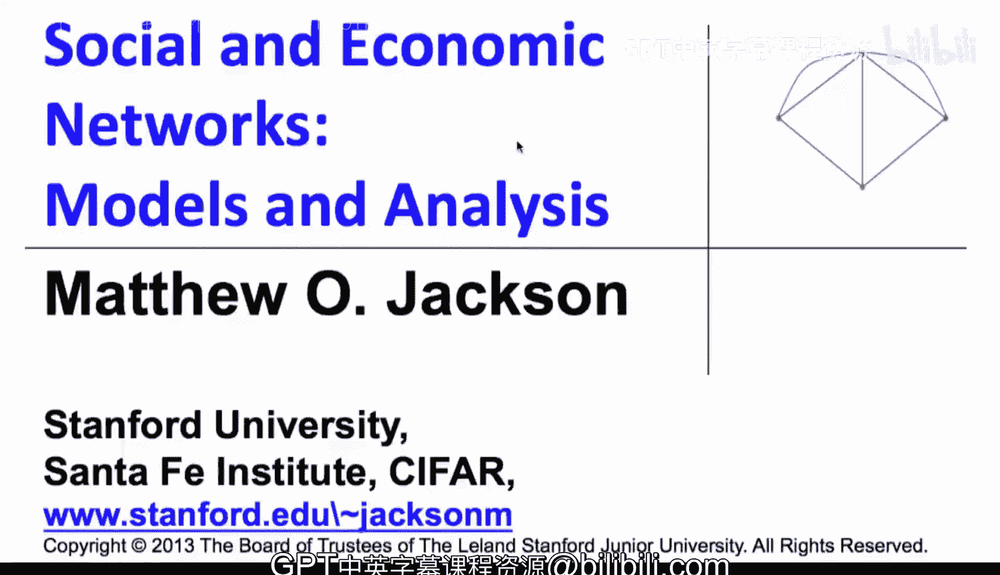

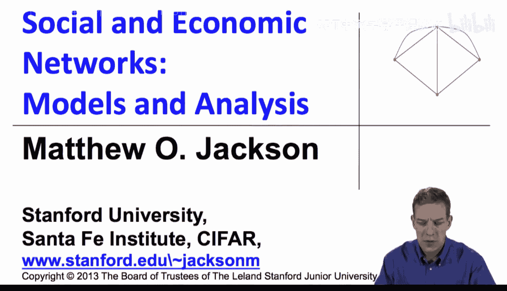

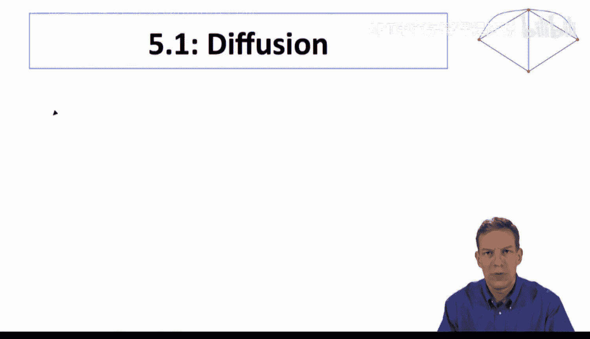

在本节课中，我们将开始学习本课程的最后主要部分：理解网络结构如何影响行为。我们将网络视为给定的，然后研究其对行为的影响。我们将从**扩散**现象入手，然后讨论其他方面。

上一节我们探讨了网络的形成，本节中我们将网络视为既定结构，研究其上的行为。显然，网络的形成和行为是相互影响的。我基于网络对行为的预期会影响我建立哪些连接，而我建立的连接又会反过来影响行为。这两者是共同决定、共同演化的。然而，我们将逐一分析它们。要理解网络形成过程，最终必须预测网络形成后会发生什么。之前，我们将网络的效用或收益视为给定。现在，我们将为这些收益填充具体内容。一旦我们知道了网络形成后的行为结果，就能获得人们的收益，进而可以回过头去理解，网络上的特定过程对网络形成意味着什么。文献大多按此顺序研究这两个问题，对共同决定的研究相对较少。在课程最后总结时，我们会稍作提及。

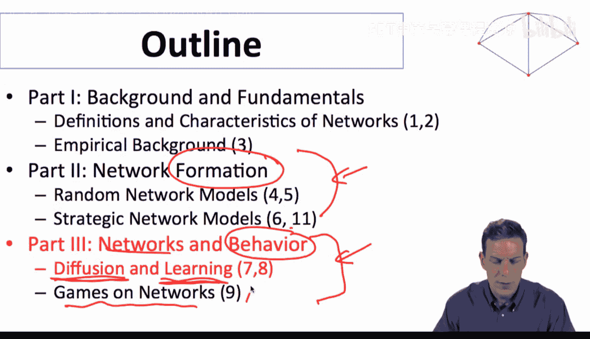

## 扩散的层次与背景

现在进入扩散部分。当我们思考网络结构如何影响行为时，将从最简单的概念开始，例如感染或传染。我们将以相当机械的方式看待扩散，即它如何从一个节点传播到另一个节点。当我们考虑更复杂的情况，如观点形成、信息处理和**学习**时，情况会变得更复杂，因为这不再是简单的“是否感染流感”的过程。在后一种简单情况下，我们只需观察网络结构就能理解。而在学习等复杂过程中，我们必须思考人们如何处理信息、信息如何流动、观点如何形成等。当我们允许人们做出选择和决策时，情况会进一步复杂化，因为他们必须考虑其他人的行为并做出反应。因此，这里存在三个层次，我们允许人们做的事情和信息处理的复杂性将逐层增加。

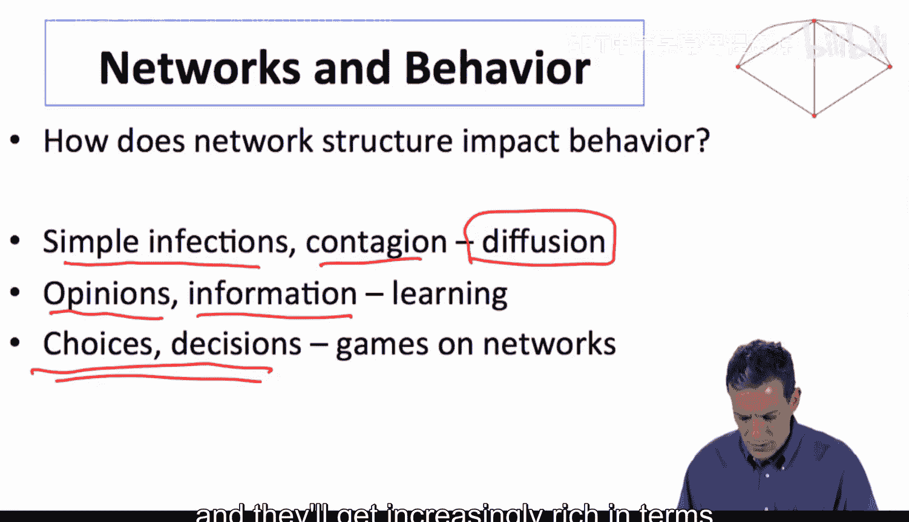

首先来看扩散。我们可以思考像流感这样的基本疾病扩散，也可以思考观点或基本信息（即你只是知道或不知道某个事实）的扩散。例如，你只是被告知一个事实（比如有一款新iPhone发布了），这并不涉及复杂的信息处理和学习，你只是被告知某事。这种基本扩散模型的应用也包括人们是否采用某个产品，但前提是他们只需要知道这个产品就能自己做决定，而无需担心别人在做什么。如果我是否想购买一个产品取决于其他人的行为，情况就会更复杂，我们将在后面讨论这种互补性。现在，我们先思考简单的过程。

我们将从一些问题和背景知识开始，然后讨论一个最佳模型——它是最简单、可能也是最著名的扩散模型。之后，我们将开始引入互动结构和网络结构。

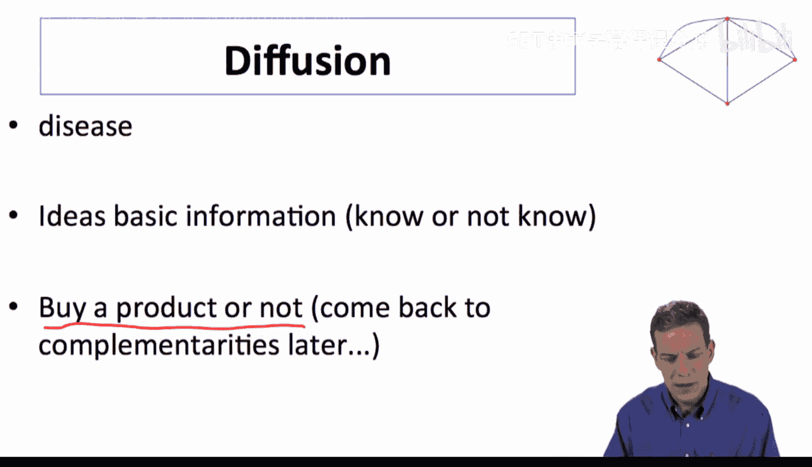

## 扩散的S型曲线与早期研究

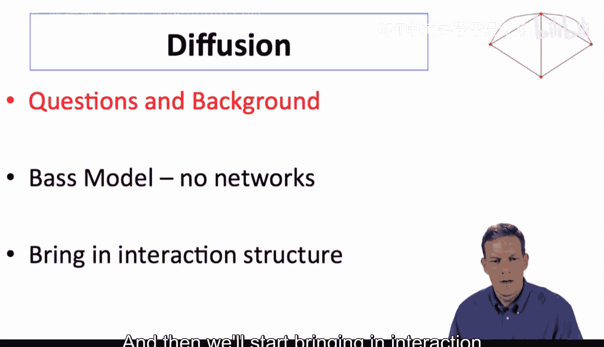

首先，当我们思考扩散时，存在一种被称为**S型采用曲线**的现象。观察事物在时空中的扩散，其传播方式和随时间推移的采用者（或感染者）数量存在不同模式。事物开始时传播缓慢，然后加速，最终达到峰值。我们可以提出一系列问题：最初的采用者是谁？他们是高度数节点还是低度数节点？是什么导致了扩散过程的不同速度？为什么最终会放缓？让我们从一项早期研究开始看起。

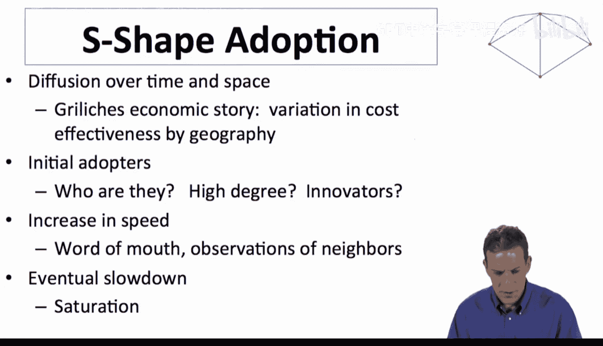

这是科尔曼、卡茨和门泽尔在20世纪60年代进行的一项研究。他们观察医生对新药的采用情况。具体来说，当时刚开发出一种新的抗生素，需要医生开具处方。他们的想法是，如果医生在某个时间点开具了这种新药的处方，就视为“采用”。他们追踪了医生随时间的变化，记录在特定时间段内（例如，新药合法上市后6个月、8个月、10个月等）有哪些医生开具了处方。

在研究开始前，他们调查了医生，询问他们会向哪些其他医生寻求建议。这构成了一个医生网络。他们将医生分为三类：有36名医生未被任何其他人提名（即没人说会向他们寻求建议）；有56名医生被1到2人提名；有33名医生被至少3人提名。然后，他们追踪了这些医生随时间的采用率。

结果显示，未被任何人提名的医生，在6个月后采用率为31%，8个月后为42%，10个月后为47%，17个月后为83%。被1到2人提名的医生，6个月后采用率为52%，8个月后约为三分之二（70%左右）。而被至少3人提名的医生，采用率更高，更早达到更高水平。这表明，扩散过程实际上因医生在网络中的位置而异。

后续研究存在一些困难，需要确保测试的纯净性，因为被多人提名可能也与其他因素相关（例如，是否从广告或其他渠道听说此药，或是否直接受到药厂压力）。一系列后续研究试图确保这里的发现是稳健的，而非虚假相关。无论如何，我们确实看到了基于连接度的差异，并且经过更仔细的数据审视，这一结论似乎成立。

下图绘制了不同时间点的采用率。可以看到，未被提名的医生在每个时间点的采用率都较低，最终他们赶上了被1-2人提名的医生，而后者的采用率又低于被至少3人提名的医生。因此，我们看到采用率因相关个体的度数而异。在尝试建模和理解扩散时，我们可以关注这一点。为什么会因个体度数而异？正如你所料，对此会有相当直观的解释。

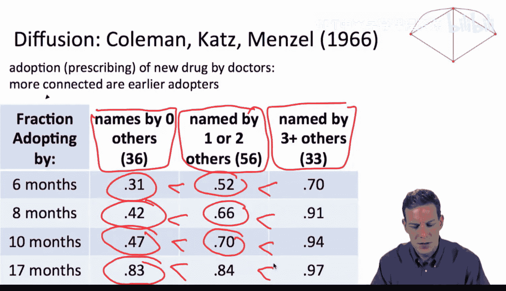

## 另一个经典案例：杂交玉米的扩散

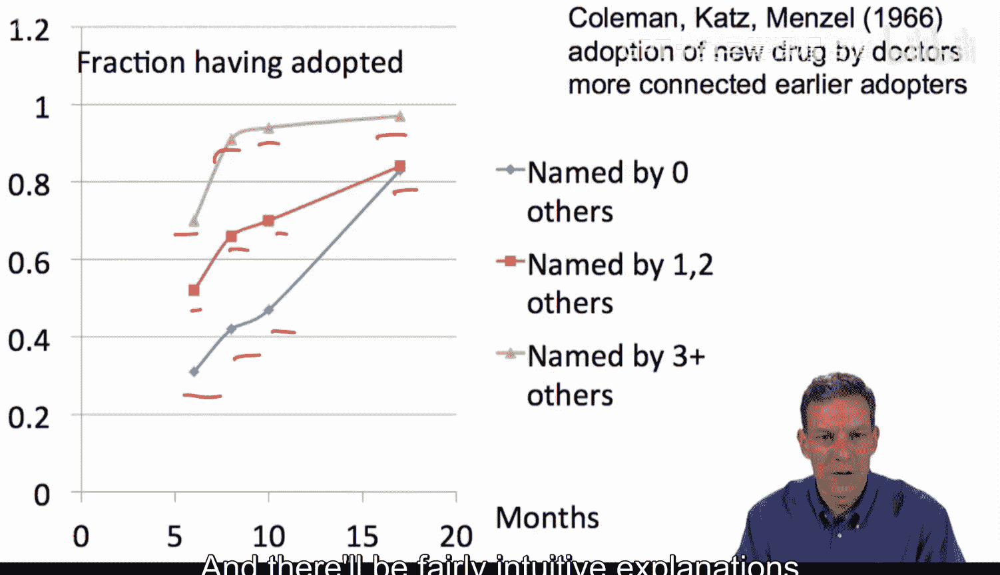

让我们看另一个相当著名的例子，这是格里利奇在1957年一篇论文中分析的数据。数据回溯到20世纪30年代和40年代收集的关于美国不同地区农民采用杂交玉米的情况。杂交玉米通过混合不同玉米品种的遗传物质培育而成（实际上这种玉米培育已有数千年历史），但在20世纪30年代以新的方式进行了市场化和开发。用这种方式生产的玉米产量比现有品种高出约15%到25%。这种玉米最终完全取代了以前的单一品种。

格里利奇分析了为什么它在不同地方的扩散路径不同。如果我们观察这些曲线，这里是三个不同的玉米生产州。爱荷华州主要种植玉米，气候非常适合，也是最早采用杂交玉米的州。威斯康星州的曲线则显示采用稍晚一些，该州种植的作物种类更多。肯塔基州对玉米的适宜性更低，种植其他作物，因此采用时间甚至比威斯康星州更晚。他还分析了德克萨斯、阿肯色等州。

这里我们看到的一个重要事实是，扩散曲线呈**S型**。具体来说，我们看到采用开始时相当缓慢，即使在爱荷华州，直到1935年左右采用率才超过10%。然后它开始加速，所以是开始缓慢，加速，然后回落，从而形成了非常漂亮的S型曲线。这实际上在许多不同的应用中被观察到。许多扩散过程都具有这种形状，我们可以尝试理解究竟是什么导致了这种形状。

为什么开始缓慢？它最终必须渐近并放缓，这很明显，因为它不能超过100%，所以最终必须放缓，不能永远持续增长。这部分很容易。困难在于弄清楚为什么它会以这种方式开始加速。口碑传播和社会互动部分在解释这种加速时将非常重要。

## 核心问题总结

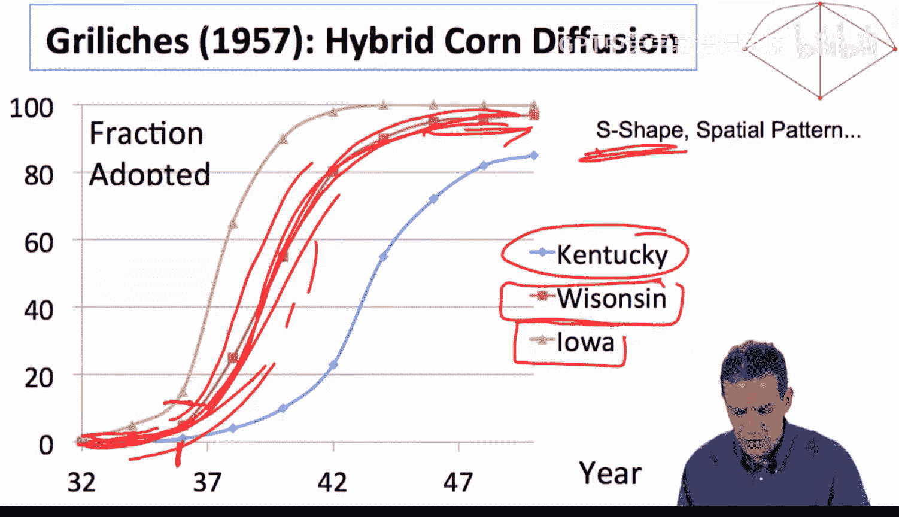

由此产生的问题包括：扩散的范围有多大？它如何依赖于网络结构的具体细节？我们能否对这些时间形状（特别是S型曲线）的成因有所阐述？能否进行福利分析？如果你想加速扩散（例如确保玉米快速扩散），你会怎么做？如果你想防止流感扩散，又该如何做？你想给谁接种疫苗？如何着手？我们可以利用扩散模型，特别是对网络过程的建模，来开始分析这一系列问题，这对于回答许多此类问题至关重要。

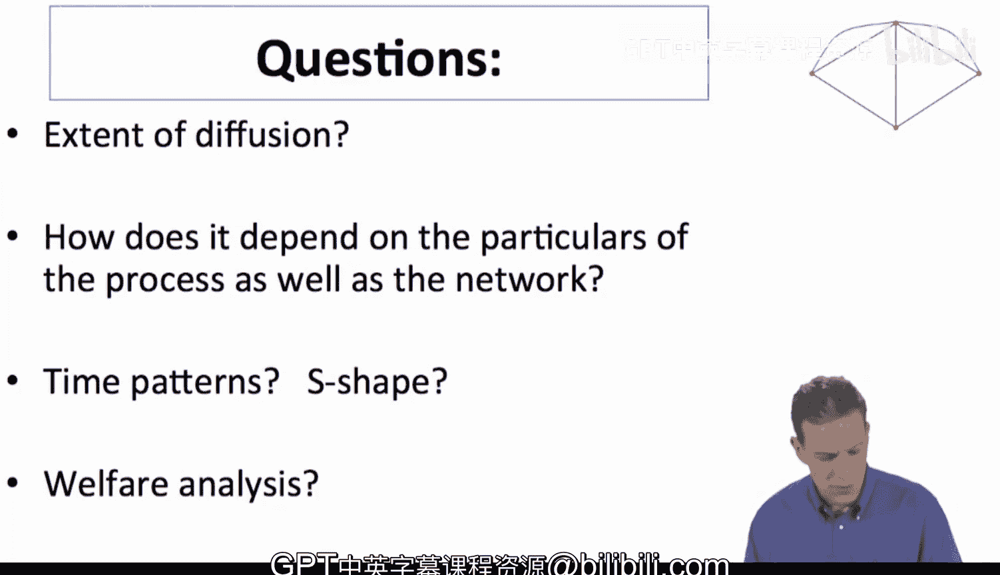

本节课中，我们一起学习了扩散模型的引入，了解了网络影响行为研究的三个层次（简单传染、信息学习、策略互动），回顾了医生采用新药和农民采用杂交玉米两个经典案例，观察到了扩散中的S型曲线和节点度数的影响，并提出了后续课程将要探讨的一系列核心问题。